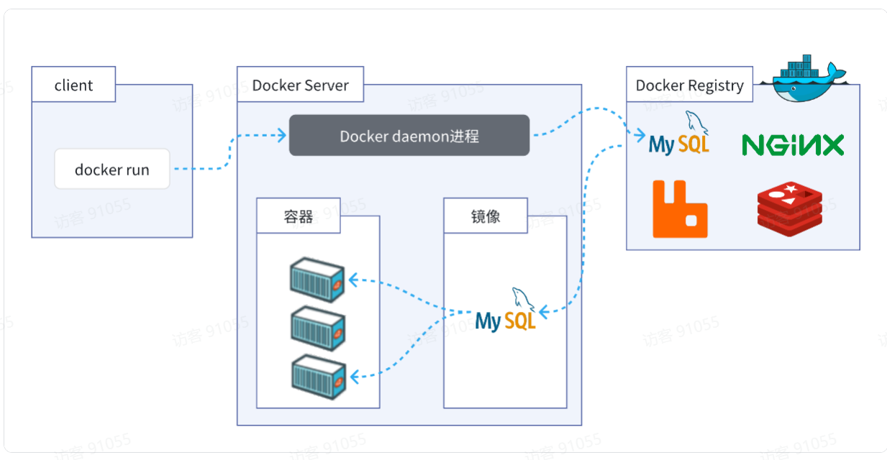
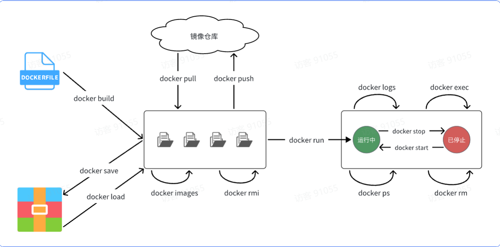
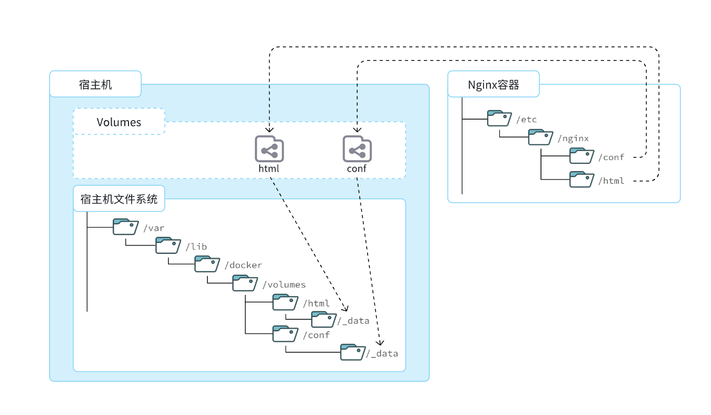
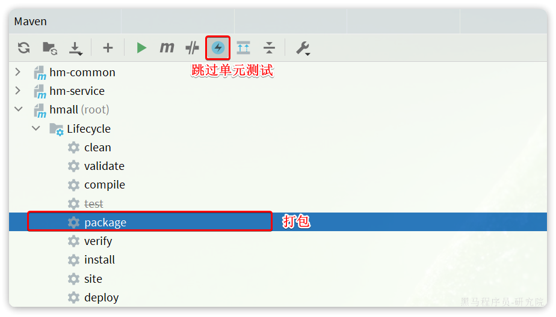

安装Docker

本安装教程参考Docker官方文档，地址如下：

https://docs.docker.com/engine/install/centos/

# 1.卸载旧版

首先如果系统中已经存在旧的Docker，则先卸载：

```Shell
yum remove docker \
    docker-client \
    docker-client-latest \
    docker-common \
    docker-latest \
    docker-latest-logrotate \
    docker-logrotate \
    docker-engine
```

# 2.配置Docker的yum库

首先要安装一个yum工具

```Bash
yum install -y yum-utils
```

安装成功后，执行命令，配置Docker的yum源：

```Bash
yum-config-manager --add-repo https://download.docker.com/linux/centos/docker-ce.repo
```

# 3.安装Docker

最后，执行命令，安装Docker

```Bash
yum install -y docker-ce docker-ce-cli containerd.io docker-buildx-plugin docker-compose-plugin
```

# 4.启动和校验

```Bash
# 启动Docker
systemctl start docker

# 停止Docker
systemctl stop docker

# 重启
systemctl restart docker

# 设置开机自启
systemctl enable docker

# 执行docker ps命令，如果不报错，说明安装启动成功
docker ps
```

# 5.配置镜像加速

这里以阿里云镜像加速为例。

## 5.1.注册阿里云账号

首先访问阿里云网站:

https://www.aliyun.com/

注册一个账号。

## 5.2.开通镜像服务

在首页的产品中，找到阿里云的**容器镜像服务**：


点击后进入控制台：


首次可能需要选择立刻开通，然后进入控制台。

## 5.3.配置镜像加速

找到**镜像工具**下的**镜像加速器**：


页面向下滚动，即可找到配置的文档说明：


具体命令如下：

```Bash
# 创建目录
mkdir -p /etc/docker

# 复制内容，注意把其中的镜像加速地址改成你自己的
tee /etc/docker/daemon.json <<-'EOF'
{
  "registry-mirrors": ["https://xxxx.mirror.aliyuncs.com"]
}
EOF

# 重新加载配置
systemctl daemon-reload

# 重启Docker
systemctl restart docker
```


学习目标：

- 能利用Docker部署常见软件
- 能利用Docker打包并部署Java应用
- 理解Docker数据卷的基本作用
- 能看懂DockerCompose文件

# 1.快速入门

## 1.1.部署MySQL

首先，我们利用Docker来安装一个MySQL软件，大家可以对比一下之前传统的安装方式，看看哪个效率更高一些。

如果是利用传统方式部署MySQL，大概的步骤有：

- 搜索并下载MySQL安装包
- 上传至Linux环境
- 编译和配置环境
- 安装

而使用Docker安装，仅仅需要一步即可，在命令行输入下面的命令（建议采用CV大法）：

```PowerShell
docker run -d \
  --name mysql \
  -p 3306:3306 \
  -e TZ=Asia/Shanghai \
  -e MYSQL_ROOT_PASSWORD=123456 \
  mysql:8.0.35
```

运行效果如图：


说明：

- 镜像：英文是image
- 容器：英文是container

> 因此，Docker安装软件的过程，就是自动搜索下载镜像，然后创建并运行容器的过程。

Docker会根据命令中的镜像名称自动搜索并下载镜像，那么问题来了，它是去哪里搜索和下载镜像的呢？这些镜像又是谁制作的呢？

Docker官方提供了一个专门管理、存储镜像的网站，并对外开放了镜像上传、下载的权利。Docker官方提供了一些基础镜像，然后各大软件公司又在基础镜像基础上，制作了自家软件的镜像，全部都存放在这个网站。这个网站就成了Docker镜像交流的社区：

https://hub.docker.com/

基本上我们常用的各种软件都能在这个网站上找到，我们甚至可以自己制作镜像上传上去。

像这种提供存储、管理Docker镜像的服务器，被称为DockerRegistry，可以翻译为镜像仓库。DockerHub网站是官方仓库，阿里云、华为云会提供一些第三方仓库，我们也可以自己搭建私有的镜像仓库。

官方仓库在国外，下载速度较慢，一般我们都会使用第三方仓库提供的镜像加速功能，提高下载速度。而企业内部的机密项目，往往会采用私有镜像仓库。

总之，镜像的来源有两种：

- 基于官方基础镜像自己制作
- 直接去DockerRegistry下载

**总结一下**：

Docker本身包含一个后台服务，我们可以利用Docker命令告诉Docker服务，帮助我们快速部署指定的应用。Docker服务部署应用时，首先要去搜索并下载应用对应的镜像，然后根据镜像创建并允许容器，应用就部署完成了。

用一幅图标示如下：



暂时无法在飞书文档外展示此内容

## 1.2.命令解读

利用Docker快速的安装了MySQL，非常的方便，不过我们执行的命令到底是什么意思呢？

```PowerShell
docker run -d \
  --name mysql \
  -p 3306:3306 \
  -e TZ=Asia/Shanghai \
  -e MYSQL_ROOT_PASSWORD=123 \
  mysql
```

> 解读：
>
> - `docker run -d` ：创建并运行一个容器，`-d`则是让容器以后台进程运行
> - `--name mysql ` : 给容器起个名字叫`mysql`，你可以叫别的
> - `-p 3306:3306` : 设置端口映射。
>   - **容器是隔离环境**，外界不可访问。但是可以**将****宿主机****端口****映射容器内到端口**，当访问宿主机指定端口时，就是在访问容器内的端口了。
>   - 容器内端口往往是由容器内的进程决定，例如MySQL进程默认端口是3306，因此容器内端口一定是3306；而宿主机端口则可以任意指定，一般与容器内保持一致。
>   - 格式： `-p 宿主机端口:容器内端口`，示例中就是将宿主机的3306映射到容器内的3306端口
> - `-e TZ=Asia/Shanghai` : 配置容器内进程运行时的一些参数
>   - 格式：`-e KEY=VALUE`，KEY和VALUE都由容器内进程决定
>   - 案例中，`TZ=Asia/Shanghai`是设置时区；`MYSQL_ROOT_PASSWORD=123`是设置MySQL默认密码
> - `mysql` : 设置**镜像**名称，Docker会根据这个名字搜索并下载镜像
>   - 格式：`REPOSITORY:TAG`，例如`mysql:8.0`，其中`REPOSITORY`可以理解为镜像名，`TAG`是版本号
>   - 在未指定`TAG`的情况下，默认是最新版本，也就是`mysql:latest`

镜像的名称不是随意的，而是要到DockerRegistry中寻找，镜像运行时的配置也不是随意的，要参考镜像的帮助文档，这些在DockerHub网站或者软件的官方网站中都能找到。

如果我们要安装其它软件，也可以到DockerRegistry中寻找对应的镜像名称和版本，阅读相关配置即可。

# 2.Docker基础

接下来，我们一起来学习Docker使用的一些基础知识，为将来部署项目打下基础。具体用法可以参考Docker官方文档：

https://docs.docker.com/

## 2.1.常见命令

首先我们来学习Docker中的常见命令，可以参考官方文档：

https://docs.docker.com/engine/reference/commandline/cli/

### 2.1.1.命令介绍

其中，比较常见的命令有：

| **命令**         | **说明**              | **文档地址**                                                                        |
| :------------- | :------------------ | :------------------------------------------------------------------------------ |
| docker pull    | 拉取镜像                | [docker pull](https://docs.docker.com/engine/reference/commandline/pull/)       |
| docker push    | 推送镜像到DockerRegistry | [docker push](https://docs.docker.com/engine/reference/commandline/push/)       |
| docker images  | 查看本地镜像              | [docker images](https://docs.docker.com/engine/reference/commandline/images/)   |
| docker rmi     | 删除本地镜像              | [docker rmi](https://docs.docker.com/engine/reference/commandline/rmi/)         |
| docker run     | 创建并运行容器（不能重复创建）     | [docker run](https://docs.docker.com/engine/reference/commandline/run/)         |
| docker stop    | 停止指定容器              | [docker stop](https://docs.docker.com/engine/reference/commandline/stop/)       |
| docker start   | 启动指定容器              | [docker start](https://docs.docker.com/engine/reference/commandline/start/)     |
| docker restart | 重新启动容器              | [docker restart](https://docs.docker.com/engine/reference/commandline/restart/) |
| docker rm      | 删除指定容器              | [docs.docker.com](https://docs.docker.com/engine/reference/commandline/rm/)     |
| docker ps -a   | 查看所有容器              | [docker ps](https://docs.docker.com/engine/reference/commandline/ps/)           |
| docker logs    | 查看容器运行日志            | [docker logs](https://docs.docker.com/engine/reference/commandline/logs/)       |
| docker exec    | 进入容器                | [docker exec](https://docs.docker.com/engine/reference/commandline/exec/)       |
| docker save    | 保存镜像到本地压缩文件         | [docker save](https://docs.docker.com/engine/reference/commandline/save/)       |
| docker load    | 加载本地压缩文件到镜像         | [docker load](https://docs.docker.com/engine/reference/commandline/load/)       |
| docker inspect | 查看容器详细信息            | [docker inspect](https://docs.docker.com/engine/reference/commandline/inspect/) |

用一副图来表示这些命令的关系：



补充：

默认情况下，每次重启虚拟机我们都需要手动启动Docker和Docker中的容器。通过命令可以实现开机自启：

```PowerShell
# Docker开机自启
systemctl enable docker

# Docker容器开机自启
docker update --restart=always [容器名/容器id]
```

### 2.1.2.演示

教学环节说明：我们以Nginx为例给大家演示上述命令。

```PowerShell
# 第1步，去DockerHub查看nginx镜像仓库及相关信息

# 第2步，拉取Nginx镜像
docker pull nginx

# 第3步，查看镜像
docker images
# 结果如下：
REPOSITORY   TAG       IMAGE ID       CREATED         SIZE
nginx        latest    605c77e624dd   16 months ago   141MB
mysql        latest    3218b38490ce   17 months ago   516MB

# 第4步，创建并允许Nginx容器
docker run -d --name nginx -p 80:80 nginx

# 第5步，查看运行中容器
docker ps
# 也可以加格式化方式访问，格式会更加清爽
docker ps --format "table {{.ID}}\t{{.Image}}\t{{.Ports}}\t{{.Status}}\t{{.Names}}"

# 第6步，访问网页，地址：http://虚拟机地址

# 第7步，停止容器
docker stop nginx

# 第8步，查看所有容器
docker ps -a --format "table {{.ID}}\t{{.Image}}\t{{.Ports}}\t{{.Status}}\t{{.Names}}"

# 第9步，再次启动nginx容器
docker start nginx

# 第10步，再次查看容器
docker ps --format "table {{.ID}}\t{{.Image}}\t{{.Ports}}\t{{.Status}}\t{{.Names}}"

# 第11步，查看容器详细信息
docker inspect nginx

# 第12步，进入容器,查看容器内目录
docker exec -it nginx bash
# 或者，可以进入MySQL
docker exec -it mysql mysql -uroot -p

# 第13步，删除容器
docker rm nginx
# 发现无法删除，因为容器运行中，强制删除容器
docker rm -f nginx
```

### 2.1.3.命令别名

给常用Docker命令起别名，方便我们访问：

```PowerShell
# 修改/root/.bashrc文件
vi /root/.bashrc
内容如下：
# .bashrc

# User specific aliases and functions

alias rm='rm -i'
alias cp='cp -i'
alias mv='mv -i'
alias dps='docker ps --format "table {{.ID}}\t{{.Image}}\t{{.Ports}}\t{{.Status}}\t{{.Names}}"'
alias dis='docker images'

# Source global definitions
if [ -f /etc/bashrc ]; then
        . /etc/bashrc
fi
```

然后，执行命令使别名生效

```PowerShell
source /root/.bashrc
```

接下来，试试看新的命令吧。

## 2.2.数据卷

容器是隔离环境，容器内程序的文件、配置、运行时产生的容器都在容器内部，我们要读写容器内的文件非常不方便。大家思考几个问题：

- 如果要升级MySQL版本，需要销毁旧容器，那么数据岂不是跟着被销毁了？
- MySQL、Nginx容器运行后，如果我要修改其中的某些配置该怎么办？
- 我想要让Nginx代理我的静态资源怎么办？

因此，容器提供程序的运行环境，但是**程序运行产生的数据、程序运行依赖的配置都应该与容器****解耦**。

### 2.2.1.什么是数据卷

**数据卷（volume）**是一个虚拟目录，是**容器内目录**与**宿主机****目录**之间映射的桥梁。

以Nginx为例，我们知道Nginx中有两个关键的目录：

- `html`：放置一些静态资源
- `conf`：放置配置文件

如果我们要让Nginx代理我们的静态资源，最好是放到`html`目录；如果我们要修改Nginx的配置，最好是找到`conf`下的`nginx.conf`文件。

但遗憾的是，容器运行的Nginx所有的文件都在容器内部。所以我们必须利用数据卷将两个目录与宿主机目录关联，方便我们操作。如图：



在上图中：

- 我们创建了两个数据卷：`conf`、`html`
- Nginx容器内部的`conf`目录和`html`目录分别与两个数据卷关联。
- 而数据卷conf和html分别指向了宿主机的`/var/lib/docker/volumes/conf/_data`目录和`/var/lib/docker/volumes/html/_data`目录

这样以来，容器内的`conf`和`html`目录就 与宿主机的`conf`和`html`目录关联起来，我们称为**挂载**。此时，我们操作宿主机的`/var/lib/docker/volumes/html/_data`就是在操作容器内的`/usr/share/nginx/html/_data`目录。只要我们将静态资源放入宿主机对应目录，就可以被Nginx代理了。

**小提示**：

> `/var/lib/docker/volumes`这个目录就是默认的存放所有容器数据卷的目录，其下再根据数据卷名称创建新目录，格式为`/数据卷名/_data`。
>
> **为什么不让容器目录直接指向****宿主机****目录呢**？
>
> - 因为直接指向宿主机目录就与宿主机强耦合了，如果切换了环境，宿主机目录就可能发生改变了。由于容器一旦创建，目录挂载就无法修改，这样容器就无法正常工作了。
> - 但是容器指向数据卷，一个逻辑名称，而数据卷再指向宿主机目录，就不存在强耦合。如果宿主机目录发生改变，只要改变数据卷与宿主机目录之间的映射关系即可。
>
> 不过，我们通过由于数据卷目录比较深，不好寻找，通常我们也**允许让容器直接与****宿主机****目录挂载而不使用数据卷**，具体参考2.2.3小节。

### 2.2.2.数据卷命令

数据卷的相关命令有：

| **命令**              | **说明**             | **文档地址**                                                 |
| :-------------------- | :------------------- | :----------------------------------------------------------- |
| docker volume create  | 创建数据卷           | [docker volume create](https://docs.docker.com/engine/reference/commandline/volume_create/) |
| docker volume ls      | 查看所有数据卷       | [docs.docker.com](https://docs.docker.com/engine/reference/commandline/volume_ls/) |
| docker volume rm      | 删除指定数据卷       | [docs.docker.com](https://docs.docker.com/engine/reference/commandline/volume_prune/) |
| docker volume inspect | 查看某个数据卷的详情 | [docs.docker.com](https://docs.docker.com/engine/reference/commandline/volume_inspect/) |
| docker volume prune   | 清除数据卷           | [docker volume prune](https://docs.docker.com/engine/reference/commandline/volume_prune/) |

注意：容器与数据卷的挂载要在创建容器时配置，对于创建好的容器，是不能设置数据卷的。而且**创建容器的过程中，数据卷会自动创建**。

教学**演示环节**：演示一下nginx的html目录挂载

```PowerShell
# 1.首先创建容器并指定数据卷，注意通过 -v 参数来指定数据卷
docker run -d --name nginx -p 80:80 -v html:/usr/share/nginx/html nginx

# 2.然后查看数据卷
docker volume ls
# 结果
DRIVER    VOLUME NAME
local     29524ff09715d3688eae3f99803a2796558dbd00ca584a25a4bbc193ca82459f
local     html

# 3.查看数据卷详情
docker volume inspect html
# 结果
[
    {
        "CreatedAt": "2024-05-17T19:57:08+08:00",
        "Driver": "local",
        "Labels": null,
        "Mountpoint": "/var/lib/docker/volumes/html/_data",
        "Name": "html",
        "Options": null,
        "Scope": "local"
    }
]

# 4.查看/var/lib/docker/volumes/html/_data目录
ll /var/lib/docker/volumes/html/_data
# 可以看到与nginx的html目录内容一样，结果如下：
总用量 8
-rw-r--r--. 1 root root 497 12月 28 2021 50x.html
-rw-r--r--. 1 root root 615 12月 28 2021 index.html

# 5.进入该目录，并随意修改index.html内容
cd /var/lib/docker/volumes/html/_data
vi index.html

# 6.打开页面，查看效果

# 7.进入容器内部，查看/usr/share/nginx/html目录内的文件是否变化
docker exec -it nginx bash
```

教学**演示环节**：演示一下MySQL的匿名数据卷

```PowerShell
# 1.查看MySQL容器详细信息
docker inspect mysql
# 关注其中.Config.Volumes部分和.Mounts部分
```

我们关注两部分内容，第一是`.Config.Volumes`部分：

```JSON
{
  "Config": {
    // ... 略
    "Volumes": {
      "/var/lib/mysql": {}
    }
    // ... 略
  }
}
```

可以发现这个容器声明了一个本地目录，需要挂载数据卷，但是**数据卷未定义**。这就是匿名卷。

然后，我们再看结果中的`.Mounts`部分：

```JSON
{
  "Mounts": [
    {
      "Type": "volume",
      "Name": "29524ff09715d3688eae3f99803a2796558dbd00ca584a25a4bbc193ca82459f",
      "Source": "/var/lib/docker/volumes/29524ff09715d3688eae3f99803a2796558dbd00ca584a25a4bbc193ca82459f/_data",
      "Destination": "/var/lib/mysql",
      "Driver": "local",
    }
  ]
}
```

可以发现，其中有几个关键属性：

- Name：数据卷名称。由于定义容器未设置容器名，这里的就是匿名卷自动生成的名字，一串hash值。
- Source：宿主机目录
- Destination : 容器内的目录

上述配置是将容器内的`/var/lib/mysql`这个目录，与数据卷`29524ff09715d3688eae3f99803a2796558dbd00ca584a25a4bbc193ca82459f`挂载。于是在宿主机中就有了`/var/lib/docker/volumes/29524ff09715d3688eae3f99803a2796558dbd00ca584a25a4bbc193ca82459f/_data`这个目录。这就是匿名数据卷对应的目录，其使用方式与普通数据卷没有差别。

接下来，可以查看该目录下的MySQL的data文件：

```Bash
ls -l /var/lib/docker/volumes/29524ff09715d3688eae3f99803a2796558dbd00ca584a25a4bbc193ca82459f/_data
```

注意：每一个不同的镜像，将来创建容器后内部有哪些目录可以挂载，可以参考DockerHub对应的页面

### 2.2.3.挂载本地目录或文件

可以发现，数据卷的目录结构较深，如果我们去操作数据卷目录会不太方便。在很多情况下，我们会直接将容器目录与宿主机指定目录挂载。挂载语法与数据卷类似：

```Bash
# 挂载本地目录
-v 本地目录:容器内目录
# 挂载本地文件
-v 本地文件:容器内文件
```

**注意**：本地目录或文件必须以 `/` 或 `./`开头，如果直接以名字开头，会被识别为数据卷名而非本地目录名。

例如：

```Bash
-v mysql:/var/lib/mysql # 会被识别为一个数据卷叫mysql，运行时会自动创建这个数据卷
-v ./mysql:/var/lib/mysql # 会被识别为当前目录下的mysql目录，运行时如果不存在会创建目录
```

**教学演示**，删除并重新创建mysql容器，并完成本地目录挂载：

- 挂载`/root/mysql/data`到容器内的`/var/lib/mysql`目录
- 挂载`/root/mysql/init`到容器内的`/docker-entrypoint-initdb.d`目录（初始化的SQL脚本目录）
- 挂载`/root/mysql/conf`到容器内的`/etc/mysql/conf.d`目录（这个是MySQL配置文件目录）

在课前资料中已经准备好了mysql的`init`目录和`conf`目录：


以及对应的初始化SQL脚本和配置文件：


其中，hm.cnf主要是配置了MySQL的默认编码，改为utf8mb4；而hmall.sql则是后面我们要用到的黑马商城项目的初始化SQL脚本。

我们直接将整个mysql目录上传至虚拟机的`/root`目录下：


接下来，我们演示本地目录挂载：

```Bash
# 1.删除原来的MySQL容器
docker rm -f mysql

# 2.进入root目录
cd ~

# 3.创建并运行新mysql容器，挂载本地目录
docker run -d \
  --name mysql \
  -p 3306:3306 \
  -e TZ=Asia/Shanghai \
  -e MYSQL_ROOT_PASSWORD=123 \
  -v ./mysql/data:/var/lib/mysql \
  -v ./mysql/conf:/etc/mysql/conf.d \
  -v ./mysql/init:/docker-entrypoint-initdb.d \
  mysql

# 4.查看root目录，可以发现~/mysql/data目录已经自动创建好了
ls -l mysql
# 结果：
总用量 4
drwxr-xr-x. 2 root    root   20 5月  19 15:11 conf
drwxr-xr-x. 7 polkitd root 4096 5月  19 15:11 data
drwxr-xr-x. 2 root    root   23 5月  19 15:11 init

# 查看data目录，会发现里面有大量数据库数据，说明数据库完成了初始化
ls -l data

# 5.查看MySQL容器内数据
# 5.1.进入MySQL
docker exec -it mysql mysql -uroot -p123
# 5.2.查看编码表
show variables like "%char%";
# 5.3.结果，发现编码是utf8mb4没有问题
+--------------------------+--------------------------------+
| Variable_name            | Value                          |
+--------------------------+--------------------------------+
| character_set_client     | utf8mb4                        |
| character_set_connection | utf8mb4                        |
| character_set_database   | utf8mb4                        |
| character_set_filesystem | binary                         |
| character_set_results    | utf8mb4                        |
| character_set_server     | utf8mb4                        |
| character_set_system     | utf8mb3                        |
| character_sets_dir       | /usr/share/mysql-8.0/charsets/ |
+--------------------------+--------------------------------+

# 6.查看数据
# 6.1.查看数据库
show databases;
# 结果，hmall是黑马商城数据库
+--------------------+
| Database           |
+--------------------+
| hmall              |
| information_schema |
| mysql              |
| performance_schema |
| sys                |
+--------------------+
5 rows in set (0.00 sec)
# 6.2.切换到hmall数据库
use hmall;
# 6.3.查看表
show tables;
# 结果：
+-----------------+
| Tables_in_hmall |
+-----------------+
| address         |
| cart            |
| item            |
| order           |
| order_detail    |
| order_logistics |
| pay_order       |
| user            |
+-----------------+
# 6.4.查看address表数据
+----+---------+----------+--------+----------+-------------+---------------+-----------+------------+-------+
| id | user_id | province | city   | town     | mobile      | street        | contact   | is_default | notes |
+----+---------+----------+--------+----------+-------------+---------------+-----------+------------+-------+
| 59 |       1 | 北京     | 北京   | 朝阳区    | 13900112222 | 金燕龙办公楼   | 李佳诚    | 0          | NULL  |
| 60 |       1 | 北京     | 北京   | 朝阳区    | 13700221122 | 修正大厦       | 李佳红    | 0          | NULL  |
| 61 |       1 | 上海     | 上海   | 浦东新区  | 13301212233 | 航头镇航头路   | 李佳星    | 1          | NULL  |
| 63 |       1 | 广东     | 佛山   | 永春      | 13301212233 | 永春武馆       | 李晓龙    | 0          | NULL  |
+----+---------+----------+--------+----------+-------------+---------------+-----------+------------+-------+
4 rows in set (0.00 sec)
```

## 2.3.镜像

前面我们一直在使用别人准备好的镜像，那如果我要部署一个Java项目，把它打包为一个镜像该怎么做呢？

### 2.3.1.镜像结构

要想自己构建镜像，必须先了解镜像的结构。

之前我们说过，镜像之所以能让我们快速跨操作系统部署应用而忽略其运行环境、配置，就是因为镜像中包含了程序运行需要的系统函数库、环境、配置、依赖。

因此，自定义镜像本质就是依次准备好程序运行的基础环境、依赖、应用本身、运行配置等文件，并且打包而成。

举个例子，我们要从0部署一个Java应用，大概流程是这样：

- 准备一个linux服务（CentOS或者Ubuntu均可）
- 安装并配置JDK
- 上传Jar包
- 运行jar包

那因此，我们打包镜像也是分成这么几步：

- 准备Linux运行环境（java项目并不需要完整的操作系统，仅仅是基础运行环境即可）
- 安装并配置JDK
- 拷贝jar包
- 配置启动脚本

上述步骤中的每一次操作其实都是在生产一些文件（系统运行环境、函数库、配置最终都是磁盘文件），所以**镜像就是一堆文件的集合**。

但需要注意的是，镜像文件不是随意堆放的，而是按照操作的步骤分层叠加而成，每一层形成的文件都会单独打包并标记一个唯一id，称为**Layer**（**层**）。这样，如果我们构建时用到的某些层其他人已经制作过，就可以直接拷贝使用这些层，而不用重复制作。

例如，第一步中需要的Linux运行环境，通用性就很强，所以Docker官方就制作了这样的只包含Linux运行环境的镜像。我们在制作java镜像时，就无需重复制作，直接使用Docker官方提供的CentOS或Ubuntu镜像作为基础镜像。然后再搭建其它层即可，这样逐层搭建，最终整个Java项目的镜像结构如图所示：


### 2.3.2.Dockerfile

由于制作镜像的过程中，需要逐层处理和打包，比较复杂，所以Docker就提供了自动打包镜像的功能。我们只需要将打包的过程，每一层要做的事情用固定的语法写下来，交给Docker去执行即可。

而这种记录镜像结构的文件就称为**Dockerfile**，其对应的语法可以参考官方文档：

https://docs.docker.com/engine/reference/builder/

其中的语法比较多，比较常用的有：

| **指令**       | **说明**                                     | **示例**                     |
| :------------- | :------------------------------------------- | :--------------------------- |
| **FROM**       | 指定基础镜像                                 | `FROM centos:6`              |
| **ENV**        | 设置环境变量，可在后面指令使用               | `ENV key value`              |
| **COPY**       | 拷贝本地文件到镜像的指定目录                 | `COPY ./xx.jar /tmp/app.jar` |
| **RUN**        | 执行Linux的shell命令，一般是安装过程的命令   | `RUN yum install gcc`        |
| **EXPOSE**     | 指定容器运行时监听的端口，是给镜像使用者看的 | EXPOSE 8080                  |
| **ENTRYPOINT** | 镜像中应用的启动命令，容器运行时调用         | ENTRYPOINT java -jar xx.jar  |

例如，要基于Ubuntu镜像来构建一个Java应用，其Dockerfile内容如下：

```Dockerfile
# 指定基础镜像
FROM ubuntu:16.04
# 配置环境变量，JDK的安装目录、容器内时区
ENV JAVA_DIR=/usr/local
ENV TZ=Asia/Shanghai
# 拷贝jdk和java项目的包
COPY ./jdk8.tar.gz $JAVA_DIR/
COPY ./docker-demo.jar /tmp/app.jar
# 设定时区
RUN ln -snf /usr/share/zoneinfo/$TZ /etc/localtime && echo $TZ > /etc/timezone
# 安装JDK
RUN cd $JAVA_DIR \
 && tar -xf ./jdk8.tar.gz \
 && mv ./jdk1.8.0_144 ./java8
# 配置环境变量
ENV JAVA_HOME=$JAVA_DIR/java8
ENV PATH=$PATH:$JAVA_HOME/bin
# 指定项目监听的端口
EXPOSE 8080
# 入口，java项目的启动命令
ENTRYPOINT ["java", "-jar", "/app.jar"]
```

同学们思考一下：以后我们会有很多很多java项目需要打包为镜像，他们都需要Linux系统环境、JDK环境这两层，只有上面的3层不同（因为jar包不同）。如果每次制作java镜像都重复制作前两层镜像，是不是很麻烦。

所以，就有人提供了基础的系统加JDK环境，我们在此基础上制作java镜像，就可以省去JDK的配置了：

```Dockerfile
# 基础镜像
FROM openjdk:11.0-jre-buster
# 设定时区
ENV TZ=Asia/Shanghai
RUN ln -snf /usr/share/zoneinfo/$TZ /etc/localtime && echo $TZ > /etc/timezone
# 拷贝jar包
COPY docker-demo.jar /app.jar
# 入口
ENTRYPOINT ["java", "-jar", "/app.jar"]
```

是不是简单多了。

### 2.3.3.构建镜像

当Dockerfile文件写好以后，就可以利用命令来构建镜像了。

在课前资料中，我们准备好了一个demo项目及对应的Dockerfile：


首先，我们将课前资料提供的`docker-demo.jar`包以及`Dockerfile`拷贝到虚拟机的`/root/demo`目录：


然后，执行命令，构建镜像：

```Bash
# 进入镜像目录
cd /root/demo
# 开始构建
docker build -t docker-demo:1.0 .
```

命令说明：

- `docker build `: 就是构建一个docker镜像

- `-t docker-demo:1.0` ：`-t`参数是指定镜像的名称（`repository`和`tag`）

- `.` : 最后的点是指构建时Dockerfile所在路径，由于我们进入了demo目录，所以指定的是`.`代表当前目录，也可以直接指定Dockerfile目录：

  - ```Bash
    # 直接指定Dockerfile目录
    docker build -t docker-demo:1.0 /root/demo
    ```

结果：


查看镜像列表：

```Bash
# 查看镜像列表：
docker images
# 结果
REPOSITORY    TAG       IMAGE ID       CREATED          SIZE
docker-demo   1.0       d6ab0b9e64b9   27 minutes ago   327MB
nginx         latest    605c77e624dd   16 months ago    141MB
mysql         latest    3218b38490ce   17 months ago    516MB
```

然后尝试运行该镜像：

```Bash
# 1.创建并运行容器
docker run -d --name dd -p 8090:8090 docker-demo:1.0
# 2.查看容器
dps
# 结果
CONTAINER ID   IMAGE             PORTS                                                  STATUS         NAMES
78a000447b49   docker-demo:1.0   0.0.0.0:8080->8080/tcp, :::8090->8090/tcp              Up 2 seconds   dd
f63cfead8502   mysql             0.0.0.0:3306->3306/tcp, :::3306->3306/tcp, 33060/tcp   Up 2 hours     mysql

# 3.访问
curl localhost:8080/hello/count
# 结果：
<h5>欢迎访问黑马商城, 这是您第1次访问<h5>
```

## 2.4.网络

上节课我们创建了一个Java项目的容器，而Java项目往往需要访问其它各种中间件，例如MySQL、Redis等。现在，我们的容器之间能否互相访问呢？我们来测试一下

首先，我们查看下MySQL容器的详细信息，重点关注其中的网络IP地址：

```Bash
# 1.用基本命令，寻找Networks.bridge.IPAddress属性
docker inspect mysql
# 也可以使用format过滤结果
docker inspect --format='{{range .NetworkSettings.Networks}}{{println .IPAddress}}{{end}}' mysql
# 得到IP地址如下：
172.17.0.2

# 2.然后通过命令进入dd容器
docker exec -it dd bash

# 3.在容器内，通过ping命令测试网络
ping 172.17.0.2
# 结果
PING 172.17.0.2 (172.17.0.2) 56(84) bytes of data.
64 bytes from 172.17.0.2: icmp_seq=1 ttl=64 time=0.053 ms
64 bytes from 172.17.0.2: icmp_seq=2 ttl=64 time=0.059 ms
64 bytes from 172.17.0.2: icmp_seq=3 ttl=64 time=0.058 ms
```

发现可以互联，没有问题。

但是，容器的网络IP其实是一个虚拟的IP，其值并不固定与某一个容器绑定，如果我们在开发时写死某个IP，而在部署时很可能MySQL容器的IP会发生变化，连接会失败。

所以，我们必须借助于docker的网络功能来解决这个问题，官方文档：

https://docs.docker.com/engine/reference/commandline/network/

常见命令有：

| **命令**                  | **说明**                 | **文档地址**                                                 |
| :------------------------ | :----------------------- | :----------------------------------------------------------- |
| docker network create     | 创建一个网络             | [docker network create](https://docs.docker.com/engine/reference/commandline/network_create/) |
| docker network ls         | 查看所有网络             | [docs.docker.com](https://docs.docker.com/engine/reference/commandline/network_ls/) |
| docker network rm         | 删除指定网络             | [docs.docker.com](https://docs.docker.com/engine/reference/commandline/network_rm/) |
| docker network prune      | 清除未使用的网络         | [docs.docker.com](https://docs.docker.com/engine/reference/commandline/network_prune/) |
| docker network connect    | 使指定容器连接加入某网络 | [docs.docker.com](https://docs.docker.com/engine/reference/commandline/network_connect/) |
| docker network disconnect | 使指定容器连接离开某网络 | [docker network disconnect](https://docs.docker.com/engine/reference/commandline/network_disconnect/) |
| docker network inspect    | 查看网络详细信息         | [docker network inspect](https://docs.docker.com/engine/reference/commandline/network_inspect/) |

教学演示：自定义网络

```Bash
# 1.首先通过命令创建一个网络
docker network create hmall

# 2.然后查看网络
docker network ls
# 结果：
NETWORK ID     NAME      DRIVER    SCOPE
639bc44d0a87   bridge    bridge    local
403f16ec62a2   hmall     bridge    local
0dc0f72a0fbb   host      host      local
cd8d3e8df47b   none      null      local
# 其中，除了hmall以外，其它都是默认的网络

# 3.让dd和mysql都加入该网络，注意，在加入网络时可以通过--alias给容器起别名
# 这样该网络内的其它容器可以用别名互相访问！
# 3.1.mysql容器，指定别名为db，另外每一个容器都有一个别名是容器名
docker network connect hmall mysql --alias db
# 3.2.db容器，也就是我们的java项目
docker network connect hmall dd

# 4.进入dd容器，尝试利用别名访问db
# 4.1.进入容器
docker exec -it dd bash
# 4.2.用db别名访问
ping db
# 结果
PING db (172.18.0.2) 56(84) bytes of data.
64 bytes from mysql.hmall (172.18.0.2): icmp_seq=1 ttl=64 time=0.070 ms
64 bytes from mysql.hmall (172.18.0.2): icmp_seq=2 ttl=64 time=0.056 ms
# 4.3.用容器名访问
ping mysql
# 结果：
PING mysql (172.18.0.2) 56(84) bytes of data.
64 bytes from mysql.hmall (172.18.0.2): icmp_seq=1 ttl=64 time=0.044 ms
64 bytes from mysql.hmall (172.18.0.2): icmp_seq=2 ttl=64 time=0.054 ms
```

OK，现在无需记住IP地址也可以实现容器互联了。

**总结**：

- 在自定义网络中，可以给容器起多个别名，默认的别名是容器名本身
- 在同一个自定义网络中的容器，可以通过别名互相访问

# 3.项目部署

好了，我们已经熟悉了Docker的基本用法，接下来可以尝试部署项目了。

在课前资料中已经提供了一个黑马商城项目给大家，如图：

项目说明：

- hmall：商城的后端代码
- hmall-portal：商城用户端的前端代码
- hmall-admin：商城管理端的前端代码

部署的容器及端口说明：

| **项目**     | **容器名** | **端口**           | **备注**            |
| :----------- | :--------- | :----------------- | :------------------ |
| hmall        | hmall      | 8080               | 黑马商城后端API入口 |
| hmall-portal | nginx      | 18080              | 黑马商城用户端入口  |
| hmall-admin  | 18081      | 黑马商城管理端入口 |                     |
| mysql        | mysql      | 3306               | 数据库              |

在正式部署前，我们先删除之前的nginx、dd两个容器：

```Bash
docker rm -f nginx dd
```

mysql容器中已经准备好了商城的数据，所以就不再删除了。

## 3.1.部署Java项目

`hmall`项目是一个maven聚合项目，使用IDEA打开`hmall`项目，查看项目结构如图：


我们要部署的就是其中的`hm-service`，其中的配置文件采用了多环境的方式：


其中的`application-dev.yaml`是部署到开发环境的配置，`application-local.yaml`是本地运行时的配置。

查看application.yaml，你会发现其中的JDBC地址并未写死，而是读取变量：


这两个变量在`application-dev.yaml`和`application-local.yaml`中并不相同：


在dev开发环境（也就是Docker部署时）采用了mysql作为地址，刚好是我们的mysql容器名，只要两者在一个网络，就一定能互相访问。

我们将项目打包：



结果：


将`hm-service`目录下的`Dockerfile`和`hm-service/target`目录下的`hm-service.jar`一起上传到虚拟机的`root`目录：


部署项目：

```Bash
# 1.构建项目镜像，不指定tag，则默认为latest
docker build -t hmall .

# 2.查看镜像
docker images
# 结果
REPOSITORY    TAG       IMAGE ID       CREATED          SIZE
hmall         latest    0bb07b2c34b9   43 seconds ago   362MB
docker-demo   1.0       49743484da68   24 hours ago     327MB
nginx         latest    605c77e624dd   16 months ago    141MB
mysql         latest    3218b38490ce   17 months ago    516MB

# 3.创建并运行容器，并通过--network将其加入hmall网络，这样才能通过容器名访问mysql
docker run -d --name hmall --network hmall -p 8080:8080 hmall
```

测试，通过浏览器访问：http://你的虚拟机地址:8080/search/list

## 3.2.部署前端

`hmall-portal`和`hmall-admin`是前端代码，需要基于nginx部署。在课前资料中已经给大家提供了nginx的部署目录：


其中：

- `html`是静态资源目录，我们需要把`hmall-portal`以及`hmall-admin`都复制进去
- `nginx.conf`是nginx的配置文件，主要是完成对`html`下的两个静态资源目录做代理

我们现在要做的就是把整个nginx目录上传到虚拟机的`/root`目录下：


然后创建nginx容器并完成两个挂载：

- 把`/root/nginx/nginx.conf`挂载到`/etc/nginx/nginx.conf`
- 把`/root/nginx/html`挂载到`/usr/share/nginx/html`

由于需要让nginx同时代理hmall-portal和hmall-admin两套前端资源，因此我们需要暴露两个端口：

- 18080：对应hmall-portal
- 18081：对应hmall-admin

命令如下：

```Bash
docker run -d \
  --name nginx \
  -p 18080:18080 \
  -p 18081:18081 \
  -v /root/nginx/html:/usr/share/nginx/html \
  -v /root/nginx/nginx.conf:/etc/nginx/nginx.conf \
  --network hmall \
  nginx
```

测试，通过浏览器访问：http://你的虚拟机ip:18080


## 3.3.DockerCompose

大家可以看到，我们部署一个简单的java项目，其中包含3个容器：

- MySQL
- Nginx
- Java项目

而稍微复杂的项目，其中还会有各种各样的其它中间件，需要部署的东西远不止3个。如果还像之前那样手动的逐一部署，就太麻烦了。

而Docker Compose就可以帮助我们实现**多个相互关联的Docker容器的快速部署**。它允许用户通过一个单独的 docker-compose.yml 模板文件（YAML 格式）来定义一组相关联的应用容器。

### 3.3.1.基本语法

docker-compose.yml文件的基本语法可以参考官方文档：

https://docs.docker.com/compose/compose-file/compose-file-v3/

docker-compose文件中可以定义多个相互关联的应用容器，每一个应用容器被称为一个服务（service）。由于service就是在定义某个应用的运行时参数，因此与`docker run`参数非常相似。

举例来说，用docker run部署MySQL的命令如下：

```Bash
docker run -d \
  --name mysql \
  -p 3306:3306 \
  -e TZ=Asia/Shanghai \
  -e MYSQL_ROOT_PASSWORD=123 \
  -v ./mysql/data:/var/lib/mysql \
  -v ./mysql/conf:/etc/mysql/conf.d \
  -v ./mysql/init:/docker-entrypoint-initdb.d \
  --network hmall
  mysql
```

如果用`docker-compose.yml`文件来定义，就是这样：

```YAML
version: "3.8"

services:
  mysql:
    image: mysql
    container_name: mysql
    ports:
      - "3306:3306"
    environment:
      TZ: Asia/Shanghai
      MYSQL_ROOT_PASSWORD: 123
    volumes:
      - "./mysql/conf:/etc/mysql/conf.d"
      - "./mysql/data:/var/lib/mysql"
    networks:
      - new
networks:
  new:
    name: hmall
```

对比如下：

| **docker run 参数** | **docker compose 指令** | **说明** |
| :---------------- | :-------------------- | :----- |
| --name            | container_name        | 容器名称   |
| -p                | ports                 | 端口映射   |
| -e                | environment           | 环境变量   |
| -v                | volumes               | 数据卷配置  |
| --network         | networks              | 网络     |

明白了其中的对应关系，相信编写`docker-compose`文件应该难不倒大家。

黑马商城部署文件：

```YAML
version: "3.8"

services:
  mysql:
    image: mysql
    container_name: mysql
    ports:
      - "3306:3306"
    environment:
      TZ: Asia/Shanghai
      MYSQL_ROOT_PASSWORD: 123
    volumes:
      - "./mysql/conf:/etc/mysql/conf.d"
      - "./mysql/data:/var/lib/mysql"
      - "./mysql/init:/docker-entrypoint-initdb.d"
    networks:
      - hm-net
  hmall:
    build: 
      context: .
      dockerfile: Dockerfile
    container_name: hmall
    ports:
      - "8080:8080"
    networks:
      - hm-net
    depends_on:
      - mysql
  nginx:
    image: nginx
    container_name: nginx
    ports:
      - "18080:18080"
      - "18081:18081"
    volumes:
      - "./nginx/nginx.conf:/etc/nginx/nginx.conf"
      - "./nginx/html:/usr/share/nginx/html"
    depends_on:
      - hmall
    networks:
      - hm-net
networks:
  hm-net:
    name: hmall
```

### 3.3.2.基础命令

编写好docker-compose.yml文件，就可以部署项目了。常见的命令：

https://docs.docker.com/compose/reference/

基本语法如下：

```Bash
docker compose [OPTIONS] [COMMAND]
```

其中，OPTIONS和COMMAND都是可选参数，比较常见的有：

| **类型**   | **参数或指令** | **说明**                                                 |
| :------- | :-------- | :----------------------------------------------------- |
| Options  | -f        | 指定compose文件的路径和名称                                      |
|          | -p        | 指定project名称。project就是当前compose文件中设置的多个service的集合，是逻辑概念 |
| Commands | up        | 创建并启动所有service容器                                       |
|          | down      | 停止并移除所有容器、网络                                           |
|          | ps        | 列出所有启动的容器                                              |
|          | logs      | 查看指定容器的日志                                              |
|          | stop      | 停止容器                                                   |
|          | start     | 启动容器                                                   |
|          | restart   | 重启容器                                                   |
|          | top       | 查看运行的进程                                                |
|          | exec      | 在指定的运行中容器中执行命令                                         |

教学演示：

```Bash
# 1.进入root目录
cd /root

# 2.删除旧容器
docker rm -f $(docker ps -qa)

# 3.删除hmall镜像
docker rmi hmall

# 4.清空MySQL数据
rm -rf mysql/data

# 5.启动所有, -d 参数是后台启动
docker compose up -d
# 结果：
[+] Building 15.5s (8/8) FINISHED
 => [internal] load build definition from Dockerfile                                    0.0s
 => => transferring dockerfile: 358B                                                    0.0s
 => [internal] load .dockerignore                                                       0.0s
 => => transferring context: 2B                                                         0.0s
 => [internal] load metadata for docker.io/library/openjdk:11.0-jre-buster             15.4s
 => [1/3] FROM docker.io/library/openjdk:11.0-jre-buster@sha256:3546a17e6fb4ff4fa681c3  0.0s
 => [internal] load build context                                                       0.0s
 => => transferring context: 98B                                                        0.0s
 => CACHED [2/3] RUN ln -snf /usr/share/zoneinfo/Asia/Shanghai /etc/localtime && echo   0.0s
 => CACHED [3/3] COPY hm-service.jar /app.jar                                           0.0s
 => exporting to image                                                                  0.0s
 => => exporting layers                                                                 0.0s
 => => writing image sha256:32eebee16acde22550232f2eb80c69d2ce813ed099640e4cfed2193f71  0.0s
 => => naming to docker.io/library/root-hmall                                           0.0s
[+] Running 4/4
 ✔ Network hmall    Created                                                             0.2s
 ✔ Container mysql  Started                                                             0.5s
 ✔ Container hmall  Started                                                             0.9s
 ✔ Container nginx  Started                                                             1.5s

# 6.查看镜像
docker compose images
# 结果
CONTAINER           REPOSITORY          TAG                 IMAGE ID            SIZE
hmall               root-hmall          latest              32eebee16acd        362MB
mysql               mysql               latest              3218b38490ce        516MB
nginx               nginx               latest              605c77e624dd        141MB

# 7.查看容器
docker compose ps
# 结果
NAME                IMAGE               COMMAND                  SERVICE             CREATED             STATUS              PORTS
hmall               root-hmall          "java -jar /app.jar"     hmall               54 seconds ago      Up 52 seconds       0.0.0.0:8080->8080/tcp, :::8080->8080/tcp
mysql               mysql               "docker-entrypoint.s…"   mysql               54 seconds ago      Up 53 seconds       0.0.0.0:3306->3306/tcp, :::3306->3306/tcp, 33060/tcp
nginx               nginx               "/docker-entrypoint.…"   nginx               54 seconds ago      Up 52 seconds       80/tcp, 0.0.0.0:18080-18081->18080-18081/tcp, :::18080-18081->18080-18081/tcp
```

打开浏览器，访问：http://yourIp:8080


# 部署笔记：

> 背景:
>
> 1. 部署步骤是先安装软件，安装完软件之后运行，**注意**，运行命令的时候需要进行几个容器**连接网络**和**目录挂载**。当连接网络之后才可以进行通用的部署。
> 2. 该项目以若依项目为基础
>
> 步骤： 
>
> 1. 部署后端
> 2. 部署前端

## 1 部署后端

> 1. 安装mysql、redis
> 2. 运行mysql
> 3. 运行redis

### 1.1 安装mysql、redis

> ```
> docker pull mysql:8.0.35
> docker pull redis
> ```
>
> 
>
> 这里的安装仅仅安装了镜像。

### 1.2 运行mysql

> - 这里就是创建mysql容器，容器又被称为镜像的实例。
>
> - 基于宿主机目录实现**MySQL数据目录、配置文件、log的挂载** 
>
> - 注意： 挂载本地目录建议创建容器时就挂载，不然很麻烦
>
> [2.2.3.挂载本地目录或文件](# 2.2.3.挂载本地目录或文件)
>
> ```
> docker run --name mysql \
>   -p 3306:3306 \
>   -e MYSQL_ROOT_PASSWORD=123456 \
>   -e TZ=Asia/Shanghai \
>   -v /usr/local/mysql/conf:/etc/mysql/conf.d \
>   -v /usr/local/mysql/log:/var/log/mysql \
>   -v /usr/local/mysql/data:/var/lib/mysql \
>   -d mysql:8.0.35
> ```

### 1.3 运行redis

> ```
> docker pull redis # 下载Redis镜像
> docker run --name redis  --restart=always -p 6379:6379 -d redis --requirepass "123456" # 启动Redis
> ```
>
> 这个可以不进行目录挂载，一般来说redis是缓存，用户提升用户体验的，可以不进行目录挂载，如果想挂载，搜一下即可


### 1.4 打jar包制作镜像

> 步骤： 
>
> 	1. 修改yml文件（mysql， redis）
> 	1. 打成jar包
> 	1. 制作Dockerfile文件
> 	1. 制作镜像

 1. **修改yml文件（mysql， redis）**

    > 1. mysql
    >
    >    > ```
    >    > # 主库数据源
    >    > master:
    >    >  url: jdbc:mysql://mysql:3306/ry-vue?useUnicode=true&characterEncoding=utf8&zeroDateTimeBehavior=convertToNull&useSSL=true&serverTimezone=GMT%2B8
    >    >  username: root
    >    >  password: 123456
    >    > ```
    >    >
    >    > > 这里 `jdbc:mysql://localhost:3306`修改为` jdbc:mysql://mysql:3306` `mysql`是运行的容器名
    >    > >
    >    > > 也可以使用 `docker inspect id`来查看ip地址，记得是"IPAddress"，假设为127.0.0.2的话这个为：`jdbc:mysql://127.0.0.2:3306/ry-vue`
    >
    > 2. redis
    >
    >    > ```
    >    > redis:
    >    >   # 地址
    >    >   host: redis
    >    >   # 端口，默认为6379
    >    >   port: 6379
    >    >   # 数据库索引
    >    >   database: 0
    >    >   # 密码
    >    >   password: 123456
    >    >   # 连接超时时间
    >    >   timeout: 10s
    >    > ```
    >    >
    >    > > 这里`host： localhost`修改为`host: redis` redis也是主机名
    >
    > 

 2. **打成jar包**

 3. **制作Dockerfile文件**

    > ```
    > # 基础镜像
    > FROM openjdk:17-jdk-alpine
    > # 设定时区
    > ENV TZ=Asia/Shanghai
    > RUN ln -snf /usr/share/zoneinfo/$TZ /etc/localtime && echo $TZ > /etc/timezone
    > # 安装字体库
    > RUN apk update && apk add --no-cache fontconfig
    > # 拷贝jar包
    > COPY ruoyi-admin.jar /app.jar
    > # 入口
    > ENTRYPOINT ["java", "-jar", "/app.jar"]
    > ```
    >
    > 这里只需要修改jar包名字即可

 4. **制作镜像**

    > - 将文件传输到`/usr/local/springboot`文件夹下
    >
    > - 使用命令`docker build -t ruoyi .`构建镜像
    >
    >   > `docker build -t 镜像名 .`
    >   > 其中，`-t` 参数用于指定镜像的名称和标签。`.` 表示 Dockerfile 位于当前目录下。构建过程可能需要一些时间，具体取决于项目的大小和复杂度。
    >
    > - 运行docker容器（**此时会报错，因为还没有进行网络互联**）
    >
    >   ```
    >   docker run --name ruoyijava -p 8080:8080 -d ruoyi
    >   ```
    >
    >   
    >
    >   ```
    >   docker run --name ruoyijava -p 8080:8080 --network 网络名 -d ruoyi
    >   ```
    >
    >   
    >
    >   > 如果含有字体库这种的需要下载的库，下载不上，可以在宿主机上下载之后与子容器进行挂载，
    >   >
    >   > ```
    >   > yum install fontconfig
    >   >  docker run --name ruoyijava -p 8080:8080 --network ruoyinet -v /usr/share/fonts:/usr/share/fonts -d ruoyi
    >   > ```
    >   >
    >   > > -v 进行挂载了，这里直接将宿主机下载的复制到子容器中了
    >
    >   - 使用`docker logs -f ruoyijava` 查看他的日志
    
    


## 2 部署前端

> 步骤： 
>
> **第二步应该先的**
>
> 1. 安装运行nginx
> 2. 打包dist
> 3. 运行nginx

### 2.1 打包dist

> 放在`/usr/local/dist`目录即可 与下面目录对应

### 2.2 安装运行nginx

1. HTTP

   > 这个需要先创建文件，绝对路径为：`/usr/local/nginx/nginx.conf`，直接覆盖nginx容器的目录内容（这里只挂载了文件）
   >
   > ```
   > worker_processes  1;
   > 
   > events {
   >     worker_connections  1024;
   > }
   > 
   > http {
   >     include       mime.types;
   >     default_type  application/octet-stream;
   >     sendfile        on;
   >     keepalive_timeout  65;
   > 
   >     server {
   >         listen       80;
   >         # 这里需要修改
   >         server_name  182.92.106.165;
   > 		charset utf-8;
   > 
   > 		location / {
   > 		    # 这里需要修改
   >             root   /usr/local/dist;
   > 			try_files $uri $uri/ /index.html;
   >             index  index.html index.htm;
   >         }
   > 		
   > 		location /prod-api/ {
   > 			proxy_set_header Host $http_host;
   > 			proxy_set_header X-Real-IP $remote_addr;
   > 			proxy_set_header REMOTE-HOST $remote_addr;
   > 			proxy_set_header X-Forwarded-For $proxy_add_x_forwarded_for;
   > 			# 这里需要修改
   > 			proxy_pass http://ruoyijava:8080/;
   > 		}
   > 
   >         error_page   500 502 503 504  /50x.html;
   >         location = /50x.html {
   >             root   html;
   >         }
   >     }
   > }
   > ```
   >
   > > `proxy_pass http://localhost:8080/;`修改为`proxy_pass http://ruoyijava:8080/;`
   >
   > ```
   > docker run --name nginx --restart=always -p 80:80 -d -v /usr/local/nginx/nginx.conf:/etc/nginx/nginx.conf -v /usr/local/dist:/usr/local/dist nginx 
   > ```
   >
   > >  `/usr/local/dist`这个目录记得修改成自己的
   > >
   > > 如果是多个端口，多加一个-p即可

2. HTTPS

   > ```
   > docker run --name nginx --restart=always -p 443:443 -p 80:80 -d -v /usr/local/nginx/nginx.conf:/etc/nginx/nginx.conf -v /usr/local/nginx/cert:/etc/nginx/cert -v /usr/local/aurora-vue:/usr/local/aurora-vue --privileged=true nginx
   > ```
   >
   > > - 端口变为443
   > > - `/usr/local/nginx/nginx.conf:/etc/nginx/nginx.conf`：将主机上的 Nginx 配置文件挂载到容器内。
   > > - `/usr/local/nginx/cert:/etc/nginx/cert`：将主机上的 SSL 证书文件挂载到容器内。
   > > - `/usr/local/aurora-vue:/usr/local/aurora-vue`：挂载了一个目录到容器内，可能是用于存放网站的静态资源等。
   > > - **`--privileged=true` 参数**：
   > >   - HTTPS 的 Nginx 使用了 `--privileged=true` 参数。这个参数是用来给容器赋予一些权限，允许容器内的进程访问主机的设备。在这里的具体作用可能与容器内的一些特殊要求有关，比如使用某些设备或功能。

## 3 容器网络互连

> [2.4.网络](# 2.4.网络)
>
> **新建一个网络** 
>
> ```
> docker network create ruoyinet
> ```
>
> **进行互联**
>
> 这里可以有两种方法
>
> 1. 创建容器时加入网络
>
>    ```
>     --network ruoyinet
>    ```
>
>    > 将这个拼接上面的容器运行即可
>
> 2. 创建网络之后加入网络
>
>    ```
>    docker network connect ruoyinet mysql
>    ```
>
>    > docker network connect 网络名字 容器名字