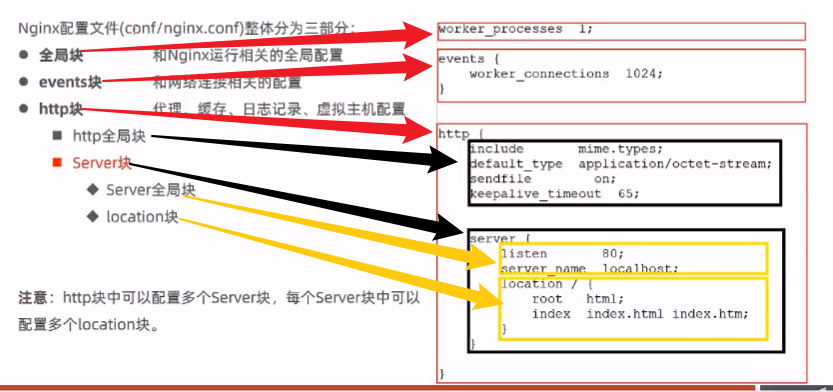
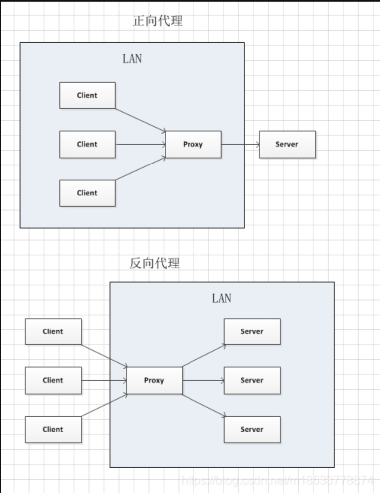

# Nginx学习记录


## 1 Nginx概述

> 步骤： 
>
> 1. 介绍
> 2. 下载和安装
> 3. 目录结构

1. **介绍**

   > Nginx是一款轻量级的Web 服务器/反向代理服务器及电子邮件(IMAP/POP3)代理服务器。其特点是占有内存少，并
   > 发能力强，事实上nginx的并发能力在同类型的网页服务器中表现较好，中国大陆使用nginx的网站有:百度、京东
   > 新浪、网易、腾讯、淘宝等。
   > Nginx是由伊戈尔·赛索耶夫为俄罗斯访问量第二的Rambler,ru站点(俄文: Pam6nep)开发的，第一个公开版本
   > 8.1@发布于24年18月4日。
   > 官网: https://nginx.org/

2. **下载和安装**

   > 安装过程:
   > 1、安装依赖包 `yum -y install gcc pcre-devel zlib-devel openssl openssl-devel`
   > 2、下载Nginx安装包`wget https://nginx.org/download/nginx-1.16.1.tar.gz`
   > 3、解压 `tar -zxvf nginx-1.16.1.tar.gz`
   > 4、`cd nginx-1.16.1`
   > 5、进行选择安装目录`./configure --prefix=/usr/local/nginx`
   > 6、进行编译安装`make && make install`

3. **目录结构**

   > ```text
   > [root@localhost ~]# tree /usr/local/nginx
   > /usr/local/nginx
   > ├── client_body_temp                 # POST 大文件暂存目录
   > ├── conf                             # Nginx所有配置文件的目录
   > │   ├── fastcgi.conf                 # fastcgi相关参数的配置文件
   > │   ├── fastcgi.conf.default         # fastcgi.conf的原始备份文件
   > │   ├── fastcgi_params               # fastcgi的参数文件
   > │   ├── fastcgi_params.default      
   > │   ├── koi-utf
   > │   ├── koi-win
   > │   ├── mime.types                   # 媒体类型
   > │   ├── mime.types.default
   > │   ├── nginx.conf                   #这是Nginx默认的主配置文件，日常使用和修改的文件
   > │   ├── nginx.conf.default
   > │   ├── scgi_params                 # scgi相关参数文件
   > │   ├── scgi_params.default  
   > │   ├── uwsgi_params                 # uwsgi相关参数文件
   > │   ├── uwsgi_params.default
   > │   └── win-utf
   > ├── fastcgi_temp                     # fastcgi临时数据目录
   > ├── html                             # Nginx默认站点目录
   > │   ├── 50x.html                     # 错误页面优雅替代显示文件，例如出现502错误时会调用此页面
   > │   └── index.html                   # 默认的首页文件
   > ├── logs                             # Nginx日志目录
   > │   ├── access.log                   # 访问日志文件
   > │   ├── error.log                   # 错误日志文件
   > │   └── nginx.pid                   # pid文件，Nginx进程启动后，会把所有进程的ID号写到此文件
   > ├── proxy_temp                       # 临时目录
   > ├── sbin                             # Nginx 可执行文件目录
   > │   └── nginx                       # Nginx 二进制可执行程序
   > ├── scgi_temp                       # 临时目录
   > └── uwsgi_temp                       # 临时目录
   > ```

## 2 Nginx命令

> **前置：** 
>
> **需要进入sbin目录或者使用绝对目录即`/usr/local/nginx/sbin/nginx`**
>
> **或者配置环境变量：**
>
> 步骤： 
>
> 1. **配置环境变量**
> 2. 查看版本
> 3. 检查配置文件的正确性
> 4. 启动和停止
> 5. 重新加载配置文件

1. **配置环境变量**：

   `vim /etc/profile`

   ```
   JAVA_HOME=/usr/local/jdk-17.0.9
   PATH=/usr/local/nginx/sbin:$JAVA_HOME/bin:$PATH
   ```

   > /usr/local/nginx/sbin:
   >
   > 这个是追加上去的
   >
   > 之后重新加载profile文件： `source /etc/profile`

2. **查看版本**

   > 查看Nginx版本可以使用命令：
   >
   > `./nginx -v`
   >
   > 配置完环境变量之后可以直接使用：`nginx -v`

3. **检查配置文件的正确性**

   >在启动Nginx服务之前，可以先检查一下conf/nginx.conf文件配置的是否有错误，命令如下:
   >`./nginx -t`

4. **启动和停止**

   >启动Nginx服务使用如下命令:
   >`./nginx`
   >停止Nginx服务使用如下命令:
   >`./nginx -s stop`
   >启动完成后可以查看Nginx进程:
   >`ps -ef|grep nginx`
   >
   > 
   >
   >配置完环境变量之后可以直接使用：`nginx`  `nginx -s stop`

5. **重新加载配置文件**

   >当修改Nginx配置文件后，需要重新加载才能生效，可以使用下面命令重新加载配置文件:
   >`./nainx -s reload`

## 3 Nginx配置文件结构

Nginx配置文件`conf/nginx.conf`

> 1. 全局块      和Nginx运行相关的全局配置
> 2. events块  和网络连接相关的配置
> 3. http块      代理、缓存、日志记录、虚拟主机配置
>    - http全局块
>    - Server块
>      - Server全局块
>      - location块
>
> 注意: http块中可以配置多个Server块，每个Server块中可以
> 配置多个location块。



## 4 Nginx具体应用

> 1. 部署静态资源
> 2. 反向代理
> 3. 负载均衡

### 4.1 部署静态资源

> Nginx可以作为静态web服务器来部署静态资源。静态资源指在服务端真实存在并且能够直接展示的一些文件，比如
> 常见的htm[页面、css文件、js文件、图片、视频等资源。
> 相对于Tomcat，Nginx处理静态资源的能力更加高效，所以在生产环境下，一般都会将静态资源部署到Nginx中。
> 将静态资源部署到Nginx非常简单，只需要将文件复制到Nainx安装目录下的html目录中即可
>
> ```
> server {
>     listen 80;                             #监听端口
>     server_name localhost;                 服务器名称
>     location / {                           #匹配客户端请求url
>          root html;                           #指定静态资源根目录
>          index index.html;                    #指定默认首页
>     }
> }
> ```
>
> > 这里root的路径是从根目录作为绝对目录的
> > ├─conf
> > │  └─eason.conf
> > ├─docs
> > ├─html
> > │  └─app-web
> > ├─logs
> > └─temp
> >
> > 假设前端的静态资源是在html中的app-web，
> >
> > 可以写成
> >
> > ```
> > 	location / {
> > 		root html/app-web;
> > 		index index.html;
> > 	}
> > ```
> >
> > 也可以在之后的`app-web`后面加一个`/`，即`root html/app-web/`

步骤： 

1. 将uni.html界面传入到/usr/local/nginx/html/下
2. 修改文件权限`chmod 777 uni.html`
3. win使用ip+页面访问界面`192.168.209.128/uni.html`

### 4.2 反向代理

> 正向代理：
> 是一个位于客户端和原始服务器(origin server)之间的服务器，为了从原始服务器取得内容，客户端向代理发送一个
> 请求并指定目标(原始服务器)，然后代理向原始服务器转交请求并将获得的内容返回给客户端。
> 正向代理的典型用途是为在防火墙内的局域网客户端提供访问internet的途径
> 正向代理一般是在**客户端设置代理服务器**，通过代理服务器转发请求，最终访问到目标服务器
>
>  反向代理：
>
> 反向代理服务器位于用户与目标服务器之间，但是对于用户而言，反向代理服务器就相当于目标服务器，即用户直接访问反向代理服务器就可以获得目标服务器的资源，反向代理服务器负责将请求转发给目标服务器。
> 用户不需要知道目标服务器的地址，也无须在用户端作任何设定。


```
        # 反向代理,处理管理端发送的请求
        location /api/ {
			proxy_pass   http://localhost:8080/admin/;
        }
		
```

> 就是修改上面这个，可以根据苍穹外卖来，这个反向代理



### 4.3 负载均衡

> 早期的网站流量和业务功能都比较简单，单台服务器就可以满足基本需求，但是随着互联网的发展，业务流量越来越
> 大并且业务逻辑也越来越复杂，单台服务器的性能及单点故障问题就凸显出来了，因此需要多台服务器组成应用集群
> 进行性能的水平扩展以及避免单点故障出现。
> 应用集群:将同一应用部署到多台机器上，组成应用集群，接收负载均衡器分发的请求，进行业务处理并返回响应
> 数据
> 负载均衡器:将用户请求根据对应的负载均衡算法分发到应用集群中的一台服务器进行处理

> 反向代理是一台服务器，负载均衡是多台服务器


> 配置负载均衡:
>
> ```
> #upstream指令可以定义一组服务器
> upstream targetserver[
> 	server 192.168.138.101:8080;
> 	server 192.168.138.101:8081;
> }
> server {
> 	listen 8080;
> 	server_name localhost;
> 	location /(
> 		proxy_pass http://targetserver;
> 	}
> }
> ```


| 名称       | 说明             |
| ---------- | ---------------- |
| 轮询       | 默认方式         |
| weight     | 权重方式         |
| ip_hash    | 依据ip分配方式   |
| least_conn | 依据最少连接方式 |
| url_hash   | 依据url分配方式  |
| fair       | 依据响应时间方式 |


```
#upstream指令可以定义一组服务器
upstream targetserver[
	server 192.168.138.101:8080 weight = 10;
	server 192.168.138.101:8081 weight = 5;
}
server {
	listen 8080;
	server_name localhost;
	location /(
		proxy_pass http://targetserver;
	}
}
```

