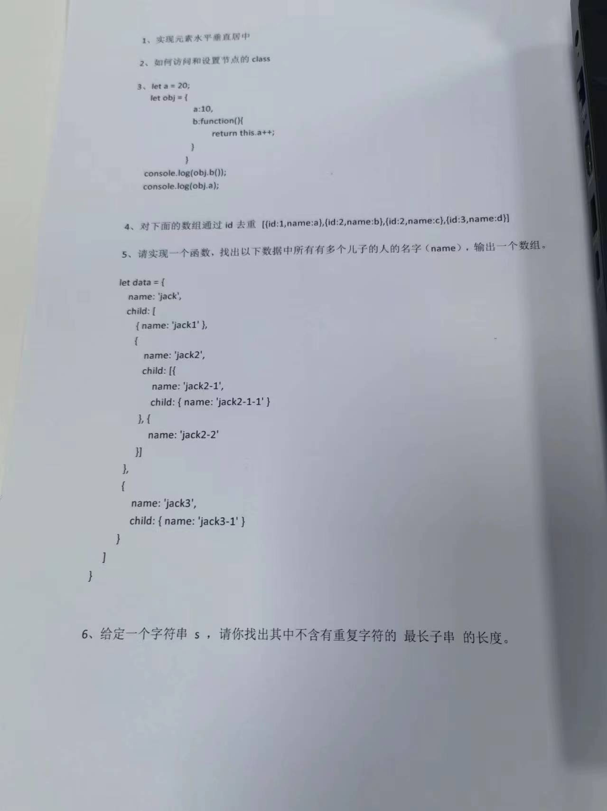

[web前端面试 - 面试官系列 (vue3js.cn)](https://vue3js.cn/interview/)
1.自我介绍
2.vue2和vue3的区别
3.compositon api
3.minxin是如何做到抽离的
5.hooks的实现原理
6.vue3为什么要用Proxy取代Object.defineProperty吗？
7.proxy的api
8.vue2的设计模式
9.跨域的解决方式
10.为什么会出现跨域，如果没有跨域会怎么样
11.后端为什么没有跨域？
12.有没有接口请求了两次，为什么会请求两次。
13.浏览器缓存
14.last-modify和Etag
15.防抖和节流
16.手写防抖或者节流函数
17.深拷贝和浅拷贝的区别，深拷贝有什么问题，手写一个深拷贝（说思路），josn.parse
18.url渲染到浏览器上的过程
19.https的原理
20.pinia与vuex的区别。
21.闭包
22.proxy比defineproperty好在哪里
23.本地存储：cookie与session与sessionStorage

24.常用hooks
25.position属性有什么

数据扁平化，数据分类、数组输出啥的

## 北京阿里面试：

react方向
一面
类组件和函数组件有什么区别
常用hooks
usecallback和usememo区别
怎么理解usecallback，usememo的缓存
读取usememo的值，对应的组件会同步更新吗
usecontext作用，他是如何实现数据共享
你理解什么是hook吗
hooks解决了什么问题
如何自定义hooks
如何往redux存入数据
redux数据流
redux异步请求如何发起
什么是高阶组件
怎么理解redux-saga
你了解dva吗
什么是虚拟dom
什么是react fiber
React fiber三大特点
react fiber通过什么提升性能
了解过h5吗
h5，微信小程序怎么做移动端适配

二面
hooks有什么作用
请你说一下useEffect模拟的哪些生命周期方法，useEffect传入的第一个参数是什么，如果有一个return关键词，他有什么作用，应用场景是什么样的。
usecallback和usememo使用上区别
usecallback和usememo缓存是什么缓存.
什么情况下使用自定义hooks，他比起自定义组件优势是什么
dva和saga解决了什么问题
dva封装saga封装了哪些
react状态管理如何修改state的值
在react中什么情况能触发组件的render函数
render里面return的内容属于虚拟还是真实节点，经历什么可以转换成真实节点
用原生js封装ajax
ajax js发起请求过程
ajax请求类型
跨域方法
详细谈一些CORS
前端数据存储方案
本地存储如何做定时更新，如何让本地存储有生命周期（给每一组数据加额外的一个字段和时间戳）
浏览器硬刷新的时候，sisson会被清除吗。什么情况下会被清除
cookie 情景题
我注入的cookie是在A域名下，如何在B域名下用这个cookie，通过什么设置解决这个限制

cookie存在哪里做的数据传输，他是怎么写入到浏览器的
写入cookie他的关键词是什么

简单介绍下flex，配置哪些维度的参数
介绍flex的参数

请你谈下对h5的理解

三面
逻辑题
请你谈下react为什么先推出的类组件，当时已经有函数式编程的概念了，为什么没有推出静态组件
答案：从应用需求，es5到es6的进化，性能方面来阐述就好
