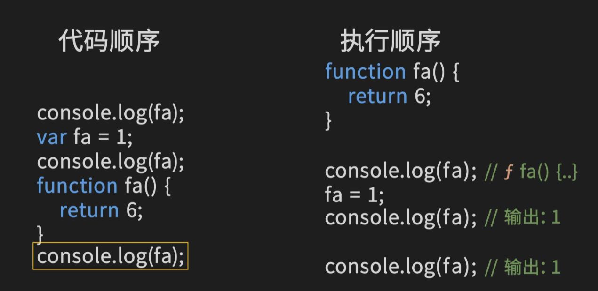

# 1 闭包

[web前端面试 - 面试官系列 (vue3js.cn)](https://vue3js.cn/interview/)

## 1.1 概念：

[10分钟带你深入理解JavaScript的执行上下文和闭包机制-CSDN博客](https://blog.csdn.net/qq_48652579/article/details/132848583)

[闭包](https://developer.mozilla.org/zh-CN/docs/Web/JavaScript/Closures)：闭包让开发者可以**从内部函数访问外部函数的作用域**。在 JavaScript 中，闭包会随着函数的创建而被同时创建。


```js
function outerFunction(outerVariable) {
  function innerFunction() {
    console.log(outerVariable);
  }
  return innerFunction;
}
 
var inner = outerFunction('Hello Closure');
inner(); // 输出 'Hello Closure'
```

> 在这个例子中，`outerFunction`是一个外部函数，接受一个参数`outerVariable`。它包含一个内部函数`innerFunction`，这个内部函数没有自己的参数或局部变量，但却引用了外部函数的变量`outerVariable`。所以，我们说`innerFunction`是一个闭包，而`outerVariable`就是它的自由变量。

> 需要注意的是，由于JavaScript的垃圾回收机制，如果一个变量离开了它的作用域，那么这个变量就会被回收。但是，由于`innerFunction`是一个闭包，它引用了`outerVariable`，所以即使`outerFunction`执行完毕，`outerVariable`离开了它的作用域，但仍然不会被垃圾回收机制回收。

> 再者，每次调用外部函数，都会为内部的闭包创建一个新的作用域。例如：

```js
var inner1 = outerFunction('Hello Closure 1');
var inner2 = outerFunction('Hello Closure 2');
inner1(); // 输出 'Hello Closure 1'
inner2(); // 输出 'Hello Closure 2'
```

> 这里，`inner1`和`inner2`是两个不同的闭包。他们分别有自己的作用域，储存了不同的`outerVariable`。

## 1.2 闭包的作用


## 1.3 闭包的场景

> 一个Ajax请求的成功回调，一个事件绑定的回调方法，一个setTimeout的延时回调，或者一个函数内部返回另一个匿名函数

> 具体场景可以看1.1中的CSDN博客


```js
function fetchData(url, callback) {
  fetch(url).then(function (response) {
    return response.json();
  }).then(function (data) {
    callback(data);
  });
}
 
function processData(data) {
  console
 
.log(data);
}
 
fetchData('https://api.example.com/data', processData);
```

> 在这个例子中，`fetchData`函数通过闭包捕获了`processData`函数作为回调函数。当异步操作完成时，它会调用回调函数并传递数据给它。闭包保持了回调函数的上下文，使得回调函数可以访问外部的`processData`函数。


**笔试题目**：

```js
      let foo = function () {
        var i = 0;
        console.log('i :>> ', i);
        return function () {
          console.log(i++);
        };
      };

      let f1 = foo(); // 每次调用foo，都被 return 一个新的函数  
      let f2 = foo();
      f1(); // 0
      f2(); // 0
      f1(); // 1
```
结果如下：
```js
i :>>  0
i :>>  0
0
0
1
```

> 这里之所以是001的原因是当第一个`f1()`在返回一个`return`运行完之后闭包并没有消失， `f2()`同理，但是每一个闭包都是不同的，所以`f2()`也是0， 第二个`f1()`运行完之后，因为最开始的闭包并没有消失，此时直接在原基础上加1。
> 这里面还有一个是在`let f1 = foo(); let f2 = foo();`这两行运行的时候内部逻辑已经被运行了，也就是说，如果没有最后三行的话，前两个输出结果`i :>>  0`也是会有的


## 1.4 扩展
> 关键词：词法作用域 
> 加分项：执行上下文机制 V8垃圾回收机制


# 2 作用域和执行上下文机制
[js执行上下文与作用域](https://www.bilibili.com/video/BV1wD4y1D7Pp/?share_source=copy_web&vd_source=a9e0245042931de24eb0a8f018fa0eae)
## 2.1 作用域

### 2.1.1 变量提升和函数提升

1. 变量提升
   

   > 这里可以看到代码顺序中执行的结果是`undefined`因为是变量提升导致提前定义了a这个变量。仅`var`
   >
   > 因为：let和const存在暂时性死区TDZ(TemporalDeadZone）变量提升没有意义
   > 
   > 函数声明会先于变量声明被提升。如果变量和函数具有相同的名称，则函数声明会覆盖变量声明。
   > 

2. 函数提升

   

   > 这里将`fa()`提升到前面，导致可以输出`fa`代码顺序

### 2.1.2 作用域

1. 全局作用域

   > 创建的全局变量如`var`执行上下文机制有相应解释。

2. 函数作用域

   > 函数内部声明的函数只能在函数内部进行访问

3. 块级作用域

   ```js
   {
     var a = "var可以被访问";
     let b = "let可以被访问";
     const c = "const可以被访问";
   }
   console.log("a :>> ", a); // var可以被访问
   console.log("b :>> ", b); // underfined
   console.log("c :>> ", c); // underfined
   ```

   > 使用`let`和`const`声明的变量是块级作用域，只能在块中进行访问
   >
   > 如 `if`、`while`、`for`等大括号包含的代码


### 2.1.3 var和let和const

>（使用`let`代替`var`）：

- `let`定义的变量名不可以重复
- 因为`var`是创建在全局对象中，写多了容易内存溢出
- `var`和`let` 可以先声明后赋值，`const`必须声明和赋值


## 2.2  执行上下文机制

> `var`和`function`声明创建在全局对象(`window`)中，而`let`、`const`、`class`声明的变量创建在全局`scope`中。

### 2.2.1 概念

- 全局执行上下文：只有一个，浏览器中的全局对象就是 `window`对象，`this` 指向这个全局对象
- 函数执行上下文：存在无数个，只有在函数被调用的时候才会被创建，每次调用函数都会创建一个新的执行上下文
- Eval 函数执行上下文： 指的是运行在 `eval` 函数中的代码，很少用而且不建议使用


JavaScript在执行语句前，为代码创建了一个执行上下文栈

4种情况会创建新的执行上下文

- 进入全局代码
- 进入`function`函数体代码
- 进入`eval`函数参数指定的代码
- 进入`module`代码


### 2.2.2 实例

[深入 JavaScript 执行上下文栈](https://www.bilibili.com/video/BV1Gr4y1b7PT/?share_source=copy_web&vd_source=a9e0245042931de24eb0a8f018fa0eae)

```js
var scope = "global scope"
function checkscop() {
    var scop = "local scope";
    function f() {
        return scope;
    }
    return f();
}
checkscope()
```


这里面的执行上下文栈的详情是：

```js
ECStack.push(globalcontext); // scope压入执行上下文栈
CStack.push(<checkscope> functionContext); // 
ECStack.push(<f> functionContext);
ECStack.pop();/// <f> functionContext
ECStack.pop();// <checkscope> functionContext
```


### 2.2.3 面试

[面试官：JavaScript中执行上下文和执行栈是什么？ | web前端面试 - 面试官系列 (vue3js.cn)](https://vue3js.cn/interview/JavaScript/context_stack.html#一、执行上下文)


个人：

> 首先解释一下变量提升/函数提升和作用域
>
> 然后说一下闭包和执行上下文栈的相关联系 可以看[2.2.2 实例](# 2.2.2 实例)


# 2 本地存储
## 2.1 cookie和session
### 2.1.1 Cookie

 由于**HTTP是一种无状态的协议**，服务器单从网络连接上是无法知道客户身份的。这时候服务器就需要给客户端颁发一个cookie，用来确认用户的身份。一般情况下，浏览器会自动将相应域名下的 Cookie 包含在 HTTP 请求头中发送给服务器

> 主要是为了解决HTTP无状态，在客户端用于保存用户信息的一种机制。

可以设置过期时间。

这里强调一点，是**cookie的不可跨域名性**

### 2.1.2 Session

Session是另一种记录客户状态的机制，保存在服务器上。


## 2.2 cookie、localStorage、sessionStorage
