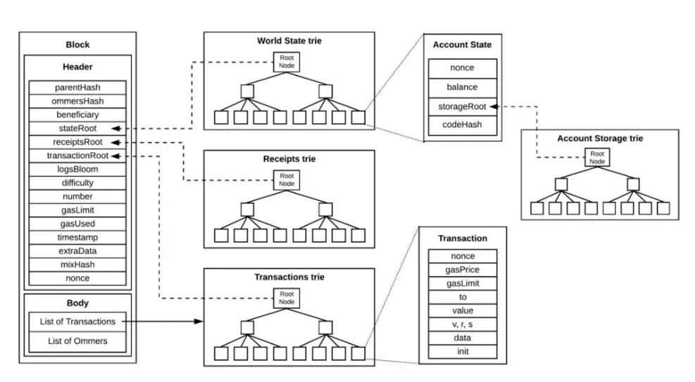

# 1 什么是以太坊

## 1.1 什么是以太坊

一个开放源代码、去中心化的区块链平台，使开发者能够创建和部署智能合约及去中心化应用（DApps）。以太坊由程序员 Vitalik Buterin 于2013年提出，并在2015年正式启动。

区别于比特币的仅限于处理简单交易的功能，以太坊通过引入智能合约——一种能够自动执行、控制或记录其条款的代码——为去中心化应用打开了一扇大门，这些应用覆盖了从金融服务到游戏，再到社交网络等广泛领域

同时，以太坊还构建了一个包含去中心化金融（DeFi）、非同质化代币（NFT）和去中心化自治组织（DAO）等在内的广泛应用和服务的生态系统。以太坊网络通过以太币（ETH）支付交易费用（称为 Gas），激励网络参与者共同维护和运行这个平台。

实际上，以太坊被视作一个“**状态机**”，通过智能合约的代码更新其状态。执行这些智能合约代码，需要消耗以太币（ether），而这个过程是通过一种名为“权益证明”（Proof of Stake, PoS）的共识机制进行验证并在整个网络中广播同步的。

## 1.2 以太坊发展简史

从一个概念提出到如今成为全球第二大加密货币平台，以太坊经历了多次关键的升级与改进。每一步升级和重大事件都为以太坊提供了更加健壮、安全和可扩展的基础，同时也为其广泛的应用场景和生态系统的发展奠定了基石。

- **2013年**：以太坊的概念由 Vitalik Buterin 提出，旨在创建一个更加通用的区块链平台，支持智能合约和去中心化应用（DApps）。

- **2014年**：
  - 以太坊通过初始币发行（ICO）募集资金。
  - Ethereum Switzerland GmbH（EthSuisse）开始正式开发以太坊软件。

- **2015年7月30日**：以太坊网络正式启动，被称为“前沿”（Frontier）阶段，标志着以太坊区块链的正式运行开始。

- **2016年**：
  - **3月**：“家园”（Homestead）升级发布，作为以太坊网络的第一个重大升级，提高了平台的安全性和稳定性。
  - **6月**：发生了著名的 “DAO 攻击”，导致社区分裂，并最终产生了以太坊经典（Ethereum Classic）作为原始链继续存在。

- **2017年**：以太坊发布了“拜占庭”（Byzantium）和“君士坦丁堡”（Constantinople）升级，这两个升级是“大都会”（Metropolis）阶段的一部分，旨在进一步提高网络的隐私性、安全性和效率。

- **2020年12月**：以太坊2.0的“信标链”（Beacon Chain）启动，标志着向权益证明（PoS）机制过渡的开始，这是以太坊网络减少能源消耗和提高交易吞吐量的关键步骤。

- **2022年9月15日**：“合并”（The Merge）完成，以太坊正式从工作量证明（PoW）共识机制转向权益证明（PoS），大幅降低了网络的能源消耗。

- **2023年**：Shapella（Shanghai + Capella）升级，进一步优化了网络功能，特别是引入了质押提款功能，使质押者能够提取他们的质押奖励。

- **2024年**：
  - **现货ETF申请讨论**：2024年1月10日，美国证券交易委员会（SEC）批准了比特币现货 ETF 的上市，这是加密货币历史上的一个重要里程碑，为其他加密货币 ETF 的批准开辟了道路，虽然美SEC 推迟了对 BlackRock 和 Fidelity 等公司以太坊现货 ETF 申请的决定，但也引发了对以太坊未来发展的乐观预期。
  - **坎昆升级计划**：坎昆升级作为以太坊网络的一个重要更新，预计将进一步提高网络的性能和可扩展性。

# 2 以太坊架构

## 2.1 账户模型

以太坊中，账户是连接用户与以太坊网络及其广泛功能的桥梁，不仅可以代表用户的数字身份和资产，还能执行智能合约，推动去中心化应用的发展。

在以太坊中，主要有两种类型的账户：外部拥有账户（Externally Owned Accounts, EOAs）和合约账户（Contract Accounts）。这两种账户共同构成了以太坊的经济和应用生态系统。

### 2.1.1 **外部拥有账户（EOAs）**

- **控制方式**：任何拥有私钥的人控制。

- **功能**：用户可以通过创建和签署交易来发送消息，进行 ETH 转移或与智能合约互动。

- **地址**：20 字节，由其公钥派生而来。

- **特点**：EOAs 直接由用户控制，安全性依赖于私钥的保管。这类账户是以太坊网络中与人类用户直接相关的账户类型，允许用户参与以太坊网络的经济活动和应用生态系统。

### 2.1.2  **合约账户**

- **控制方式**：智能合约代码控制。

- **功能**：当合约账户接收到消息时，其内部代码会自动执行，允许账户根据逻辑读写内部存储、发送其他消息或创建新合约。

- **地址**：20 字节，由合约创建时的交易数据派生而来。

- **特点**：合约账户的行为完全由其内部代码决定，实现了代码的自动执行和自治操作，但**只能**通过外部账户发起消息调用来执行代码。

### 2.1.3  **账户字段**

- **Nonce**：用于记录外部账户发起的交易数量或合约账户创建的合约数量。

  > 外部账户的 nonce 从0开始计数，合约账户的 nonce 从1开始。

- **Balance**：账户拥有的以太币数量，以Wei为单位（1 ETH = 1e+18 Wei）。

- **CodeHash**：合约账户的 EVM 代码的哈希值。对于合约账户，CodeHash代表可执行的智能合约代码，该代码在账户接收到消息调用时执行。

  > 对于外部账户，此字段为空字符串的哈希。

- **StorageRoot**：也称为存储哈希，是 Merkle Patricia Trie 根节点的256位哈希，编码了账户的存储内容。这个 Trie 树以键值对形式存储账户的数据，对于新账户，默认为空。


## 2.2 状态与数据存储

在前面的章节里，我们说过，以太坊是一个巨大的、全球分布式的“状态机”。这里，"状态"指的是在任何给定时刻，整个以太坊网络的具体信息快照。每当发生一个交易（无论是资金的转移、智能合约的执行还是数据的存储），以太坊的状态都会改变。那么这些状态信息以及交易数据存储具体是怎么存储的呢？

虽然区块链实际上是一个去中心化的账本，但由于数据的存储需要成本，所以并不是所有的数据都适合上链。在以太坊中这一点尤为重要，因为以太坊不仅处理简单的资金转移，还支持复杂的智能合约和去中心化应用（DApps）。

为了有效降低存储成本并提高数据处理效率，以太坊采取了一种精巧的设计策略：在每个区块头中只保留其三棵核心 Merkle Patricia Trie（MPT） 树——世界状态树、交易树和回执树的**根哈希值**，而将这些树的详细结构和数据存储在各个节点的数据库中。这种方法显著减轻了区块链本身的存储压力，同时保持了网络的完整性和安全性。

我们首先来看这三颗核心的树：世界状态树，交易树，回执树




### 2.2.1 **世界状态树**

世界状态树存储了以太坊网络中所有账户的信息，包括账户的余额、nonce、合约代码和合约存储等信息，它是以太坊网络状态的全面记录，任何账户状态的变化都会反映在这棵树的更新中。

### 2.2.2 **交易树**

交易树记录了某个区块中所有交易的信息。每笔交易都通过其哈希值在树中找到对应的位置，它保证了区块中交易数据的完整性和可验证性，使得任何人都能高效地验证交易数据的正确性。

### 2.2.3 **回执树**

回执树存储了每笔交易执行后的回执信息，包括交易的执行结果、消耗的Gas和日志事件等，它为交易执行的结果提供了透明度，允许任何人验证交易的执行情况和智能合约的事件日志。

通过仅在区块头中存储根哈希值，以太坊能够确保数据的完整性和不可篡改性，因为任何对数据的微小更改都会导致根哈希值的变化，从而被网络检测到。而在节点本地存储完整树的数据，则允许各节点独立地验证和更新状态，进一步加强了网络的去中心化特性。

## 2.3 交易

### 2.3.1 **什么是交易**

交易是以太坊网络中执行操作的基本单位，由外部账户发起，带有密码学签名的指令。

以太坊上的交易包含了一系列字段：

- `from` - 发送者的地址，该地址将签署交易。 这将是一个外部帐户，因为合约帐户不能发送交易。

- `recipient` – 接收地址（如果是外部帐户，交易将传输值。 如果是合约帐户，交易将执行合约代码）

- `signature` – 发送者的标识符。 当发送者的私钥签署交易并确保发送者已授权此交易时，生成此签名。

- `nonce` - 一个有序递增的计数器，表示来自帐户的交易数量

- `value` – 发送者向接收者转移的以太币数量（面值为 WEI，1 个以太币 = 1e+18wei）

- `input data` – 可包括任意数据的可选字段

- `gasLimit` – 交易可以消耗的最大数量的燃料单位。 以太坊虚拟机指定每个计算步骤所需的燃料单位

- `maxPriorityFeePerGas` - 作为小费提供给验证者的已消耗燃料的最高价格

- `maxFeePerGas` - 愿意为交易支付的每单位燃料的最高费用（包括 `baseFeePerGas` 和 `maxPriorityFeePerGas`）

以太坊有几种不同类型的交易：

- 常规交易：从一个帐户到另一个帐户的交易。

- 合约部署交易：没有“to”地址的交易，数据字段用于合约代码。

- 执行合约：与已部署的智能合约进行交互的交易。 在这种情况下，“to”地址是智能合约地址。

### 2.3.2  **交易的生命周期**

1. **创建和签名**：交易由用户创建并使用私钥签名，以证明交易的发起者拥有执行交易的权限。

2. **广播**：签名的交易被广播到以太坊网络。一旦交易进入网络，它会被传播到网络中的多个节点。这样，交易就开始在网络中传播，最终到达矿工节点，进入待处理的交易池。

3. **打包和验证**： 矿工会从交易池中选择要包含在下一个区块中的交易。通常，矿工会选择具有较高燃料费用（gas）的交易，因为他们可以通过处理这些交易来获取更高的奖励。矿工选择后，验证其有效性，然后将其打包进新的区块中。

4. **执行**：一旦交易被打包进区块并被网络确认，交易将被执行。这可能包括转移以太币、执行智能合约代码等操作。

5. **最终确认**：随着更多区块被挖掘并附加到区块链上，交易获得更多确认，其被逆转的可能性越来越小，最终成为不可更改的一部分。

###  2.3.3 **燃料（Gas）**

交易执行需要消耗 Gas，作为支付给矿工的手续费。Gas 的消耗量取决于交易的复杂度，简单的转账交易消耗较少的 Gas，而复杂的合约交互消耗更多的 Gas。用户通过设置 Gas Limit 和 Gas Price 来控制交易费用。


## 2.4 Ether

### 2.4.1 **定义**

有些人经常把以太坊（Ethereum）和以太币（ ETH）混为一谈。但实际上，以太坊是区块链，以太币是以太坊的原生资产，以 Wei 作为最小单位，其中1 Ether 等于10^18 Wei。它在以太坊生态系统中扮演着至关重要的角色，用于支付交易费用、执行智能合约，以及在过去的工作量证明（PoW）机制下作为矿工的激励机制。随着以太坊转向权益证明（PoS）机制，Ether 同样用于激励验证者（Validators）。


### 2.4.2 **产生方式**

1. **初始分配（众筹）：**在以太坊网络启动之初，通过2014年的众筹（ICO）进行了初始的 Ether 分配。投资者用比特币（BTC）购买了 Ether，这些 Ether 在以太坊网络启动时被创建并分配给了参与众筹的投资者。

2. **区块奖励（在PoW机制下）**：在以太坊采用工作量证明机制时，矿工通过解决复杂数学难题来验证交易并创建新区块，作为回报获得新产生的 Ether。这个过程不仅确保了网络的去中心化和安全性，也是新 Ether 进入流通的主要途径。

3. **质押奖励（在PoS机制下）**：随着以太坊升级到2.0版本并转向权益证明机制，Ether 的产生方式也随之改变。在 PoS 机制中，持币者通过锁定一定数量的 Ether 作为质押，获得成为网络验证者的资格。验证者负责验证交易和提议新区块，作为回报获得新产生的 Ether。这种方式减少了对大量计算资源的需求，降低了网络的能源消耗。

4. **交易费用和燃烧**：除了通过区块奖励产生外，Ether 还通过交易费用在用户之间流通。在 EIP-1559 提案实施后，网络开始燃烧部分交易费用中的基础费用，减少了 Ether 的总供应量，这一机制有助于控制通胀并可能对 Ether 的价值产生积极影响。

### 2.4.3 **Ether的经济和技术意义**

- **经济意义**：作为以太坊网络的原生货币，Ether 是去中心化金融（DeFi）生态系统中的主要流通货币，支持了广泛的金融产品和服务。

- **技术意义**：Ether 支付的交易费用激励了网络参与者（无论是矿工还是验证者）维护网络的安全和稳定，同时促进了智能合约和 DApps 的运行。

## 2.5 智能合约与 EVM

### 2.5.1 介绍

什么是智能合约？它运行在以太坊链上，是位于以太坊区块链上一个**特定地址**的自动执行、控制或文档化法律或逻辑行为的**代码（函数）**和**数据（状态）**。

了解智能合约，我们可以从一个很经典的例子入手：

我们可以把智能合约比作自动售货机：

**选择产品** —— 调用合约函数，选择你想要执行的操作或交易

**自动售货机显示出价格** —— 智能合约明确规定了执行该操作所需的条件或成本

**付款** —— 在以太坊中，执行智能合约通常需要支付 Gas 费用

**自动售货机验证你的付款金额是否正确** —— 智能合约自动验证操作是否满足执行条件，确保交易的有效性和安全性

**自动售货机给你提供产品** —— 智能合约自动执行预设的逻辑，完成交易或操作，如转账、发放代币、执行合约内的其他函数等

通过这个例子，我们可以知道智能合约有着这样的特点：

- **自动化**：智能合约无需人工介入即可自动执行，大大提高了处理速度和效率。
- **透明性**：合约条款以代码形式公开在区块链上，任何人都可以验证这些条款，保证了交易的透明度。

- **不可篡改**：一旦智能合约被部署到区块链上，其逻辑就无法更改，确保了合约执行的可靠性和安全性。

- **去中心化**：智能合约的执行不依赖于任何中心化的机构或个人，降低了信任成本和潜在的欺诈风险

在以太坊上，智能合约是以 Ethereum Virtual Machine (EVM) 字节码的形式存储的。

EVM 是以太坊的运行环境，是一个基于堆栈的虚拟机，它是分布式的，运行在以太坊网络中的每个节点上，确保了网络中任何节点都能独立验证智能合约的执行结果。这意味着，一旦智能合约被部署到区块链上，它就可以在全球任何地方的以太坊网络中无需任何第三方的介入下运行。

智能合约在部署到以太坊时，都会被编译成 EVM 可执行的字节码。当智能合约被触发时（例如，通过用户发送的交易或其他合约的调用），EVM 会加载合约的字节码并解释执行这些字节码，执行过程中，EVM 会按照字节码指令进行操作，包括但不限于计算、存储访问、和其他合约的交互等。智能合约的执行可能会改变以太坊的全局状态，如账户余额、合约存储的数据等。

### 2.5.2 **智能合约的运行机制**

智能合约的运行基于以下几个步骤：

1.**编写和编译**：开发者使用 Solidity 或其他支持的语言编写智能合约代码，然后将其编译成 EVM 字节码。

2.**部署**：编译后的字节码通过一个以太坊交易被发送到网络，并存储在区块链上的特定地址处。

3.**执行**：当用户或另一个合约调用智能合约时，EVM 会加载并执行存储在该地址的字节码。

4.**状态变更**：智能合约的执行可能会改变以太坊的全局状态，例如更新账户余额或修改合约存储的数据。

5.**Gas消耗**：智能合约的执行需要消耗 Gas，Gas 费用由发起交易的用户支付，用以激励网络中的节点执行和验证交易

目前，以太坊上最流行的智能合约编程语言是Solidity。我们这里给出一个简单的 HelloWorld 示例：


```solidity
1// 指定Solidity的版本
2pragma solidity ^0.8.0;
3
4// 定义一个合约，名为'HelloWorld'
5contract HelloWorld {
6    // 定义一个状态变量，用于存储一个字符串
7    string public greeting = "Hello, World!";
8
9    // 定义一个函数，用于改变'greeting'变量的值
10    function setGreeting(string memory _greeting) public {
11        greeting = _greeting;
12    }
13
14    // 定义一个函数，用于获取当前的'greeting'值
15    function getGreeting() public view returns (string memory) {
16        return greeting;
17    }
18}
```