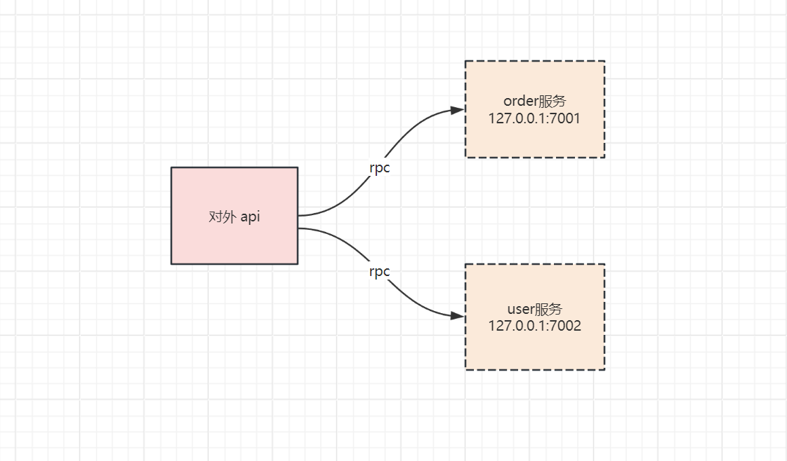

# 1、介绍


# 2、安装环境

[golang 安装 | go-zero Documentation](https://go-zero.dev/docs/tasks)


# 3、Etcd

Etcd是一个高可用的分布式键值存储系统，主要用于共享配置信息和服务发现。它采用Raft一致性算法来保证数据的强一致性，并且支持对数据进行监视和更新

## 3.1、为什么要用etcd

主要是用于微服务的配置中心，服务发现0



在对外api这个应用里面，怎么知道order服务的rpc地址呢？

写在配置文件里面？

如果服务的ip地址变化了怎么办？在传统的配置文件模式，修改配置文件，应用程序是需要重启才能解决的

所以etcd就是来做这个事情的


至于为什么不用redis，大家只需要记住，**etcd的数据可靠性更强**

## 3.2、安装

**windows安装**

https://github.com/etcd-io/etcd/releases

**linux安装**

源码安装

https://blog.csdn.net/Mr_XiMu/article/details/127923827

yum安装

版本一般比较老

**docker安装**

```Go
docker run --name etcd -d -p 2379:2379 -p 2380:2380 -e ALLOW_NONE_AUTHENTICATION=yes bitnami/etcd:latest
```

这里需要注意的是，windows安装的不是本体，而是执行命令的程序。本体是docker安装的。windows安装完相应的压缩包之后需要将本体安装

具体相关安装可以看官方文档，windows里面有两步。

## 3.3、基本命令

```Go
// 设置或更新值
etcdctl put name 张三
// 获取值
etcdctl get name
// 只要value
etcdctl get name --print-value-only
// 获取name前缀的键值对
etcdctl get --prefix name
// 删除键值对
etcdctl del name
// 监听键的变化
etcdctl watch name

```

## 参考文档

etcd windows安装 https://www.cnblogs.com/wujuntian/p/12837926.html

etcdctl指令 https://www.jianshu.com/p/67cbef492812

为什么用etcd https://www.elecfans.com/d/1890103.html


# 4、微服务demo

这个demo是一个用户微服务，一个视频微服务

视频微服务需要提供一个http接口，用户查询一个视频的信息，并且把关联用户id的用户名也查出来

那么用户微服务就要提供一个方法，根据用户id返回用户信息

## 4.1、编写rpc的proto文件

> 注意路径问题，都是在最外层目录下执行的
>
> 

user/rpc/user.proto

```protobuf
syntax = "proto3";

package user;

option go_package = "./user";

message IdRequest {
  string id = 1;
}


message UserResponse {
  // 用户id
  string id = 1;
  // 用户名
  string name = 2;
  // 用户性别
  string gender = 3;
}


service User {
  rpc getUser(IdRequest) returns(UserResponse);
}
```

执行命令：`goctl rpc protoc ./user/rpc/user.proto --go_out=./user/rpc/ --go-grpc_out=./user/rpc/ --zrpc_out=./user/rpc/ `进行编译

> 命令出处：[goctl rpc | go-zero Documentation](https://go-zero.dev/docs/tutorials/cli/rpc#goctl-rpc-protoc)

执行命令：`go mod tidy`安装全部依赖

执行命令：`go run user.go`运行脚本，注意路径，这里应该使用`go run user/rpc/user.go`

```shell
go run user\rpc\user.go -f user\rpc\etc\user.yaml
```

> 这里面有可能遇见配置文件找不到，这里可以使用-f进行指定配置文件，或者进入go文件目录下进行启动。


## 4.2、编写api文件

video/api/video.api

```go
type (
	VideoReq {
		Id string `path:"id"`
	}
	VideoRes {
		Id   string `json:"id"`
		Name string `json:"name"`
	}
)

service video {
	@handler getVideo
	get /api/videos/:id (VideoReq) returns (VideoRes)
}


```

> 相关文档请看：[api 语法 | go-zero Documentation](https://go-zero.dev/docs/tasks/dsl/api)

**运行**

```shell
goctl api go -api video/api/video.api -dir video/api/
```

> 相关文档请看：[goctl api | go-zero Documentation](https://go-zero.dev/docs/tutorials/cli/api)


1. **添加user rpc配置**

因为要在video里面调用user的rpc服务

video/api/internal/config/config.go

```go
package config

import (
  "github.com/zeromicro/go-zero/rest"
  "github.com/zeromicro/go-zero/zrpc"
)

type Config struct {
  rest.RestConf
  UserRpc zrpc.RpcClientConf
}

```

- **完善服务依赖**

video/api/internal/svc/servicecontext.go

```go
package svc

import (
  "github.com/zeromicro/go-zero/zrpc"
  "go_test/user/rpc/userclient"
  "go_test/video/api/internal/config"
)

type ServiceContext struct {
  Config  config.Config
  UserRpc userclient.User
}

func NewServiceContext(c config.Config) *ServiceContext {
  return &ServiceContext{
    Config:  c,
    UserRpc: userclient.NewUser(zrpc.MustNewClient(c.UserRpc)),
  }
}

```

> 这里添加的为11行：`  UserRpc userclient.User`和17，添加的目的是通过配置文件找到etcd的ip，其中这个类型是编译器自动生成的。然后之后进行配置，如yaml，和服务依赖，都需要添加。

- **添加yaml配置**

video/api/etc/video.yaml

```YAML
Name: video
Host: 0.0.0.0
Port: 8888
UserRpc:
  Etcd:
    Hosts:
      - 127.0.0.1:2379
    Key: user.rpc
```

- **完善服务依赖**

video/api/internal/logic/getvideologic.go

```go
func (l *GetVideoLogic) GetVideo(req *types.VideoReq) (resp *types.VideoRes, err error) {
  // todo: add your logic here and delete this line
  user1, err := l.svcCtx.UserRpc.GetUser(l.ctx, &user.IdRequest{
    Id: "1",
  })
  if err != nil {
    return nil, err
  }
  return &types.VideoRes{
    Id:   req.Id,
    Name: user1.Name,
  }, nil
}

```


**运行**

`go mod tidy`

`go run video.go`


## 知识回顾

回顾一下，我们做了哪些操作

1. 编写用户微服务的rpc服务的proto文件
2. 生成代码
3. 添加自己的逻辑
4. 编写视频微服务的api服务的api文件
5. 生成代码
6. 完善依赖，配置
7. 添加自己的逻辑

> 这就是使用go-zero的好处，让我们专注于业务的开发

生成并修改之后的目录

