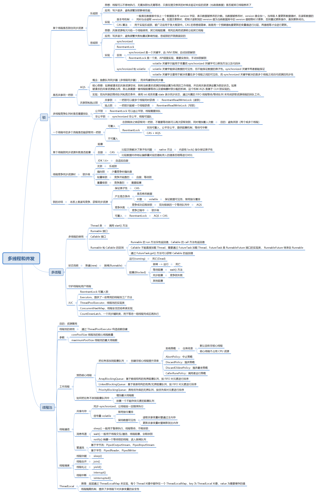

# JavaSE

## java基础

## 多线程和并发

## Integer和int的区别

> 1. Integer的初始值是null，int的初始值是0
> 2. Integer存储在堆内存，int类型是直接存储在栈空间
> 3. Integer是对象类型，它封装了很多的方法和属性，我们在使用的时候更加灵活

# 数据库

## 2.1 MySql常见的存储引擎及区别

> 一、InnoDB
>
> 二、MyISAM
>
> 三、Memory

**一、InnoDB**

1. 支持事务
2. 用的锁粒度默认为行级锁，可以支持更高的并发；也支持表锁
3. 持外键约束；外键约束其实降低了表的查询速度，增加了表之间的耦合度

**二、MyISAM**

1. 不提供事务支持
2. 只支持表级锁
3. 不支持外键

**三、Memory**

数据存储在内存中

总结：

> - MyISAM管理非事务表，提供高速存储和检索以及全文搜索能力，如果在应用中执行大量select操作，应该选择MyISAM
>
> - InnoDB用于事务处理，具有ACID事务支持等特性，如果在应用中执行大量insert和update操作，应该选择InnoDB

## 2.2 Redis

### 2.2.1双写一致性问题
> 这个是redis和mysql同步的问题

原理：[后端面试反复问的缓存双写一致性问题_哔哩哔哩_bilibili](https://www.bilibili.com/video/BV1Jz421e7an/)
解决方案：[【IT老齐062】缓存一致性如何保障？先写库还是先写缓存？聊聊Cache Aside Pattern与延迟双删_哔哩哔哩_bilibili](https://www.bilibili.com/video/BV1aF411e7ur/)
> 双写一致，需要  先更新库再删缓存+延时双删