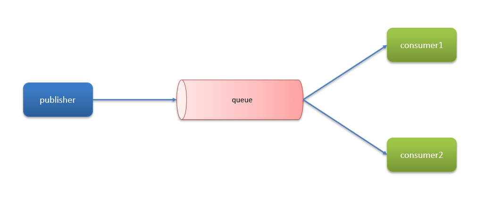
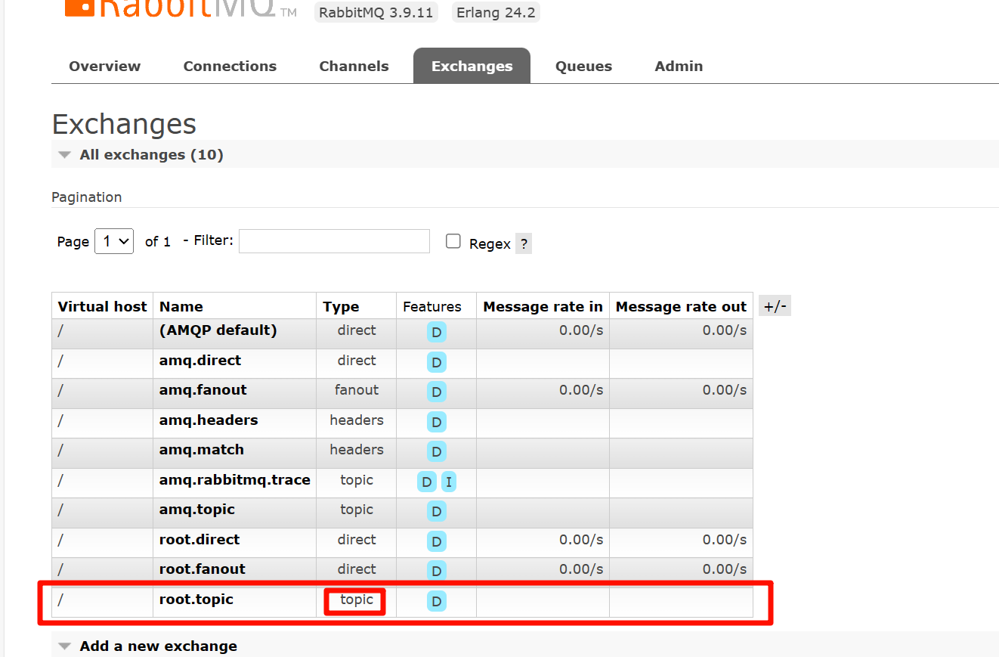
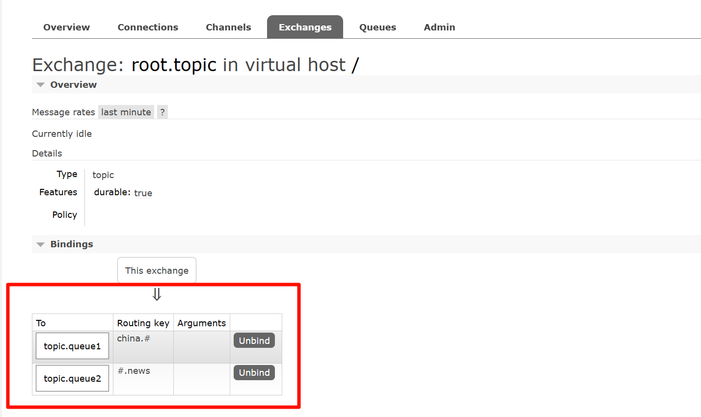
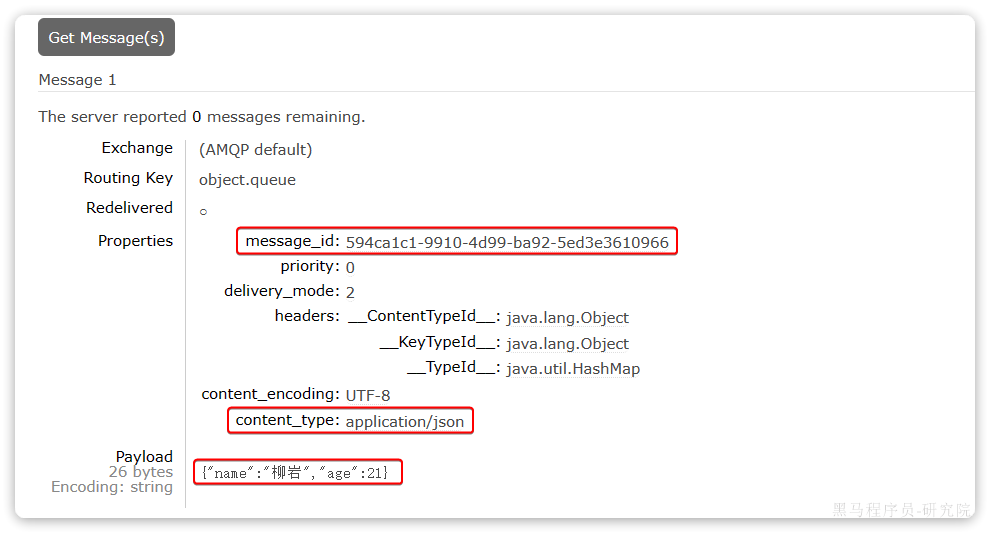

# MQ基础

## 介绍

MQ （MessageQueue），中文是消息队列，字面来看就是存放消息的队列。也就是事件驱动架构中的Broker。

异步通信的优点：

- 耦合度低

- 吞吐量提升

- 故障隔离

- 流量削峰

异步通信的缺点：

- 依赖于Broker的可靠性、安全性、吞吐能力

- 架构复杂了，业务没有明显的流程线，不好追踪管理


常见消息模型

|            | **RabbitMQ**            | **ActiveMQ**                   | **RocketMQ** | **Kafka**  |
| ---------- | ----------------------- | ------------------------------ | ------------ | ---------- |
| 公司/社区  | Rabbit                  | Apache                         | 阿里         | Apache     |
| 开发语言   | Erlang                  | Java                           | Java         | Scala&Java |
| 协议支持   | AMQP，XMPP，SMTP，STOMP | OpenWire,STOMP，REST,XMPP,AMQP | 自定义协议   | 自定义协议 |
| 可用性     | 高                      | 一般                           | 高           | 高         |
| 单机吞吐量 | 一般                    | 差                             | 高           | 非常高     |
| 消息延迟   | 微秒级                  | 毫秒级                         | 毫秒级       | 毫秒以内   |
| 消息可靠性 | 高                      | 一般                           | 高           | 一般       |


## 1 RabbitMQ快速入门

RabbitMQ概述和安装

本地安装看这个[RabbitMQ部署](./RabbitMQ安装/RabbitMQ部署指南.md)

快速入门

RabbitMQ中的几个概念：

- channel：操作MQ的工具

- exchange：路由消息到队列中

- queue：缓存消息

- virtual host：虚拟主机，是对queue、exchange等资源的逻辑分组


## 2 SpringAMQP

SpringAMQP是基于RabbitMQ封装的一套模板，并且还利用SpringBoot对其实现了自动装配，使用起来非常方便。

SpringAmqp的官方地址：https://spring.io/projects/spring-amqp


### 2.1 实现基础消息队列功能

> 1. 在父工程中引入spring-amqp的依赖
>
> 2. 在publisher服务中利用RabbitTemplate发送消息到simple.queue这个队列
>
> 3. 在consumer服务中编写消费逻辑，绑定simple.queue这个队列


1. **在父工程中引入spring-amqp的依赖**

   ```
           <!--AMQP依赖，包含RabbitMQ-->
           <dependency>
               <groupId>org.springframework.boot</groupId>
               <artifactId>spring-boot-starter-amqp</artifactId>
           </dependency>
   ```

   

2. **在publisher服务中利用RabbitTemplate发送消息到simple.queue这个队列**

   1. 在publisher服务中编写application.yml，添加mq连接信息

      ```
      spring:
        rabbitmq:
          host: 192.168.209.130 # 主机名
          port: 5672 # 端口
          virtual-host: / # 虚拟主机
          username: root # 用户名
          password: 123456 # 密码
      ```

   2. 在publisher服务中新建一个测试类，编写测试方法

      ```
      @SpringBootTest
      public class SpringAmqpTest {
          @Autowired
          private RabbitTemplate rabbitTemplate;
      
          @Test
          public void testSimpleQueue() {
              // 队列名称
              String queueName = "simple.queue";
              // 消息
              String message = "hello, spring amqp!";
              // 发送消息
              rabbitTemplate.convertAndSend(queueName, message);
          }
      }
      ```

      > 这里记得先创建一个名字为`simple.queue`的queue

3. **在consumer服务中编写消费逻辑，绑定simple.queue这个队列**

   1. 配置yml

      > 这里和publisher一样

   2. 编写listeners

      ```
      @Component
      public class SpringRabbitListener {
          // 利用RabbitListener来声明要监听的队列信息
          // 将来一旦监听的队列中有了消息，就会推送给当前服务，调用当前方法，处理消息。
          // 可以看到方法体中接收的就是消息体的内容
          @RabbitListener(queues = "simple.queue")
          public void listenSimpleQueueMessage(String msg) throws InterruptedException {
              System.out.println("spring 消费者接收到消息：【" + msg + "】");
          }
      }
      ```

      


### 2.2 WorkQueue模型

Work queues，任务模型。简单来说就是**让多个消费者绑定到一个队列，共同消费队列中的消息**。



当消息处理比较耗时的时候，可能生产消息的速度会远远大于消息的消费速度。长此以往，消息就会堆积越来越多，无法及时处理。

此时就可以使用work 模型，**多个消费者共同处理消息处理，消息处理的速度就能大大提高**了。

#### 2.2.1 消息发送

> 记得先加一个`work.queue`的队列

```
@Test
public void testWorkQueue() throws InterruptedException {
    String queueName = "work.queue";

    for (int i = 1; i <= 50; i++) {
        String message = "hello, worker,  message_" + i;
        rabbitTemplate.convertAndSend(queueName, message);
        Thread.sleep(10);
    }
}
```

#### 2.2.2 消息接收

```Java
@RabbitListener(queues = "work.queue")
public void listenWorkQueue1(String msg) throws InterruptedException {
    System.out.println("消费者1接收到消息：【" + msg + "】" + LocalTime.now());
    Thread.sleep(20);
}

@RabbitListener(queues = "work.queue")
public void listenWorkQueue2(String msg) throws InterruptedException {
    System.err.println("消费者2........接收到消息：【" + msg + "】" + LocalTime.now());
    Thread.sleep(200);
}
```

注意到这两消费者，都设置了`Thead.sleep`，模拟任务耗时：

- 消费者1 sleep了20毫秒，相当于每秒钟处理50个消息
- 消费者2 sleep了200毫秒，相当于每秒处理5个消息


#### 2.2.3 测试

启动ConsumerApplication后，在执行publisher服务中刚刚编写的发送测试方法testWorkQueue。

最终结果如下：

```Java
消费者1接收到消息：【hello, message_0】21:06:00.869555300
消费者2........接收到消息：【hello, message_1】21:06:00.884518
消费者1接收到消息：【hello, message_2】21:06:00.907454400
消费者1接收到消息：【hello, message_4】21:06:00.953332100
消费者1接收到消息：【hello, message_6】21:06:00.997867300
消费者1接收到消息：【hello, message_8】21:06:01.042178700
消费者2........接收到消息：【hello, message_3】21:06:01.086478800
消费者1接收到消息：【hello, message_10】21:06:01.087476600
消费者1接收到消息：【hello, message_12】21:06:01.132578300
消费者1接收到消息：【hello, message_14】21:06:01.175851200
消费者1接收到消息：【hello, message_16】21:06:01.218533400
消费者1接收到消息：【hello, message_18】21:06:01.261322900
消费者2........接收到消息：【hello, message_5】21:06:01.287003700
消费者1接收到消息：【hello, message_20】21:06:01.304412400
消费者1接收到消息：【hello, message_22】21:06:01.349950100
消费者1接收到消息：【hello, message_24】21:06:01.394533900
消费者1接收到消息：【hello, message_26】21:06:01.439876500
消费者1接收到消息：【hello, message_28】21:06:01.482937800
消费者2........接收到消息：【hello, message_7】21:06:01.488977100
消费者1接收到消息：【hello, message_30】21:06:01.526409300
消费者1接收到消息：【hello, message_32】21:06:01.572148
消费者1接收到消息：【hello, message_34】21:06:01.618264800
消费者1接收到消息：【hello, message_36】21:06:01.660780600
消费者2........接收到消息：【hello, message_9】21:06:01.689189300
消费者1接收到消息：【hello, message_38】21:06:01.705261
消费者1接收到消息：【hello, message_40】21:06:01.746927300
消费者1接收到消息：【hello, message_42】21:06:01.789835
消费者1接收到消息：【hello, message_44】21:06:01.834393100
消费者1接收到消息：【hello, message_46】21:06:01.875312100
消费者2........接收到消息：【hello, message_11】21:06:01.889969500
消费者1接收到消息：【hello, message_48】21:06:01.920702500
消费者2........接收到消息：【hello, message_13】21:06:02.090725900
消费者2........接收到消息：【hello, message_15】21:06:02.293060600
消费者2........接收到消息：【hello, message_17】21:06:02.493748
消费者2........接收到消息：【hello, message_19】21:06:02.696635100
消费者2........接收到消息：【hello, message_21】21:06:02.896809700
消费者2........接收到消息：【hello, message_23】21:06:03.099533400
消费者2........接收到消息：【hello, message_25】21:06:03.301446400
消费者2........接收到消息：【hello, message_27】21:06:03.504999100
消费者2........接收到消息：【hello, message_29】21:06:03.705702500
消费者2........接收到消息：【hello, message_31】21:06:03.906601200
消费者2........接收到消息：【hello, message_33】21:06:04.108118500
消费者2........接收到消息：【hello, message_35】21:06:04.308945400
消费者2........接收到消息：【hello, message_37】21:06:04.511547700
消费者2........接收到消息：【hello, message_39】21:06:04.714038400
消费者2........接收到消息：【hello, message_41】21:06:04.916192700
消费者2........接收到消息：【hello, message_43】21:06:05.116286400
消费者2........接收到消息：【hello, message_45】21:06:05.318055100
消费者2........接收到消息：【hello, message_47】21:06:05.520656400
消费者2........接收到消息：【hello, message_49】21:06:05.723106700
```

可以看到消费者1和消费者2竟然每人消费了25条消息：

- 消费者1很快完成了自己的25条消息
- 消费者2却在缓慢的处理自己的25条消息。

也就是说消息是平均分配给每个消费者，并没有考虑到消费者的处理能力。导致1个消费者空闲，另一个消费者忙的不可开交。没有充分利用每一个消费者的能力，最终消息处理的耗时远远超过了1秒。这样显然是有问题的。

#### 2.2.4 能者多劳

在spring中有一个简单的配置，可以解决这个问题。我们修改consumer服务的application.yml文件，添加配置：

```YAML
spring:
  rabbitmq:
    listener:
      simple:
        prefetch: 1 # 每次只能获取一条消息，处理完成才能获取下一个消息
```

再次测试，发现结果如下：

```Java
消费者1接收到消息：【hello, message_0】21:12:51.659664200
消费者2........接收到消息：【hello, message_1】21:12:51.680610
消费者1接收到消息：【hello, message_2】21:12:51.703625
消费者1接收到消息：【hello, message_3】21:12:51.724330100
消费者1接收到消息：【hello, message_4】21:12:51.746651100
消费者1接收到消息：【hello, message_5】21:12:51.768401400
消费者1接收到消息：【hello, message_6】21:12:51.790511400
消费者1接收到消息：【hello, message_7】21:12:51.812559800
消费者1接收到消息：【hello, message_8】21:12:51.834500600
消费者1接收到消息：【hello, message_9】21:12:51.857438800
消费者1接收到消息：【hello, message_10】21:12:51.880379600
消费者2........接收到消息：【hello, message_11】21:12:51.899327100
消费者1接收到消息：【hello, message_12】21:12:51.922828400
消费者1接收到消息：【hello, message_13】21:12:51.945617400
消费者1接收到消息：【hello, message_14】21:12:51.968942500
消费者1接收到消息：【hello, message_15】21:12:51.992215400
消费者1接收到消息：【hello, message_16】21:12:52.013325600
消费者1接收到消息：【hello, message_17】21:12:52.035687100
消费者1接收到消息：【hello, message_18】21:12:52.058188
消费者1接收到消息：【hello, message_19】21:12:52.081208400
消费者2........接收到消息：【hello, message_20】21:12:52.103406200
消费者1接收到消息：【hello, message_21】21:12:52.123827300
消费者1接收到消息：【hello, message_22】21:12:52.146165100
消费者1接收到消息：【hello, message_23】21:12:52.168828300
消费者1接收到消息：【hello, message_24】21:12:52.191769500
消费者1接收到消息：【hello, message_25】21:12:52.214839100
消费者1接收到消息：【hello, message_26】21:12:52.238998700
消费者1接收到消息：【hello, message_27】21:12:52.259772600
消费者1接收到消息：【hello, message_28】21:12:52.284131800
消费者2........接收到消息：【hello, message_29】21:12:52.306190600
消费者1接收到消息：【hello, message_30】21:12:52.325315800
消费者1接收到消息：【hello, message_31】21:12:52.347012500
消费者1接收到消息：【hello, message_32】21:12:52.368508600
消费者1接收到消息：【hello, message_33】21:12:52.391785100
消费者1接收到消息：【hello, message_34】21:12:52.416383800
消费者1接收到消息：【hello, message_35】21:12:52.439019
消费者1接收到消息：【hello, message_36】21:12:52.461733900
消费者1接收到消息：【hello, message_37】21:12:52.485990
消费者1接收到消息：【hello, message_38】21:12:52.509219900
消费者2........接收到消息：【hello, message_39】21:12:52.523683400
消费者1接收到消息：【hello, message_40】21:12:52.547412100
消费者1接收到消息：【hello, message_41】21:12:52.571191800
消费者1接收到消息：【hello, message_42】21:12:52.593024600
消费者1接收到消息：【hello, message_43】21:12:52.616731800
消费者1接收到消息：【hello, message_44】21:12:52.640317
消费者1接收到消息：【hello, message_45】21:12:52.663111100
消费者1接收到消息：【hello, message_46】21:12:52.686727
消费者1接收到消息：【hello, message_47】21:12:52.709266500
消费者2........接收到消息：【hello, message_48】21:12:52.725884900
消费者1接收到消息：【hello, message_49】21:12:52.746299900
```

可以发现，由于消费者1处理速度较快，所以处理了更多的消息；消费者2处理速度较慢，只处理了6条消息。而最终总的执行耗时也在1秒左右，大大提升。

正所谓能者多劳，这样充分利用了每一个消费者的处理能力，可以有效避免消息积压问题。


#### 2.2.5 总结

Work模型的使用：

- 多个消费者绑定到一个队列，同一条消息只会被一个消费者处理
- 通过设置prefetch来控制消费者预取的消息数量


### 2.3 交换机类型

在之前的两个测试案例中，都没有交换机，生产者直接发送消息到队列。而一旦引入交换机，消息发送的模式会有很大变化：


可以看到，在订阅模型中，多了一个exchange角色，而且过程略有变化：

- **Publisher**：生产者，不再发送消息到队列中，而是发给交换机
- **Exchange**：交换机，一方面，接收生产者发送的消息。另一方面，知道如何处理消息，例如递交给某个特别队列、递交给所有队列、或是将消息丢弃。到底如何操作，取决于Exchange的类型。
- **Queue**：消息队列也与以前一样，接收消息、缓存消息。不过队列一定要与交换机绑定。
- **Consumer**：消费者，与以前一样，订阅队列，没有变化

**Exchange（** **交换机** **）只负责转发消息，不具备存储消息的能力**，因此如果没有任何队列与Exchange绑定，或者没有符合路由规则的队列，那么消息会丢失！

交换机的类型有四种：

- **Fanout**：广播，将消息交给所有绑定到交换机的队列。我们最早在控制台使用的正是Fanout交换机
- **Direct**：订阅，基于RoutingKey（路由key）发送给订阅了消息的队列
- **Topic**：通配符订阅，与Direct类似，只不过RoutingKey可以使用通配符
- **Headers**：头匹配，基于MQ的消息头匹配，用的较少。

> 为什么会有交换机，举个场景，当一个支付成功的消息来到后端，不能只有一个消费者收到，而且到了后期会有集群，会有多个微服务，一个消息需要多个队列，所以说出现了交换机。


### 2.4 Fanout交换机

在广播模式下，消息发送流程是这样的：


#### 2.4.1 声明队列和交换机

- 交换机


- 队列


- 然后绑定两个队列到交换机：


#### 2.4.2 消息发送

在publisher服务的SpringAmqpTest类中添加测试方法：

```java
@Test
public void testFanoutQueue() {
    // 交换机名称
    String exchangeName = "root.fanout";
    String message = "hello, everyone!";
    // 发送消息
    rabbitTemplate.convertAndSend(exchangeName, "", message);
}
```

#### 2.4.3 消息接收

在consumer服务的SpringRabbitListener中添加两个方法，作为消费者

```java
@RabbitListener(queues = "fanout.queue1")
public void listenFanoutQueue1(String msg) throws InterruptedException {
    System.err.println("消费者1........接收到fanout消息：【" + msg + "】" + LocalTime.now());
}

@RabbitListener(queues = "fanout.queue2")
public void listenFanoutQueue2(String msg) throws InterruptedException {
    System.err.println("消费者2........接收到fanout消息：【" + msg + "】" + LocalTime.now());
}
```


#### 2.4.4 总结

交换机的作用是什么？

- 接收publisher发送的消息
- 将消息按照规则路由到与之绑定的队列
- 不能缓存消息，路由失败，消息丢失
- FanoutExchange的会将消息路由到每个绑定的队列


### 2.5 Direct交换机

在Fanout模式中，一条消息，会被所有订阅的队列都消费。但是，在某些场景下，我们希望不同的消息被不同的队列消费。这时就要用到Direct类型的Exchange。


在Direct模型下：

- 队列与交换机的绑定，不能是任意绑定了，而是要指定一个`RoutingKey`（路由key）
- 消息的发送方在 向 Exchange发送消息时，也必须指定消息的 `RoutingKey`。
- Exchange不再把消息交给每一个绑定的队列，而是根据消息的`Routing Key`进行判断，只有队列的`Routingkey`与消息的 `Routing key`完全一致，才会接收到消息

#### 需求：按照上图所示

1.  声明一个名为`hmall.direct`的交换机
2. 声明队列`direct.queue1`，绑定`hmall.direct`，`bindingKey`为`blud`和`red`
3. 声明队列`direct.queue2`，绑定`hmall.direct`，`bindingKey`为`yellow`和`red`
4.  在`consumer`服务中，编写两个消费者方法，分别监听direct.queue1和direct.queue2 
5.  在publisher中编写测试方法，向`hmall.direct`发送消息 

#### 2.5.1 声明队列和交换机

> 步骤：
>
> 1. 声明交换机
> 2. 声明队列
> 3. 将队列绑定到交换机上

- 交换机


- 队列


- 然后使用`red`和`blue`作为key，**绑定**`direct.queue1`到`root.direct`：


#### 2.5.2 消息发送

- 在publisher服务的SpringAmqpTest类中添加测试方法：

```java
@Test
public void testDirectQueue() throws InterruptedException {
    // 交换机名称
    String exchangeName = "root.direct";
    String message = "hello, blue!";
    // 发送消息

    rabbitTemplate.convertAndSend(exchangeName, "blue", message);
    Thread.sleep(20);
    message = "hello, yellow!";
    rabbitTemplate.convertAndSend(exchangeName, "yellow", message);
    Thread.sleep(20);
    message = "hello, red!";
    rabbitTemplate.convertAndSend(exchangeName, "red", message);
}
```

#### 2.5.3 消息接收

- 在consumer服务的SpringRabbitListener中添加方法：

```java
@RabbitListener(queues = "direct.queue1")
public void listenDirectQueue1(String msg) throws InterruptedException {
    System.err.println("消费者1........接收到direct消息：【" + msg + "】" + LocalTime.now());
}

@RabbitListener(queues = "direct.queue2")
public void listenDirectQueue2(String msg) throws InterruptedException {
    System.err.println("消费者2........接收到direct消息：【" + msg + "】" + LocalTime.now());
}
```

- 接收结果如下


> 这里我们可以知道的是当设置了key的时候，只有对应有相应的key的队列才会被Direct交换机发送消息

#### 2.5.4.总结

描述下Direct交换机与Fanout交换机的差异？

- Fanout交换机将消息路由给每一个与之绑定的队列
- Direct交换机根据RoutingKey判断路由给哪个队列
- 如果多个队列具有相同的RoutingKey，则与Fanout功能类似


### 2.6 Topic交换机

#### 2.6.1 说明

`Topic`类型的`Exchange`与`Direct`相比，都是可以根据`RoutingKey`把消息路由到不同的队列。

只不过`Topic`类型`Exchange`可以让队列在绑定`BindingKey` 的时候使用通配符！

```
BindingKey` 一般都是有一个或多个单词组成，多个单词之间以`.`分割，例如： `item.insert
```

通配符规则：

- `#`：匹配一个或多个词
- `*`：匹配不多不少恰好1个词

举例：

- `item.#`：能够匹配`item.spu.insert` 或者 `item.spu`
- `item.*`：只能匹配`item.spu`

图示：


假如此时publisher发送的消息使用的`RoutingKey`共有四种：

- `china.news `代表有中国的新闻消息；
- `china.weather` 代表中国的天气消息；
- `japan.news` 则代表日本新闻
- `japan.weather` 代表日本的天气消息；

解释：

- `topic.queue1`：绑定的是`china.#` ，凡是以 `china.`开头的`routing key` 都会被匹配到，包括：
  - `china.news`
  - `china.weather`
- `topic.queue2`：绑定的是`#.news` ，凡是以 `.news`结尾的 `routing key` 都会被匹配。包括:
  - `china.news`
  - `japan.news`


#### 2.6.2 声明队列和交换机

- 队列


- 交换机



- 绑定



#### 2.6.3 消息发送

- 在publisher服务的SpringAmqpTest类中添加测试方法：

```java
@Test
public void testTopicQueue() {
    // 交换机名称
    String exchangeName = "root.topic";
    String message = "hello, china.weather";
    rabbitTemplate.convertAndSend(exchangeName, "china.weather", message);
    message = "hello, china.news";
    rabbitTemplate.convertAndSend(exchangeName, "china.news", message);
    message = "hello, japan.news";
    rabbitTemplate.convertAndSend(exchangeName, "japan.news", message);
}
```


#### 2.6.4 消息接收

- 在consumer服务的SpringRabbitListener中添加方法：

```java
@RabbitListener(queues = "topic.queue1")
public void listenTopicQueue1(String msg) throws InterruptedException {
    System.err.println("消费者1........接收到topic消息：【" + msg + "】" + LocalTime.now());
}

@RabbitListener(queues = "topic.queue2")
public void listenTopicQueue2(String msg) throws InterruptedException {
    System.err.println("消费者2........接收到topic消息：【" + msg + "】" + LocalTime.now());
}
```


结果如下：

```java
消费者2........接收到topic消息：【hello, china.news】01:14:44.393
消费者1........接收到topic消息：【hello, china.weather】01:14:44.393
消费者2........接收到topic消息：【hello, japan.news】01:14:44.394
消费者1........接收到topic消息：【hello, china.news】01:14:44.394
```


### 2.7 利用java声明队列和交换机

在之前我们都是基于RabbitMQ控制台来创建队列、交换机。但是在实际开发时，队列和交换机是程序员定义的，将来项目上线，又要交给运维去创建。那么程序员就需要把程序中运行的所有队列和交换机都写下来，交给运维。在这个过程中是很容易出现错误的。

因此推荐的做法是由程序启动时检查队列和交换机是否存在，如果不存在自动创建。

#### 2.7.1 基本API

SpringAMQP提供了一个Queue类，用来创建队列：


SpringAMQP还提供了一个Exchange接口，来表示所有不同类型的交换机：


我们可以自己创建队列和交换机，不过SpringAMQP还提供了ExchangeBuilder来简化这个过程：


而在绑定队列和交换机时，则需要使用BindingBuilder来创建Binding对象：


#### 2.7.2 fanout示例

在consumer中创建一个类，声明队列和交换机：

```Java
package com.itheima.consumer.config;

import org.springframework.amqp.core.Binding;
import org.springframework.amqp.core.BindingBuilder;
import org.springframework.amqp.core.FanoutExchange;
import org.springframework.amqp.core.Queue;
import org.springframework.context.annotation.Bean;
import org.springframework.context.annotation.Configuration;

@Configuration
public class FanoutConfig {
    /**
     * 声明交换机
     * @return Fanout类型交换机
     */
    @Bean
    public FanoutExchange fanoutExchange(){
        return new FanoutExchange("hmall.fanout");
    }

    /**
     * 第1个队列
     */
    @Bean
    public Queue fanoutQueue1(){
        return new Queue("fanout.queue1");
    }

    /**
     * 绑定队列和交换机
     */
    @Bean
    public Binding bindingQueue1(Queue fanoutQueue1, FanoutExchange fanoutExchange){
        return BindingBuilder.bind(fanoutQueue1).to(fanoutExchange);
    }

    /**
     * 第2个队列
     */
    @Bean
    public Queue fanoutQueue2(){
        return new Queue("fanout.queue2");
    }

    /**
     * 绑定队列和交换机
     */
    @Bean
    public Binding bindingQueue2(Queue fanoutQueue2, FanoutExchange fanoutExchange){
        return BindingBuilder.bind(fanoutQueue2).to(fanoutExchange);
    }
}
```

#### 2.7.3 direct示例

direct模式由于要绑定多个KEY，会非常麻烦，每一个Key都要编写一个binding：

```Java
package com.itheima.consumer.config;

import org.springframework.amqp.core.*;
import org.springframework.context.annotation.Bean;
import org.springframework.context.annotation.Configuration;

@Configuration
public class DirectConfig {

    /**
     * 声明交换机
     * @return Direct类型交换机
     */
    @Bean
    public DirectExchange directExchange(){
        return ExchangeBuilder.directExchange("hmall.direct").build();
    }

    /**
     * 第1个队列
     */
    @Bean
    public Queue directQueue1(){
        return new Queue("direct.queue1");
    }

    /**
     * 绑定队列和交换机
     */
    @Bean
    public Binding bindingQueue1WithRed(Queue directQueue1, DirectExchange directExchange){
        return BindingBuilder.bind(directQueue1).to(directExchange).with("red");
    }
    /**
     * 绑定队列和交换机
     */
    @Bean
    public Binding bindingQueue1WithBlue(Queue directQueue1, DirectExchange directExchange){
        return BindingBuilder.bind(directQueue1).to(directExchange).with("blue");
    }

    /**
     * 第2个队列
     */
    @Bean
    public Queue directQueue2(){
        return new Queue("direct.queue2");
    }

    /**
     * 绑定队列和交换机
     */
    @Bean
    public Binding bindingQueue2WithRed(Queue directQueue2, DirectExchange directExchange){
        return BindingBuilder.bind(directQueue2).to(directExchange).with("red");
    }
    /**
     * 绑定队列和交换机
     */
    @Bean
    public Binding bindingQueue2WithYellow(Queue directQueue2, DirectExchange directExchange){
        return BindingBuilder.bind(directQueue2).to(directExchange).with("yellow");
    }
}
```

#### 2.7.4 基于注解声明

基于@Bean的方式声明队列和交换机比较麻烦，Spring还提供了基于注解方式来声明。

例如，我们同样声明Direct模式的交换机和队列：

- 这个是在消费者的监听器定义的

```Java
@RabbitListener(bindings = @QueueBinding(
    value = @Queue(name = "direct.queue1"),
    exchange = @Exchange(name = "hmall.direct", type = ExchangeTypes.DIRECT),
    key = {"red", "blue"}
))
public void listenDirectQueue1(String msg){
    System.out.println("消费者1接收到direct.queue1的消息：【" + msg + "】");
}

@RabbitListener(bindings = @QueueBinding(
    value = @Queue(name = "direct.queue2"),
    exchange = @Exchange(name = "hmall.direct", type = ExchangeTypes.DIRECT),
    key = {"red", "yellow"}
))
public void listenDirectQueue2(String msg){
    System.out.println("消费者2接收到direct.queue2的消息：【" + msg + "】");
}
```


**Topic模式：**

```Java
@RabbitListener(bindings = @QueueBinding(
    value = @Queue(name = "topic.queue1"),
    exchange = @Exchange(name = "hmall.topic", type = ExchangeTypes.TOPIC),
    key = "china.#"
))
public void listenTopicQueue1(String msg){
    System.out.println("消费者1接收到topic.queue1的消息：【" + msg + "】");
}

@RabbitListener(bindings = @QueueBinding(
    value = @Queue(name = "topic.queue2"),
    exchange = @Exchange(name = "hmall.topic", type = ExchangeTypes.TOPIC),
    key = "#.news"
))
public void listenTopicQueue2(String msg){
    System.out.println("消费者2接收到topic.queue2的消息：【" + msg + "】");
}
```


### 2.8 消息转换器

Spring的消息发送代码接收的消息体是一个Object：

而在数据传输时，它会把你发送的消息序列化为字节发送给MQ，接收消息的时候，还会把字节反序列化为Java对象。

只不过，默认情况下Spring采用的序列化方式是JDK序列化。众所周知，JDK序列化存在下列问题：

- 数据体积过大
- 有安全漏洞
- 可读性差


#### 2.8.1 测试默认转换器

1）创建测试队列

首先，我们在consumer服务中声明一个新的配置类：


利用@Bean的方式创建一个队列，

具体代码：

```Java
package com.itheima.consumer.config;

import org.springframework.amqp.core.Queue;
import org.springframework.context.annotation.Bean;
import org.springframework.context.annotation.Configuration;

@Configuration
public class MessageConfig {

    @Bean
    public Queue objectQueue() {
        return new Queue("object.queue");
    }
}
```

注意，这里我们先不要给这个队列添加消费者，我们要查看消息体的格式。

重启consumer服务以后，该队列就会被自动创建出来了：


2）发送消息

我们在publisher模块的SpringAmqpTest中新增一个消息发送的代码，发送一个Map对象：

```Java
@Test
public void testSendMap() throws InterruptedException {
    // 准备消息
    Map<String,Object> msg = new HashMap<>();
    msg.put("name", "柳岩");
    msg.put("age", 21);
    // 发送消息
    rabbitTemplate.convertAndSend("object.queue", msg);
}
```

发送消息后查看控制台：


可以看到消息格式非常不友好。

#### 2.8.2 配置JSON转换器

显然，JDK序列化方式并不合适。我们希望消息体的体积更小、可读性更高，因此可以使用JSON方式来做序列化和反序列化。

在`publisher`和`consumer`两个服务中都引入依赖：

```XML
<dependency>
    <groupId>com.fasterxml.jackson.dataformat</groupId>
    <artifactId>jackson-dataformat-xml</artifactId>
    <version>2.9.10</version>
</dependency>
```

注意，如果项目中引入了`spring-boot-starter-web`依赖，则无需再次引入`Jackson`依赖。

配置消息转换器，在`publisher`和`consumer`两个服务的启动类中添加一个Bean即可：

```Java
@Bean
public MessageConverter messageConverter(){
    // 1.定义消息转换器
    Jackson2JsonMessageConverter jackson2JsonMessageConverter = new Jackson2JsonMessageConverter();
    // 2.配置自动创建消息id，用于识别不同消息，也可以在业务中基于ID判断是否是重复消息
    jackson2JsonMessageConverter.setCreateMessageIds(true);
    return jackson2JsonMessageConverter;
}
```

消息转换器中添加的messageId可以便于我们将来做幂等性判断。

此时，我们到MQ控制台**删除**`object.queue`中的旧的消息。然后再次执行刚才的消息发送的代码，到MQ的控制台查看消息结构：



#### 2.8.3 消费者接收Object

我们在consumer服务中定义一个新的消费者，publisher是用Map发送，那么消费者也一定要用Map接收，格式如下：

```Java
@RabbitListener(queues = "object.queue")
public void listenSimpleQueueMessage(Map<String, Object> msg) throws InterruptedException {
    System.out.println("消费者接收到object.queue消息：【" + msg + "】");
}
```


# MQ高级