# Springcloud基础

两种分

## 项目拆分

### 怎么拆

有两种微服务：

小的：每个模块都是一个项目

大的：maven聚合


之前我们说过，微服务拆分时**粒度要小**，这其实是拆分的目标。具体可以从两个角度来分析：

- **高内聚**：每个微服务的职责要尽量单一，包含的业务相互关联度高、完整度高。
- **低耦合**：每个微服务的功能要相对独立，尽量减少对其它微服务的依赖，或者依赖接口的稳定性要强。

**高内聚**首先是**单一职责，**但不能说一个微服务就一个接口，而是要保证微服务内部业务的完整性为前提。目标是当我们要修改某个业务时，最好就只修改当前微服务，这样变更的成本更低。

一旦微服务做到了高内聚，那么服务之间的**耦合度**自然就降低了。

当然，微服务之间不可避免的会有或多或少的业务交互，比如下单时需要查询商品数据。这个时候我们不能在订单服务直接查询商品数据库，否则就导致了数据耦合。而应该由商品服务对应暴露接口，并且一定要保证微服务对外**接口的稳定性**（即：尽量保证接口外观不变）。虽然出现了服务间调用，但此时无论你如何在商品服务做内部修改，都不会影响到订单微服务，服务间的耦合度就降低了。

明确了拆分目标，接下来就是拆分方式了。我们在做服务拆分时一般有两种方式：

- **纵向**拆分
- **横向**拆分

所谓**纵向拆分**，就是按照项目的功能模块来拆分。例如黑马商城中，就有用户管理功能、订单管理功能、购物车功能、商品管理功能、支付功能等。那么按照功能模块将他们拆分为一个个服务，就属于纵向拆分。这种拆分模式可以尽可能提高服务的内聚性。

而**横向拆分**，是看各个功能模块之间有没有公共的业务部分，如果有将其抽取出来作为通用服务。例如用户登录是需要发送消息通知，记录风控数据，下单时也要发送短信，记录风控数据。因此消息发送、风控数据记录就是通用的业务功能，因此可以将他们分别抽取为公共服务：消息中心服务、风控管理服务。这样可以提高业务的复用性，避免重复开发。同时通用业务一般接口稳定性较强，也不会使服务之间过分耦合。


### 微服务远程调用

> 背景：
>
> ​	需要将查订单的时候也将用户查出来，这里`RestTemplate`就是spring一个发送请求的api
>
> 步骤：
>
> 1. 注册RestTemplate
> 2. 服务远程调用RestTemplate

1. **注册RestTemplate**

   - 在order-service的OrderApplication中注册RestTemplate

     > 这里不一定需要写在OrderApplication，主要是OrderApplication也是一个配置类，自己写一个配置类也行

   ```
   
   @MapperScan("cn.itcast.order.mapper")
   @SpringBootApplication
   public class OrderApplication {
   
       public static void main(String[] args) {
           SpringApplication.run(OrderApplication.class, args);
       }
   
       @Bean
       public RestTemplate restTemplate(){
           return new RestTemplate();
       }
   
   }
   ```

2. **服务远程调用RestTemplate**

   - 修改order-service中的OrderService的queryOrderById方法：

   ```
   @Service
   public class OrderService {
   
       @Autowired
       private OrderMapper orderMapper;
   
       @Autowired
       private RestTemplate restTemplate;
   
       public Order queryOrderById(Long orderId) {
           // 1.查询订单
           Order order = orderMapper.findById(orderId);
           // 2.查询用户
           String url = "http://localhost:8081/user/" + order.getUserId();
           User user = restTemplate.getForObject(url, User.class);
           // 3. 封装user信息
           order.setUser(user);
           // 4.返回
           return order;
       }
   }
   ```

   > 主要是加了2和3，将get请求得到的值放入到order中

### 依赖问题

> 父工程导入了springcloud依赖，子工程cloud中就不需要导入版本号了

- 父工程

```
            <!-- springCloud -->
            <dependency>
                <groupId>org.springframework.cloud</groupId>
                <artifactId>spring-cloud-dependencies</artifactId>
                <version>Hoxton.SR10</version>
                <type>pom</type>
                <scope>import</scope>
            </dependency>
```


## 1 Eureka注册中心

### 1.1 介绍：

> 有两个重点：
>
> 一个是eureka的工作原理
>
> 一个是客户端和服务端


- **eureka的工作原理**

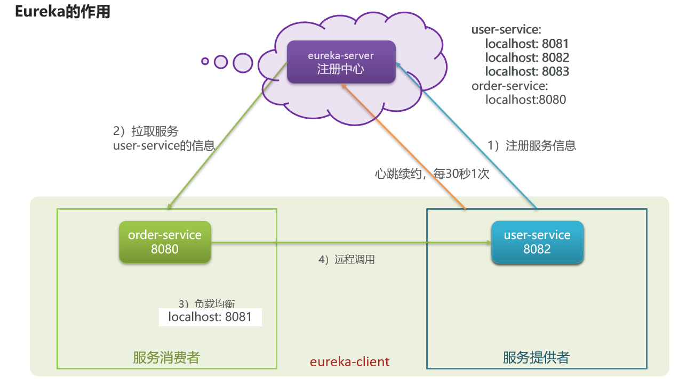

- **客户端和服务端**

在Eureka架构中，微服务角色有两类：

- lEurekaServer：服务端，注册中心
  - 记录服务信息
  - 心跳监控
- lEurekaClient：客户端
  - Provider：服务提供者，例如案例中的 user-service
    - 注册自己的信息到EurekaServer
    - 每隔30秒向EurekaServer发送心跳
  - consumer：服务消费者，例如案例中的 order-service
    - 根据服务名称从EurekaServer拉取服务列表
    - 基于服务列表做负载均衡，选中一个微服务后发起远程调用


### 1.2 搭建注册中心

> 背景：
>
> ​	搭建EurekaServer
>
> 步骤： 
>
> 1. 创建项目，引入spring-cloud-starter-netflix-eureka-server的依赖
> 2. 编写启动类，添加@EnableEurekaServer注解
> 3. 添加application.yml文件，编写下面的配置：


1. **创建项目，引入spring-cloud-starter-netflix-eureka-server的依赖**

   - 父工程

     > 看上面的父工程

   - 客户端

   ```
           <!-- EurekaServer服务 -->
           <dependency>
               <groupId>org.springframework.cloud</groupId>
               <artifactId>spring-cloud-starter-netflix-eureka-server</artifactId>
           </dependency>
   ```

   

2. **编写启动类，添加@EnableEurekaServer注解**

   ```
   @EnableEurekaServer
   @SpringBootApplication
   public class EurekaApplication {
       public static void main(String[] args) {
           SpringApplication.run(EurekaApplication.class, args);
       }
   }
   ```

   

3. **添加application.yml文件，编写下面的配置：**

   ```
   server:
     port: 10086 # 端口名称
   spring:
     application:
       name: eurekaserver # eureka的服务名称
   eureka:
     client:
       service-url: # eureka的地址信息
         defaultZone: http://127.0.0.1:10086/eureka
   ```

   

### 1.3 服务注册

> 背景：
>
> ​	将user-service、order-service都注册到eureka
>
> 步骤：
>
> 1. 在user-service项目引入spring-cloud-starter-netflix-eureka-client的依赖
> 2. 在application.yml文件，编写下面的配置：
> 3. orderservice同理
> 4. user-service多次启动， 模拟多实例部署
> 5. 结果

1. **在user-service项目引入spring-cloud-starter-netflix-eureka-client的依赖**

   ```
           <!-- EurekaServer服务 -->
           <dependency>
               <groupId>org.springframework.cloud</groupId>
               <artifactId>spring-cloud-starter-netflix-eureka-server</artifactId>
           </dependency>
   ```

   

2. **在application.yml文件，编写下面的配置：**

```
spring:
  application:
    name: userservice # eureka的服务名称
eureka:
  client:
    service-url: # eureka的地址信息
      defaultZone: http://127.0.0.1:10086/eureka
```

3. **orderservice同理**

4. **user-service多次启动， 模拟多实例部署**

   > 这里使用idea中的Copy Configuratio的属性将user-service复制一份，但为了避免端口冲突，需要修改端口设置：
   >
   > 即在**VM options**中加上-Dserver.port=8002

5. **结果**

> 访问地址为： localhost/eureka
>
> ​      defaultZone: http://127.0.0.1:10086/eureka
>
> 就是自己设置的


### 1.4 服务发现

> 背景：
>
> ​	在order-service中完成服务拉取，然后通过负载均衡挑选一个服务，实现远程调用
>
> 步骤：
>
> 1. 修改OrderService的代码，修改访问的url路径，用服务名代替ip、端口：
> 2. 在order-service项目的启动类OrderApplication中的RestTemplate添加**负载均衡**注解：


1. **修改OrderService的代码，修改访问的url路径，用服务名代替ip、端口：**

   ````
   // 2.查询用户
   String url = "http://userservice/user/" + order.getUserId();
   ````

   > 这里将127.0.0.1:8080改为了userservice，可以理解为eureka注册中心有一张表，可以直接做负载均衡

2. **在order-service项目的启动类OrderApplication中的RestTemplate添加负载均衡注解：**

```
    @Bean
    @LoadBalanced
    public RestTemplate restTemplate(){
        return new RestTemplate();
    }
```

## 2 Ribbon负载均衡

### 2.1 负载均衡原理


### 2.2 负载均衡策略

> 背景：
>
> 负载均衡选择服务列表有两种方式：
>
> - 轮询
>
> - 随机
> - IP的hash
> - 最近最少访问
>
> 步骤：
>
> 1. 代码方式：在order-service中的OrderApplication类中，定义一个新的IRule：
> 2. 配置文件方式：在order-service的application.yml文件中，添加新的配置也可以修改规则：

1. **代码方式：在order-service中的OrderApplication类中，定义一个新的IRule：**

   > 不一定非得在OrderApplication，自己写个配置类也行

   ```
       @Bean
       public IRule randomRule(){
           return new RandomRule();
       }
   ```

2. **配置文件方式：在order-service的application.yml文件中，添加新的配置也可以修改规则：**

   ```
   userservice:
     ribbon:
       NFLoadBalancerRuleClassName: com.netflix.loadbalancer.RandomRule # 负载均衡规则
   ```

### 2.3 懒加载

> Ribbon默认是采用懒加载，即第一次访问时才会去创建LoadBalanceClient，请求时间会很长。
>
> 而饥饿加载则会在项目启动时创建，降低第一次访问的耗时，通过下面配置开启饥饿加载：

Orderservice中设置

```
ribbon:
  eager-load:
    enabled: true # 开启饥饿加载
    clients: userservice # 指定对userservice这个服务饥饿加载
```


## 3 Nacos注册中心

### 3.1 认识和安装Nacos

> 1. 安装
> 2. 端口配置
> 3. 运行

1. **安装**

   > 在Nacos的GitHub页面，提供有下载链接，可以下载编译好的Nacos服务端或者源代码：
   >
   > GitHub主页：https://github.com/alibaba/nacos
   >
   > GitHub的Release下载页：https://github.com/alibaba/nacos/releases

2. **端口配置**

   >Nacos的默认端口是8848，如果你电脑上的其它进程占用了8848端口，请先尝试关闭该进程。
   >
   >**如果无法关闭占用8848端口的进程**，也可以进入nacos的conf目录，修改配置文件中的端口：

3. **运行**

   执行命令即可：

- windows命令：

  ```
  startup.cmd -m standalone
  ```

  > 这是单机启动

- 登录的**账号名**和**密码**都是`nacos`

### 3.2 服务注册到Nacos

> 1. 在cloud-demo父工程中添加spring-cloud-alilbaba的管理依赖
> 2. 注释掉order-service和user-service中原有的eureka依赖。
> 3. 添加nacos的客户端依赖：

1. **在cloud-demo父工程中添加spring-cloud-alilbaba的管理依赖**

   父工程：

   ```xml
               <!-- nacos的管理依赖 -->
               <dependency>
                   <groupId>com.alibaba.cloud</groupId>
                   <artifactId>spring-cloud-alibaba-dependencies</artifactId>
                   <version>2.2.5.RELEASE</version>
                   <type>pom</type>
                   <scope>import</scope>
               </dependency>
   ```

   

   客户端：

   ```xml
   <!-- nacos客户端依赖包 -->
   <dependency>
       <groupId>com.alibaba.cloud</groupId>
       <artifactId>spring-cloud-starter-alibaba-nacos-discovery</artifactId>
   </dependency>
   ```

2. **注释掉order-service和user-service中原有的eureka依赖并添加nacos依赖。**

   ```
           <!-- nacos客户端依赖包 -->
           <dependency>
               <groupId>com.alibaba.cloud</groupId>
               <artifactId>spring-cloud-starter-alibaba-nacos-discovery</artifactId>
           </dependency>
   ```

3. **注释掉原有的yml文件eureka配置，添加nacos配置**

   ```
   spring:
     cloud:
       nacos:
         server-addr: localhost:8848 # nacos服务地址
   ```

   > 这里
   >
   > ```
   > application:
   >    name: userservice # 服务名称
   > ```
   >
   > 这个不能删除，因为这个是名字
   >
   > 完整应该为
   >
   > ```
   > spring:
   >   application:
   >     name: userservice # 服务名称
   >   cloud:
   >     nacos:
   >       server-addr: localhost:8848 # nacos服务地址
   > ```
   >
   > 还有负载均衡的也不用删除，都是通用的。

### 3.3 Nacos服务分级存储模型（集群）

> 背景：
>
> 1.Nacos服务分级存储模型
>
> - ①一级是服务，例如userservice
>
> - ②二级是集群，例如杭州或上海
>
> - ③三级是实例，例如杭州机房的某台部署了userservice的服务器
>
> 步骤：
>
> 1. 修改application.yml，添加如下内容：
> 2. 在Nacos控制台可以看到集群变化：


1. **修改application.yml，添加如下内容：**

   ```
   spring:
     cloud:
       nacos:
         server-addr: localhost:8848 # nacos服务地址
         discovery:
           cluster-name: HZ # 配置集群名称，也就是机房位置，例如：HZ，杭州
   ```

   > 这个修改一个地点，运行一个实例即可。

2. **在Nacos控制台可以看到集群变化：**


### 3.4 根据集群设置负载均衡与权重

> 背景：
>
> ​	希望Order集群调用的时候优先调用本地集群，这就需要设置将Ordervice和一个UserService在一个HZ集群中，将UserService2放在另一个SH集群中
>
> 步骤：
>
> 1. 修改order-service中的application.yml，设置集群为HZ：
> 2. 然后在order-service中设置负载均衡的IRule为NacosRule，这个规则优先会寻找与自己同集群的服务

1. **修改order-service中的application.yml，设置集群为HZ：**

   ```
   spring:
     cloud:
       nacos:
         server-addr: localhost:8848 # nacos服务地址
         discovery:
           cluster-name: HZ # 配置集群名称
   ```

   

2. **然后在order-service中设置负载均衡的IRule为NacosRule，这个规则优先会寻找与自己同集群的服务**

   ```
   serservice: # 要做配置的微服务名称
     ribbon:
       NFLoadBalancerRuleClassName: com.alibaba.cloud.nacos.ribbon.NacosRule # 负载均衡规则
   ```

- 当在同一个集群中，权重高的会被优先访问

  进入nacos后台，依次点击**服务管理->服务列表->详情->编辑**进行修改权重

### 3.5 Nacos环境隔离（命名空间）

> 背景:
>
> namespace（表空间）->group（分组）->service/Data（服务存储或者数据存储）->集群->实例
>
> 我们可以进行环境隔离进行
>
> 步骤：
>
> 1. 在Nacos控制台可以创建namespace
> 2. 修改order-service的application.yml，添加namespace：
> 3. 重启order-service后，再来查看控制台：
> 4. 此时访问order-service，因为namespace不同，会导致找不到userservice，控制台会报错

1. **在Nacos控制台可以创建namespace**

   > 在Nacos控制台点击**命名空间->新建命名空间->填写->保存生成的id**
   >
   > 一般来说，不填写规则会使用uuid生成id

2. **修改order-service的application.yml，添加namespace：**

   ```
   spring:
     cloud:
       nacos:
         server-addr: localhost:8848 # nacos服务地址
         discovery:
           cluster-name: HZ # 配置集群名称
           namespace: f28c39a8-329d-45ac-a077-481f60e74433 # 命名空间,填写id
   ```

3. **重启order-service后，再来查看控制台：**

4. **此时访问order-service，因为namespace不同，会导致找不到userservice，控制台会报错**

   

### 3.6 临时实例

> 临时实例宕机时，会从nacos的服务列表中剔除，而非临时实例则不会

设置非临时实例

```
spring:
  cloud:
    nacos:
      discovery:
        ephemeral: false # 设置为非临时实例
```


### 3.7 Nacos和Eureka的异同：


1.Nacos与eureka的共同点

- ①都支持服务注册和服务拉取

- ②都支持服务提供者心跳方式做健康检测

2.Nacos与Eureka的区别

- ①Nacos支持服务端主动检测提供者状态：临时实例采用心跳模式，非临时实例采用主动检测模式

- ②临时实例心跳不正常会被剔除，非临时实例则不会被剔除

- ③Nacos支持服务列表变更的消息推送模式，服务列表更新更及时

- ④Nacos集群默认采用AP方式，当集群中存在非临时实例时，采用CP模式；Eureka采用AP方式


## 4 Nacos配置管理

>  介绍： 就是Nacos中yml配置和本地的整合在一起

### 4.1 统一配置管理


### 4.2 在Nacos控制台添加配置

规则：


> 按照这个形式添加即可

### 4.3 配置拉取

> 1. 引入Nacos的配置管理客户端依赖：
> 2. 在userservice中的resource目录添加一个bootstrap.yml文件，这个文件是引导文件，优先级高于application.yml：
> 3. 测试

1. **引入Nacos的配置管理客户端依赖：**

   ```
           <!--nacos配置管理依赖-->
           <dependency>
               <groupId>com.alibaba.cloud</groupId>
               <artifactId>spring-cloud-starter-alibaba-nacos-config</artifactId>
           </dependency>
   ```

2. **在userservice中的resource目录添加一个bootstrap.yml文件，这个文件是引导文件，优先级高于application.yml：**

   - bootstrap.yml

   ```
   spring:
     application:
       name: userservice # 服务名称
     profiles:
       active: dev #开发环境，这里是dev
     cloud:
       nacos:
         server-addr: localhost:8848 # Nacos地址
         config:
           file-extension: yaml # 文件后缀名
   ```

   > 配置之后将application.yml中的相同配置注释
   >
   > 这里面的一些数据和前面添加表单的配置规则一样

3. **测试**

   > 在UserController中添加@Value注解获取配置

   ```
       @Autowired
       private UserService userService;
   
       @Value("${pattern.dateformat}")
       private String dateformate;
       @GetMapping("/now")
       public String now() {
           return LocalDateTime.now().format(DateTimeFormatter.ofPattern(dateformate));
       }
   ```

   

### 4.4 配置热更新

> 这个方式就是对应获取配置两种方法

1. 方式一：在@Value注入的变量所在类上添加注解@RefreshScope
2. 方式二：使用@ConfigurationProperties注解

### 4.5 多环境配置共享


> 这里是名字改变了，少了环境，是一个全局的配置


### 4.6 Nacos集群搭建

看视频p29，然后查看笔记[Nacos集群搭建](./Nacos集群搭建/nacos集群搭建.md)


### 4.7 小总结

微服务会从nacos读取的配置文件：

- ①[服务名]-[spring.profile.active].yaml，环境配置

- ②[服务名].yaml，默认配置，多环境共享

优先级：

- ①[服务名]-[环境].yaml >[服务名].yaml > 本地配置

搭建Nacos集群

## 5 Feign远程调用

### 5.1 介绍

>  Feign是一个声明式的http客户端，官方地址：https://github.com/OpenFeign/feign
>
> 其作用就是帮助我们优雅的实现http请求的发送，解决上面提到的问题。


### 5.2 定义和使用Feign客户端

> 步骤：
>
> 1. 引入依赖
> 2. 在order-service的启动类添加注解开启Feign的功能：
> 3. 编写Feign客户端：
> 4. 用Feign客户端代替**RestTemplate**

1. **引入依赖**

   ```
           <!-- feign客户端依赖 -->
           <dependency>
               <groupId>org.springframework.cloud</groupId>
               <artifactId>spring-cloud-starter-openfeign</artifactId>
           </dependency>
   ```

2. **在order-service的启动类添加注解开启Feign的功能：**

   ```
   @MapperScan("cn.itcast.order.mapper")
   @SpringBootApplication
   @EnableFeignClients
   public class OrderApplication {
   
       public static void main(String[] args) {
           SpringApplication.run(OrderApplication.class, args);
       }
   }
   ```

3. **编写Feign客户端：**

   - clients/UserClient

   ```
   @FeignClient("userservice")
   public interface UserClient {
   
       @GetMapping("/user/{id}")
       User findById(@PathVariable("id") Long id);
   }
   
   ```

   > 1. 这里是一个接口
   > 2. 添加@FeignClient("userservice")注解，`userservice`是服务名称

4. **用Feign客户端代替RestTemplate**

   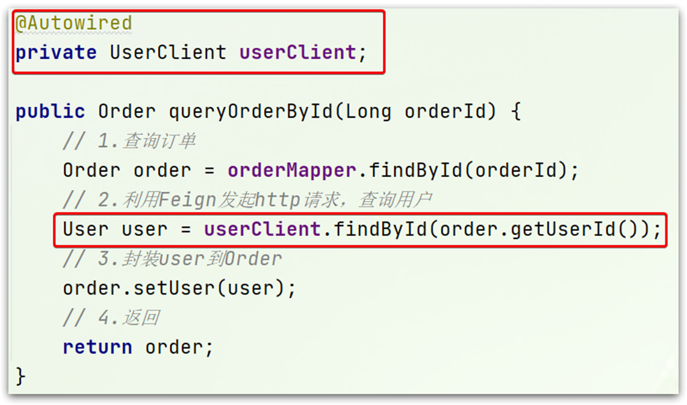


### 5.3 自定义Feign的配置

| 类型                   | 作用             | 说明                                                   |
| ---------------------- | ---------------- | ------------------------------------------------------ |
| **feign.Logger.Level** | 修改日志级别     | 包含四种不同的级别：NONE、BASIC、HEADERS、FULL         |
| feign.codec.Decoder    | 响应结果的解析器 | http远程调用的结果做解析，例如解析json字符串为java对象 |
| feign.codec.Encoder    | 请求参数编码     | 将请求参数编码，便于通过http请求发送                   |
| feign. Contract        | 支持的注解格式   | 默认是SpringMVC的注解                                  |
| feign. Retryer         | 失败重试机制     | 请求失败的重试机制，默认是没有，不过会使用Ribbon的重试 |


#### 配置Feign日志有两种方式：

**方式一**：配置文件方式(添加到客户端OrderServer的yml中)

1. 全局生效

   ```
   feign:
     client:
       config:
         default: # 这里用default就是全局配置，如果是写服务名称，则是针对某个微服务的配置
           loggerLevel: FULL #  日志级别
   ```

2. 局部生效

   ```
   feign:
     client:
       config: 
         userservice: # 这里用default就是全局配置，如果是写服务名称，则是针对某个微服务的配置
           loggerLevel: FULL #  日志级别 
   ```

**方式二**：java代码方式，需要先声明一个Bean

```
package cn.itcast.order.config;

import feign.Logger;
import org.springframework.context.annotation.Bean;

public class DefaultFeignConfiguration {
    @Bean
    public Logger.Level logLevel() {
        return Logger.Level.BASIC;
    }
}
```

> 这个 看包，我没有加入到ioc容器中

- 而后如果是全局配置，则把它放到@EnableFeignClients这个注解中：

  ```
  @EnableFeignClients(defaultConfiguration = FeignClientProperties.class)
  ```

- 如果是局部配置，则把它放到@FeignClient这个注解中：

  ```
  @FeignClient(value = "userservice", configuration = FeignClientConfiguration.class) 
  ```

  > 这俩就是一个加到启动类上的，作为全局配置，一个加到之前5.2编写的**Feign客户端**上的注解

   

> **不开连接池性能会优化很多**


### 5.4 Feign的性能优化

> Feign底层的客户端实现：
>
> •URLConnection：默认实现，不支持连接池
>
> •Apache HttpClient ：支持连接池
>
> •OKHttp：支持连接池
>
> 
>
> 因此优化Feign的性能主要包括：
>
> ①使用连接池代替默认的URLConnection
>
> ②日志级别，最好用basic或none


#### 5.4.1 连接池配置

> 1. 引入依赖
> 2. 配置连接池

1. **引入依赖**

   ```
           <!--httpClient的依赖 -->
           <dependency>
               <groupId>io.github.openfeign</groupId>
               <artifactId>feign-httpclient</artifactId>
           </dependency>
   ```

2. **配置连接池**

   ```
   feign:
     httpclient:
       enabled: true # 开启feign对HttpClient的支持
       max-connections: 200 # 最大的连接数
       max-connections-per-route: 50 # 每个路径的最大连接数
   ```


### 5.6 Feign的最佳实践

> 这个最好看[讲解视频](https://www.bilibili.com/video/BV1LQ4y127n4/?p=33&share_source=copy_web&vd_source=a9e0245042931de24eb0a8f018fa0eae)看看原理
>
> 更推荐抽取，耦合性低

#### 5.6.1 继承

方式一（继承）：给消费者的FeignClient和提供者的controller定义统一的父接口作为标准。

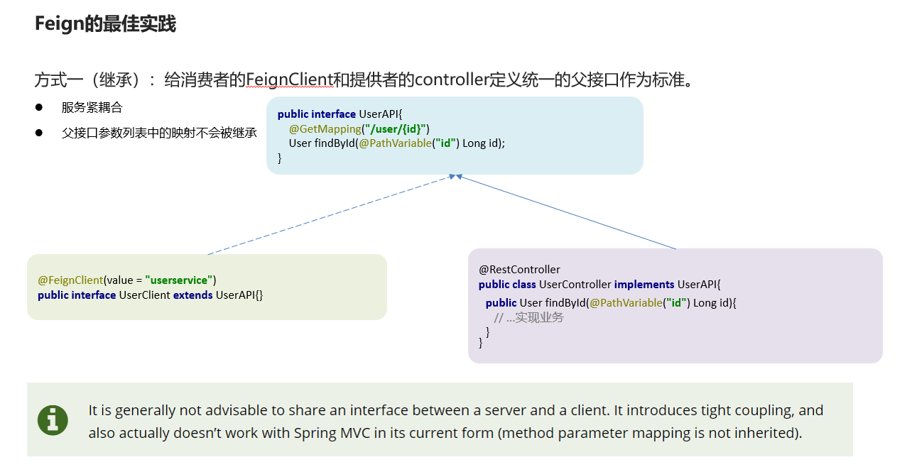


#### 5.6.2 抽取

方式二（抽取）：将FeignClient抽取为独立模块，并且把接口有关的POJO、默认的Feign配置都放到这个模块中，提供给所有消费者使用


> 步骤： 
>
> 1. 首先创建一个module，命名为feign-api，然后引入feign的starter依赖
>
> 2. 将order-service中编写的UserClient、User、DefaultFeignConfiguration都复制到feign-api项目中
>
> 3. 在order-service中引入feign-api的依赖
>
> 4. 修改order-service中的所有与上述三个组件有关的import部分，改成导入feign-api中的包
>
> 5. 添加扫描包
> 6. 重启测试


1. **首先创建一个module，命名为feign-api，然后引入feign的starter依赖**

   ```
       <dependencies>
           <dependency>
               <groupId>org.springframework.cloud</groupId>
               <artifactId>spring-cloud-starter-openfeign</artifactId>
           </dependency>
       </dependencies>
   ```

   > 只需要导入feign即可

2. **将order-service中编写的UserClient、User、DefaultFeignConfiguration都复制到feign-api项目中**

   ```
   ├─feign-api
   │  │  pom.xml
   │  │  
   │  ├─src
   │  │  ├─main
   │  │  │  ├─java
   │  │  │  │  └─com
   │  │  │  │      └─feign
   │  │  │  │          │  
   │  │  │  │          ├─clients
   │  │  │  │          │      UserClient.java
   │  │  │  │          │      
   │  │  │  │          ├─config
   │  │  │  │          │      DefaultFeignConfiguration.java
   │  │  │  │          │      
   │  │  │  │          └─pojo
   │  │  │  │                  User.java
   │  │  │  │                  
   │  │  │  └─resources
   ```

   > 目录树如上，添加的服务端（user）的pojo，和一些feign的配置，以及客户端

3. **在order-service中引入feign-api的依赖**

   ```
           <!-- 引入feign的统一api -->
           <dependency>
               <groupId>com.feign</groupId>
               <artifactId>feign-api</artifactId>
               <version>1.0</version>
           </dependency>
   ```

   > 写的时候会自动提示，这是搁客户端（order）上写的

4. **修改order-service中的所有与上述三个组件有关的import部分，改成导入feign-api中的包**

   > 这个是修改文件的引入

5. **添加扫描包**

   当定义的FeignClient不在SpringBootApplication的扫描包范围时，这些FeignClient无法使用。有两种方式解决：

   方式一：指定FeignClient所在包

   ```
   @EnableFeignClients(basePackages = "包名，写到客户端的包clients")
   @EnableFeignClients("com.feign.clients")
   ```

   方式二：指定FeignClient字节码

   ```
   @EnableFeignClients(clients = {UserClient.class})
   ```

6. **重启测试**


## 6 Gateway服务网关

### 6.1 为什么需要网关

网关的作用：

•对用户请求做身份认证、权限校验

•将用户请求路由到微服务，并实现负载均衡

•对用户请求做限流

### 6.2 搭建网关服务

> 步骤： 
>
> 1. 创建新的module，引入SpringCloudGateway的依赖和nacos的服务发现依赖：
> 2. 编写路由配置及nacos地址
> 3. 规则
> 4. 使用网关


1. **创建新的module，引入SpringCloudGateway的依赖和nacos的服务发现依赖：**

   ```
           <!--网关依赖-->
           <dependency>
               <groupId>org.springframework.cloud</groupId>
               <artifactId>spring-cloud-starter-gateway</artifactId>
           </dependency>
           <!--nacos服务发现依赖-->
           <dependency>
               <groupId>com.alibaba.cloud</groupId>
               <artifactId>spring-cloud-starter-alibaba-nacos-discovery</artifactId>
           </dependency>
   ```

   

2. **编写路由配置及nacos地址**

   ```
   server:
     port: 10010 # 网关端口
   spring:
     application:
       name: gateway # 服务名称
     cloud:
       nacos:
         server-addr: localhost:8848 # nacos地址
       gateway:
         routes: # 网关路由配置
           - id: user-service # 路由id，自定义，只要唯一即可
             # uri: http://127.0.0.1:8081 # 路由的目标地址 http就是固定地址
             uri: lb://userservice # 路由的目标地址 lb就是负载均衡，后面跟服务名称
             predicates: # 路由断言，也就是判断请求是否符合路由规则的条件
               - Path=/user/** # 这个是按照路径匹配，只要以/user/开头就符合要求
           - id: order-service
             uri: lb://orderservice
             predicates:
               - Path=/order/**
   ```


> 这个图的意思就是将用户申请的地址通过网关路由到了服务名
>
> 这里面通过predicates这个规则可以将请求根据规则转到对应的服务也就是1和3

3. **规则**

>  网关搭建步骤：
>
> 1.创建项目，引入nacos服务发现和gateway依赖
>
> 2.配置application.yml，包括服务基本信息、nacos地址、路由
>
> 路由配置包括：
>
> 1.路由id：路由的唯一标示
>
> 2.路由目标（uri）：路由的目标地址，http代表固定地址，lb代表根据服务名负载均衡
>
> 3.路由断言（predicates）：判断路由的规则，
>
> 4.路由过滤器（filters）：对请求或响应做处理

4. **使用网关**

   > 访问本身设置的端口号，进行访问端口即可


### 6.3 路由断言工厂

predicates

| **名称**   | **说明**                       | **示例**                                                     |
| ---------- | ------------------------------ | ------------------------------------------------------------ |
| After      | 是某个时间点后的请求           | -  After=2037-01-20T17:42:47.789-07:00[America/Denver]       |
| Before     | 是某个时间点之前的请求         | -  Before=2031-04-13T15:14:47.433+08:00[Asia/Shanghai]       |
| Between    | 是某两个时间点之前的请求       | -  Between=2037-01-20T17:42:47.789-07:00[America/Denver],  2037-01-21T17:42:47.789-07:00[America/Denver] |
| Cookie     | 请求必须包含某些cookie         | - Cookie=chocolate, ch.p                                     |
| Header     | 请求必须包含某些header         | - Header=X-Request-Id, \d+                                   |
| Host       | 请求必须是访问某个host（域名） | -  Host=**.somehost.org,**.anotherhost.org                   |
| Method     | 请求方式必须是指定方式         | - Method=GET,POST                                            |
| Path       | 请求路径必须符合指定规则       | - Path=/red/{segment},/blue/**                               |
| Query      | 请求参数必须包含指定参数       | - Query=name, Jack或者-  Query=name                          |
| RemoteAddr | 请求者的ip必须是指定范围       | - RemoteAddr=192.168.1.1/24                                  |
| Weight     | 权重处理                       |                                                              |

> 常用的是Path


### 6.4 过滤器工厂GatewayFilterFactory

> 官网地址： [GatewayFilterFactory]([GatewayFilter Factories :: Spring Cloud Gateway](https://docs.spring.io/spring-cloud-gateway/reference/spring-cloud-gateway/gatewayfilter-factories.html))

| **名称**             | **说明**                     |
| -------------------- | ---------------------------- |
| AddRequestHeader     | 给当前请求添加一个请求头     |
| RemoveRequestHeader  | 移除请求中的一个请求头       |
| AddResponseHeader    | 给响应结果中添加一个响应头   |
| RemoveResponseHeader | 从响应结果中移除有一个响应头 |
| RequestRateLimiter   | 限制请求的流量               |
| ...                  |                              |

1. 局部过滤器

   - 添加gateway项目中yml

   ```
   spring:
     application:
       name: gateway # 服务名称
     cloud:
       nacos:
         server-addr: localhost:8848 # nacos地址
       gateway:
         routes: # 网关路由配置
           - id: user-service # 路由id，自定义，只要唯一即可
             # uri: http://127.0.0.1:8081 # 路由的目标地址 http就是固定地址
             uri: lb://userservice # 路由的目标地址 lb就是负载均衡，后面跟服务名称
             predicates: # 路由断言，也就是判断请求是否符合路由规则的条件
               - Path=/user/** # 这个是按照路径匹配，只要以/user/开头就符合要求
             filters:
               - AddRequestHeader=X-Request-red, blue
   ```

   > 这是官网的一个示例，`filters:AddRequestHeader=X-Request-red, blue` 我这里是将userservice中的添加一个请求头

   - 查看结果

   ```
   @GetMapping("/{id}")
   public User queryById(@PathVariable("id") Long id,
                         @RequestHeader(value = "X-Request-red", required = false) String XRequestred) {
       System.out.println("过滤的头X-Request-red：" + XRequestred);
       return userService.queryById(id);
   }
   ```

   > 在userservice中的userController中添加头并输出

2. 全局过滤器

   ```
   spring:
     application:
       name: gateway # 服务名称
     cloud:
       nacos:
         server-addr: localhost:8848 # nacos地址
       gateway:
         routes: # 网关路由配置
           - id: user-service # 路由id，自定义，只要唯一即可
             # uri: http://127.0.0.1:8081 # 路由的目标地址 http就是固定地址
             uri: lb://userservice # 路由的目标地址 lb就是负载均衡，后面跟服务名称
             predicates: # 路由断言，也就是判断请求是否符合路由规则的条件
               - Path=/user/** # 这个是按照路径匹配，只要以/user/开头就符合要求
   #          filters:
   #            - AddRequestHeader=X-Request-red, blue
           - id: order-service
             uri: lb://orderservice
             predicates:
               - Path=/order/**
         default-filters:
           - AddRequestHeader=X-Request-red, blue
   ```

   > 只需要修改gateway中的yml文件这里的即可
   >
   > 添加`      default-filters:AddRequestHeader=X-Request-red, blue`   注意这里是和router一个层级


### 6.5 全局过滤器

> 这可以作为一个验证

- AuthorizeFilter.java

```
@Order(-1)
@Component
public class AuthorizeFilter implements GlobalFilter {
    @Override
    public Mono<Void> filter(ServerWebExchange exchange, GatewayFilterChain chain) {
        // 1. 获取请求参数
        ServerHttpRequest request = exchange.getRequest();
        MultiValueMap<String, String> params = request.getQueryParams();
        // 2. 获取参数中的  authorizeation 参数
        String authorization = params.getFirst("authorization");
        // 3. 判断参数值是否等于admin
        if ("admin".equals(authorization)) {
            // 4. 是，放行
            return chain.filter(exchange);
        }
        // 5. 否，拦截
        // 设置状态码
        exchange.getResponse().setStatusCode(HttpStatus.UNAUTHORIZED);
        // 拦截
        return exchange.getResponse().setComplete();
    }
}
```

> 这里就是简单的认证，但是返回值什么的需要明白，
>
> 1. exchange在这里是上下文的意思
> 2. 在4放行中的时候，他调用的是回调。可以用gpt看看
> 3. 在5的拦截中setComplete()就是结束的意思。
> 4. 上面有个注解`@Order`是指定过滤器的顺序的。值越小，优先级越高，这里也可以通过实现order接口进行设置，但是都一样。

- 测试

> 访问`http://localhost:10010/user/1?authorization=admin`地址，这个是网关的端口，这里需要主义的是这里就判断了请求参数。
>
> 我们如果想进行token验证的话，`request.getHeaders().get("authorization");`这个即可，其他步骤都差不多。


### 6.6 过滤器执行顺序

1. 每一个过滤器都必须指定一个int类型的order值，**order** **值越小，优先级越高，执行顺序越靠前。**
2. GlobalFilter通过实现Ordered接口，或者添加@Order注解来指定order值，由我们自己指定
3. 路由过滤器和defaultFilter的order由Spring指定，默认是按照声明顺序从1递增。
4. 当过滤器的order值一样时，会按照 defaultFilter > 路由过滤器 > GlobalFilter的顺序执行


### 6.7 跨域问题

跨域：域名不一致就是跨域，主要包括：

- 域名不同： www.taobao.com 和 www.taobao.org 和 www.jd.com 和 miaosha.jd.com
- 域名相同，端口不同：localhost:8080和localhost8081

跨域问题：浏览器禁止请求的发起者与服务端发生跨域ajax请求，请求被浏览器拦截的问题

解决方案：CORS


添加配置即可

````
spring:
  cloud:
    gateway:      #
      globalcors: # 全局的跨域处理
        add-to-simple-url-handler-mapping: true # 解决options请求被拦截问题
        corsConfigurations:
          '[/**]':
            allowedOrigins: # 允许哪些网站的跨域请求
              - "http://localhost:8090"
              - "http://www.leyou.com"
            allowedMethods: # 允许的跨域ajax的请求方式
              - "GET"
              - "POST"
              - "DELETE"
              - "PUT"
              - "OPTIONS"
            allowedHeaders: "*" # 允许在请求中携带的头信息
            allowCredentials: true # 是否允许携带cookie
            maxAge: 360000 # 这次跨域检测的有效期
````

> 这个是gateway下面的一层，跟router同层


```
<!DOCTYPE html>
<html lang="en">
<head>
    <meta charset="UTF-8">
    <meta http-equiv="X-UA-Compatible" content="IE=edge">
    <meta name="viewport" content="width=device-width, initial-scale=1.0">
    <title>Axios CORS Test</title>
    <!-- 引入 Axios 库 -->
    <script src="https://cdn.jsdelivr.net/npm/axios/dist/axios.min.js"></script>
</head>
<body>

<script>
    // 发送 GET 请求
    axios.get('http://localhost:10010/user/1?authorization=admin')
        .then(response => {
            // 请求成功处理
            console.log('Response:', response.data);
        })
        .catch(error => {
            // 请求失败处理
            console.error('Error:', error);
        });
</script>

</body>
</html>
```

> 测试代码如上


# SpringCloud高级

首先是**业务健壮性**问题：

例如在之前的查询购物车列表业务中，购物车服务需要查询最新的商品信息，与购物车数据做对比，提醒用户。大家设想一下，如果商品服务查询时发生故障，查询购物车列表在调用商品服务时，是不是也会异常？从而导致购物车查询失败。但从业务角度来说，为了提升用户体验，即便是商品查询失败，购物车列表也应该正确展示出来，哪怕是不包含最新的商品信息。

还有**级联失败**问题：

还是查询购物车的业务，假如商品服务业务并发较高，占用过多Tomcat连接。可能会导致商品服务的所有接口响应时间增加，延迟变高，甚至是长时间阻塞直至查询失败。

此时查询购物车业务需要查询并等待商品查询结果，从而导致查询购物车列表业务的响应时间也变长，甚至也阻塞直至无法访问。而此时如果查询购物车的请求较多，可能导致购物车服务的Tomcat连接占用较多，所有接口的响应时间都会增加，整个服务性能很差， 甚至不可用。

这就是**级联失败**问题，或者叫**雪崩**问题。

## 1 微服务保护

> 雪崩问题：微服务调用链路中的某个服务故障，引起整个链路中的所有微服务都不可用，这就是雪崩。

### 1.1 请求限流

请求限流往往会有一个限流器，数量高低起伏的并发请求曲线，经过限流器就变的非常平稳。这就像是水电站的大坝，起到蓄水的作用，可以通过开关控制水流出的大小，让下游水流始终维持在一个平稳的量。


### 1.2 线程隔离

当一个业务接口响应时间长，而且并发高时，就可能耗尽服务器的线程资源，导致服务内的其它接口受到影响。所以我们必须把这种影响降低，或者缩减影响的范围。线程隔离正是解决这个问题的好办法。

线程隔离的思想来自轮船的舱壁模式：


轮船的船舱会被隔板分割为N个相互隔离的密闭舱，假如轮船触礁进水，只有损坏的部分密闭舱会进水，而其他舱由于相互隔离，并不会进水。这样就把进水控制在部分船体，避免了整个船舱进水而沉没。

为了避免某个接口故障或压力过大导致整个服务不可用，我们可以限定每个接口可以使用的资源范围，也就是将其“隔离”起来。


如图所示，**我们给查询购物车业务限定可用线程数量上限为20**，这样即便查询购物车的请求因为查询商品服务而出现故障，也不会导致服务器的线程资源被耗尽，不会影响到其它接口。

### 1.3 服务熔断

线程隔离虽然避免了雪崩问题，但故障服务（商品服务）依然会拖慢购物车服务（服务调用方）的接口响应速度。而且商品查询的故障依然会导致查询购物车功能出现故障，购物车业务也变的不可用了。

所以，我们要做两件事情：

- **编写服务降级逻辑**：就是服务调用失败后的处理逻辑，根据业务场景，可以抛出异常，也可以返回友好提示或默认数据。
- **异常统计和熔断**：统计服务提供方的异常比例，当比例过高表明该接口会影响到其它服务，应该拒绝调用该接口，而是直接走降级逻辑。

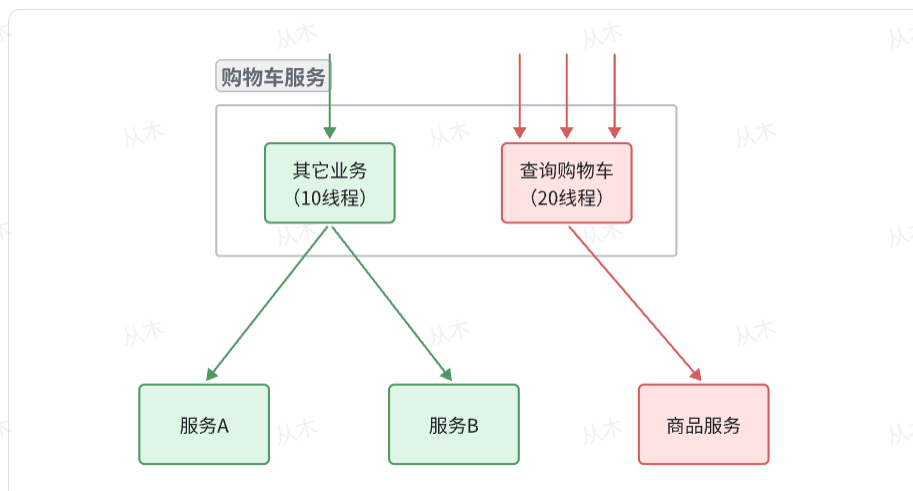

服务保护技术:

|          | **Sentinel**                                   | **Hystrix**                  |
| -------- | ---------------------------------------------- | ---------------------------- |
| 线程隔离 | 信号量隔离                                     | 线程池隔离/信号量隔离        |
| 熔断策略 | 基于慢调用比例或异常比例                       | 基于异常比率                 |
| 限流     | 基于 QPS，支持流量整形                         | 有限的支持                   |
| Fallback | 支持                                           | 支持                         |
| 控制台   | 开箱即用，可配置规则、查看秒级监控、机器发现等 | 不完善                       |
| 配置方式 | 基于控制台，重启后失效                         | 基于注解或配置文件，永久生效 |

## 1.2.Sentinel

微服务保护的技术有很多，但在目前国内使用较多的还是Sentinel，所以接下来我们学习Sentinel的使用。

### 1.2.1.介绍和安装

Sentinel是阿里巴巴开源的一款服务保护框架，目前已经加入SpringCloudAlibaba中。官方网站：

https://sentinelguard.io/zh-cn/

Sentinel 的使用可以分为两个部分:

- **核心库**（Jar包）：不依赖任何框架/库，能够运行于 Java 8 及以上的版本的运行时环境，同时对 Dubbo / Spring Cloud 等框架也有较好的支持。在项目中引入依赖即可实现服务限流、隔离、熔断等功能。
- **控制台**（Dashboard）：Dashboard 主要负责管理推送规则、监控、管理机器信息等。

为了方便监控微服务，我们先把Sentinel的控制台搭建出来。

1）下载jar包

下载地址：

https://github.com/alibaba/Sentinel/releases

2）运行

将jar包放在任意非中文、不包含特殊字符的目录下，重命名为`sentinel-dashboard.jar`：

然后运行如下命令启动控制台：

```Shell
java -Dserver.port=8090 -Dcsp.sentinel.dashboard.server=localhost:8090 -Dproject.name=sentinel-dashboard -jar sentinel-dashboard.jar
```

其它启动时可配置参数可参考官方文档：

https://github.com/alibaba/Sentinel/wiki/%E5%90%AF%E5%8A%A8%E9%85%8D%E7%BD%AE%E9%A1%B9

3）访问

访问[http://localhost:8090](http://localhost:8090)页面，就可以看到sentinel的控制台了：

需要输入账号和密码，默认都是：sentinel

### 1.2.2.微服务整合

我们在`cart-service`模块中整合sentinel，连接`sentinel-dashboard`控制台，步骤如下： 1）引入sentinel依赖

```XML
<!--sentinel-->
<dependency>
    <groupId>com.alibaba.cloud</groupId> 
    <artifactId>spring-cloud-starter-alibaba-sentinel</artifactId>
</dependency>
```

2）配置控制台

修改application.yaml文件，添加下面内容：

```YAML
spring:
  cloud: 
    sentinel:
      transport:
        dashboard: localhost:8090
```

3）访问`cart-service`的任意端点

重启`cart-service`，然后访问查询购物车接口，sentinel的客户端就会将服务访问的信息提交到`sentinel-dashboard`控制台。并展示出统计信息

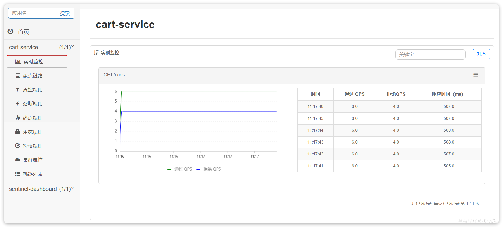

可以看出`GET:/carts`这个接口的通过QPS稳定在6附近，而拒绝的QPS在4附近，符合我们的预期。

## 1.4.线程隔离

限流可以降低服务器压力，尽量减少因并发流量引起的服务故障的概率，但并不能完全避免服务故障。一旦某个服务出现故障，我们必须隔离对这个服务的调用，避免发生雪崩。

比如，查询购物车的时候需要查询商品，为了避免因商品服务出现故障导致购物车服务级联失败，我们可以把购物车业务中查询商品的部分隔离起来，限制可用的线程资源：


这样，即便商品服务出现故障，最多导致查询购物车业务故障，并且可用的线程资源也被限定在一定范围，不会导致整个购物车服务崩溃。

所以，我们要对查询商品的FeignClient接口做线程隔离。


导致最终的平局响应时间较长。

### 1.4.1.OpenFeign整合Sentinel

修改cart-service模块的application.yml文件，开启Feign的sentinel功能：

```YAML
feign:
  sentinel:
    enabled: true # 开启feign对sentinel的支持
```

然后重启cart-service服务，可以看到查询商品的FeignClient自动变成了一个簇点资源：


### 1.4.2.配置线程隔离

接下来，点击查询商品的FeignClient对应的簇点资源后面的流控按钮：


在弹出的表单中填写下面内容：


注意，这里勾选的是并发线程数限制，也就是说这个查询功能最多使用5个线程，而不是5QPS。如果查询商品的接口每秒处理2个请求，则5个线程的实际QPS在10左右，而超出的请求自然会被拒绝。


我们利用Jemeter测试，每秒发送100个请求：


最终测试结果如下：


进入查询购物车的请求每秒大概在100，而在查询商品时却只剩下每秒10左右，符合我们的预期。

此时如果我们通过页面访问购物车的其它接口，例如添加购物车、修改购物车商品数量，发现不受影响：


响应时间非常短，这就证明线程隔离起到了作用，尽管查询购物车这个接口并发很高，但是它能使用的线程资源被限制了，因此不会影响到其它接口。

## 1.5.服务熔断

在上节课，我们利用线程隔离对查询购物车业务进行隔离，保护了购物车服务的其它接口。由于查询商品的功能耗时较高（我们模拟了500毫秒延时），再加上线程隔离限定了线程数为5，导致接口吞吐能力有限，最终QPS只有10左右。这就导致了几个问题：

第一，超出的QPS上限的请求就只能抛出异常，从而导致购物车的查询失败。但从业务角度来说，即便没有查询到最新的商品信息，购物车也应该展示给用户，用户体验更好。也就是给查询失败设置一个**降级处理**逻辑。

第二，由于查询商品的延迟较高（模拟的500ms），从而导致查询购物车的响应时间也变的很长。这样不仅拖慢了购物车服务，消耗了购物车服务的更多资源，而且用户体验也很差。对于商品服务这种不太健康的接口，我们应该直接停止调用，直接走降级逻辑，避免影响到当前服务。也就是将商品查询接口**熔断**。


### 1.5.1.编写降级逻辑Fallback

触发限流或熔断后的请求不一定要直接报错，也可以返回一些默认数据或者友好提示，用户体验会更好。

给FeignClient编写失败后的降级逻辑有两种方式：

- 方式一：FallbackClass，无法对远程调用的异常做处理
- 方式二：FallbackFactory，可以对远程调用的异常做处理，我们一般选择这种方式。

这里我们演示方式二的失败降级处理。

**步骤一**：在hm-api模块中给`ItemClient`定义降级处理类，实现`FallbackFactory`：


代码如下：

```Java
package com.hmall.api.client.fallback;

import com.hmall.api.client.ItemClient;
import com.hmall.api.dto.ItemDTO;
import com.hmall.api.dto.OrderDetailDTO;
import com.hmall.common.exception.BizIllegalException;
import com.hmall.common.utils.CollUtils;
import lombok.extern.slf4j.Slf4j;
import org.springframework.cloud.openfeign.FallbackFactory;

import java.util.Collection;
import java.util.List;

@Slf4j
public class ItemClientFallback implements FallbackFactory<ItemClient> {
    @Override
    public ItemClient create(Throwable cause) {
        return new ItemClient() {
            @Override
            public List<ItemDTO> queryItemByIds(Collection<Long> ids) {
                log.error("远程调用ItemClient#queryItemByIds方法出现异常，参数：{}", ids, cause);
                // 查询购物车允许失败，查询失败，返回空集合
                return CollUtils.emptyList();
            }

            @Override
            public void deductStock(List<OrderDetailDTO> items) {
                // 库存扣减业务需要触发事务回滚，查询失败，抛出异常
                throw new BizIllegalException(cause);
            }
        };
    }
}
```

**步骤二**：在`hm-api`模块中的`com.hmall.api.config.DefaultFeignConfig`类中将`ItemClientFallback`注册为一个`Bean`：


**步骤三**：在`hm-api`模块中的`ItemClient`接口中使用`ItemClientFallbackFactory`：

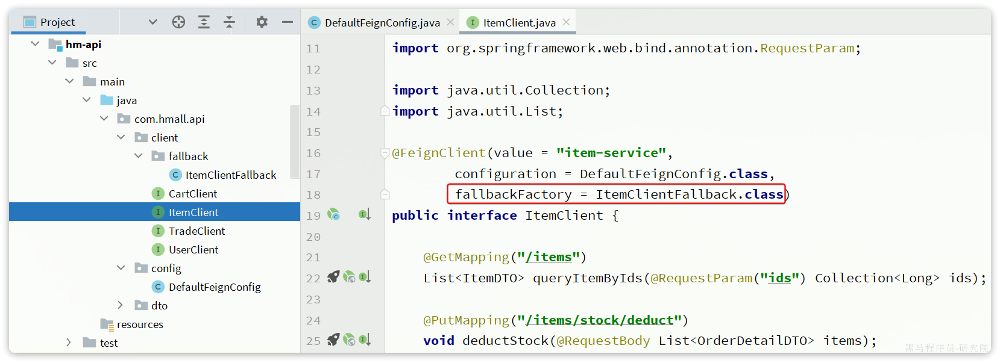

重启后，再次测试，发现被限流的请求不再报错，走了降级逻辑：


但是未被限流的请求延时依然很高：


导致最终的平局响应时间较长。

### 1.5.2.服务熔断

查询商品的RT较高（模拟的500ms），从而导致查询购物车的RT也变的很长。这样不仅拖慢了购物车服务，消耗了购物车服务的更多资源，而且用户体验也很差。

对于商品服务这种不太健康的接口，我们应该停止调用，直接走降级逻辑，避免影响到当前服务。也就是将商品查询接口**熔断**。当商品服务接口恢复正常后，再允许调用。这其实就是**断路器**的工作模式了。

Sentinel中的断路器不仅可以统计某个接口的**慢请求比例**，还可以统计**异常请求比例**。当这些比例超出阈值时，就会**熔断**该接口，即拦截访问该接口的一切请求，降级处理；当该接口恢复正常时，再放行对于该接口的请求。

断路器的工作状态切换有一个状态机来控制：

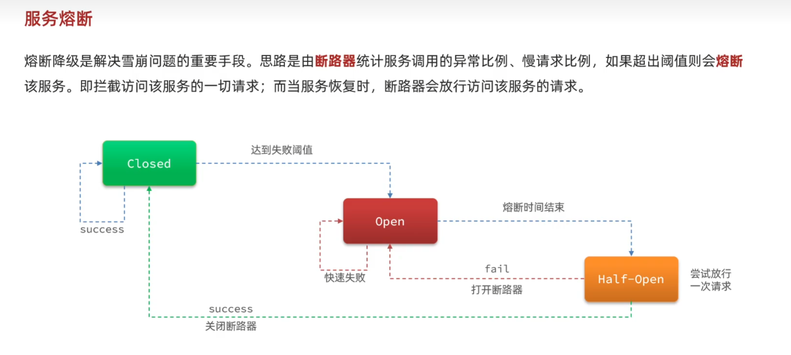

状态机包括三个状态：

- **closed**：关闭状态，断路器放行所有请求，并开始统计异常比例、慢请求比例。超过阈值则切换到open状态
- **open**：打开状态，服务调用被**熔断**，访问被熔断服务的请求会被拒绝，快速失败，直接走降级逻辑。Open状态持续一段时间后会进入half-open状态
- **half-open**：半开状态，放行一次请求，根据执行结果来判断接下来的操作。 
  - 请求成功：则切换到closed状态
  - 请求失败：则切换到open状态

我们可以在控制台通过点击簇点后的**`熔断`**按钮来配置熔断策略：

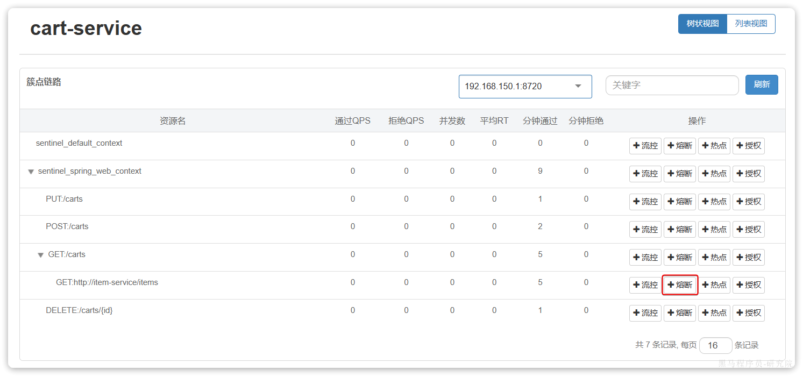

在弹出的表格中这样填写：


这种是按照慢调用比例来做熔断，上述配置的含义是：

- RT超过200毫秒的请求调用就是慢调用
- 统计最近1000ms内的最少5次请求，如果慢调用比例不低于0.5，则触发熔断
- 熔断持续时长20s

配置完成后，再次利用Jemeter测试，可以发现：


在一开始一段时间是允许访问的，后来触发熔断后，查询商品服务的接口通过QPS直接为0，所有请求都被熔断了。而查询购物车的本身并没有受到影响。

此时整个购物车查询服务的平均RT影响不大：


## 1.6持久化

这里直接看视频即可

# 2.分布式事务

首先我们看看项目中的下单业务整体流程：


由于订单、购物车、商品分别在三个不同的微服务，而每个微服务都有自己独立的数据库，因此下单过程中就会跨多个数据库完成业务。而每个微服务都会执行自己的本地事务：

- 交易服务：下单事务
- 购物车服务：清理购物车事务
- 库存服务：扣减库存事务

整个业务中，各个本地事务是有关联的。因此每个微服务的本地事务，也可以称为**分支事务**。多个有关联的分支事务一起就组成了**全局事务**。我们必须保证整个全局事务同时成功或失败。

我们知道每一个分支事务就是传统的**单体事务**，都可以满足ACID特性，但全局事务跨越多个服务、多个数据库，是否还能满足呢？

我们来做一个测试，先进入购物车页面：


目前有4个购物车，然结算下单，进入订单结算页面：


然后将购物车中某个商品的库存修改为`0`：


然后，提交订单，最终因库存不足导致下单失败：


然后我们去查看购物车列表，发现购物车数据依然被清空了，并未回滚：


事务并未遵循ACID的原则，归其原因就是参与事务的多个子业务在不同的微服务，跨越了不同的数据库。虽然每个单独的业务都能在本地遵循ACID，但是它们互相之间没有感知，不知道有人失败了，无法保证最终结果的统一，也就无法遵循ACID的事务特性了。

这就是分布式事务问题，出现以下情况之一就可能产生分布式事务问题：

- 业务跨多个服务实现
- 业务跨多个数据源实现

接下来这一章我们就一起来研究下如何解决分布式事务问题。

## 2.1.认识Seata

解决分布式事务的方案有很多，但实现起来都比较复杂，因此我们一般会使用开源的框架来解决分布式事务问题。在众多的开源分布式事务框架中，功能最完善、使用最多的就是阿里巴巴在2019年开源的Seata了。

https://seata.io/zh-cn/docs/overview/what-is-seata.html

其实分布式事务产生的一个重要原因，就是参与事务的多个分支事务互相无感知，不知道彼此的执行状态。因此解决分布式事务的思想非常简单：

就是找一个统一的**事务协调者**，与多个分支事务通信，检测每个分支事务的执行状态，保证全局事务下的每一个分支事务同时成功或失败即可。大多数的分布式事务框架都是基于这个理论来实现的。

Seata也不例外，在Seata的事务管理中有三个重要的角色：

-  **TC** **(****Transaction Coordinator****) -** **事务协调者：**维护全局和分支事务的状态，协调全局事务提交或回滚。 
-  **TM (Transaction Manager) -** **事务管理器：**定义全局事务的范围、开始全局事务、提交或回滚全局事务。 
-  **RM (Resource Manager) -** **资源管理器：**管理分支事务，与TC交谈以注册分支事务和报告分支事务的状态，并驱动分支事务提交或回滚。 

Seata的工作架构如图所示：


其中，**TM**和**RM**可以理解为Seata的客户端部分，引入到参与事务的微服务依赖中即可。将来**TM**和**RM**就会协助微服务，实现本地分支事务与**TC**之间交互，实现事务的提交或回滚。

而**TC**服务则是事务协调中心，是一个独立的微服务，需要单独部署。

## 2.2.部署TC服务

### 2.2.1.准备数据库表

Seata支持多种存储模式，但考虑到持久化的需要，我们一般选择基于数据库存储。执行课前资料提供的`《seata-tc.sql》`，导入数据库表：

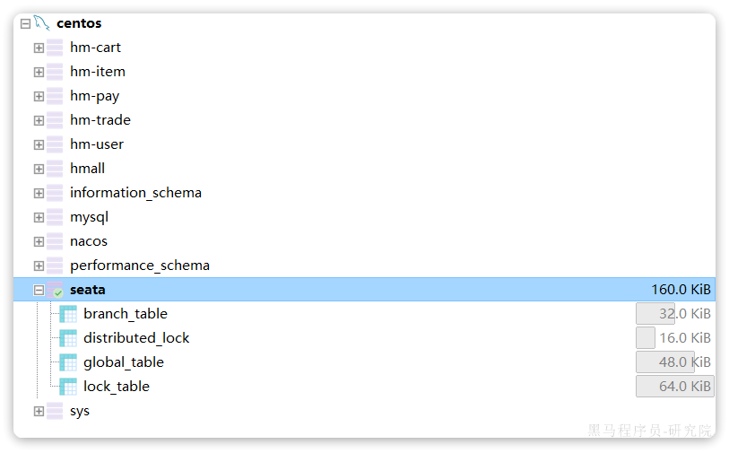

### 2.2.2.准备配置文件

课前资料准备了一个seata目录，其中包含了seata运行时所需要的配置文件：


其中包含中文注释，大家可以自行阅读。

我们将整个seata文件夹拷贝到虚拟机的`/root`目录：

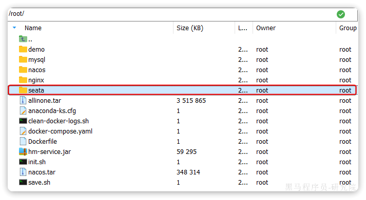

### 2.2.3.Docker部署

在虚拟机的`/root`目录执行下面的命令：

```Shell
docker run --name seata \
-p 8099:8099 \
-p 7099:7099 \
-e SEATA_IP=192.168.47.128 \
-v ./seata:/seata-server/resources \
--privileged=true \
--restart=always \
-d \
seataio/seata-server:1.3.0
```

如果镜像下载困难，也可以把课前资料提供的镜像上传到虚拟机并加载：

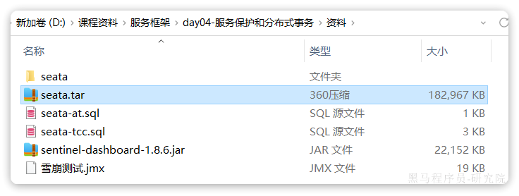

## 2.3.微服务集成Seata

参与分布式事务的每一个微服务都需要集成Seata，我们以`trade-service`为例。

### 2.3.1.引入依赖

为了方便各个微服务集成seata，我们需要把seata配置共享到nacos，因此`trade-service`模块不仅仅要引入seata依赖，还要引入nacos依赖:

```XML
<!--统一配置管理-->
  <dependency>
      <groupId>com.alibaba.cloud</groupId>
      <artifactId>spring-cloud-starter-alibaba-nacos-config</artifactId>
  </dependency>
  <!--读取bootstrap文件-->
  <dependency>
      <groupId>org.springframework.cloud</groupId>
      <artifactId>spring-cloud-starter-bootstrap</artifactId>
  </dependency>
  <!--seata-->
  <dependency>
      <groupId>com.alibaba.cloud</groupId>
      <artifactId>spring-cloud-starter-alibaba-seata</artifactId>
  </dependency>
  <!--sentinel-->
  <dependency>
      <groupId>com.alibaba.cloud</groupId>
      <artifactId>spring-cloud-starter-alibaba-sentinel</artifactId>
  </dependency>
```

### 2.3.2.改造配置

首先在nacos上添加一个共享的seata配置，命名为`shared-seata.yaml`：


内容如下：

```YAML
seata:
  registry: # TC服务注册中心的配置，微服务根据这些信息去注册中心获取tc服务地址
    type: nacos # 注册中心类型 nacos
    nacos:
      server-addr: 192.168.150.101:8848 # nacos地址
      namespace: "" # namespace，默认为空
      group: DEFAULT_GROUP # 分组，默认是DEFAULT_GROUP
      application: seata-server # seata服务名称
      username: nacos
      password: nacos
  tx-service-group: hmall # 事务组名称
  service:
    vgroup-mapping: # 事务组与tc集群的映射关系
      hmall: "default"
```

然后，改造`trade-service`模块，添加`bootstrap.yaml`：


内容如下:

```YAML
spring:
  application:
    name: trade-service # 服务名称
  profiles:
    active: dev
  cloud:
    nacos:
      server-addr: 192.168.150.101 # nacos地址
      config:
        file-extension: yaml # 文件后缀名
        shared-configs: # 共享配置
          - dataId: shared-jdbc.yaml # 共享mybatis配置
          - dataId: shared-log.yaml # 共享日志配置
          - dataId: shared-swagger.yaml # 共享日志配置
          - dataId: shared-seata.yaml # 共享seata配置
```

可以看到这里加载了共享的seata配置。

然后改造application.yaml文件，内容如下：

```YAML
server:
  port: 8085
feign:
  okhttp:
    enabled: true # 开启OKHttp连接池支持
  sentinel:
    enabled: true # 开启Feign对Sentinel的整合
hm:
  swagger:
    title: 交易服务接口文档
    package: com.hmall.trade.controller
  db:
    database: hm-trade
```

参考上述办法分别改造`hm-cart`和`hm-item`两个微服务模块。

### 2.3.3.添加数据库表

seata的客户端在解决分布式事务的时候需要记录一些中间数据，保存在数据库中。因此我们要先准备一个这样的表。

将课前资料的seata-at.sql分别文件导入hm-trade、hm-cart、hm-item三个数据库中：


结果：


OK，至此为止，微服务整合的工作就完成了。可以参考上述方式对`hm-item`和`hm-cart`模块完成整合改造。

### 2.3.4.测试

接下来就是测试的分布式事务的时候了。

我们找到`trade-service`模块下的`com.hmall.trade.service.impl.OrderServiceImpl`类中的`createOrder`方法，也就是下单业务方法。

将其上的`@Transactional`注解改为Seata提供的`@GlobalTransactional`：


`@GlobalTransactional`注解就是在标记事务的起点，将来TM就会基于这个方法判断全局事务范围，初始化全局事务。

我们重启`trade-service`、`item-service`、`cart-service`三个服务。再次测试，发现分布式事务的问题解决了！

那么，Seata是如何解决分布式事务的呢？

## 2.4.XA模式

Seata支持四种不同的分布式事务解决方案：

- **XA**
- **TCC**
- **AT**
- **SAGA**

这里我们以`XA`模式和`AT`模式来给大家讲解其实现原理。

`XA` 规范 是` X/Open` 组织定义的分布式事务处理（DTP，Distributed Transaction Processing）标准，XA 规范 描述了全局的`TM`与局部的`RM`之间的接口，几乎所有主流的数据库都对 XA 规范 提供了支持。

### 2.4.1.两阶段提交

A是规范，目前主流数据库都实现了这种规范，实现的原理都是基于两阶段提交。

正常情况：


异常情况：


一阶段：

- 事务协调者通知每个事务参与者执行本地事务
- 本地事务执行完成后报告事务执行状态给事务协调者，此时事务不提交，继续持有数据库锁

二阶段：

- 事务协调者基于一阶段的报告来判断下一步操作
- 如果一阶段都成功，则通知所有事务参与者，提交事务
- 如果一阶段任意一个参与者失败，则通知所有事务参与者回滚事务

### 2.4.2.Seata的XA模型

Seata对原始的XA模式做了简单的封装和改造，以适应自己的事务模型，基本架构如图：

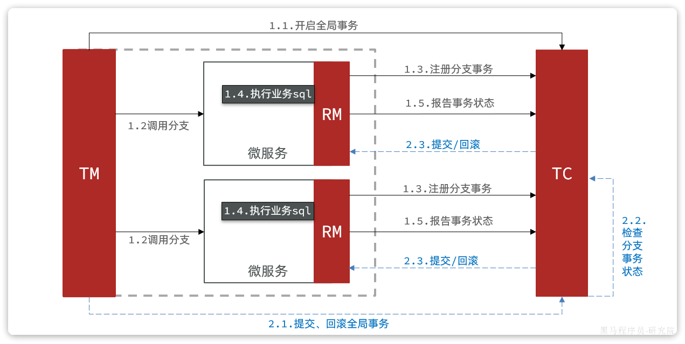

`RM`一阶段的工作：

1. 注册分支事务到`TC`
2. 执行分支业务sql但不提交
3. 报告执行状态到`TC`

`TC`二阶段的工作：

1.  `TC`检测各分支事务执行状态
   1. 如果都成功，通知所有RM提交事务
   2. 如果有失败，通知所有RM回滚事务 

`RM`二阶段的工作：

- 接收`TC`指令，提交或回滚事务

### 2.4.3.优缺点

`XA`模式的优点是什么？

- 事务的强一致性，满足ACID原则
- 常用数据库都支持，实现简单，并且没有代码侵入

`XA`模式的缺点是什么？

- 因为一阶段需要锁定数据库资源，等待二阶段结束才释放，性能较差
- 依赖关系型数据库实现事务

## 2.5.AT模式

`AT`模式同样是分阶段提交的事务模型，不过缺弥补了`XA`模型中资源锁定周期过长的缺陷。

### 2.5.1.Seata的AT模型

基本流程图：


阶段一`RM`的工作：

- 注册分支事务
- 记录undo-log（数据快照）
- 执行业务sql并提交
- 报告事务状态

阶段二提交时`RM`的工作：

- 删除undo-log即可

阶段二回滚时`RM`的工作：

- 根据undo-log恢复数据到更新前

### 2.5.2.流程梳理

我们用一个真实的业务来梳理下AT模式的原理。

比如，现在有一个数据库表，记录用户余额：

| **id** | **money** |
| :----- | :-------- |
| 1      | 100       |

其中一个分支业务要执行的SQL为：

```SQL
 update tb_account set money = money - 10 where id = 1
```

AT模式下，当前分支事务执行流程如下：

**一阶段**：

1. `TM`发起并注册全局事务到`TC`
2. `TM`调用分支事务
3. 分支事务准备执行业务SQL
4. `RM`拦截业务SQL，根据where条件查询原始数据，形成快照。

```JSON
{
  "id": 1, "money": 100
}
```

1. `RM`执行业务SQL，提交本地事务，释放数据库锁。此时 money = 90
2. `RM`报告本地事务状态给`TC`

**二阶段**：

1. `TM`通知`TC`事务结束
2. `TC`检查分支事务状态
   1. 如果都成功，则立即删除快照
   2. 如果有分支事务失败，需要回滚。读取快照数据（{"id": 1, "money": 100}），将快照恢复到数据库。此时数据库再次恢复为100

流程图：


### 2.5.3.AT与XA的区别

简述`AT`模式与`XA`模式最大的区别是什么？

- `XA`模式一阶段不提交事务，锁定资源；`AT`模式一阶段直接提交，不锁定资源。
- `XA`模式依赖数据库机制实现回滚；`AT`模式利用数据快照实现数据回滚。
- `XA`模式强一致；`AT`模式最终一致

可见，AT模式使用起来更加简单，无业务侵入，性能更好。因此企业90%的分布式事务都可以用AT模式来解决。

# 3.练习

## 3.1.编写降级逻辑

给黑马商城中现有的FeignClient都编写对应的降级逻辑，并且改造项目中每一个微服务，将OpenFeign与Sentinel整合。

## 3.2.解决分布式事务

除了下单业务以外，用户如果选择余额支付，前端会将请求发送到pay-service模块。而这个模块要做三件事情：

- 直接从user-service模块调用接口，扣除余额付款
- 更新本地（pay-service）交易流水表状态
- 通知交易服务（trade-service）更新其中的业务订单状态

流程如图：

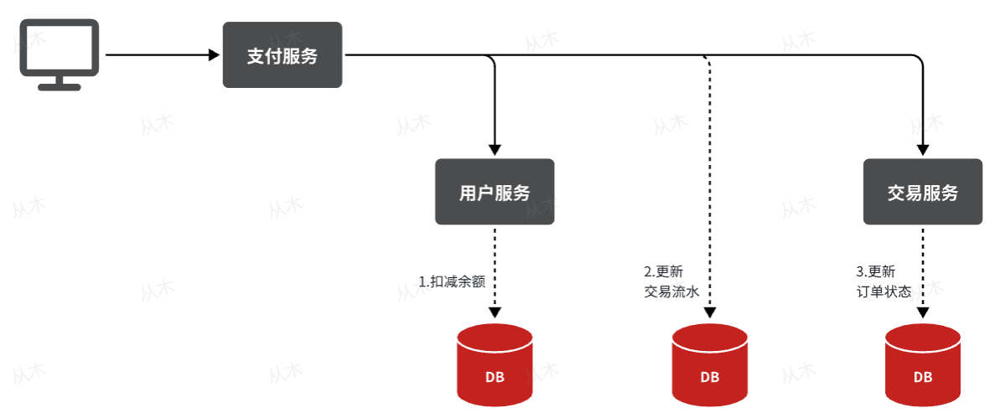

显然，这里也存在分布式事务问题。

对应的页面如下：


当我们提交订单成功后，进入支付页面，选择余额支付，输入密码后点击确认支付即可。

前端会提交支付请求，业务接口的入口在`com.hmall.pay.controller.PayController`类的`tryPayOrderByBalance`方法：

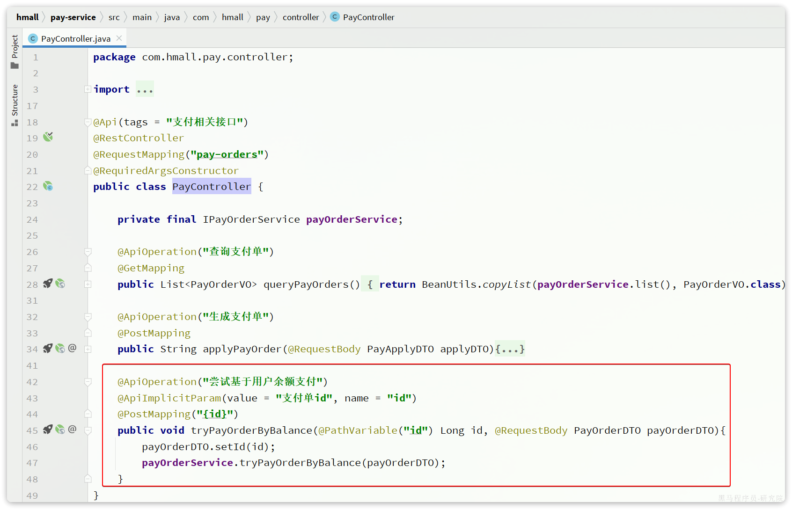

对应的service方法如下：

```Java
@Override
@Transactional
public void tryPayOrderByBalance(PayOrderDTO payOrderDTO) {
    // 1.查询支付单
    PayOrder po = getById(payOrderDTO.getId());
    // 2.判断状态
    if(!PayStatus.WAIT_BUYER_PAY.equalsValue(po.getStatus())){
        // 订单不是未支付，状态异常
        throw new BizIllegalException("交易已支付或关闭！");
    }
    // 3.尝试扣减余额
    userClient.deductMoney(payOrderDTO.getPw(), po.getAmount());
    // 4.修改支付单状态
    boolean success = markPayOrderSuccess(payOrderDTO.getId(), LocalDateTime.now());
    if (!success) {
        throw new BizIllegalException("交易已支付或关闭！");
    }
    // 5.修改订单状态
    tradeClient.markOrderPaySuccess(po.getBizOrderNo());
}
```

利用seata解决这里的分布式事务问题，并思考这个业务实现有没有什么值得改进的地方
