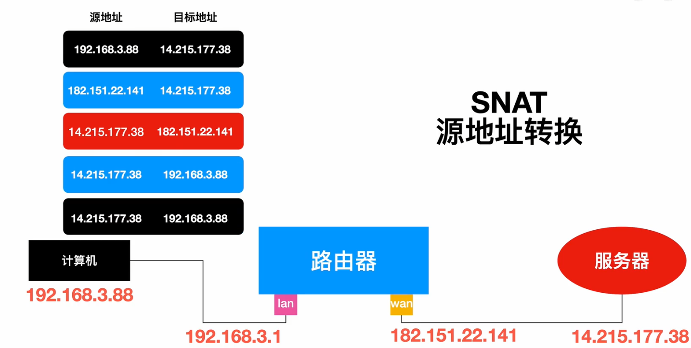
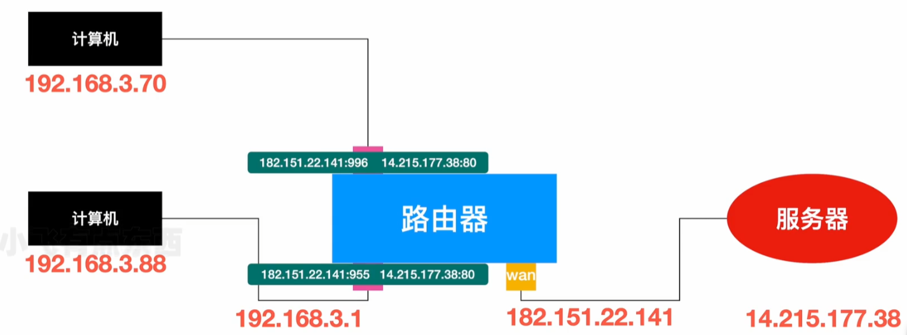
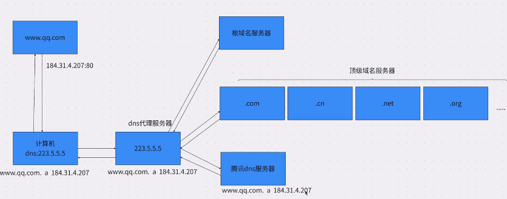

>视频地址：[CS架构与BS架构 - 《Python零基础到全栈系列](https://www.bilibili.com/video/BV1Cd4y1b7kz/?share_source=copy_web&vd_source=a9e0245042931de24eb0a8f018fa0eae)

## 01-CS架构 BS架构-p001
- CS架构
  >    客户端（Client）与服务端（Server）交互
  >    Client            <======>        Server
  >    虽然如此，但是他们本质上是硬件的交互
  >    抖音app                                    抖音音服务器
  >    操作系统                                   操作系统
  >    计算机硬件   <======>        计算机硬件
  >    例如： A想要B电脑的电影资源，没有网络的情况下u盘拷贝
  >    有网络的情况下是进行CS交互

- BS架构（本质上也是CS架构）
  >    浏览器（Browser）和服务端（Server）交互
  >    Browser         <======>        Server

## 02-物理介质连接-p002
>讲述了光猫、交换机、路由器等物理介质的运行方式


> 这里需要讲解一下：
> 	属性：
>
> 		1. 手机、电脑：含有网卡（分无线网卡和有限网卡）连接网线
>		2. 路由器：有三个内网插口（lan口），一个外网插口（wan口）
> 		3. 交换机：用于局域网连接，路由器内网口比较少，通过交换机进行添加网口，主力交换机是质量好的防止坏。
> 			4. 光猫：把电信号和光信号进行转换
> 		5. 电信设备箱：分御三家，通过光纤连接光猫
> 			6. 三家的机房
> 
> 	
> 
> 		整体步骤：
> 		手机、电脑含有网卡，通过网线连接路由器，如果设备较多（例如公司），可以通过交换机进行扩充插口。
> 			电信机房通过光缆连接电信设备箱，电信设备箱再通过光纤来连接路由器。


## 03-OSI七层网络模型-p003
- 物理层：信号转换的问题 0101-电信号（光信号）

- 数据链路层：mac地址    全世界唯一    身份证号

- 网络层：ip地址
			公网ip        全世界唯一       快递地址
		内网ip        局域网唯一       房间号
	
- 传输层：   
			tcp协议可靠，速度慢长距离
		传输100M->小包（1500Byte) 00001 00002 00002
		udp协议不可靠，速度快   短距离传输（局域网）
		端口：**本地计算机应用进程的标识**， 指定进程占用端口，以便主机发送数据到相应进程中。
	
- 会话层：决定什么时候发，什么时候断

- 表示层：描述文件类型

- 应用层：微信QQ浏览器

   

> 数据链路层是解决发给谁的问题
网络层是解决发到哪的问题
很多协议中容易将后三层合并为1层即5层协议
在p009-p015这之中[封包与解包 - 《Python零基础到全栈系列》](https://www.bilibili.com/video/BV1TM411k7Ju/?share_source=copy_web&vd_source=a9e0245042931de24eb0a8f018fa0eae)讲的挺好的，是数据在OSI模型中如何进行传输


## 04-NAT&&内网网段-p015

介绍： 
	NAT（Network Address Translation，网络地址转换）：将一些地址划分为私有地址（内网IP）和公有地址（公网IP），进行IP通信时，**内网IP通过网关进行nat转换为公网IP**。以此解决IP地址不够用问题。
	**内网IP**：局域网IP，可以在不同局域网内通用
	**公网IP**：全球唯一。

以下是一些内网ip（私有地址):

```
内网ip段：
10.0.0.0 ~ 10.255.255.255 (10/8地址块) 一千六百多万
172.16.0.0 ~ 172.31.255.255 (172.16/12地址块) 104万
192.168.0.0 ~ 192.168.255.255 (192.168/16地址块) 65536个
127.0.0.0 ~ 127.255.255.255 保留地址
```
> 举个例子，如果你被攻击了，查看对方的IP地址，如果是公网IP不多赘述，如果是内网IP就说明有内鬼或者是你公司内部的机器被渗透了，对方以此作为攻击。

学习地址：[NAT技术 - 《Python零基础到全栈系列》_哔哩哔哩_bilibili](https://www.bilibili.com/video/BV1KD4y1v7sr/)

### SNAT-p25

介绍： 

​	**进行源地址转换**，即将内网IP经过路由器转换为一个外网IP。

p25-SNAT作者讲了内网IP如何访问其他公网IP的一个简化流程

- **单个内网ip时**



可以看出这里仅过了多次转换，

如`192.168.3.88-14.215.177.38`这个是最开始内网ip要将数据传送的目的ip

再如`182.151.22.141-14.215.177.38`这个是经过路由器转化为了路由器暴露的公网ip进行公网间的运输。

- **多个内网ip时**



这里是添加了端口进行局域网之间数据的准确传送。


### DNAT-p26

介绍： 

​	进行**目的地址转换**，即内网ip对外做服务，跟nginx的反向代理一样。


如上图所示，`192.168.3.88:80`是一个被监听的一个web界面。这里可以看的出来，外部访问公网ip`182.151.22.141:8080`，这里路由器进行了DNAT转换将`182.151.22.141:8080`转换为了`192.168.3.88:80`端口

### 内网穿透

介绍： 

​	将内网ip转化为公网ip，常见的为frp

## 05-子网掩码-p019

介绍：

​	用于划分不同的网段或者划分不同的局域网。

子网掩码实例：

> ​	192.168.3.88/255.255.255.0
> ​	192.168.3.88/24
> ​	常用24位：以下是以24位举例
>
> ​        255.255.255.0 => 11111111.11111111.11111111.00000000
> ​	192.168.3.88  => **11000000.10101000.00000011**.01011000
> ​	                          [          **网络位**           ]［主机位 ]
> ​	192.168.3.0   => 11000000.10101000.00000011.00000000 网络号第一个ip地址 
> ​	192.168.3.1   => 11000000.10101000.00000011.00000001 第一个可用ip地址
> ​	·········
> ​	192.168.3.254 => 11000000.10101000.00000011.11111110 最后一个可用ip地址
> ​	192.168.3.255 => 11000000.10101000.00000011.11111111 广播地址 最后一个ip地址

## 06-ARP欺骗-p024

1. **什么是ARP：**

​	arp是可以将mac地址和IP地址进行转换，生成对应的arp表

可以使用在windows窗口使用命令 `arp -a` 查看arp表中信息。

2. **ARP欺骗：**

​	对方可以通过伪装将自己的mac地址改为目的mac地址，然后再将数据经过自己转发给真正的目的mac地址以达成监控和篡改的arp欺骗。

3. **ARP防火墙：**

​	arp防火墙原理是：上来就广播一下，拿到网关的mac地址


## 07-传输层的引入-p27

引入这个主要是想说看看这个视频，讲了**局域网通信**和**跨局域网通信**数据在数据链路层和网络层都干了啥。**这里第一个例子暂时并未引入传输层**

### 局域网通信

1. 基础（应用层）   =>    数据
2. 网络层                   =>    （源ip，目的ip）数据
3. 数据链路层           =>      （源mac，目的mac）（源ip，目的ip）数据

### 跨局域网通信

1. 基础（应用层）   =>    数据
2. 网络层                   =>    （源ip，目的ip）数据
3. 数据链路层           =>      （源mac，网关mac）（源ip，对方目的ip）数据

### 三次握手、四次挥手-p30

- 三次握手


- 四次挥手


## 08-dhcp-p37

介绍：
    DHCP(Dynamic Host Configuration Protocol),动态主机配置协议，是一个应用层协议。当我们将客户主机ip地址设置为动态获取方式时，DHCP服务器就会根据DHCP协议给客户端分配IP，使得客户机能够利用这个IP上网。
更详细的信息可以看网络工程师的视频。


## 09-dns-p38

介绍： 
    DNS，全称为Domain Name System，即域名系统，是一种用于将域名和IP地址相互映射的分布式数据库系统。在Internet上，每个设备都被分配了一个唯一的IP地址，但IP地址并不容易被人们记忆，因此就有了域名的概念，比如我们经常访问的百度网站的IP地址是180.101.49.11，但是我们只需要输入“www.baidu.com”就可以访问了。

- dns由来：
      通过配置dns服务器来有一个dns服务端（含有域名和ip的数据库），电脑端有dns客户端，每次访问一个域名的时候，电脑的dns客户端就会发送请求给dns服务器来获取详细的ip地址。

- dns解析流程：
      计算机通过配置本地dns连接到例如阿里云的dns服务器（233.5.5.5），我们可以获得到相应的ip

- dns代理服务器原理：
      首先查看dns服务器中有没有缓存，如果有缓存就直接返回结果，没有缓存就上根域名服务器查找。dns服务器本质上其实就是一个dns代理服务器，是一个具有代理性质的服务器
  
  流程：当我们想访问www.qq.com的时候，我们需要从dns代理服务器中拿。此时，dns代理服务器无缓存，需要上根域名服务器上查找，根域名服务器给用户返回了一个.com服务器地址，然后此时dns代理服务器向.com域名服务器查询，查看到qq.com被腾讯注册了，此时会返回一个腾讯dns服务器地址，代理服务器再去腾讯dns服务器查找，查找成功返回ip地址，这时候dns代理服务器就返回给ip到计算机，计算机就可以进行访问域名了。
  补充一个概念：根域名服务器会下放顶级域名给公司，例如。qq.com结尾的域名，交给腾讯的dns服务器解析，同理，我们在腾讯买域名也是同样如此。

- dns制裁：
      如果代理服务器询问根域名服务器，根域名服务器直接返回一个错误的ip，这样代理服务器就无法进行访问根域名服务器。实例：03年美国攻打伊拉克的信息战就是将伊拉克的域名全部收回，这样所有人都无法访问伊拉克的网站了，伊拉克对外发布的新闻全世界无法看到。