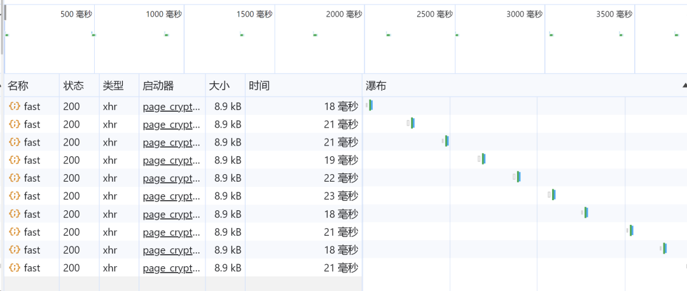
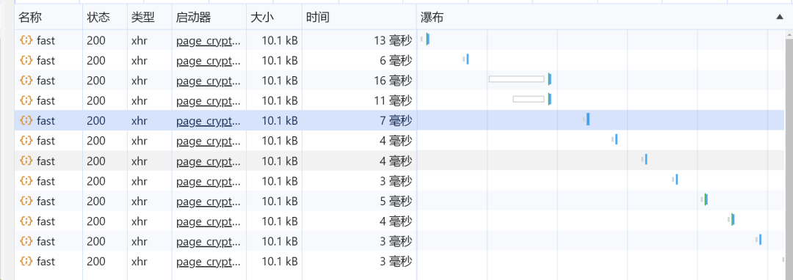
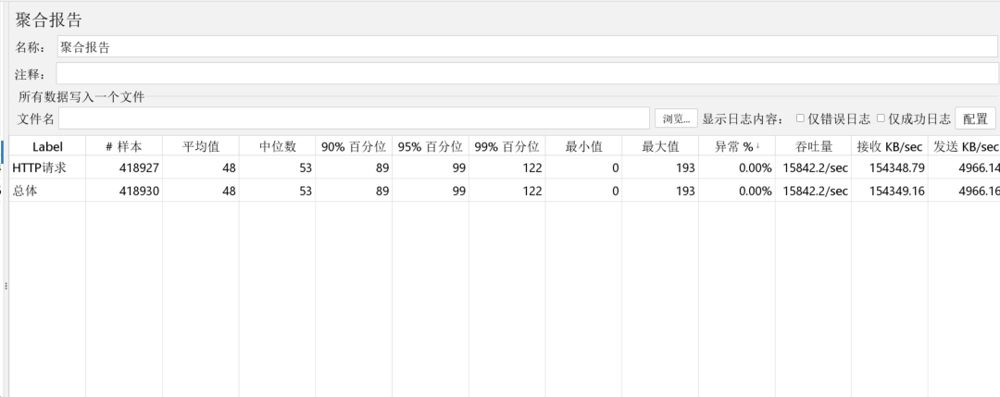
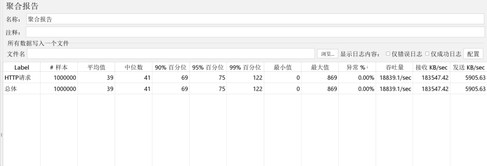

# 大致流程


## 1、业务上的优化

10亿级别的数据，分库分表，进行集群

查询数据进行一个分页查询，分页中含有count。


1、使用es

2、使用一页一页的缓存。

如果一开始就用es挺好，如果一开始不用es，那么最好不要引用中间件，因为这样需要理解业务需求，同时，如果代码不是自己写的，业务不熟悉不要直接改别人的代码，会崩的。


此时只能用mysql


可以跟产品经理进行沟通，像一些全部访问的数据，默认带一些查询条件，这时候他的查询就会筛选过滤，这样再查询就比较快了。


## 2、代码层的优化

包括数据库上的设计

单独建立一张新表，这个新表名存储了数据表名称，主键，count数。

进行count保存，保存的话使用异步进行保存，查询直接查询这个表里面的count就查出来

可以看全表查询优化。


对于联表查询，索引其实就不太明显了，此时可以使用宽表，或者两个sql查询出来的数据，做拼装。


## 3、SQL层面的优化

正常情况下是创建索引，创建联合索引，减少回表，少使用函数查询

最常见的是创建联合索引，但是联合索引仅仅是加速`where`查询，如果没有条件查询，加这个联合索引没有任何作用。


## 4、硬件层的优化

这个是运维方面的了，增加硬件。


## 5、实际例子

### 例子1：鱼皮优化

要优化的是一个后端查询接口，功能是查询出主页要展示的分页数据列表，逻辑很简单，就是数据库分页查询而已。

如下图：


首先我们往数据库里插入 10 万条数据，然后打开浏览器控制台，观察 10 次请求的响应耗时，平均是 700 毫秒：


**1）首先，我尝试优化了数据查询的 SQL 语句，让它只查询需要返回给前端的数据，减少数据量。**

优化后的接口平均耗时是 500 多毫秒，大概响应时长缩短了 1 / 4：


使用 JMeter 进行压力测试，每秒启动 1000 个线程，总共启动 1 万个线程发送请求，在异常率 0% 的前提下，测试结果得到的 qps 为 20，这显然不是一个很好的成绩。


**2）进一步优化，使用性能更高的 Redis 分布式缓存。将分页查询结果作为 JSON 字符串写入缓存，再次查询的时候直接读取就行。**

结果响应时长直接缩短到了平均 20 毫秒！缩短了 25 倍！

> 第一个请求是加载缓存的，所以较慢。


有缓存的情况下，压力测试得到的 qps 是 114.6，提升了 5 倍多！


可见缓存还是猛啊，读多写少、更新频率低、访问频率高的数据，非常适合使用缓存。

还能进一步优化么？

**3）当然能！使用比分布式缓存更快的本地缓存，直接从当前服务器内存读取数据，更快~**

用浏览器控制台测试响应时长，几乎没有变化（因为我测试过程中，Redis 也是本地启动的）：



进行压力测试，发现 qps 略有提升，大概 10% 左右吧：


本地缓存按道理来说已经是最快的读取方式了，难道这就已经优化到极限了么？

当然没有！

**4）虽然 I / O 难以继续优化了，但我们可以优化程序的计算逻辑、节约 CPU 资源。**

比如我修改缓存的数据类型，不再写入 JSON 格式的缓存了，直接用 JDK 原生的序列化方式去保存对象，这样读取的时候也不需要把 JSON 转为对象。

优化这个逻辑后，响应时长大幅度减少！平均 8 毫秒左右：



没想到吧，看似不起眼的 JSON 转换操作，这么影响性能？

压力测试的结果更恐怖了，吞吐量接近 16000，直接提升了 100 多倍！



真是不测不知道，一测吓一跳。

问题来了，还能继续优化么？

当然可以！

**5）除了业务逻辑层，我们还可以优化请求层。比如修改 Tomcat 服务器的配置，增大工作线程数和最大线程连接数。**

稍微改 2 行配置，吞吐量就提高了 1 / 5 左右，接近 19000！相比最开始的 qps 20 提升了近千倍！



这。。这次到极限了么？

我怎么知道啊！肯定还是需要自己测试这个极限到底在哪里！

如何测试呢？

**6）我们可以编写一个没有任何业务逻辑，直接返回 "ok" 字符串的空接口。**

每秒启动 10 万个线程来测试，得到的 qps 为 36000+，又提高了整整一倍！


ok，没有任何逻辑的接口 qps 是这个数，那么你再怎么优化业务逻辑，性能的极限也不会超过这个值。

那么，还有办法继续优化么？

当然可以！

**7）因为这只是 Tomcat 服务器 + Spring MVC 框架的极限，如果我们用别的技术呢？**

这里我就抛砖引玉，大家感兴趣的话，可以找个项目中的查询接口、用我上面提到的方法优化下。


------


回到最开始的问题 “一台部署了 Tomcat 的服务器，每秒最多能处理多少个请求？”

其实这个答案是 **无解** ，因为缺少了最重要的测试条件、测试环境和测试基准，比如是在几核几 G、带宽多少的机器上测试呢？不同的测试环境，测试结果肯定不同。性能优化效果一定要以实际测试结果为准，下次遇到这种问题的时候，别被面试官唬住了哦~


### 例子2：mysql调优过程

[【MySQL调优】如何进行MySQL调优？一篇文章就够了！-CSDN博客](https://blog.csdn.net/qq_40991313/article/details/131059110)

**一、监控报警**

监控工具（例如Prometheus+Grafana）监控MySQL，发现查询性能变慢，报警提醒运维人员：

**二、排查慢SQL**

2.1 开启慢查询日志 

```sql
show status like 'slow_queries';
```

> 开启慢查询次数

```sql
set slow_query_log='ON';    #开启慢查询日志
set long_query_time = 1;     #设置慢查询阈值
```

> 开启慢查询日志，修改慢查询阈值：

```sql
#命令行，按照查询时间排序，查看前五条 慢查询SQL 语句
mysqldumpslow -s t -t 5 /var/lib/mysql/xxx-slow.log 
```


2.2 找出最慢的几条SQL

慢查询日志分析工具mysqldumpslow找到最慢的几条语句


2.3 分析查询计划 

explan分析sql执行计划（访问类型、记录条数、索引长度等）


# 千万级数据优化

## 1、全表查询优化（千万级）

过程：

1、加索引

创建联合索引，是为了有条件查询更快而不是全表查询更快。

但对于全表查询来说，加索引和不加索引是没有任何区别的。

条件查询

```sql
select * from user where username = 'lihua'
```

> 对于这个来说，如果username加了索引查询时间为0.003s，没有索引查询时间为3s。

2、将count，表名，id放入一个新表

情况1：如果没有查询条件，直接返回新表里面的count，优化1.7秒。


如何更新count，这里可以使用异步对删除和新增之后进行count的更新。


3、使用子查询进行分页查询，这里面子查询会使用覆盖索引，会更快一些，大概优化一秒多

```sql
select * from user where id >= (select id from user limit 9000000, 1) limit 10
```

这里也可以去掉跳页，只用上一页和下一页，然后携带上一页的条件索引作为条件。


## 2、深度分页解决 (千万级)

未优化前的sql

```sql
select
c.id, c.`name`, c.`no`
from
t_customer c
where
c.delete_flag = 0
order by c.id limit #{pageNum}, #{pageSize};
```


**1、利用子查询，利用聚焦索引减少回表，从而提升查询效率**

```sql
select
c.id, c.`name`, c.`no`
from
t_customer c
where
c.id >= (select id from t_customer where delete_flag = 0 order by id limit #{pageNum},1) limit #{pageSize};
```

> 注意，最后那个limit后面有一个0，这个0是pageNum，但是一般就省略了。
>
> 这里面子查询是通过仅仅查id，id通过索引，查询较快，查出来id之后通过条件查询查出库中大于这个id的人，然后查询从0到一页的数据。
>
> 这里面通过子查询直接查到id，此时这个子查询是一个聚集索引，没有回表。


**2、内连接（left join)查询，我们可以把子查询（利用聚集索引）的结果当作一张临时表，然后和原表进行关联查询**

```sql
select
c.id, c.`name`, c.`no`
from
t_customer c, 
(select id from t_customer where delete_flag = 0 order by id limit #{pageNum}, #{pageSize}) as d
where
c.id = d.id;
```

> 这里的子查询因为仅仅查询了id，此时没有回表，没有深度分页。


**3、使用游标分页查询，当我们查询第二页的时候，把第一页的查询结果（返回最后一条记录的Id）放到第二页的查询条件中。(最优)**

```sql
select
c.id, c.name, c.no
from
t_customer c
where
c.delete_flag = 0 and id > #{lastId}
order by c.id 
limit #{pageSize};
```

> 这个是最好的
>
> 这里，如果id是uuid和雪花算法，我们可以使用create_time和update_time与id进行联合索引，
>
> ```sql
> CREATE INDEX idx_customer_created_at_id ON t_customer (created_at, id);
> 
> select
>     c.id, c.name, c.no
> from
>     t_customer c
> where
>     c.delete_flag = 0
>     and (
>         c.update_time > #{lastUpdateTime}
>         or (c.update_time = #{lastUpdateTime} and c.id > #{lastId})
>     )
> order by c.created_at, c.id
> limit #{pageSize};
> ```
>
> 一个简单的例子。


如果是分库分表情况下如何


如果是高并发情况下如何
