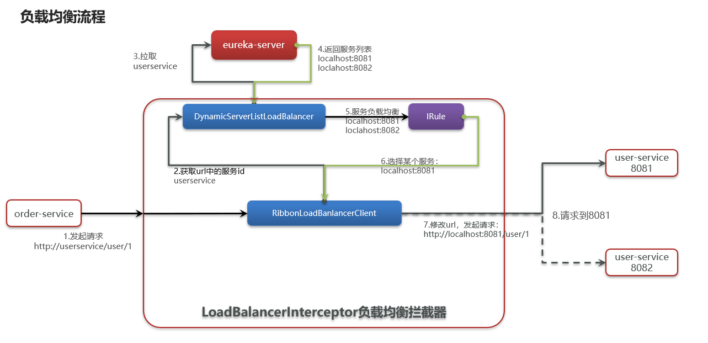
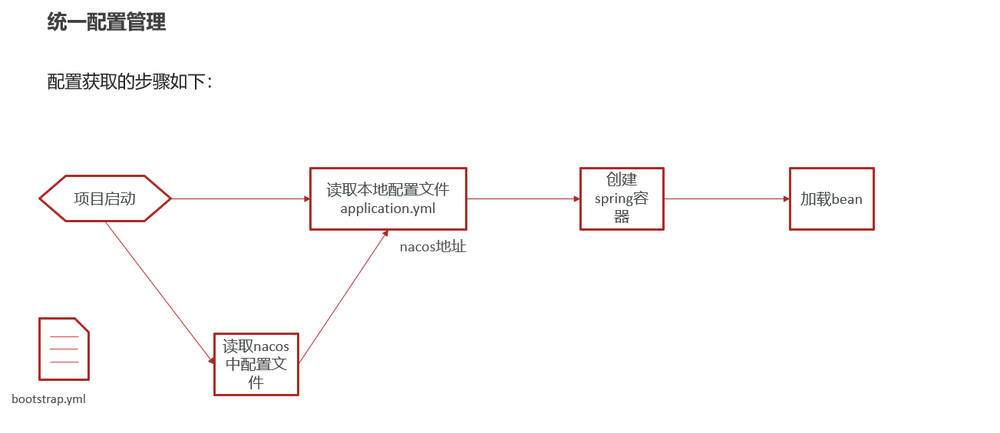
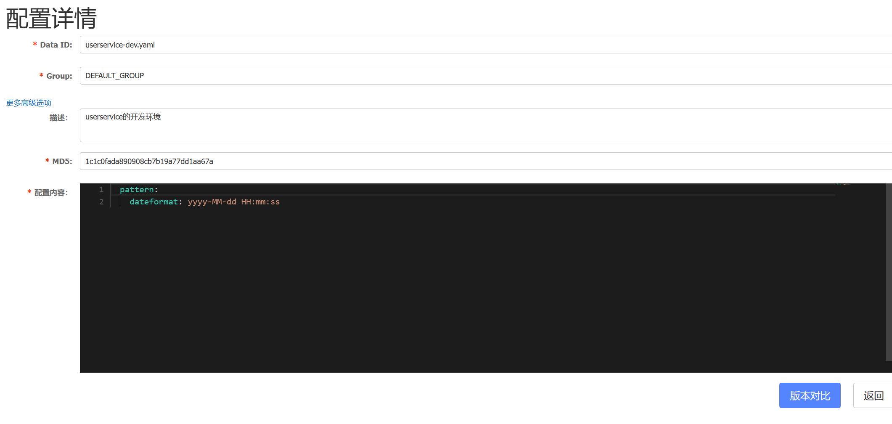
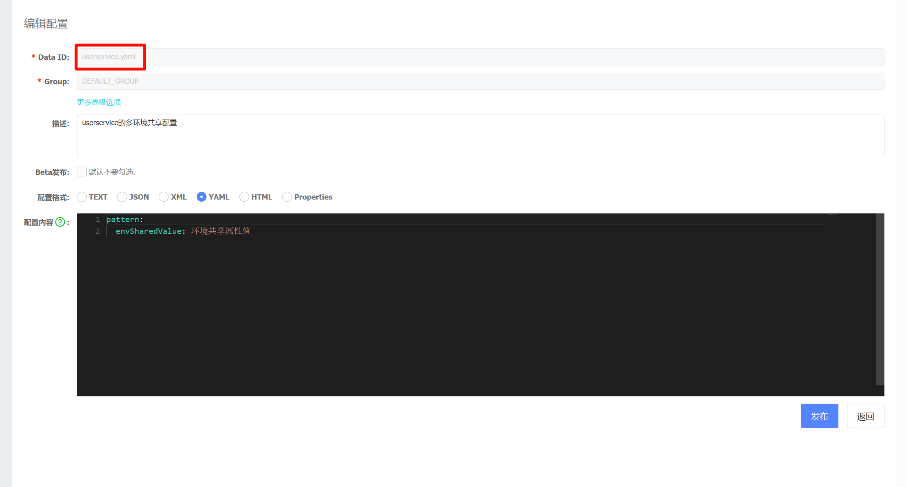

# Springcloud

两种分

## 项目拆分

### 怎么拆

有两种微服务：

小的：每个模块都是一个项目

大的：maven聚合


之前我们说过，微服务拆分时**粒度要小**，这其实是拆分的目标。具体可以从两个角度来分析：

- **高内聚**：每个微服务的职责要尽量单一，包含的业务相互关联度高、完整度高。
- **低耦合**：每个微服务的功能要相对独立，尽量减少对其它微服务的依赖，或者依赖接口的稳定性要强。

**高内聚**首先是**单一职责，**但不能说一个微服务就一个接口，而是要保证微服务内部业务的完整性为前提。目标是当我们要修改某个业务时，最好就只修改当前微服务，这样变更的成本更低。

一旦微服务做到了高内聚，那么服务之间的**耦合度**自然就降低了。

当然，微服务之间不可避免的会有或多或少的业务交互，比如下单时需要查询商品数据。这个时候我们不能在订单服务直接查询商品数据库，否则就导致了数据耦合。而应该由商品服务对应暴露接口，并且一定要保证微服务对外**接口的稳定性**（即：尽量保证接口外观不变）。虽然出现了服务间调用，但此时无论你如何在商品服务做内部修改，都不会影响到订单微服务，服务间的耦合度就降低了。

明确了拆分目标，接下来就是拆分方式了。我们在做服务拆分时一般有两种方式：

- **纵向**拆分
- **横向**拆分

所谓**纵向拆分**，就是按照项目的功能模块来拆分。例如黑马商城中，就有用户管理功能、订单管理功能、购物车功能、商品管理功能、支付功能等。那么按照功能模块将他们拆分为一个个服务，就属于纵向拆分。这种拆分模式可以尽可能提高服务的内聚性。

而**横向拆分**，是看各个功能模块之间有没有公共的业务部分，如果有将其抽取出来作为通用服务。例如用户登录是需要发送消息通知，记录风控数据，下单时也要发送短信，记录风控数据。因此消息发送、风控数据记录就是通用的业务功能，因此可以将他们分别抽取为公共服务：消息中心服务、风控管理服务。这样可以提高业务的复用性，避免重复开发。同时通用业务一般接口稳定性较强，也不会使服务之间过分耦合。


### 微服务远程调用

> 背景：
>
> ​	需要将查订单的时候也将用户查出来，这里`RestTemplate`就是spring一个发送请求的api
>
> 步骤：
>
> 1. 注册RestTemplate
> 2. 服务远程调用RestTemplate

1. **注册RestTemplate**

   - 在order-service的OrderApplication中注册RestTemplate

     > 这里不一定需要写在OrderApplication，主要是OrderApplication也是一个配置类，自己写一个配置类也行

   ```
   
   @MapperScan("cn.itcast.order.mapper")
   @SpringBootApplication
   public class OrderApplication {
   
       public static void main(String[] args) {
           SpringApplication.run(OrderApplication.class, args);
       }
   
       @Bean
       public RestTemplate restTemplate(){
           return new RestTemplate();
       }
   
   }
   ```

2. **服务远程调用RestTemplate**

   - 修改order-service中的OrderService的queryOrderById方法：

   ```
   @Service
   public class OrderService {
   
       @Autowired
       private OrderMapper orderMapper;
   
       @Autowired
       private RestTemplate restTemplate;
   
       public Order queryOrderById(Long orderId) {
           // 1.查询订单
           Order order = orderMapper.findById(orderId);
           // 2.查询用户
           String url = "http://localhost:8081/user/" + order.getUserId();
           User user = restTemplate.getForObject(url, User.class);
           // 3. 封装user信息
           order.setUser(user);
           // 4.返回
           return order;
       }
   }
   ```

   > 主要是加了2和3，将get请求得到的值放入到order中

### 依赖问题

> 父工程导入了springcloud依赖，子工程cloud中就不需要导入版本号了

- 父工程

```
            <!-- springCloud -->
            <dependency>
                <groupId>org.springframework.cloud</groupId>
                <artifactId>spring-cloud-dependencies</artifactId>
                <version>Hoxton.SR10</version>
                <type>pom</type>
                <scope>import</scope>
            </dependency>
```


## 1 Eureka注册中心

### 1.1 介绍：

> 有两个重点：
>
> 一个是eureka的工作原理
>
> 一个是客户端和服务端


- **eureka的工作原理**


- **客户端和服务端**

在Eureka架构中，微服务角色有两类：

- lEurekaServer：服务端，注册中心
  - 记录服务信息
  - 心跳监控
- lEurekaClient：客户端
  - Provider：服务提供者，例如案例中的 user-service
    - 注册自己的信息到EurekaServer
    - 每隔30秒向EurekaServer发送心跳
  - consumer：服务消费者，例如案例中的 order-service
    - 根据服务名称从EurekaServer拉取服务列表
    - 基于服务列表做负载均衡，选中一个微服务后发起远程调用


### 1.2 搭建注册中心

> 背景：
>
> ​	搭建EurekaServer
>
> 步骤： 
>
> 1. 创建项目，引入spring-cloud-starter-netflix-eureka-server的依赖
> 2. 编写启动类，添加@EnableEurekaServer注解
> 3. 添加application.yml文件，编写下面的配置：


1. **创建项目，引入spring-cloud-starter-netflix-eureka-server的依赖**

   - 父工程

     > 看上面的父工程

   - 客户端

   ```
           <!-- EurekaServer服务 -->
           <dependency>
               <groupId>org.springframework.cloud</groupId>
               <artifactId>spring-cloud-starter-netflix-eureka-server</artifactId>
           </dependency>
   ```

   

2. **编写启动类，添加@EnableEurekaServer注解**

   ```
   @EnableEurekaServer
   @SpringBootApplication
   public class EurekaApplication {
       public static void main(String[] args) {
           SpringApplication.run(EurekaApplication.class, args);
       }
   }
   ```

   

3. **添加application.yml文件，编写下面的配置：**

   ```
   server:
     port: 10086 # 端口名称
   spring:
     application:
       name: eurekaserver # eureka的服务名称
   eureka:
     client:
       service-url: # eureka的地址信息
         defaultZone: http://127.0.0.1:10086/eureka
   ```

   

### 1.3 服务注册

> 背景：
>
> ​	将user-service、order-service都注册到eureka
>
> 步骤：
>
> 1. 在user-service项目引入spring-cloud-starter-netflix-eureka-client的依赖
> 2. 在application.yml文件，编写下面的配置：
> 3. orderservice同理
> 4. user-service多次启动， 模拟多实例部署
> 5. 结果

1. **在user-service项目引入spring-cloud-starter-netflix-eureka-client的依赖**

   ```
           <!-- EurekaServer服务 -->
           <dependency>
               <groupId>org.springframework.cloud</groupId>
               <artifactId>spring-cloud-starter-netflix-eureka-server</artifactId>
           </dependency>
   ```

   

2. **在application.yml文件，编写下面的配置：**

```
spring:
  application:
    name: userservice # eureka的服务名称
eureka:
  client:
    service-url: # eureka的地址信息
      defaultZone: http://127.0.0.1:10086/eureka
```

3. **orderservice同理**

4. **user-service多次启动， 模拟多实例部署**

   > 这里使用idea中的Copy Configuratio的属性将user-service复制一份，但为了避免端口冲突，需要修改端口设置：
   >
   > 即在**VM options**中加上-Dserver.port=8002

5. **结果**

> 访问地址为： localhost/eureka
>
> ​      defaultZone: http://127.0.0.1:10086/eureka
>
> 就是自己设置的


### 1.4 服务发现

> 背景：
>
> ​	在order-service中完成服务拉取，然后通过负载均衡挑选一个服务，实现远程调用
>
> 步骤：
>
> 1. 修改OrderService的代码，修改访问的url路径，用服务名代替ip、端口：
> 2. 在order-service项目的启动类OrderApplication中的RestTemplate添加**负载均衡**注解：


1. **修改OrderService的代码，修改访问的url路径，用服务名代替ip、端口：**

   ````
   // 2.查询用户
   String url = "http://userservice/user/" + order.getUserId();
   ````

   > 这里将127.0.0.1:8080改为了userservice，可以理解为eureka注册中心有一张表，可以直接做负载均衡

2. **在order-service项目的启动类OrderApplication中的RestTemplate添加负载均衡注解：**

```
    @Bean
    @LoadBalanced
    public RestTemplate restTemplate(){
        return new RestTemplate();
    }
```

## 2 Ribbon负载均衡

### 2.1 负载均衡原理



### 2.2 负载均衡策略

> 背景：
>
> 负载均衡选择服务列表有两种方式：
>
> - 轮询
>
> - 随机
> - IP的hash
> - 最近最少访问
>
> 步骤：
>
> 1. 代码方式：在order-service中的OrderApplication类中，定义一个新的IRule：
> 2. 配置文件方式：在order-service的application.yml文件中，添加新的配置也可以修改规则：

1. **代码方式：在order-service中的OrderApplication类中，定义一个新的IRule：**

   > 不一定非得在OrderApplication，自己写个配置类也行

   ```
       @Bean
       public IRule randomRule(){
           return new RandomRule();
       }
   ```

2. **配置文件方式：在order-service的application.yml文件中，添加新的配置也可以修改规则：**

   ```
   userservice:
     ribbon:
       NFLoadBalancerRuleClassName: com.netflix.loadbalancer.RandomRule # 负载均衡规则
   ```

### 2.3 懒加载

> Ribbon默认是采用懒加载，即第一次访问时才会去创建LoadBalanceClient，请求时间会很长。
>
> 而饥饿加载则会在项目启动时创建，降低第一次访问的耗时，通过下面配置开启饥饿加载：

Orderservice中设置

```
ribbon:
  eager-load:
    enabled: true # 开启饥饿加载
    clients: userservice # 指定对userservice这个服务饥饿加载
```


## 3 Nacos注册中心

### 3.1 认识和安装Nacos

> 1. 安装
> 2. 端口配置
> 3. 运行

1. **安装**

   > 在Nacos的GitHub页面，提供有下载链接，可以下载编译好的Nacos服务端或者源代码：
   >
   > GitHub主页：https://github.com/alibaba/nacos
   >
   > GitHub的Release下载页：https://github.com/alibaba/nacos/releases

2. **端口配置**

   >Nacos的默认端口是8848，如果你电脑上的其它进程占用了8848端口，请先尝试关闭该进程。
   >
   >**如果无法关闭占用8848端口的进程**，也可以进入nacos的conf目录，修改配置文件中的端口：

3. **运行**

   执行命令即可：

- windows命令：

  ```
  startup.cmd -m standalone
  ```

  > 这是单机启动

- 登录的**账号名**和**密码**都是`nacos`

### 3.2 服务注册到Nacos

> 1. 在cloud-demo父工程中添加spring-cloud-alilbaba的管理依赖
> 2. 注释掉order-service和user-service中原有的eureka依赖。
> 3. 添加nacos的客户端依赖：

1. **在cloud-demo父工程中添加spring-cloud-alilbaba的管理依赖**

   父工程：

   ```xml
               <!-- nacos的管理依赖 -->
               <dependency>
                   <groupId>com.alibaba.cloud</groupId>
                   <artifactId>spring-cloud-alibaba-dependencies</artifactId>
                   <version>2.2.5.RELEASE</version>
                   <type>pom</type>
                   <scope>import</scope>
               </dependency>
   ```

   

   客户端：

   ```xml
   <!-- nacos客户端依赖包 -->
   <dependency>
       <groupId>com.alibaba.cloud</groupId>
       <artifactId>spring-cloud-starter-alibaba-nacos-discovery</artifactId>
   </dependency>
   ```

2. **注释掉order-service和user-service中原有的eureka依赖并添加nacos依赖。**

   ```
           <!-- nacos客户端依赖包 -->
           <dependency>
               <groupId>com.alibaba.cloud</groupId>
               <artifactId>spring-cloud-starter-alibaba-nacos-discovery</artifactId>
           </dependency>
   ```

3. **注释掉原有的yml文件eureka配置，添加nacos配置**

   ```
   spring:
     cloud:
       nacos:
         server-addr: localhost:8848 # nacos服务地址
   ```

   > 这里
   >
   > ```
   > application:
   >   name: userservice # 服务名称
   > ```
   >
   > 这个不能删除，因为这个是名字
   >
   > 完整应该为
   >
   > ```
   > spring:
   >   application:
   >     name: userservice # 服务名称
   >   cloud:
   >     nacos:
   >       server-addr: localhost:8848 # nacos服务地址
   > ```
   >
   > 还有负载均衡的也不用删除，都是通用的。

### 3.3 Nacos服务分级存储模型（集群）

> 背景：
>
> 1.Nacos服务分级存储模型
>
> - ①一级是服务，例如userservice
>
> - ②二级是集群，例如杭州或上海
>
> - ③三级是实例，例如杭州机房的某台部署了userservice的服务器
>
> 步骤：
>
> 1. 修改application.yml，添加如下内容：
> 2. 在Nacos控制台可以看到集群变化：


1. **修改application.yml，添加如下内容：**

   ```
   spring:
     cloud:
       nacos:
         server-addr: localhost:8848 # nacos服务地址
         discovery:
           cluster-name: HZ # 配置集群名称，也就是机房位置，例如：HZ，杭州
   ```

   > 这个修改一个地点，运行一个实例即可。

2. **在Nacos控制台可以看到集群变化：**


### 3.4 根据集群设置负载均衡与权重

> 背景：
>
> ​	希望Order集群调用的时候优先调用本地集群，这就需要设置将Ordervice和一个UserService在一个HZ集群中，将UserService2放在另一个SH集群中
>
> 步骤：
>
> 1. 修改order-service中的application.yml，设置集群为HZ：
> 2. 然后在order-service中设置负载均衡的IRule为NacosRule，这个规则优先会寻找与自己同集群的服务

1. **修改order-service中的application.yml，设置集群为HZ：**

   ```
   spring:
     cloud:
       nacos:
         server-addr: localhost:8848 # nacos服务地址
         discovery:
           cluster-name: HZ # 配置集群名称
   ```

   

2. **然后在order-service中设置负载均衡的IRule为NacosRule，这个规则优先会寻找与自己同集群的服务**

   ```
   serservice: # 要做配置的微服务名称
     ribbon:
       NFLoadBalancerRuleClassName: com.alibaba.cloud.nacos.ribbon.NacosRule # 负载均衡规则
   ```

- 当在同一个集群中，权重高的会被优先访问

  进入nacos后台，依次点击**服务管理->服务列表->详情->编辑**进行修改权重

### 3.5 Nacos环境隔离（命名空间）

> 背景:
>
> namespace（表空间）->group（分组）->service/Data（服务存储或者数据存储）->集群->实例
>
> 我们可以进行环境隔离进行
>
> 步骤：
>
> 1. 在Nacos控制台可以创建namespace
> 2. 修改order-service的application.yml，添加namespace：
> 3. 重启order-service后，再来查看控制台：
> 4. 此时访问order-service，因为namespace不同，会导致找不到userservice，控制台会报错

1. **在Nacos控制台可以创建namespace**

   > 在Nacos控制台点击**命名空间->新建命名空间->填写->保存生成的id**
   >
   > 一般来说，不填写规则会使用uuid生成id

2. **修改order-service的application.yml，添加namespace：**

   ```
   spring:
     cloud:
       nacos:
         server-addr: localhost:8848 # nacos服务地址
         discovery:
           cluster-name: HZ # 配置集群名称
           namespace: f28c39a8-329d-45ac-a077-481f60e74433 # 命名空间,填写id
   ```

3. **重启order-service后，再来查看控制台：**

4. **此时访问order-service，因为namespace不同，会导致找不到userservice，控制台会报错**

   

### 3.6 临时实例

> 临时实例宕机时，会从nacos的服务列表中剔除，而非临时实例则不会

设置非临时实例

```
spring:
  cloud:
    nacos:
      discovery:
        ephemeral: false # 设置为非临时实例
```


### 3.7 Nacos和Eureka的异同：


1.Nacos与eureka的共同点

- ①都支持服务注册和服务拉取

- ②都支持服务提供者心跳方式做健康检测

2.Nacos与Eureka的区别

- ①Nacos支持服务端主动检测提供者状态：临时实例采用心跳模式，非临时实例采用主动检测模式

- ②临时实例心跳不正常会被剔除，非临时实例则不会被剔除

- ③Nacos支持服务列表变更的消息推送模式，服务列表更新更及时

- ④Nacos集群默认采用AP方式，当集群中存在非临时实例时，采用CP模式；Eureka采用AP方式


## 4 Nacos配置管理

>  介绍： 就是Nacos中yml配置和本地的整合在一起

### 4.1 统一配置管理



### 4.2 在Nacos控制台添加配置

规则：




> 按照这个形式添加即可

### 4.3 配置拉取

> 1. 引入Nacos的配置管理客户端依赖：
> 2. 在userservice中的resource目录添加一个bootstrap.yml文件，这个文件是引导文件，优先级高于application.yml：
> 3. 测试

1. **引入Nacos的配置管理客户端依赖：**

   ```
           <!--nacos配置管理依赖-->
           <dependency>
               <groupId>com.alibaba.cloud</groupId>
               <artifactId>spring-cloud-starter-alibaba-nacos-config</artifactId>
           </dependency>
   ```

2. **在userservice中的resource目录添加一个bootstrap.yml文件，这个文件是引导文件，优先级高于application.yml：**

   - bootstrap.yml

   ```
   spring:
     application:
       name: userservice # 服务名称
     profiles:
       active: dev #开发环境，这里是dev
     cloud:
       nacos:
         server-addr: localhost:8848 # Nacos地址
         config:
           file-extension: yaml # 文件后缀名
   ```

   > 配置之后将application.yml中的相同配置注释
   >
   > 这里面的一些数据和前面添加表单的配置规则一样

3. **测试**

   > 在UserController中添加@Value注解获取配置

   ```
       @Autowired
       private UserService userService;
   
       @Value("${pattern.dateformat}")
       private String dateformate;
       @GetMapping("/now")
       public String now() {
           return LocalDateTime.now().format(DateTimeFormatter.ofPattern(dateformate));
       }
   ```

   

### 4.4 配置热更新

> 这个方式就是对应获取配置两种方法

1. 方式一：在@Value注入的变量所在类上添加注解@RefreshScope
2. 方式二：使用@ConfigurationProperties注解

### 4.5 多环境配置共享



> 这里是名字改变了，少了环境，是一个全局的配置


### 4.6 Nacos集群搭建

看视频p29，然后查看笔记[Nacos集群搭建](./Nacos集群搭建/nacos集群搭建.md)


### 4.7 小总结

微服务会从nacos读取的配置文件：

- ①[服务名]-[spring.profile.active].yaml，环境配置

- ②[服务名].yaml，默认配置，多环境共享

优先级：

- ①[服务名]-[环境].yaml >[服务名].yaml > 本地配置

搭建Nacos集群

## 5 Feign远程调用

### 5.1 介绍

>  Feign是一个声明式的http客户端，官方地址：https://github.com/OpenFeign/feign
>
> 其作用就是帮助我们优雅的实现http请求的发送，解决上面提到的问题。


### 5.2 定义和使用Feign客户端

> 步骤：
>
> 1. 引入依赖
> 2. 在order-service的启动类添加注解开启Feign的功能：
> 3. 编写Feign客户端：
> 4. 用Feign客户端代替**RestTemplate**

1. **引入依赖**

   ```
           <!-- feign客户端依赖 -->
           <dependency>
               <groupId>org.springframework.cloud</groupId>
               <artifactId>spring-cloud-starter-openfeign</artifactId>
           </dependency>
   ```

2. **在order-service的启动类添加注解开启Feign的功能：**

   ```
   @MapperScan("cn.itcast.order.mapper")
   @SpringBootApplication
   @EnableFeignClients
   public class OrderApplication {
   
       public static void main(String[] args) {
           SpringApplication.run(OrderApplication.class, args);
       }
   }
   ```

3. **编写Feign客户端：**

   - clients/UserClient

   ```
   @FeignClient("userservice")
   public interface UserClient {
   
       @GetMapping("/user/{id}")
       User findById(@PathVariable("id") Long id);
   }
   
   ```

   > 1. 这里是一个接口
   > 2. 添加@FeignClient("userservice")注解，`userservice`是服务名称

4. **用Feign客户端代替RestTemplate**

   


### 5.3 自定义Feign的配置

| 类型                   | 作用             | 说明                                                   |
| ---------------------- | ---------------- | ------------------------------------------------------ |
| **feign.Logger.Level** | 修改日志级别     | 包含四种不同的级别：NONE、BASIC、HEADERS、FULL         |
| feign.codec.Decoder    | 响应结果的解析器 | http远程调用的结果做解析，例如解析json字符串为java对象 |
| feign.codec.Encoder    | 请求参数编码     | 将请求参数编码，便于通过http请求发送                   |
| feign. Contract        | 支持的注解格式   | 默认是SpringMVC的注解                                  |
| feign. Retryer         | 失败重试机制     | 请求失败的重试机制，默认是没有，不过会使用Ribbon的重试 |


#### 配置Feign日志有两种方式：

**方式一**：配置文件方式(添加到客户端OrderServer的yml中)

1. 全局生效

   ```
   feign:
     client:
       config:
         default: # 这里用default就是全局配置，如果是写服务名称，则是针对某个微服务的配置
           loggerLevel: FULL #  日志级别
   ```

2. 局部生效

   ```
   feign:
     client:
       config: 
         userservice: # 这里用default就是全局配置，如果是写服务名称，则是针对某个微服务的配置
           loggerLevel: FULL #  日志级别 
   ```

**方式二**：java代码方式，需要先声明一个Bean

```
package cn.itcast.order.config;

import feign.Logger;
import org.springframework.context.annotation.Bean;

public class DefaultFeignConfiguration {
    @Bean
    public Logger.Level logLevel() {
        return Logger.Level.BASIC;
    }
}
```

> 这个 看包，我没有加入到ioc容器中

- 而后如果是全局配置，则把它放到@EnableFeignClients这个注解中：

  ```
  @EnableFeignClients(defaultConfiguration = FeignClientProperties.class)
  ```

- 如果是局部配置，则把它放到@FeignClient这个注解中：

  ```
  @FeignClient(value = "userservice", configuration = FeignClientConfiguration.class) 
  ```

  > 这俩就是一个加到启动类上的，作为全局配置，一个加到之前5.2编写的**Feign客户端**上的注解

   

> **不开连接池性能会优化很多**


### 5.4 Feign的性能优化

> Feign底层的客户端实现：
>
> •URLConnection：默认实现，不支持连接池
>
> •Apache HttpClient ：支持连接池
>
> •OKHttp：支持连接池
>
> 
>
> 因此优化Feign的性能主要包括：
>
> ①使用连接池代替默认的URLConnection
>
> ②日志级别，最好用basic或none


#### 5.4.1 连接池配置

> 1. 引入依赖
> 2. 配置连接池

1. **引入依赖**

   ```
           <!--httpClient的依赖 -->
           <dependency>
               <groupId>io.github.openfeign</groupId>
               <artifactId>feign-httpclient</artifactId>
           </dependency>
   ```

2. **配置连接池**

   ```
   feign:
     httpclient:
       enabled: true # 开启feign对HttpClient的支持
       max-connections: 200 # 最大的连接数
       max-connections-per-route: 50 # 每个路径的最大连接数
   ```


### 5.6 Feign的最佳实践

> 这个最好看[讲解视频](https://www.bilibili.com/video/BV1LQ4y127n4/?p=33&share_source=copy_web&vd_source=a9e0245042931de24eb0a8f018fa0eae)看看原理
>
> 更推荐抽取，耦合性低

#### 5.6.1 继承

方式一（继承）：给消费者的FeignClient和提供者的controller定义统一的父接口作为标准。


#### 5.6.2 抽取

方式二（抽取）：将FeignClient抽取为独立模块，并且把接口有关的POJO、默认的Feign配置都放到这个模块中，提供给所有消费者使用


> 步骤： 
>
> 1. 首先创建一个module，命名为feign-api，然后引入feign的starter依赖
>
> 2. 将order-service中编写的UserClient、User、DefaultFeignConfiguration都复制到feign-api项目中
>
> 3. 在order-service中引入feign-api的依赖
>
> 4. 修改order-service中的所有与上述三个组件有关的import部分，改成导入feign-api中的包
>
> 5. 添加扫描包
> 6. 重启测试


1. **首先创建一个module，命名为feign-api，然后引入feign的starter依赖**

   ```
       <dependencies>
           <dependency>
               <groupId>org.springframework.cloud</groupId>
               <artifactId>spring-cloud-starter-openfeign</artifactId>
           </dependency>
       </dependencies>
   ```

   > 只需要导入feign即可

2. **将order-service中编写的UserClient、User、DefaultFeignConfiguration都复制到feign-api项目中**

   ```
   ├─feign-api
   │  │  pom.xml
   │  │  
   │  ├─src
   │  │  ├─main
   │  │  │  ├─java
   │  │  │  │  └─com
   │  │  │  │      └─feign
   │  │  │  │          │  
   │  │  │  │          ├─clients
   │  │  │  │          │      UserClient.java
   │  │  │  │          │      
   │  │  │  │          ├─config
   │  │  │  │          │      DefaultFeignConfiguration.java
   │  │  │  │          │      
   │  │  │  │          └─pojo
   │  │  │  │                  User.java
   │  │  │  │                  
   │  │  │  └─resources
   ```

   > 目录树如上，添加的服务端（user）的pojo，和一些feign的配置，以及客户端

3. **在order-service中引入feign-api的依赖**

   ```
           <!-- 引入feign的统一api -->
           <dependency>
               <groupId>com.feign</groupId>
               <artifactId>feign-api</artifactId>
               <version>1.0</version>
           </dependency>
   ```

   > 写的时候会自动提示，这是搁客户端（order）上写的

4. **修改order-service中的所有与上述三个组件有关的import部分，改成导入feign-api中的包**

   > 这个是修改文件的引入

5. **添加扫描包**

   当定义的FeignClient不在SpringBootApplication的扫描包范围时，这些FeignClient无法使用。有两种方式解决：

   方式一：指定FeignClient所在包

   ```
   @EnableFeignClients(basePackages = "包名，写到客户端的包clients")
   @EnableFeignClients("com.feign.clients")
   ```

   方式二：指定FeignClient字节码

   ```
   @EnableFeignClients(clients = {UserClient.class})
   ```

6. **重启测试**


## 6 Gateway服务网关

### 6.1 为什么需要网关

网关的作用：

•对用户请求做身份认证、权限校验

•将用户请求路由到微服务，并实现负载均衡

•对用户请求做限流

### 6.2 搭建网关服务

> 步骤： 
>
> 1. 创建新的module，引入SpringCloudGateway的依赖和nacos的服务发现依赖：
> 2. 编写路由配置及nacos地址
> 3. 规则
> 4. 使用网关


1. **创建新的module，引入SpringCloudGateway的依赖和nacos的服务发现依赖：**

   ```
           <!--网关依赖-->
           <dependency>
               <groupId>org.springframework.cloud</groupId>
               <artifactId>spring-cloud-starter-gateway</artifactId>
           </dependency>
           <!--nacos服务发现依赖-->
           <dependency>
               <groupId>com.alibaba.cloud</groupId>
               <artifactId>spring-cloud-starter-alibaba-nacos-discovery</artifactId>
           </dependency>
   ```

   

2. **编写路由配置及nacos地址**

   ```
   server:
     port: 10010 # 网关端口
   spring:
     application:
       name: gateway # 服务名称
     cloud:
       nacos:
         server-addr: localhost:8848 # nacos地址
       gateway:
         routes: # 网关路由配置
           - id: user-service # 路由id，自定义，只要唯一即可
             # uri: http://127.0.0.1:8081 # 路由的目标地址 http就是固定地址
             uri: lb://userservice # 路由的目标地址 lb就是负载均衡，后面跟服务名称
             predicates: # 路由断言，也就是判断请求是否符合路由规则的条件
               - Path=/user/** # 这个是按照路径匹配，只要以/user/开头就符合要求
           - id: order-service
             uri: lb://orderservice
             predicates:
               - Path=/order/**
   ```


> 这个图的意思就是将用户申请的地址通过网关路由到了服务名
>
> 这里面通过predicates这个规则可以将请求根据规则转到对应的服务也就是1和3

3. **规则**

>  网关搭建步骤：
>
> 1.创建项目，引入nacos服务发现和gateway依赖
>
> 2.配置application.yml，包括服务基本信息、nacos地址、路由
>
> 路由配置包括：
>
> 1.路由id：路由的唯一标示
>
> 2.路由目标（uri）：路由的目标地址，http代表固定地址，lb代表根据服务名负载均衡
>
> 3.路由断言（predicates）：判断路由的规则，
>
> 4.路由过滤器（filters）：对请求或响应做处理

4. **使用网关**

   > 访问本身设置的端口号，进行访问端口即可


### 6.3 路由断言工厂

predicates

| **名称**   | **说明**                       | **示例**                                                     |
| ---------- | ------------------------------ | ------------------------------------------------------------ |
| After      | 是某个时间点后的请求           | -  After=2037-01-20T17:42:47.789-07:00[America/Denver]       |
| Before     | 是某个时间点之前的请求         | -  Before=2031-04-13T15:14:47.433+08:00[Asia/Shanghai]       |
| Between    | 是某两个时间点之前的请求       | -  Between=2037-01-20T17:42:47.789-07:00[America/Denver],  2037-01-21T17:42:47.789-07:00[America/Denver] |
| Cookie     | 请求必须包含某些cookie         | - Cookie=chocolate, ch.p                                     |
| Header     | 请求必须包含某些header         | - Header=X-Request-Id, \d+                                   |
| Host       | 请求必须是访问某个host（域名） | -  Host=**.somehost.org,**.anotherhost.org                   |
| Method     | 请求方式必须是指定方式         | - Method=GET,POST                                            |
| Path       | 请求路径必须符合指定规则       | - Path=/red/{segment},/blue/**                               |
| Query      | 请求参数必须包含指定参数       | - Query=name, Jack或者-  Query=name                          |
| RemoteAddr | 请求者的ip必须是指定范围       | - RemoteAddr=192.168.1.1/24                                  |
| Weight     | 权重处理                       |                                                              |

> 常用的是Path


### 6.4 过滤器工厂GatewayFilterFactory

> 官网地址： [GatewayFilterFactory]([GatewayFilter Factories :: Spring Cloud Gateway](https://docs.spring.io/spring-cloud-gateway/reference/spring-cloud-gateway/gatewayfilter-factories.html))

| **名称**             | **说明**                     |
| -------------------- | ---------------------------- |
| AddRequestHeader     | 给当前请求添加一个请求头     |
| RemoveRequestHeader  | 移除请求中的一个请求头       |
| AddResponseHeader    | 给响应结果中添加一个响应头   |
| RemoveResponseHeader | 从响应结果中移除有一个响应头 |
| RequestRateLimiter   | 限制请求的流量               |
| ...                  |                              |

1. 局部过滤器

   - 添加gateway项目中yml

   ```
   spring:
     application:
       name: gateway # 服务名称
     cloud:
       nacos:
         server-addr: localhost:8848 # nacos地址
       gateway:
         routes: # 网关路由配置
           - id: user-service # 路由id，自定义，只要唯一即可
             # uri: http://127.0.0.1:8081 # 路由的目标地址 http就是固定地址
             uri: lb://userservice # 路由的目标地址 lb就是负载均衡，后面跟服务名称
             predicates: # 路由断言，也就是判断请求是否符合路由规则的条件
               - Path=/user/** # 这个是按照路径匹配，只要以/user/开头就符合要求
             filters:
               - AddRequestHeader=X-Request-red, blue
   ```

   > 这是官网的一个示例，`filters:AddRequestHeader=X-Request-red, blue` 我这里是将userservice中的添加一个请求头

   - 查看结果

   ```
   @GetMapping("/{id}")
   public User queryById(@PathVariable("id") Long id,
                         @RequestHeader(value = "X-Request-red", required = false) String XRequestred) {
       System.out.println("过滤的头X-Request-red：" + XRequestred);
       return userService.queryById(id);
   }
   ```

   > 在userservice中的userController中添加头并输出

2. 全局过滤器

   ```
   spring:
     application:
       name: gateway # 服务名称
     cloud:
       nacos:
         server-addr: localhost:8848 # nacos地址
       gateway:
         routes: # 网关路由配置
           - id: user-service # 路由id，自定义，只要唯一即可
             # uri: http://127.0.0.1:8081 # 路由的目标地址 http就是固定地址
             uri: lb://userservice # 路由的目标地址 lb就是负载均衡，后面跟服务名称
             predicates: # 路由断言，也就是判断请求是否符合路由规则的条件
               - Path=/user/** # 这个是按照路径匹配，只要以/user/开头就符合要求
   #          filters:
   #            - AddRequestHeader=X-Request-red, blue
           - id: order-service
             uri: lb://orderservice
             predicates:
               - Path=/order/**
         default-filters:
           - AddRequestHeader=X-Request-red, blue
   ```

   > 只需要修改gateway中的yml文件这里的即可
   >
   > 添加`      default-filters:AddRequestHeader=X-Request-red, blue`   注意这里是和router一个层级


### 6.5 全局过滤器

> 这可以作为一个验证

- AuthorizeFilter.java

```
@Order(-1)
@Component
public class AuthorizeFilter implements GlobalFilter {
    @Override
    public Mono<Void> filter(ServerWebExchange exchange, GatewayFilterChain chain) {
        // 1. 获取请求参数
        ServerHttpRequest request = exchange.getRequest();
        MultiValueMap<String, String> params = request.getQueryParams();
        // 2. 获取参数中的  authorizeation 参数
        String authorization = params.getFirst("authorization");
        // 3. 判断参数值是否等于admin
        if ("admin".equals(authorization)) {
            // 4. 是，放行
            return chain.filter(exchange);
        }
        // 5. 否，拦截
        // 设置状态码
        exchange.getResponse().setStatusCode(HttpStatus.UNAUTHORIZED);
        // 拦截
        return exchange.getResponse().setComplete();
    }
}
```

> 这里就是简单的认证，但是返回值什么的需要明白，
>
> 1. exchange在这里是上下文的意思
> 2. 在4放行中的时候，他调用的是回调。可以用gpt看看
> 3. 在5的拦截中setComplete()就是结束的意思。
> 4. 上面有个注解`@Order`是指定过滤器的顺序的。值越小，优先级越高，这里也可以通过实现order接口进行设置，但是都一样。

- 测试

> 访问`http://localhost:10010/user/1?authorization=admin`地址，这个是网关的端口，这里需要主义的是这里就判断了请求参数。
>
> 我们如果想进行token验证的话，`request.getHeaders().get("authorization");`这个即可，其他步骤都差不多。


### 6.6 过滤器执行顺序

1. 每一个过滤器都必须指定一个int类型的order值，**order** **值越小，优先级越高，执行顺序越靠前。**
2. GlobalFilter通过实现Ordered接口，或者添加@Order注解来指定order值，由我们自己指定
3. 路由过滤器和defaultFilter的order由Spring指定，默认是按照声明顺序从1递增。
4. 当过滤器的order值一样时，会按照 defaultFilter > 路由过滤器 > GlobalFilter的顺序执行


### 6.7 跨域问题

跨域：域名不一致就是跨域，主要包括：

- 域名不同： www.taobao.com 和 www.taobao.org 和 www.jd.com 和 miaosha.jd.com
- 域名相同，端口不同：localhost:8080和localhost8081

跨域问题：浏览器禁止请求的发起者与服务端发生跨域ajax请求，请求被浏览器拦截的问题

解决方案：CORS


添加配置即可

````
spring:
  cloud:
    gateway:      #
      globalcors: # 全局的跨域处理
        add-to-simple-url-handler-mapping: true # 解决options请求被拦截问题
        corsConfigurations:
          '[/**]':
            allowedOrigins: # 允许哪些网站的跨域请求
              - "http://localhost:8090"
              - "http://www.leyou.com"
            allowedMethods: # 允许的跨域ajax的请求方式
              - "GET"
              - "POST"
              - "DELETE"
              - "PUT"
              - "OPTIONS"
            allowedHeaders: "*" # 允许在请求中携带的头信息
            allowCredentials: true # 是否允许携带cookie
            maxAge: 360000 # 这次跨域检测的有效期
````

> 这个是gateway下面的一层，跟router同层


```
<!DOCTYPE html>
<html lang="en">
<head>
    <meta charset="UTF-8">
    <meta http-equiv="X-UA-Compatible" content="IE=edge">
    <meta name="viewport" content="width=device-width, initial-scale=1.0">
    <title>Axios CORS Test</title>
    <!-- 引入 Axios 库 -->
    <script src="https://cdn.jsdelivr.net/npm/axios/dist/axios.min.js"></script>
</head>
<body>

<script>
    // 发送 GET 请求
    axios.get('http://localhost:10010/user/1?authorization=admin')
        .then(response => {
            // 请求成功处理
            console.log('Response:', response.data);
        })
        .catch(error => {
            // 请求失败处理
            console.error('Error:', error);
        });
</script>

</body>
</html>
```

> 测试代码如上
