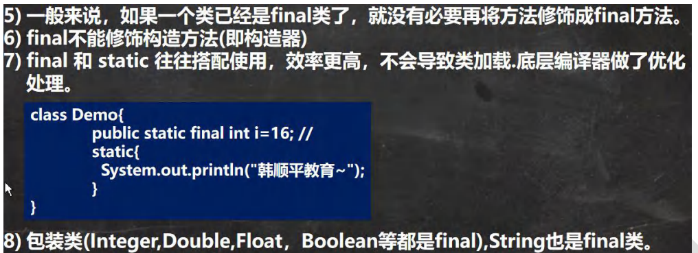

final 中文意思:最后的,最终的.

final 可以修饰类、属性、方法和局部变量.

在某些情况下,程序员可能有以下需求，就会**使用到final:**

1. 当不希望类被继承时,可以用final修饰。[案例演示]
2. 当不希望父类的某个方法被子类覆盖/重写(override)时,可以用final关键字修饰。案例演示: 访问修饰符 final 返回类型 方法名
3. 当不希望类的的某个属性的值被修改,可以用final修饰。[案例演示: public3final double TAX RATE=0.08]
4. 当不希望某个局部变量被修改，可以使用final修饰[案例演示: final doubleTAX RATE=0.08 

10.5.2 final 使用注意事项和细节讨论
1. final修饰的属性又叫常量,一般 用 XX XX XX 来命名
2. final修饰的属性在定义时,必须赋初值,并且以后不能再修改，赋值可以在如下位置之一[选择一个位置赋初值即可] : 

  - 定义时: 如 public final double TAX RATE=0.08.

  - 在构造器中

  - 在代码块中

3. 如果final修饰的属性是静态的，则初始化的位置只能是D 定义时 @ 在静态代码块 不能在构造器中赋值。
3. final类不能继承，但是可以实例化对象。[A2类]
3. 如果类不是final类，但是含有final方法，则该方法虽然不能重写，但是可以被继承。[A3类]

