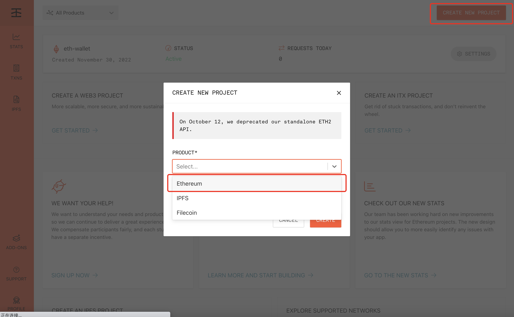
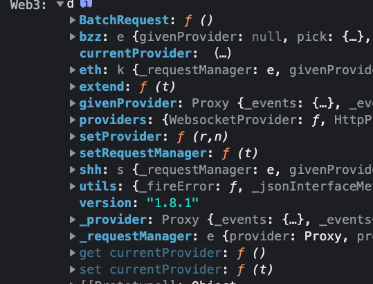
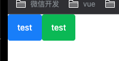
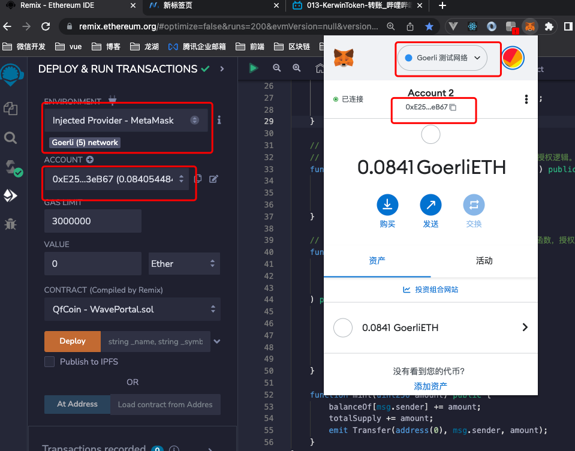
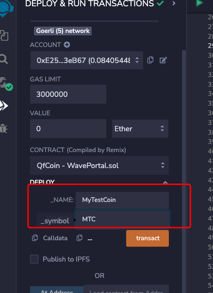
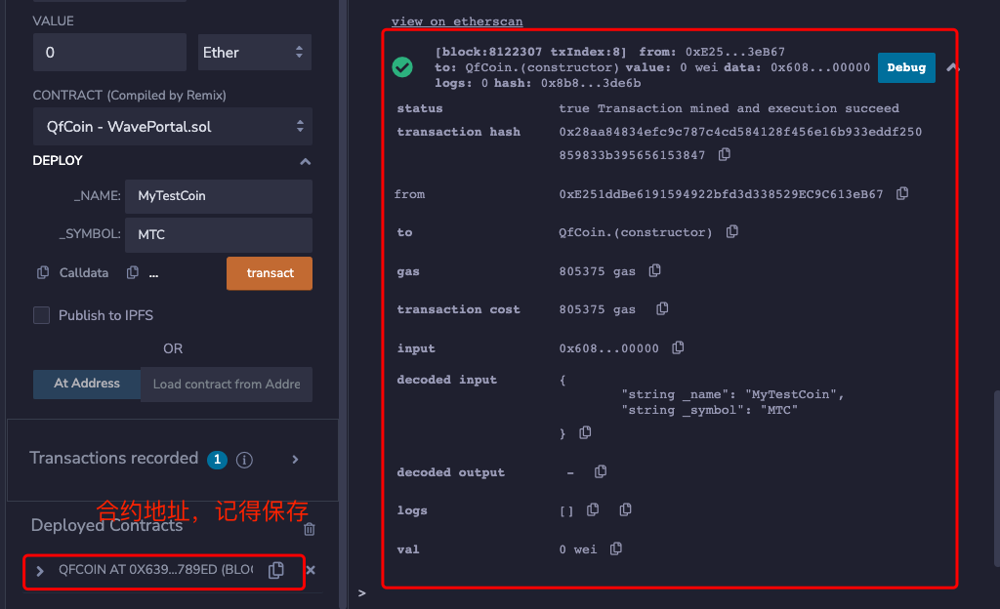
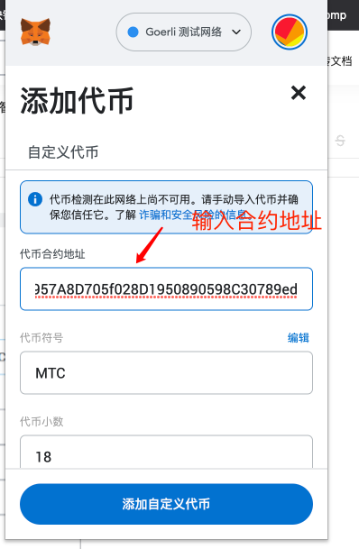
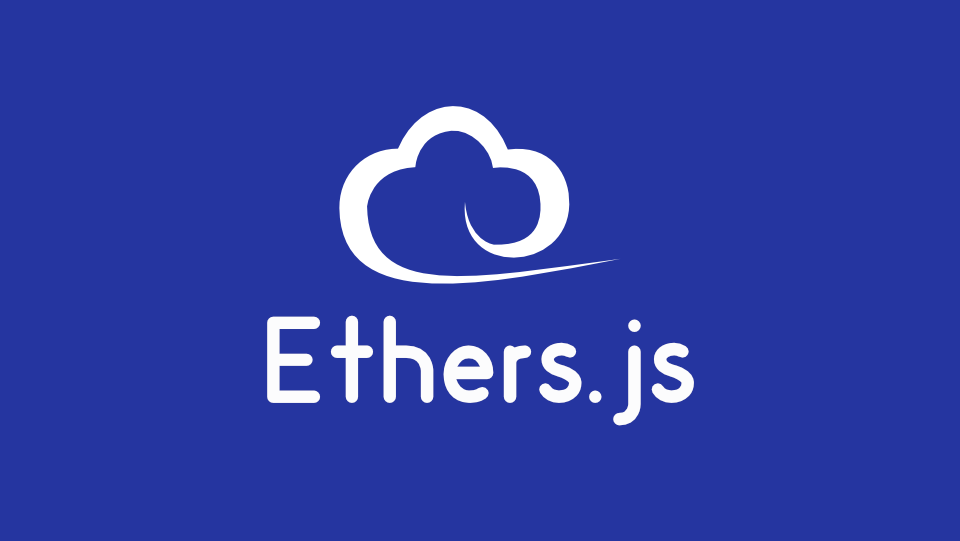

# web3连接到以太坊网络（测试网、主网）

1. 什么是web3
   web3是以太坊官方开提供的一个连接以太坊区块链的模块，允许您使用HTTP或IPC与本地或远程以太坊节点进行交互，它包含以太坊生态系统的几乎所有功能。web3模块主要连接以太坊暴露出来的RPC层。开发者利用web3连接RPC层，可以连接任何暴露了RPC接口的节点，从而与区块链交互。web3是一个集合库，支持多种开发语言使用wbe3，其中的JavaScript API叫做web3.js、另外还有web3.py、web3j，web3.js将是我们钱包开发项目的重点。

web3.eth：用于与以太坊区块链和智能合约之间的交互。

web3.utils：包含一些辅助方法。

web3.shh：用于协议进行通信的P2P和广播。

web3.bzz：用于与群网络交互的Bzz模块。

github地址：https://github.com/web3/web3.js/tree/v1.0.0-beta.34

web3.js开发文档：https://web3js.readthedocs.io/en/v1.8.1/

web3.js 中文文档 : https://learnblockchain.cn/docs/web3.js/

2. 实例化web3对象
   web3要与以坊节点进行交互，需要创建一个web3对象，下面看看如何创建。

``` javascript
var Web3 = require('web3');
// "Web3.providers.givenProvider" will be set if in an Ethereum supported browser.
var web3 = new Web3(Web3.givenProvider || 'ws://some.local-or-remote.node:8546');
```

根据API可知需要指定节点地址，我们将ws://some.local-or-remote.node:8546换成其它连接到以太坊网络的节点的地址，以此来确定连接的以太坊的网络。那么连接到以太坊网络的节点的地址是多少呢？这里我们需要使用到infura。

3. 获取连接到以太坊网络的节点地址
   infura提供公开的 Ethereum主网和测试网络节点，到infura.io网站注册后即可获取各个网络的地址。请按照如下步骤获取地址。

第一步：打开 infura网站地址：https://infura.io/dashboard，使用邮箱注册后登陆

第二步：点击上图标记的“create new project”按钮创建一个新项目。然后弹出如下弹框，在输入框输入项目名，如”MyEtherWallet“，然后点击“create project”按钮创建。



第三步：然后会显示如下界面，点击下图中的选择框，可以看到提供主网、Kovan测试网络、Ropsten测试网络、GoerLi测试网络的节点地址。


第四步：选择GoerLi测试网络，然后复制地址，将获取到类似这样的地址：https://kovan.infura.io/v3/d93f......cd67，如下。


4. 连接到以太坊GoerLi测试网络
   现在将复制的地址替换掉实例化web对象的地址，如下

``` javascript
var Web3 = require("web3")
var web3 = new Web3(Web3.givenProvider || 'wss://goerli.infura.io/ws/v3/cb7e63cf28244e4499b4b6fb6162e746');
console.log("Web3:", web3)

```

连接到以太坊主网与GoerLi测试网络一样的，只需复制主网节点的地址去实例化web3即可。由于在主网上交易需要花费gas，因此我们基于GoerLi测试网络进行开发，后续开发完成后可再切换到主网。



# Web3js 高频 Api

##  账号创建
1. 创建账号需要使用web3.js的如下API

API

```javascript
web3.eth.accounts.create([entropy]);
```


参数：

entropy - String (可选): 它是一个可选项，是一个随机字符串，将作为解锁账号的密码。如果没有传递字符串，则使用random生成随机字符串。

返回值：

Object：包含以下字段的一个帐户对象：

address- string：帐户地址。

privateKey- string：帐户私钥。前端永远不应该在localstorage中以未加密的方式共享或存储！

signTransaction(tx [, callback])- Function：签名交易的方法。

sign(data)- Function：签名二进制交易的方法。

例子

```javascript
web3.eth.accounts.create('2435@#@#@±±±±!!!!678543213456764321§34567543213456785432134567');
```

```javascript
web3.eth.accounts.create('2435@#@#@±±±±!!!!678543213456764321§34567543213456785432134567');
{
address: "0xF2CD2AA0c7926743B1D4310b2BC984a0a453c3d4",
privateKey: "0xd7325de5c2c1cf0009fac77d3d04a9c004b038883446b065871bc3e831dcd098",
signTransaction: function(tx){...},
sign: function(data){...},
encrypt: function(password){...}
}
```


2. 获取地址
   使用API`web3.eth.accounts.create()`创建了新账户后生成了一个账户对象，在该对象中拥有`addreds`属性，即账户的私钥。

``` javascript
let account = web3.eth.accounts.create("123456")
let address = account.address
//address：0xfF0B5A0AA68249cD161b606679DB49CBD9a12cd0

```

3.获取私钥

使用API`web3.eth.accounts.create()`创建了新账户后生成了一个账户对象，在该对象中拥有`privateKey`属性，即账户的私钥。

```javascript
let account = web3.eth.accounts.create()
let privateKey = account.privateKey
//privateKey:0x348ce564d427a3311b6536bbcff9390d69395b06ed6c486954e971d960fe8709
```

## 余额获取

根据地址获取以wei为单位余额

```javascript
web3.eth.getBalance(address).then((ret) => {
    console.log(ret)
});
```

## 单位转换

1. Eth 转为 wei

```javascript
# Web3 或者实例后的web3对象都可以
const num = Web3.utils.toWei("0.3");
const num = web3.utils.toWei("0.3");
console.log(num)
// 300000000000000000
```

2. wei 转为Eth

```javascript
# Web3 或者实例后的web3对象都可以
 this.balance = Web3.utils.fromWei(ret, "ether");
 this.balance = web3.utils.fromWei(ret, "ether");
```

## Eth转账

**API**

```js
web3.eth.sendSignedTransaction(signedTransactionData [, callback])
```

**参数**

- `signedTransactionData`-`String`：以HEX格式签名的交易数据。

  交易数据对象可以包含如下字段：

  - `from`- `String|Number`：发送帐户的地址。如果未指定，则使用web3.eth.defaultAccount属性。或web3.eth.accounts.wallet中本地钱包的地址。
  - `to`- `String`:(可选）消息的目标地址，若未定义则为合同发送消息。
  - `value`- `Number|String|BN|BigNumber`:(可选）为wei中的交易转移的数量，如果是合约发送消息，则是捐赠给合约地址。
  - `gas` - `Number`:(可选，默认：待定）用于交易的gas（未使用的gas会退还）。
  - `gasPrice`- `Number|String|BN|BigNumber`:(可选）此交易的gas价格，以wei为单位，默认为[web3.eth.gasPrice](https://web3js.readthedocs.io/en/1.0/web3-eth.html#eth-gasprice)。
  - `data`- `String`:(可选）包含合同上函数调用数据的[ABI字节字符串](http://solidity.readthedocs.io/en/latest/abi-spec.html)。
  - `nonce`- `Number`:(可选）随机数的整数。

- `callback`-`Function`：（可选）可选回调，将错误对象作为第一个参数返回，结果作为第二个参数返回。

**返回**

`PromiEvent`：promise组合的事件，将在交易完成时调用。包含以下事件

- `"transactionHash"`返回`String`：在发送事务并且事务哈希可用之后立即触发。
- `"receipt"`返回`Object`：在交易确认时触发。
- `"confirmation"`返回`Number`，`Object`：每次确认都会被调用，直到第12次确认。接收确认编号作为第一个参数，将数据作为第二个参数。
- `"error"`返回`Error`：如果在发送过程中发生错误，则会触发。

1. 构建转账参数

   区块链转账和支付宝转账类似，需要 `发送方` 、`接收方`、`金额`、`密码`

   另外需要添加部分区块链参数：`矿工费gas`、`地址转账交易次数`

   ```javascript
        // 获取账户交易次数
         let nonce = await web3.eth.getTransactionCount(fromaddress);
         // 获取预计转账gas费
         let gasPrice = await web3.eth.getGasPrice();
         // 转账金额以wei为单位
         let balance = await web3.utils.toWei(number);
         var rawTx = {
           from: fromaddress,
           nonce: nonce,
           gasPrice: gasPrice,
           to: toaddress,
           value: balance,
           data: "0x00", //转Token代币会用到的一个字段
         };
   ```

2. 通过转账参数计算最终gas费用，并将通过私钥将转账参数进行编码加密

   > ethereumjs-tx 第三方库请选择1.3.7版本

   ```javascript
   import Tx from "ethereumjs-tx";  
   // 将私钥去除“ox”后进行hex转化
         var privateKey = new Buffer(privatekey.slice(2), "hex");
         //需要将交易的数据进行预估gas计算，然后将gas值设置到数据参数中
         let gas = await web3.eth.estimateGas(rawTx);
         rawTx.gas = gas;
        // 通过 ethereumjs-tx 实现私钥加密Ï
         var tx = new Tx(rawTx);
         tx.sign(privateKey);
         var serializedTx = tx.serialize();
   ```

3. 通过 `sendSignedTransaction` api发送转账交易，并且获取交易id

```javascript
      
      web3.eth
        .sendSignedTransaction("0x" + serializedTx.toString("hex"))
        .on("transactionHash", (txid) => {
          console.log("交易成功,请在区块链浏览器查看");
          console.log("交易id", txid);
          console.log(`https://goerli.etherscan.io/tx/${txid}`);
        })
        // .on('receipt', (ret)=>{console.log('receipt')})
        // .on('confirmation', (ret)=>{console.log('confirmation')})
        .on("error", (err) => {
          console.log("error:" + err);
        });
```

4. 区块链浏览器或者目标钱包产看转账结果

   goerli区块链浏览器 https://goerli.etherscan.io/tx/交易id

# 账户系统

## 简介

> 在前面的教程中我们对以太坊钱包已经有了一定的认识，上一章也重点介绍了账号地址的生成过程，在以太坊钱包中一个重点就是账户系统，在这个模块中很多初学同学不是很清楚密码、keystore、助记词与私钥它们之间的关系。下面我们来看看它们之间到底有着怎样的爱恨情仇，让大家琢磨不透。

`密码`

密码不是私钥，它是在创建账户时候的密码（可以修改）

密码在以下情况下会使用到：

1. 作为转账的支付密码
2. 用keystore导入钱包的时候需要输入的密码，用来解锁keystore的

`私钥 Private Key`

私钥由64位长度的十六进制的字符组成，比如：`0xA4356E49C88C8B7AB370AF7D5C0C54F0261AAA006F6BDE09CD4745CF54E0115A`，一个账户只有一个私钥且不能修改。
通常一个钱包中私钥和公钥是成对出现的，有了私钥，我们就可以通过一定的算法生成公钥，再通过公钥经过一定的算法生成地址，这一过程都是不可逆的。私钥一定要妥善保管，若被泄漏别人可以通过私钥解锁账号转出你的该账号的数字货币。

`公钥 Public Key`

公钥(Public Key)是和私钥成对出现的，和私钥一起组成一个密钥对，保存在钱包中。公钥由私钥生成，但是无法通过公钥倒推得到私钥。公钥能够通过一系列算法运算得到钱包的地址，因此可以作为拥有这个钱包地址的凭证。

`Keystore`

Keystore常见于以太坊钱包，它是将私钥以加密的方式保存为一份 JSON 文件，这份 JSON 文件就是 keystore，所以它就是加密后的私钥。Keystore必须配合钱包密码才能导入并使用该账号。当黑客盗取 Keystore 后，在没有密码情况下, 有可能通过暴力破解 Keystore 密码解开 Keystore，所以建议使用者在设置密码时稍微复杂些，比如带上特殊字符，至少 8 位以上，并安全存储。

`助记词 Mnemonic`

私钥是64位长度的十六进制的字符，不利于记录且容易记错，所以用算法将一串随机数转化为了一串12 ~ 24个容易记住的单词，方便保存记录。注意：

1. 助记词是私钥的另一种表现形式
2. 助记词=私钥，这是不正确的说法，通过助记词可以获取相关联的多个私钥，但是通过其中一个私钥是不能获取助记词的，因此**助记词≠私钥**。

BIP

要弄清楚助记词与私钥的关系，得清楚BIP协议，是`Bitcoin Improvement Proposals`的缩写，意思是Bitcoin 的改进建议，用于提出 Bitcoin 的新功能或改进措施。BIP协议衍生了很多的版本，主要有BIP32、BIP39、BIP44。

**BIP32**

BIP32是 HD钱包的核心提案，通过种子来生成主私钥，然后派生海量的子私钥和地址，种子是一串很长的随机数。

**BIP39**

由于种子是一串很长的随机数，不利于记录，所以我们用算法将种子转化为一串12 ~ 24个的单词，方便保存记录，这就是BIP39，它扩展了 HD钱包种子的生成算法。

**BIP44**

BIP44 是在 BIP32 和 BIP43 的基础上增加多币种，提出的层次结构非常全面，它允许处理多个币种，多个帐户，每个帐户有数百万个地址。

在BIP32路径中定义以下5个级别：

```
m/purpse'/coin_type'/account'/change/address_index
```

- purpose：在BIP43之后建议将常数设置为44'。表示根据BIP44规范使用该节点的子树。
- Coin_type：币种，代表一个主节点（种子）可用于无限数量的独立加密币，如比特币，Litecoin或Namecoin。此级别为每个加密币创建一个单独的子树，避免重用已经在其它链上存在的地址。开发人员可以为他们的项目注册未使用的号码。
- Account：账户，此级别为了设置独立的用户身份可以将所有币种放在一个的帐户中，从0开始按顺序递增。
- Change：常量0用于外部链，常量1用于内部链，外部链用于钱包在外部用于接收和付款。内部链用于在钱包外部不可见的地址，如返回交易变更。
- Address_index：地址索引，按顺序递增的方式从索引0开始编号。

BIP44的规则使得 HD钱包非常强大，用户只需要保存一个种子，就能控制所有币种，所有账户的钱包，因此由BIP39 生成的助记词非常重要，所以一定安全妥善保管，那么会不会被破解呢？如果一个 HD 钱包助记词是 12 个单词，一共有 2048 个单词可能性，那么随机的生成的助记词所有可能性大概是`5e+39`，因此几乎不可能被破解。

`HD钱包`

通过BIP协议生成账号的钱包叫做HD钱包。这个HD钱包，并不是Hardware Wallet硬件钱包，这里的 HD 是`Hierarchical Deterministic`的缩写，意思是分层确定性，所以HD钱包的全称为比特币分成确定性钱包 。

## 密码、私钥、keystore与助记词的关系


## 钱包的核心：私钥

基于以上的分析，我们对以太坊钱包的账号系统有了一个很好的认识，那么我们在使用钱包的过程中，该如何保管自己的钱包呢？主要包含以下几种方式：

- 私钥（Private Key）
- Keystore+密码（Keystore+Password）
- 助记词（Mnemonic code）

通过以上三种中的一种方式都可以解锁账号，然后掌控它，所以对于每种方式中的数据都必须妥善包括，如有泄漏，请尽快转移数字资产。

我们可以得到以下总结：

- 通过私钥+密码可以生成keystore，即加密私钥；
- 通过keystore+密码可以获取私钥，即解密keystore。
- 通过助记词根据不同的路径获取不同的私钥，即使用HD钱包将助记词转化成种子来生成主私钥，然后派生海量的子私钥和地址。

可以看出这几种方式的核心其实都是为了获得私钥，然后去解锁账号，因此钱包的核心功能是私钥的创建、存储和使用。

**参考资料**

https://web3js.readthedocs.io/en/1.0/web3-eth-accounts.html
https://github.com/bitcoin/bips/blob/master/bip-0032.mediawiki
https://github.com/bitcoin/bips/blob/master/bip-0044.mediawiki
https://github.com/ethereum/EIPs/issues/84
https://github.com/ethereum/EIPs/issues/85

## 创建账户

> 从无到有创建一个新的账户

### web3 直接创建账户

```javascript
web3.eth.accounts.create('2435@#@#@±±±±!!!!678543213456764321§34567543213456785432134567');
```

### 助记词 创建账户

需要使用`bip39`协议将助记词转换成种子，再通过`ethereumjs-wallet`库生成hd钱包，根据路径的不同从hd钱包中获取不同的keypair，keypair中就包含有公钥、私钥，再通过`ethereumjs-util`库将公钥生成地址，从而根据助记词获取所有关联的账号，能获取到公钥、私钥、地址等数据信息。

#### 1. 依赖库

需要用到三个库：bip39、ethereumjs-wallet/hdkey、ethereumjs-util。先安装依赖库，`cd`到项目跟路径运行命令`npm i bip39 ethereumjs-wallet ethereumjs-util`。

- [bip39](https://github.com/bitcoinjs/bip39)：随机产生新的 mnemonic code，并可以将其转成 binary 的 seed。
- [ethereumjs-wallet](https://github.com/ethereumjs/ethereumjs-wallet)：生成和管理公私钥，下面使用其中 hdkey 子套件来创建 HD 钱包。
- [ethereumjs-util](https://github.com/ethereumjs/ethereumjs-util)：Ethereum 的一个工具库。
- https://iancoleman.io/bip39/

#### 2. 通过助记词创建账号

* 创建助记词

  ```javascript
  // 引入bip39模块
  import * as bip39 from "bip39";
  // 创建助记词 
  let mnemonic = bip39.generateMnemonic();
  console.log(mnemonic);
  // 结果 12位助记词
  // vote select solar shy embrace immense lizard stamp scrub vague negative forward
  ```

* 根据助记词生成密钥对 keypair

```javascript
      // 导入分层钱包模块
import { hdkey } from "ethereumjs-wallet";
      //1.将助记词转成seed
      let seed = await bip39.mnemonicToSeed("12位助记词");
      //3.通过hdkey将seed生成HD Wallet
      let hdWallet = hdkey.fromMasterSeed(seed);
      //4.生成钱包中在m/44'/60'/0'/0/i路径的keypair
      let keypair = hdWallet.derivePath("m/44'/60'/0'/0/0");
      console.log(keypair);
     
```

keypair 密钥对


#### 3. 由keypair 获取钱包地址和私钥

```javascript
// 获取钱包对象
let wallet = keypair.getWallet();
// 获取钱包地址
let lowerCaseAddress = wallet.getAddressString();
// 获取钱包校验地址
let CheckSumAddress = wallet.getChecksumAddressString();
// 获取私钥
let prikey = wallet.getPrivateKey().toString("hex");
 console.log("lowerCaseAddress", lowerCaseAddress);
 console.log("CheckSumAddress", CheckSumAddress);
 console.log("prikey", prikey);
/*
lowerCaseAddress 0xd9fc0fd4412616c7075e68b151ab3a7bcb9a3f54
CheckSumAddress 0xd9fC0FD4412616c7075E68b151ab3A7bcB9A3f54
prikey 3fc11495517f1f015bbcb6c311da66e3b26b23e4c91c1285ccc4b69d9d274002
*/
```

##  导出账户

> 一个已经存在的账户导出 私钥 和 keystore

1. 通过分层钱包对象 + 密码 创建keystore

```javascript
  let keystore = await wallet.toV3(data.pass1); // 参数必须为 字符串
```

2. 通过私钥和密码创建 keystore 

``` javascript
const keystore = await web3.eth.accounts.encrypt("账户私钥","密码");
```

```javascript
// 模拟keystore数据
const keystoreJsonV3 = {
        version: 3,
        id: "dbb70fb2-52ad-4e1f-9c19-0b50329f89c3",
        address: "445b469888528dacd9b87246c5ce70407adaa411",
        crypto: {
          ciphertext:
            "1e53e7e775644422600188b8134907992db40d278064ea3a966da4dcdf80db64",
          cipherparams: { iv: "f9d2b047019674eee449b316f4a21491" },
          cipher: "aes-128-ctr",
          kdf: "scrypt",
          kdfparams: {
            dklen: 32,
            salt: "153e074d78d0ba36fae3e46e582c42e53f61653cb5d4f1a3a3f68094e6ca0160",
            n: 8192,
            r: 8,
            p: 1,
          },
          mac: "e91456c59b2505c16b80c2495ab7b4633273c2ae366cb6953f27de8cfebad629",
        },
      };
 const res = web3.eth.accounts.decrypt(keystoreJsonV3, "1235");
 console.log(res);
```

3. 通过keystore解密私钥

```javascript
import ethwallet from "ethereumjs-wallet";  
   let pass = prompt("请输入密码");
       let wallet;
       try {
         wallet = await ethwallet.fromV3(keystore, pass);
       } catch (error) {
         alert("密码错误");
         return false;
       }
   let key = wallet.getPrivateKey().toString("hex");
```


## 导入账户

> 通过 私钥、助记词、keystore 导入一个已经存在的钱包账户 地址 和 私钥

1. 通过keystore获取 私钥和地址 

```javascript
import ethwallet from "ethereumjs-wallet";  
   let pass = prompt("请输入密码");
       let wallet;
       try {
         wallet = await ethwallet.fromV3(keystore, pass);
       } catch (error) {
         alert("密码错误");
         return false;
       }
let key = wallet.getPrivateKey().toString("hex");
let address = wallet.getAddressString()
```

2. 通过助记词 获取地址和私钥

```javascript
let mnemonic=prompt("请输入助记词")
let seed = bip39.mnemonicToSeed(mnemonic)
let hdwallet = hdkey.fromMasterSeed(seed)
let keypair = hdWallet.derivePath("m/44'/60'/0'/0/0");
// 获取钱包对象
let wallet = keypair.getWallet();
// 获取钱包地址
let lowerCaseAddress = wallet.getAddressString();
// 获取钱包校验地址
let CheckSumAddress = wallet.getChecksumAddressString();
// 获取私钥
let prikey = wallet.getPrivateKey().toString("hex");
```

3. 通过私钥获取 地址

   ```javascript
   import ethwallet from "ethereumjs-wallet";     
   let privatekey=new Buffer( prompt("请输入私钥"), 'hex' )
   let wallet = ethwallet.fromPrivateKey(privatekey)
   // 获取钱包地址
   let lowerCaseAddress = wallet.getAddressString();
   ```

# 区块链钱包项目流程


### 1.项目准备

​         直接采用随堂demo创建的项目 不需要重新创建

#### web3相关第三方包

```bash
npm install web3 bip39 ethereumjs-tx@1.3.7 ethereumjs-util ethereumjs-wallet
```

> 注： ethereumjs-tx 使用1.3.7 版本

#### node-polyfill 兼容文件配置

1. 下载polyfill 插件

   ```bash
   npm install node-polyfill-webpack-plugin -D 
   ```

2. 在vue.config.js 文件中配置插件

   ```javascript
   const { defineConfig } = require('@vue/cli-service')
   // 引入插件
   ++ const NodePolyfillWebpackPlugin = require("node-polyfill-webpack-plugin");
   module.exports = defineConfig({
     transpileDependencies: true,
   ++  configureWebpack: {
   ++    plugins: [
   ++      new NodePolyfillWebpackPlugin()
       ],
     },
   })
   
   ```

#### 配置vant-ui ui组件库

https://vant-contrib.gitee.io/vant/#/zh-CN

1. 安装

```bash
$ npm i vant
$ npm i unplugin-vue-components -D
```

2. 在vue.config.js 文件中配置插件

```javascript
const { defineConfig } = require("@vue/cli-service");
// 引入插件
const NodePolyfillWebpackPlugin = require("node-polyfill-webpack-plugin");
// vant
++ const { VantResolver } = require('unplugin-vue-components/resolvers');
++ const ComponentsPlugin = require('unplugin-vue-components/webpack');
module.exports = defineConfig({
  transpileDependencies: true,
  configureWebpack: {
    plugins: [
      new NodePolyfillWebpackPlugin(),
++    ComponentsPlugin({ resolvers: [VantResolver()]}),
    ],
  },
});

```

3. 测试 在app.vue文件添加代码

```vue
<template>
 <van-button type="primary">test</van-button>
 <van-button type="success">test</van-button>
</template>
```



#### 通过vw配置响应式

https://www.cnblogs.com/hongrun/p/16130707.html

1. 安装

```bash
npm install postcss-px-to-viewport -D 
```

2. 在根目录下创建 名为 `postcss.config.js` 文件

```javascript
module.exports = {
  plugins: {
    "postcss-px-to-viewport": {
      unitToConvert: "px", // 要转化的单位
      viewportWidth: 375, // UI设计稿的宽度
      unitPrecision: 6, // 转换后的精度，即小数点位数
      propList: ["*"], // 指定转换的css属性的单位，*代表全部css属性的单位都进行转换
      viewportUnit: "vw", // 指定需要转换成的视窗单位，默认vw
      fontViewportUnit: "vw", // 指定字体需要转换成的视窗单位，默认vw      selectorBlackList: ["wrap"], // 指定不转换为视窗单位的类名，
      minPixelValue: 1, // 默认值1，小于或等于1px则不进行转换
      mediaQuery: true, // 是否在媒体查询的css代码中也进行转换，默认false
      replace: true, // 是否转换后直接更换属性值
      exclude: [/node_modules/], // 设置忽略文件，用正则做目录名匹配
    },
  },
};
```

#### 封装缓存函数 

整个项目为了保证钱包的安全性，所有账户相关的操作，不经过中心化服务器，只在缓存使用

在这里可以参考`webstorage`增加过期时间，cookie 等的封装

创建 src/utils/storage.js 文件

```js
class Storage {
  setItem(key, val) {
    localStorage.setItem(key, JSON.stringify(val || ""));
  }
  getItem(key) {
    let val;
    try {
      val = JSON.parse(localStorage.getItem(key));
    } catch {
      val = null;
    }
    return val;
  }
}
export default new Storage();
```

####  app.vue 文件引入

在app.vue 引入文件并且初始化web3.js

```vue
<template>
  <div class="app">
   <h3> qf - eth -wallet</h3>
  </div>
</template>
<script setup>
// import * as util from "ethereumjs-util";
import ethwallet from "ethereumjs-wallet";  
import { hdkey } from "ethereumjs-wallet";
import * as bip39 from "bip39";
import Tx from "ethereumjs-tx";
import Web3 from "web3";
import storage from "@/utils/storage";
var web3 = new Web3(
  Web3.givenProvider ||
    "https://goerli.infura.io/v3/e4f789009c9245eeaad1d93ce9d059bb"
);

</script>

```


###  2.通过Mnemonic助记词创建钱包

>  判断缓存是否有 钱包对象
>
> 1. 有钱包对象显示钱包信息  地址 私钥  余额
> 2. 没有钱包对象显示创建钱包按钮

```vue
<template>
  <div class="app">
    <h3>qf - eth -wallet</h3>
    <h4>创建钱包</h4>
    <van-button type="primary" @click="createWallet"> 创建钱包 </van-button>
    <van-button type="primary" @click="importWallet">
      导入钱包-助记词
    </van-button>
    <h4>钱包信息</h4>
    {{ wallet }}
  </div>
</template>
<script setup>

// import * as util from "ethereumjs-util";
import ethwallet from "ethereumjs-wallet";
import { hdkey } from "ethereumjs-wallet";
import * as bip39 from "bip39";
import Tx from "ethereumjs-tx";
import storage from "@/utils/storage";
import Web3 from "web3";
import { reactive } from "vue";
var web3 = new Web3(
  Web3.givenProvider ||
    "https://goerli.infura.io/v3/e4f789009c9245eeaad1d93ce9d059bb"
);
const wallet = reactive(storage.getItem("wallet") || {});
console.log(wallet);
async function createWallet() {
  const pass = prompt("请输入您的钱包密码");
  if (!pass) return false;
  let mnemonic = bip39.generateMnemonic();
  alert("您的助记词为:" + mnemonic);
  const checkMnemonic = prompt("请输入您的助记词");
  if (mnemonic === checkMnemonic) {
    //1.将助记词转成seed
    let seed = await bip39.mnemonicToSeed(mnemonic);
    //3.通过hdkey将seed生成HD Wallet
    let hdWallet = hdkey.fromMasterSeed(seed);
    //4.生成钱包中在m/44'/60'/0'/0/i路径的keypair
    let keyPair = hdWallet.derivePath("m/44'/60'/0'/0/0");
    // 获取钱包对象
    let wallet = keyPair.getWallet();
    // 获取钱包地址
    let lowerCaseAddress = wallet.getAddressString();
    // 获取钱包校验地址
    let CheckSumAddress = wallet.getChecksumAddressString();
    // 获取私钥
    let prikey = wallet.getPrivateKey().toString("hex");
    let keystore = await wallet.toV3(pass);
    console.log(keystore);
    // 保存钱包信息
    const walletInfo = {
      address: lowerCaseAddress,
      prikey,
      keystore,
      balance: 0,
      mnemonic, // 助记词不应该记录下来仅仅是为了便于演示
    };
    storage.setItem("wallet", walletInfo);
    wallet = walletInfo;
  } else {
    alert("助记词错误请重新输入");
  }
}

</script>

```

### 3.显示余额

```javascript
const balance = ref("0");

// 获取余额
async function getBalance() {
  if(!wallet.address) return false;
  // 根据地址查询余额
  web3.eth.getBalance(wallet.address).then((ret) => {
    balance.value = web3.utils.fromWei(ret, "ether");
  });
}
getBalance()
```

### 4.转账交易

```javascript
1. 获取用户输入金额 与 地址 
2. 调用send 方法

async function send() {
  const keystore = storage.getItem("wallet").keystore;
  let pass = prompt("请输入密码");
  let walletobj;
  try {
    walletobj = await ethwallet.fromV3(keystore, pass);
  } catch (error) {
    alert("密码错误");
    return false;
  }
  let key = walletobj.getPrivateKey().toString("hex");
  var privateKey = new Buffer(key, "hex");
  // console.log(privateKey);
  const fromaddress = wallet.address;
  // 获取账户交易次数
  let nonce = await web3.eth.getTransactionCount(fromaddress);
  // 获取预计转账gas费
  let gasPrice = await web3.eth.getGasPrice();
  // 转账金额以wei为单位
  console.log(number.value, typeof number.value);
  let balance = Web3.utils.toWei(number.value);
  console.log(222);
  var rawTx = {
    from: fromaddress,
    nonce: nonce,
    gasPrice: gasPrice,
    to: toaddress.value,
    value: balance,
    data: "0x00", //转Token代币会用到的一个字段
  };

  //需要将交易的数据进行预估gas计算，然后将gas值设置到数据参数中
  let gas = await web3.eth.estimateGas(rawTx);
  rawTx.gas = gas;
  // 通过 ethereumjs-tx 实现私钥加密Ï
  var tx = new Tx(rawTx);
  tx.sign(privateKey);
  var serializedTx = tx.serialize();

  web3.eth
    .sendSignedTransaction("0x" + serializedTx.toString("hex"))
    .on("transactionHash", (txid) => {
      console.log("交易成功,请在区块链浏览器查看");
      console.log("交易id", txid);
      console.log(`https://goerli.etherscan.io/tx/${txid}`);
    })
    // .on('receipt', (ret)=>{console.log('receipt')})
    // .on('confirmation', (ret)=>{console.log('confirmation')})
    .on("error", (err) => {
      console.log("error:" + err);
    });
}
```


### 5.导出账户信息

* 导出私钥

```javascript
async function exportKey() {
  let pass = prompt("请输入密码");
       let walletObj;
       try {
        walletObj = await ethwallet.fromV3(wallet.keystore, pass);
       } catch (error) {
         alert("密码错误");
         return false;
       }
   let key = walletObj.getPrivateKey().toString("hex");
   alert(key)
}
```

* 导出keystore 

```javascript
缓存对象
function exportKeyStore() {
  alert(JSON.stringify(wallet.keystore))
}
```


### 6.解锁账户信息

* 助记词解锁

  ``` javascript
  添加助记词导入钱包方法
  async function importWallet() {
    const mnemonic = prompt("请输入助记词");
    const pass = prompt("请输入您的钱包密码");
    if (!pass) return false;
      //1.将助记词转成seed
      let seed = await bip39.mnemonicToSeed(mnemonic);
      //3.通过hdkey将seed生成HD Wallet
      let hdWallet = hdkey.fromMasterSeed(seed);
      //4.生成钱包中在m/44'/60'/0'/0/i路径的keypair
      let keyPair = hdWallet.derivePath("m/44'/60'/0'/0/0");
      // 获取钱包对象
      let wallet = keyPair.getWallet();
      // 获取钱包地址
      let lowerCaseAddress = wallet.getAddressString();
      // 获取钱包校验地址
      let CheckSumAddress = wallet.getChecksumAddressString();
      // 获取私钥
      let prikey = wallet.getPrivateKey().toString("hex");
      let keystore = await wallet.toV3(pass);
      console.log(keystore);
      // 保存钱包信息
      const walletInfo = {
        address: lowerCaseAddress,
        prikey,
        keystore,
        balance: 0,
        mnemonic, // 助记词不应该记录下来仅仅是为了便于演示
      };
      storage.setItem("wallet", walletInfo);
      wallet = walletInfo;
    }
  ```

  

* 私钥解锁

```javascript
async function importByPrivateKey() { 
  const key = prompt("请输入私钥")
	let privatekey=new Buffer(key , 'hex' )
  let pass =  prompt("请输入密码");
	let wallet = ethwallet.fromPrivateKey(privatekey)
  let keystore = await wallet.toV3(pass);
  // 获取钱包地址
  let lowerCaseAddress = wallet.getAddressString();
  const walletInfo = {
      address: lowerCaseAddress,
      prikey: key,
      keystore,
      balance: 0,
    };
    console.log(walletInfo)
    storage.setItem("wallet", walletInfo);
}
```

1. 未来展望
   * 通过uniapp 、rn、electron 将项目变为app和桌面端应用
   * app添加扫码转账功能
   * 增加erc20代币转账功能
   * 增加nft数字藏品商城功能
   * 增加Dao 应用

# 智能合约

1. 通过智能合约文件 获取abi

   ```javascript
   import { abi } from "@/contract/HHC.json";
   ```

2. 在web3实例的基础上创建智能合约实例

```javascript
const hhc = new this.web3.eth.Contract(
  abi,
  "0x18dAaC8e2E422fDB5e26715eF1EcDca11F78eDE5"
);
```

3. 通过智能合约实例获取代币余额

```javascript
 let num = await hhc.methods.balanceOf(address).call();
Web3.utils.fromWei(num, "ether");
```

4. 智能合约交易hash 创建

```javascript
 async createCoinTransationHx(contractInstance, method, to, value) {
    let pass = prompt("请输入密码");
    let wallet;
    try {
      wallet = await ethwallet.fromV3(keystore, pass);
    } catch (error) {
      alert("密码错误");
      return false;
    }
    let key = wallet.getPrivateKey().toString("hex");
    const from = this.ownerAddress;
    // 当前地址交易次数
    const nonce = await this.instance.eth.getTransactionCount(from);
    var privateKey = new Buffer(key, "hex");
    // 获取预计转账gas费
    let gasPrice = await this.instance.eth.getGasPrice();
    // 转账金额以wei为单位
    let weiValue = await Web3.utils.toWei(value);
    // 转账的记录对象
    // 代币转账
    // this.HccCont = new this.web3.eth.Contract(
    //   abi,
    //   "0x18dAaC8e2E422fDB5e26715eF1EcDca11F78eDE5"
    // );
    const contractAbi = await contractInstance.methods[method](
      to,
      weiValue
    ).encodeABI();
    // console.log(contractAbi);
    // console.log(contractInstance._address);
    // return false;
    var rawTx = {
      from: this.ownerAddress,
      nonce: nonce,
      gasPrice: gasPrice,
      to: contractInstance._address, //eth 转账 to 目标地址 ，智能合约 to 智能合约地址
      value: 0, //eth 转账 数量
      data: contractAbi, //智能合约方法的abi编码
    };
    //需要将交易的数据进行预估gas计算，然后将gas值设置到数据参数中
    let gas = await this.instance.eth.estimateGas(rawTx);
    rawTx.gas = gas;
    // 通过tx实现交易对象的加密操作
    var tx = new Tx(rawTx);
    tx.sign(privateKey);
    var serializedTx = tx.serialize();
    var transationHx = "0x" + serializedTx.toString("hex");
    return transationHx;
  }
```


4. 智能合约代币转账

   ```javascript
   this.web3.eth
         .sendSignedTransaction(hx)
         .on("transactionHash", (txid) => {
           console.log("交易成功,请在区块链浏览器查看");
           console.log("交易id", txid);
           console.log(`https://goerli.etherscan.io/tx/${txid}`);
         })
         .on("receipt", (ret) => {
           cb && cb(ret);
           console.log("receipt", ret);
           const { transactionHash } = ret;
           this.createOrderData(transactionHash);
         })
         .on("latestBlockHash", (...arg) => {
           console.log("latestBlockHash", arg);
         })
         .on("error", (err) => {
           console.log("error:");
           console.log(err);
         });
   ```

   


# 什么是ERC

ERC 全称是“Ethereum Request for Comment”，表示以太坊的意见征求稿，ERC 中包含技术和组织等注意事项及标准。这套标准其实不光由以太坊官方提出，还由一些以太坊爱好者提出。是以太坊生态系统中被广泛使用的关键标准。

##  代币(token)标准

- [ERC-20](https://ethereum.org/zh/developers/docs/standards/tokens/erc-20/) - 同质化（可互换）代币的标准接口，比如投票代币、质押代币或虚拟货币。
- [ERC-721](https://ethereum.org/zh/developers/docs/standards/tokens/erc-721/) - 非同质化代币的标准接口，比如艺术作品或歌曲的契约。
- [ERC-777](https://ethereum.org/zh/developers/docs/standards/tokens/erc-777/) - 关于 ERC-20 的代币标准改进。
- [ERC-1155](https://ethereum.org/zh/developers/docs/standards/tokens/erc-1155/) - 一个能包括同质化和非同质化资产的代币标准。

## ERC-20 代币

`千言万语汇成一句话：造钱`

> 什么叫做代币  代替货币 

代币可以在以太坊中表示任何东西：

- 在线平台中的信誉积分
- 游戏中一个角色的技能
- 彩票
- 金融资产类似于公司股份的资产
- 像美元一样的法定货币
- 一克黄金
- 以及更多

> ERC-20以太坊代币标准是创建与更广泛的以太坊网络兼容的可替换代币的蓝图。以太坊，或称Ethereum，是一种加密货币，允许创建各种应用，包括代币，与大多数传统应用不同，它不需要中心化服务机构就可以运作。
>
> 简单来说，**ERC-20**就是一套**基于以太坊网络的标准代币发行协议**。有了ERC-20，**开发者们得以高效、可靠、低成本地创造专属自己项目的代币；**我们甚至可以将ERC-20视为以太坊网络为早期区块链世界做出的最重要贡献，也是以太坊网络第一个真正意义上的杀手级应用。

如果我们把众多区块链项目的开发者，看作是在一个小区门口商铺里，经营不同业态的众多商户。这些商户根据自己的专长提供各自不同的商品和服务，也都希望发行自己店铺专属的消费储值卡。方便消费者光顾的同时，也能提升用户的体验和粘性

以太坊就像是运营这个小区底商的物业公司，它提供一整套标准化的储值卡发放协议和配套服务。借助这套叫做ERC-20的整体解决方案，每个商户（开发者）都可以傻瓜式地发行专属于自己店铺的消费储值卡，同时由于这种储值卡采用了统一的协议，可以非常方便地和其他商户的储值卡做无缝兑换。

于是借助ERC-20，用户可以通过持有其中一种储值卡（token）很方便地享受整个生态的各种服务；商户（开发者）则节约了开发运营成本、同时提升了获取用户的效率；而物业公司（以太坊基金会和矿工）则可以通过做大生态体量实现更多的租金（ETH增值）和储值卡结算手续费（Gas费用）收入。

ERC-20就是用这种做大生态价值的方式，实现了用户、开发者和以太坊网络三方面的共赢。

***ERC-20的应用案例***

为了让你对ERC-20有更具象化的认识，这里援引 [Alyssa Hertig](https://link.zhihu.com/?target=https%3A//www.coindesk.com/author/alyssa.hertig) 在 [What is the ERC-20 Ethereum Token Standard?](https://link.zhihu.com/?target=https%3A//www.coindesk.com/tech/2021/02/09/what-is-the-erc-20-ethereum-token-standard/) 中列举的一些比较知名的基于ERC-20协议代币：

> Tether (USDT)
> [Chainlink](https://link.zhihu.com/?target=https%3A//www.coindesk.com/tech/2021/02/09/what-is-the-erc-20-ethereum-token-standard/) (LINK)
> Binance coin (BNB)
> [USD coin](https://link.zhihu.com/?target=https%3A//www.coindesk.com/tech/2021/02/09/what-is-the-erc-20-ethereum-token-standard/) (USDC)
> Wrapped bitcoin (WBTC)
> [Dai](https://link.zhihu.com/?target=https%3A//www.coindesk.com/tech/2021/02/09/what-is-the-erc-20-ethereum-token-standard/) (DAI)

需要特别指出的是，这上面提到的Tether发行的稳定币USDT除了基于ERC-20协议的版本之外，其实还有基于其他公链发行的多个版本，只不过ERC-20版的发行量最大，知名度也最高。

# openzeppelin 智能合约库

官网：https://www.openzeppelin.com/

GitHub：https://github.com/OpenZeppelin/openzeppelin-contracts

OpenZeppelin 是一个使用以太坊智能合约语言 Solidity 进行构建的开发框架，可以简化智能合约和 Dapp 的开发。

OpenZeppelin合约和库已成为行业标准，其开源代码模板经历了以太坊及其他区块链的实战考验，帮助开发者最大限度降低风险。OpenZeppelin代码包括使用度最高的ERC标准及拓展部署，已被社区在各类指南以及操作教程中大量使用。

## Contract Wizard

OpenZeppelin开发了一种基于网络的线上智能合约交互式工具，它可能是使用OpenZeppelin代码编写智能合约最简单快捷的方式。这一工具称为[Contracts Wizard](https://docs.openzeppelin.com/contracts/4.x/wizard)。


# ERC-20 代币实现

https://ethereum.org/zh/developers/docs/standards/tokens/erc-20/#top

https://github.com/ethereum/EIPs/blob/master/EIPS/eip-20.md

https://docs.openzeppelin.com/contracts/4.x/api/token/erc20#ERC20

https://github.com/OpenZeppelin/openzeppelin-contracts/blob/v4.8.0/contracts/token/ERC20/ERC20.sol

https://www.openzeppelin.com/contracts

https://ethereum.org/zh/

https://www.osgeo.cn/solidity/units-and-global-variables.html#special-variables-and-functions

ERC-20（以太坊意见征求 20）由 Fabian Vogelsteller 提出于 2015 年 11 月。这是一个能实现智能合约中代币的应用程序接口标准。

ERC-20 的功能示例包括：

- 将代币从一个帐户转到另一个帐户
- 获取帐户的当前代币余额
- 获取网络上可用代币的总供应量
- 批准一个帐户中一定的代币金额由第三方帐户使用

如果智能合约实施了下列方法和事件，它可以被称为 ERC-20 代币合约， 一旦部署，将负责跟踪以太坊上创建的代币。

方法

```solidity
function name() public view returns (string)
function symbol() public view returns (string)
function decimals() public view returns (uint8)

function totalSupply() public view returns (uint256)
//返回存在的通证数量。 此函数是一个取值器，不会修改合约的状态。 请记住，Solidity 中没有浮点数。 因此，大多数通证都会采用 18 位小数，并且会返回总供应量和其他结果，如下所示：1 个通证 100000000000000000。 您需要在处理通证时格外注意，并不是每个通证都有 18 位小数。

function balanceOf(address _owner) public view returns (uint256 balance)
//返回地址拥有的通证数量(account)。 此函数是一个取值器，不会修改合约的状态。

function allowance(address _owner, address _spender) public view returns (uint256 remaining)
// ERC-20 标准使一个地址能够允许另一个地址从中检索通证。 此取值器返回允许spender代表owner花费的剩余通证数量。 此函数是一个取值器，不会修改合约的状态，并且默认应返回 0。

function transfer(address _to, uint256 _value) public returns (bool success)
//将通证的amount从函数调用者地址(msg.sender) 移动到接收者地址。 此函数发出稍后定义的Transfer事件。 如果可进行转账，它将返回 true。

function transferFrom(address _from, address _to, uint256 _value) public returns (bool success)
//使用余量机制将通证的amount从sender移动到recipient。 然后从调用者的余量中扣除该数额。 此函数发出Transfer事件。

function approve(address _spender, uint256 _value) public returns (bool success)
//设置允许spender从函数调用方(msg.sender)余额转账的allowance的数额。 此函数发出 Approval 事件。 此函数返回是否成功设置了余量。
```

事件

```solidity
event Transfer(address indexed _from, address indexed _to, uint256 _value)
//将通证（值）的数量从from地址发送到to地址时会发出此事件。
//在铸造新代币时，转账通常会在 from 0x00..0000 地址进行，而在销毁代币时，转账会在 to 0x00..0000 地址进行。

event Approval(address indexed _owner, address indexed _spender, uint256 _value)
//当owner批准要由spender使用的通证数量(value)时，将发出此事件。
```

## 代币1

```solidity
// SPDX-License-Identifier: UNLICENSED
pragma solidity ^0.8.0;

contract QfCoin {
    event Transfer(address, address, uint256);
    event Approval(address, address, uint256);

    mapping(address => uint256) public balanceOf;
    // override 重载
    mapping(address => mapping(address => uint256)) public allowance;
    uint256 public totalSupply;

    string public name;
    string public symbol;
    uint8 public decimals = 18;

    constructor(string memory _name, string memory _symbol) {
        name = _name;
        symbol = _symbol;
    }

    // transfer() 函数 IERC20 中的 transfer 函数， Token 实现。调用方 amount 币会增加 Token 数量，接收方此函数相应的狗改土，加入、分红、抽奖等。
    //  转账函数
    function transfer(address recipient, uint256 amount) public returns (bool) {
        balanceOf[msg.sender] -= amount;
        balanceOf[recipient] += amount;
        emit Transfer(msg.sender, recipient, amount);
        return true;
    }

    // approve 函数
    // approve() 函数：IERC20 的 approve 函数， Token 授权逻辑。被授权方 spender 可以控制授权方的 amount 数量的 Token 。
    function approve(address spender, uint256 amount) public returns (bool) {
        allowance[msg.sender][spender] = amount;
        emit Approval(msg.sender, spender, amount);
        return true;
    }

    // transferFrom() 功能：IERC20 中的 transferFrom 函数，授权逻辑。被授权方将授权方实现 sender 的 amount 数量的 Token 授权给接收方 recipient。
    function transferFrom(
        address sender,
        address recipient,
        uint256 amount
    ) public returns (bool) {
        allowance[sender][msg.sender] -= amount;
        balanceOf[sender] == amount;
        balanceOf[recipient] += amount;
        emit Transfer(sender, recipient, amount);
        return true;
    }

    function mint(uint256 amount) public {
        balanceOf[msg.sender] += amount;
        totalSupply += amount;
        emit Transfer(address(0), msg.sender, amount);
    }
}

```

## 代币2

```solidity
// ./Context.sol
// SPDX-License-Identifier: MIT
pragma solidity >=0.8.0 <0.9.0;

contract Context {
    function _msgSender() internal view returns(address) {
        return msg.sender;
    }
}
```

```solidity
// ./MyToken.sol
// SPDX-License-Identifier: MIT
pragma solidity >=0.8.0 <0.9.0;

import './Context.sol';

contract MyToken is Context {

    // - 1、代币信息 -

    // 代币名称 name
    string private _name;
    // 代币标识 symbol
    string private _symbol;
    // 代币小数位数 decimals
    uint8 private _decimals;
    // 代币的总发行量 totalSupply
    uint256 private _totalSupply;
    // 代币数量 balance
    mapping(address => uint256) private _balances;
    // 授权代币数量 allowance
    mapping(address => mapping(address => uint256)) private _allowances;

    // - 2、初始化 - 
    constructor () {
        _name = "RabbitCoin";
        _symbol = "RABTC";
        _decimals = 18;

        // 初始化货币池
        _mint(_msgSender(), 100 * 10000 * 10**_decimals);
    }

    // - 3、取值器 -
    
    // 返回代币的名字 name()
    function name() public view returns (string memory) {
        return _name;
    }
    // 返回代币标识 symbol()
    function symbol() public view returns (string memory) {
        return _symbol;
    }
    // 返回代币的小数位数 decimals()
    function decimals() public view returns (uint8) {
        return _decimals;
    }
    // 返回代币总发行量 totalSupply()
    function totalSupply() public view returns (uint256) {
        return _totalSupply;
    }
    // 返回账户拥有的代币数量 balanceOf()
    function balanceOf(address account) public view returns (uint256) {
        return _balances[account];
    }
    // 返回授权代币数量 allowanceOf()
    function allowanceOf(address owner, address spender) public view returns(uint256) {
        return _allowances[owner][spender];
    }

    // - 4、函数 -

    // 代币转发
    function transfer(address to, uint256 amount) public returns (bool) {
        // 当前账号，是变化的。
        address owner = _msgSender();
        // 实现转账
        _transfer(owner, to, amount);
        return true;
    }

    // 授权代币的转发
    function approve(address spender, uint256 amount) public returns (bool) {
        // 银行授权给我（银行要贷款给我）
        address owner = _msgSender();
        // owner 是授权人
        // spender 被授权人
        _approve(owner, spender, amount);
        return true;
    }

    // 授权代币转发
    function transferFrom(address from, address to, uint256 amount) public returns (bool) {
        address owner = _msgSender();

        // 更新授权账户信息
        _spendAllowance(from, owner, amount);

        // 执行转账
        // from: 银行
        // to: 我自己，中介公司，买房人
        _transfer(from, to, amount);
        return true;
    }

    
    
    // - 5、事件 -
    event Transfer(address from, address to, uint256 amount);
    event Approval(address owner, address spender, uint256 amount);

    // - 6、合约内部函数 - 
    function _mint(address account, uint256 amount) internal {
        require(account != address(0), "ERC20: mint to the zero address");
        // 初始化货币数量
        _totalSupply += amount;
        // 给某个账号注入起始资金
        unchecked {
            _balances[account] += amount;
        }
    }

    function _transfer(address from, address to, uint256 amount) internal {
        require(from != address(0), "ERC20: transfer from the zero address");
        require(to != address(0), "ERC20: transer to the zero address");

        uint256 fromBalance = _balances[from];
        require(fromBalance >= amount, unicode"ERC20: 余额不足。");
        unchecked {
            _balances[from] = fromBalance - amount;
            _balances[to] += amount;
        }
        
        emit Transfer(from, to, amount);
    }

    function _approve(address owner, address spender, uint256 amount) internal {
        require(owner != address(0), "ERC20: approve from the zero address");
        require(spender != address(0), "ERC20: approve from the zero address");

        // 执行授权
        _allowances[owner][spender] = amount;

        emit Approval(owner, spender, amount);
    }

    function _spendAllowance(address owner, address spender, uint256 amount) internal {
        uint256 currentAllowance = allowanceOf(owner, spender);
        if (currentAllowance != type(uint256).max) {
            require(currentAllowance >= amount, unicode"ERC20: 余额不足");
            unchecked {
                _approve(owner, spender, currentAllowance - amount);
            }
        }
    }

    /* 
        主体：借款人，贷款人，中介公司，房屋出售者 account
        授权：贷款人（银行）借钱给我 approve  100w
        提款：从银行贷款账户里提钱给自己 transferFrom 1w
        支付房款：借款人转账给房屋出售者 transferFrom 90w
        支付佣金：借款人转账中介公司 transferFrom 9w
     */

    /* 
        0x5B38Da6a701c568545dCfcB03FcB875f56beddC4
        0xAb8483F64d9C6d1EcF9b849Ae677dD3315835cb2
        0x4B20993Bc481177ec7E8f571ceCaE8A9e22C02db
        0x78731D3Ca6b7E34aC0F824c42a7cC18A495cabaB

        {
            0x5B38Da6a701c568545dCfcB03FcB875f56beddC4: {
                0xAb8483F64d9C6d1EcF9b849Ae677dD3315835cb2: 100w
            },
            
            0x4B20993Bc481177ec7E8f571ceCaE8A9e22C02db: {
                0x78731D3Ca6b7E34aC0F824c42a7cC18A495cabaB: 200w
            }
        }
     */
}
```

一个优秀的实现：

https://github.com/OpenZeppelin/openzeppelin-contracts/blob/master/contracts/token/ERC20/ERC20.sol

# ERC-20代币部署

1. 将环境切换切MetaMask钱包环境并选择钱包账户



2. 点击Deploy ，输入代币的名字和表示 部署合约



部署成功结果



合约地址 0x639DfECe957A8D705f028D1950890598C30789ed

交易hash 0x28aa84834efc9c787c4cd584128f456e16b933eddf250859833b395656153847


在metaMask 添加代币




智能合约初始化的时候没有规定代币的数量，所以添加结果为0MTC


后续通过mint 铸造方法，添加货币


接下来就可以在测试网络中进行代币转账了

# Web3.js 和 ether.js 介绍

Web3.js 和 ethers.js 都是 JavaScript 库，其作用是使开发者可以与以太坊区块链交互。这两个库都很实用，都能满足大多数以太坊开发者的需求。下面将重点围绕 Web3.js 和 Ethers.js 的相同点和不同点来对它们进行比较，以便你能更好地理解它们的细微区别。

 什么是 web3.js？ 


Web3.js 是一个由以太坊基金会开发和维护的开源JavaScript库，使用HTTP或 IPC(Inter-Process Communication进程间通信) 连接 或 WebSocket 来和本地或远程以太坊节点进行交互的库。类比于 JavaScript库 axios 对 Web 服务器进行 Ajax 调用，您可以使用Web3.js来读取和写入以太坊区块链。

web3.js。因此，有更广泛的支持，因为有更多的开发人员支持它。

Web3.js 库由一系列模块的集合，服务于以太坊生态系统的各个功能，如：

●web3-eth 用来与以太坊区块链及合约的交互；

●web3-shh Whisper 协议相关，进行p2p通信和广播；

●web3-bzz swarm 协议（去中心化文件存储）相关；

●web3-utils 包含一些对 DApp 开发者有用的方法。

官网：[https://web3js.org](https://web3js.org/)

GitHub: https://github.com/web3/web3.js

 什么是 ethers.js？ 

ETHERS.JS




ethers.js库旨在为以太坊区块链及其生态系统提供一个小而完整的 JavaScript API 库，ethers.js 对比使用 web3.js 代码量更少，接口也更简洁。

可以通过[JSON-RPC](https://github.com/ethereum/wiki/wiki/JSON-RPC)、[INFURA](https://infura.io/)、[Etherscan](https://etherscan.io/)、[Alchemy](https://alchemyapi.io/)、[Cloudflare](https://developers.cloudflare.com/distributed-web/ethereum-gateway/)或[MetaMask](https://metamask.io/)连接到以太坊节点。

与 web3.js 相似，ethers.js 常用模块有:

●Ethers.provider 封装与以太坊区块链的连接。它可以用于签发查询和发送已签名的交易，这将改变区块链的状态。

●Ethers.contract 部署智能合约并与它交互。具体来说，该模块中的函数用于侦听从智能合约发射的事件、调用智能合约提供的函数、获取有关智能合约的信息，以及部署智能合约。

●Ethers.utils 提供用于格式化数据和处理用户输入的实用程序函数。Ethers.utils 的作用方式与 web3-utils 相似，能够简化去中心化应用的构建流程。

●Ethers.wallets 提供的功能与我们目前讨论过的其他模块截然不同。Ethers.wallet 的作用是使你可以与现有钱包（以太坊地址）建立连接、创建新钱包以及对交易签名。

官网：[https://ethers.org](https://ethers.org/)

GitHub：https://github.com/ethers-io/ethers.js

 web3.js 和 ethers.js 该如何选择 

 作者对比 

Web3.js 所有者是[以太坊基金会](https://ethereum.org/en/)

ethers.js 所有者是Richard Moore

 

两个库都能够完成任务。Ethers.js 在近两年来越来越受欢迎，下载量和项目使用量都不断增加。Web3.js 一直以来都作为标杆存在，并且仍然拥有许多开发者共享资源。后面将介绍如何连接到 [Infura API](https://infura.io/dashboard) 并使用 web3.js 和 ethers.js 发送交易。


# web3 与智能合约

1. 获取合约部署后的配置文件  在 `artifacts` 下的的 `合约名.json`文件
2. 

https://web3js.readthedocs.io/en/v1.8.1/

## **window.ethereum API**

MetaMask会向网页注入一个全局的API变量window.ethereum，出于历史遗留原因， 这个全局API变量也可以使用window.web3.currentProvider来访问。该API允许 网站请求用户登录，可以从用户接入的区块链读取数据，并切能够提示用户签名 要提交的交易。

你可以使用这个API来检测一个浏览器是否注入了window.ethereum：

```javascript
if (typeof window.ethereum !== 'undefined') {
  console.log('MetaMask is installed!');
}
```

ethereum API本身很简单，它同时也封装了以太坊JSON-RPC消息，就像那些流行的库例如web3、 truffle、ethjs、Embark等等一样。

### ethereum.isConnected()

如果提供者连接到当前链返回true，否则返回false。

如果提供商未连接，则必须重新加载页面才能重新建立连接。

### eth_requestAccounts - 请求用户授权

```javascript
//调用方式1
ethereum.request({ method: 'eth_requestAccounts' })
  .then(function (accounts) {
    // You now have an array of accounts!
    // Currently only ever one:
    // ['0xFDEa65C8e26263F459A1B5de9555D2931A33b825']
  })
  .catch(function (reason) {
    console.log(reason === "User rejected provider access")
  })
```

### ethereum.selectedAddress - 获取当前用户账号

ethereum.selectedAddress 属性返回表示用户当前选择的以太坊账号，16进制字符串表示

### ethereum.isMetaMask - 检测是否使用MetaMask

ethereum.isMetaMask返回true或false，表示当前用户是否安装了MetaMask。

### ethereum.autoRefreshOnNetworkChange - 网络切换时是否自动刷新

当用户切换网络时，MetaMask扩展会自动刷新。 ethereum.autoRefreshOnNetworkChange这个实验性质的属性允许你关闭 默认的网络切换自动刷新功能。

### ethereum.on() - 监听MetaMask事件

ethereum.on()方法用来监听MetaMask的事件，其原型如下：

```
ethereum.on(eventName, callback)
```

其中：

- eventName：要监听的事件名称
- callback：事件触发时的回调函数

目前支持下列事件：

- accountsChanged：当用户选中账号变化时触发
- networkChanged：当所连接网络ID变化时触发

注意：networkChanged事件只有当你禁用ethereum.autoRefreshOnNetworkChange属性时才有用。

下面的代码在用户切换MetaMask账号后输出新账号到控制台：

```javascript
ethereum.on('accountsChanged', function (accounts) {
  console.log(accounts[0])
})
```

## 调用智能合约(MetaMask)

### 实例web3

```javascript
const Web3 = require("web3");
import mtcContract from "./contracts/contract_Ballot.json";
// 链接上web3 格尔丽的环境
const geerliWS =
  "wss://goerli.infura.io/ws/v3/e4f789009c9245eeaad1d93ce9d059bb";
var web3 = new Web3(Web3.givenProvider || geerliWS);
```

### 账户链接

```javascript
 const account = await web3.eth.requestAccounts();
```

### 实例合约

```javascript
new web3.eth.Contract(智能合约abi,合约地址)
this.votoContract = new web3.eth.Contract(
      mtcContract.abi,
      "0x1D108E4B9162668e1adACD07727b3de749818d0a"
    );

```

### 方法

1. 不需要消耗gas的方法 call (不修改数据的)

   ```javascript
   myContract.methods.myMethod([param1[, param2[, ...]]]).call(options [, defaultBlock] [, callback])
   ```

   ```javascript
   // using the callback
   myContract.methods.myMethod(123).call({from: '0xde0B295669a9FD93d5F28D9Ec85E40f4cb697BAe'}, function(error, result){
       ...
   });
   
   // using the promise
   myContract.methods.myMethod(123).call({from: '0xde0B295669a9FD93d5F28D9Ec85E40f4cb697BAe'})
   .then(function(result){
       ...
   });
   
   ```

   

2. 修改数据消耗gas的方法 send

   ```javascript
   myContract.methods.myMethod([param1[, param2[, ...]]]).send(options[, callback])
   ```

   ```javascript
   // using the callback
   myContract.methods.myMethod(123).send({from: '0xde0B295669a9FD93d5F28D9Ec85E40f4cb697BAe'}, function(error, transactionHash){
       ...
   });
   
   // using the promise
   myContract.methods.myMethod(123).send({from: '0xde0B295669a9FD93d5F28D9Ec85E40f4cb697BAe'})
   .then(function(receipt){
       // receipt can also be a new contract instance, when coming from a "contract.deploy({...}).send()"
   });
   
   ```

   注意:数据修改完成后根据需求监听`receipt`事件

### 事件

```soli
myContract.events.MyEvent([options][, callback])
```

```javascript
myContract.events.MyEvent({
    filter: {myIndexedParam: [20,23], myOtherIndexedParam: '0x123456789...'}, // Using an array means OR: e.g. 20 or 23
    fromBlock: 0
}, function(error, event){ console.log(event); })
.on("connected", function(subscriptionId){
    console.log(subscriptionId);
})
.on('data', function(event){
    console.log(event); // same results as the optional callback above
})
.on('changed', function(event){
    // remove event from local database
})
.on('error', function(error, receipt) { // If the transaction was rejected by the network with a receipt, the second parameter will be the receipt.
    ...
});

```

### 完整代码

```vue
<template>
  <div>
    <h1>web3 与智能合约</h1>
    <h1>代币信息</h1>
    名称: {{ name  }} <br>
    标识: {{ symbol }} <br>
    发行量 {{ web3.utils.fromWei(totalSupply,"ether" ) }} <br>
    <hr>
    <h2>账户信息</h2>
    地址: {{ accounts[0] }} <br>
    余额: {{web3.utils.fromWei(balanceOf,"ether")}} <br>
    <hr>
    <h2>操作</h2>
    收款方: <input type="text" v-model="toAddress"> <br>
    金额:<input type="text" v-model="money"> <br>
    <button @click="send">转账</button>
  </div>
</template>
<script>
const Web3 = require("web3");
import { abi } from "./contracts/HHC.json";
console.log(abi);
export default {
  data() {
    return {
      name:"",
      symbol:"",
      totalSupply: "",
      balanceOf: "",
      accounts:[],
      toAddress: "0xE251ddBe6191594922bfd3d338529EC9C613eB67",
      money:1,
    }
  },
  methods: {
    // 初始化web3实例
    async initWeb3() {
      const geerliWS =
        "wss://goerli.infura.io/ws/v3/e4f789009c9245eeaad1d93ce9d059bb";
      this.web3 = new Web3(Web3.givenProvider || geerliWS);
      // 获取metamask钱包使用的用户
      this.accounts = await this.web3.eth.requestAccounts();
      console.log( this.accounts)
      this.initContract();
    },
    // 初始化智能合约
    initContract() {
      // 代币 hhc 智能合约地址
      this.HccCont = new this.web3.eth.Contract(
        abi,
        "0x18dAaC8e2E422fDB5e26715eF1EcDca11F78eDE5"
      );
      this.getCoinInfo();
      this.addEvents();
    },
    // 获取代币的信息
    async getCoinInfo() {
      // 不修改状态数据 不消耗gas
      this.name = await this.HccCont.methods.name().call();
      this.symbol = await this.HccCont.methods.symbol().call();
      this.totalSupply = await this.HccCont.methods.totalSupply().call();
      this.balanceOf = await this.HccCont.methods.balanceOf(this.accounts[0]).call();
    },
    send() {
      // 修改状态数据
      const weiNum = this.web3.utils.toWei(String(this.money), 'ether');
      console.log(weiNum)
      this.HccCont.methods.transfer(this.toAddress,weiNum).send({
        from: this.accounts[0],
      })
      .on('receipt', function(receipt){
        console.log("交易成功")
        console.log(receipt)
      })
    },
    addEvents() {
      this.HccCont.events.Transfer({c
        filter: {},
        fromBlock: 8161338,
      })
      .on("data",(event) => {
        console.log("events transfer");
        console.log(event)
      })
    }
  },
  created() {
    if (typeof window.ethereum !== "undefined") {
      console.log("MetaMask is installed!");
    }
    this.initWeb3();

   
  },
};
</script>

```

## 调用智能合约(纯web3)

> 调用智能合约也相当于是通过web3 发起一个交易
>
> 核心在于  web3.eth.sendSignedTransaction(transHash)
>
> 在构建hash数据时候将调用的合约信息添加进入

### 构建调用智能合约交易hash

将智能合约的方法调用 通过`encodeABI`进行转化

```javascript
 const contractData = await contract.methods.transfer("转账地址",web3.utils.toWei('转账金额')).encodeABI()
```


```javascript
    // 构建交易hash
    async createTransationHx(key, fromAddress, toAddress, money) {
      // key 私钥
      // fromAddress 发送方地址
      // toAddress 接受方地址
      // money 转账金额
      // 当前地址交易次数
      const nonce = await web3.eth.getTransactionCount(fromAddress);
      var privateKey = new Buffer(key, "hex");
      // 获取预计转账gas费
      let gasPrice = await web3.eth.getGasPrice();
      // 转账金额以wei为单位
      let balance = await web3.utils.toWei(money);
    const contractData = await contract.methods.transfer("0x9B0DbF610175F5c783ec169DAdDa5E8B17055626",web3.utils.toWei('30000')).encodeABI()
      // 转账的记录对象
      var rawTx = {
        from: fromAddress,
        nonce: nonce,
        gasPrice: gasPrice,
        to:"",//智能合约地址,
        value: 0,
        data: contractData, //转Token代币会用到的一个字段
      };
      //需要将交易的数据进行预估gas计算，然后将gas值设置到数据参数中
      let gas = await web3.eth.estimateGas(rawTx);
      rawTx.gas = gas;
      // 通过tx实现交易对象的加密操作
      var tx = new Tx(rawTx);
      tx.sign(privateKey);
      var serializedTx = tx.serialize();
      var transationHx = "0x" + serializedTx.toString("hex");
      return transationHx;
    },
```

### 常规转账发起

```javascript
 async sendToken() {
      let pass = prompt("请输入密码");
      let keystore = this.walletInfo.keystore;
      let wallet;
      try {
        wallet = await ethwallet.fromV3(keystore, pass);
      } catch (error) {
        alert("密码错误");
        return false;
      }
      let prikey = wallet.getPrivateKey().toString("hex");
      console.log(prikey)
      const from  = this.walletInfo.lowerCaseAddress;
      const to = this.to;
      const money = this.money;
      // 获取交易hx
      const transHash = await this.createTransationHx(prikey,from,to,money)
      // 发布交易信息
      web3.eth
        .sendSignedTransaction(transHash)
        .on("transactionHash", (txid) => {
          console.log("交易成功,请在区块链浏览器查看");
          console.log("交易id", txid);
          console.log(`https://goerli.etherscan.io/tx/${txid}`);
        })
         .on("receipt", (ret) => {
          console.log("receipt", ret);
          const { transactionHash } = ret;
          // 从区块节点中获取交易hash
          this.createOrderData(transactionHash);
        })
        .on('confirmation', (ret)=>{
          console.log('confirmation',ret)
        })
        .on("error", (err) => {
          console.log("error:" + err);
        });
    },
```

### 完整代码

```javascript
<template>
  <div>
    <h1>web3 与智能合约</h1>
    <h1>代币信息</h1>
    名称: {{ name }} <br />
    标识: {{ symbol }} <br />
    发行量 {{ web3.utils.fromWei(totalSupply, "ether") }} <br />
    <hr />
    <h2>账户信息</h2>
    地址: {{ accounts[0] }} <br />
    eth余额: {{ web3.utils.fromWei(ethBalance, "ether") }}<br />
    代币余额: {{ web3.utils.fromWei(balanceOf, "ether") }} <br />
    <hr />
    <h2>操作</h2>
    收款方: <input type="text" v-model="toAddress" /> <br />
    金额:<input type="text" v-model="money" /> <br />
    <button @click="send">代币转账</button>
    <button @click="sendEth">转账Eth</button>
  </div>
</template>
<script>
const Web3 = require("web3");
const Tx = require("ethereumjs-tx");
import { abi } from "./contracts/HHC.json";
console.log(abi);
export default {
  data() {
    return {
      name: "",
      symbol: "",
      totalSupply: "",
      balanceOf: "",
      accounts: [],
      toAddress: "0xE251ddBe6191594922bfd3d338529EC9C613eB67",
      money: "1",
      ethBalance: "0",
    };
  },
  methods: {
    // 初始化web3实例
    async initWeb3() {
      const geerliWS =
        "wss://goerli.infura.io/ws/v3/e4f789009c9245eeaad1d93ce9d059bb";
      this.web3 = new Web3(Web3.givenProvider || geerliWS);
      // 获取metamask钱包使用的用户
      this.accounts = await this.web3.eth.requestAccounts();
      console.log(this.accounts);
      this.ethBalance = await this.web3.eth.getBalance(this.accounts[0]);
      console.log(this.ethBalance);
      this.initContract();
    },
    // 初始化智能合约
    initContract() {
      // 代币 hhc 智能合约地址
      this.HccCont = new this.web3.eth.Contract(
        abi,
        "0x18dAaC8e2E422fDB5e26715eF1EcDca11F78eDE5"
      );
      this.getCoinInfo();
      this.addEvents();
    },
    // 获取代币的信息
    async getCoinInfo() {
      // 不修改状态数据 不消耗gas
      this.name = await this.HccCont.methods.name().call();
      this.symbol = await this.HccCont.methods.symbol().call();
      this.totalSupply = await this.HccCont.methods.totalSupply().call();
      this.balanceOf = await this.HccCont.methods
        .balanceOf(this.accounts[0])
        .call();
    },
    // 通过metamask 调用智能合约
    send() {
      // 修改状态数据
      const weiNum = this.web3.utils.toWei(String(this.money), "ether");
      console.log(weiNum);
      this.HccCont.methods
        .transfer(this.toAddress, weiNum)
        .send({
          from: this.accounts[0],
        })
        .on("receipt", function (receipt) {
          console.log("交易成功");
          console.log(receipt);
        });
    },
    // 生成交易的hash 数据
    async createTransationHx(prikey,from,to,money) {
      console.log("money",typeof money, money)
       // 当前地址交易次数
      const nonce = await this.web3.eth.getTransactionCount(from);
      var privateKey = new Buffer(prikey, "hex");
      // 获取预计转账gas费
      let gasPrice = await this.web3.eth.getGasPrice();
      // 转账金额以wei为单位
      let value = await this.web3.utils.toWei(money);
      // 转账的记录对象
      var rawTx = {
        from,
        nonce: nonce,
        gasPrice: gasPrice,
        to,//智能合约地址,
        value: value,
        data:"", //转Token代币会用到的一个字段
      };
       //需要将交易的数据进行预估gas计算，然后将gas值设置到数据参数中
       let gas = await this.web3.eth.estimateGas(rawTx);
       rawTx.gas = gas;
        // 通过tx实现交易对象的加密操作
      var tx = new Tx(rawTx);
      tx.sign(privateKey);
      var serializedTx = tx.serialize();
      var transationHx = "0x" + serializedTx.toString("hex");
      return transationHx;
    },
    // 代币转账
    async createCoinTransationHx(prikey,from,to,money) {
      console.log("money",typeof money, money)
       // 当前地址交易次数
      const nonce = await this.web3.eth.getTransactionCount(from);
      var privateKey = new Buffer(prikey, "hex");
      // 获取预计转账gas费
      let gasPrice = await this.web3.eth.getGasPrice();
      // 转账金额以wei为单位
      let value = await this.web3.utils.toWei(money);
      // 转账的记录对象
      // 代币转账
      const contractAbi = await this.HccCont.methods.transfer(to,value).encodeABI();
      var rawTx = {
        from,
        nonce: nonce,
        gasPrice: gasPrice,
        to:'0x18dAaC8e2E422fDB5e26715eF1EcDca11F78eDE5',//eth 转账 to 目标地址 ，智能合约 to 智能合约地址
        value: 0, //eth 转账 数量
        data:contractAbi, //智能合约方法的abi编码
      };
       //需要将交易的数据进行预估gas计算，然后将gas值设置到数据参数中
       let gas = await this.web3.eth.estimateGas(rawTx);
       rawTx.gas = gas;
        // 通过tx实现交易对象的加密操作
      var tx = new Tx(rawTx);
      tx.sign(privateKey);
      var serializedTx = tx.serialize();
      var transationHx = "0x" + serializedTx.toString("hex");
      return transationHx;
    },
    // 通过纯web3调用智能合约
    async sendEth() {
      const prikey =
        "71676f2ff44e36e78a276b16ac389ee8536790c8dfb12392c002050d6f162902";
      // 获取转账的hash
      const from = this.accounts[0];
      // 代币hash
      const transHash = await this.createCoinTransationHx(prikey, from, this.toAddress, this.money);
      // 珠链币的hash
      // const transHash = await this.createTransationHx(prikey, from, this.toAddress, this.money);
      console.log("transHash",transHash);
      // 发起交易
      this.web3.eth
        .sendSignedTransaction(transHash)
        .on("transactionHash", (txid) => {
          console.log("交易成功,请在区块链浏览器查看");
          console.log("交易id", txid);
          console.log(`https://goerli.etherscan.io/tx/${txid}`);
        })
        .on("receipt", (ret) => {
          console.log("receipt", ret);
        });
    },

    addEvents() {
      this.HccCont.events
        .Transfer({
          filter: {},
          fromBlock: 8161338,
        })
        .on("data", (event) => {
          console.log("events transfer");
          console.log(event);
        });
    },
  },
  created() {
    if (typeof window.ethereum !== "undefined") {
      console.log("MetaMask is installed!");
    }
    this.initWeb3();
  },
};
</script>

```


