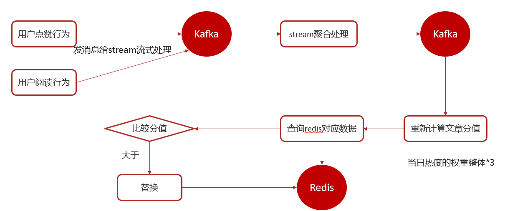

# 2

## 2.1 闻讯头条

- **运用Kafka完成内部系统消息通知；与客户端系统消息通知；以及实时数据计算。**
- **运用Redis缓存技术，实现热数据的计算，并实现延时任务**

> 看看Redis相关文档，
>
> 1、这里热数据是：用户存储到minio上的文章，以及用户的点赞，评论，阅读，收藏取出来使用kafka流进行聚合计算
>
> 2、Kafka流和聚合计算是什么：
>
> kafka流数据结构是key  value结构
>
> 它是提供了对存储于Kafka内的数据进行流式处理和分析的功能。
>
> 生产者->流式处理->消费者
>
> 3、延时任务的步骤怎么搞：
>
> 
>
> 

- **运用Spring Cloud Alibaba Nacos作为项目中的注册中心和配置中心。**

> 看看nacos的相关知识把

- **使用Mongo存储用户热数据，以保证用户热数据高扩展和高性能指标**

> 在搜索记录使用mongodb来存，使用mongodb的原因是因为需要给每个用户都存一份数据量比较大，而且redis是key value结构，不适合。
>
> 常见的提问方式：
>
> 1、**常见的数据类型：**
>
> Mongo-DB是一个文档数据库，可提供高性能，高可用性和易扩展性。
>
> 2、 **什么是mongodb：**
>
> 常用于处理json
>
> 3、**如何执行事务/加锁**
>
> 因为mongodb设计就是轻量高性能，所以**没有**传统的锁和复杂的事务的回滚
>
> 4、**解释一下MongoDB中的索引是什么**
>
> 索引是MongoDB中的特殊结构，它以易于遍历的形式存储一小部分数据集。索引按索引中指定的字段的值排序，存储特定字段或一组字段的值。

- **使用分布式任务框架xxl-job定时计算文章热度**

> 使用xxl-job的原因是因为分布式任务框架可以解决统一业务的多个服务进行的任务，防止出现重复等概率
>
> 计算文章热度是将点赞，评论，阅读，收藏。
>
> - 路由策略，轮询 和 分片（按照模来分配任务给实例）

### 2.1.2 项目介绍：

延时任务

> 延时任务使用的是redis，这里原理是zset

定时计算

实时计算

用户点赞和用户行为会发送给kafka消息，kafka进行流式处理，也就是给权重加1，流式处理完会发送消息，此时kafka重新计算文章分值，此时通过监听发送来的点赞和用户行为加上去，当日权重*3，然后再查询redis比较分值替换一下。