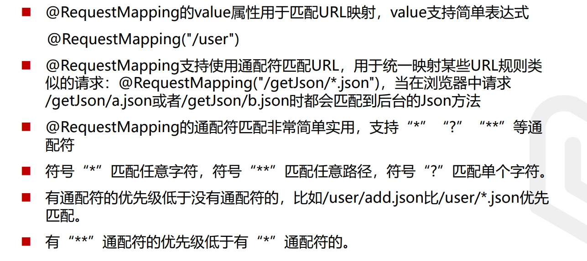

注解介绍：

- @RestController和@Controller    控制器

  > 如果请求的是界面和数据，使用@Controller注解即可；如果只是请求数据，则可以使用@RestController注解。默认情况下，@RestController注解会将返回的对象数据转换为JSON格式

  > 如果返回一个name数据，前端界面中可以通过${name}参数获取后台返回的数据并显示
  >
  > 一般前后端分离的项目使用@RestController，@Controller这个是ssm中的知识，个人认为是mvc和ioc的结合
  >
  > @RestController注解是springMVC提供的一个复合注解，标识在控制器的类上，就相当于为类添加了 @Controller注解，并且为其中的每个方法添加了@ResponseBody注解

- @RequestMapping

  > @RequestMapping注解主要负责URL的路由映射， 它可以添加在Controller类或者具体方法上。
  >
  > 如果添加在Controller类上，则这个Controller中的所有路由映射都将会加上此 映射规则，如果添加在方法上，则只对当前方法生效。
  >
  > 参数如下：
  >
  > value: 请求URL的路径，支持URL模板、正则表达式 
  >
  > method: HTTP请求方法 
  >
  > consumes: 请求的媒体类型（Content-Type），如application/json
  >
  > produces: 响应的媒体类型 
  >
  > params，headers: 请求的参数及请求头的值



- @RequestParam：

  > 一般用在Controller层，用来解决前端与后端参数不一致 的问题，在参数上加上@RequestParam，那么前端的参数必须和后端参数一致，否则会报错。

  

```
@RequestMapping(value = "/hello", method = RequestMethod.GET)
// http://localhost:8080/hello?nickname=zhangsan
public String hello(@RequestParam("nickname") String nickname) {
    return "你好" + nickname;
}
```

  > 加入之后，@RequestParam("nickname")中的nickname和String nickname 将会一致， 如果不传入nickname  eg：`http://localhost:8080/hello` 网站将会报错


