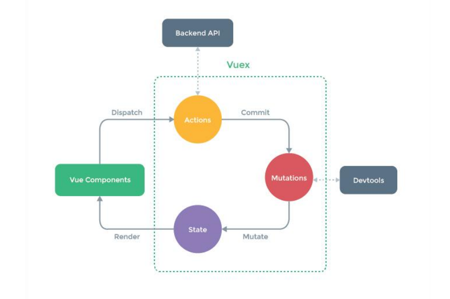

[TOC]

**下面的代码用的vuex3，对标vue2，如果想用vuex4，可以看官方文档**

> 新建一个store文件夹，文件夹下面创建一个index.js文件


## Vuex介绍 

- 对于组件化开发来说，大型应用的状态往往跨越多个组件。在多层嵌套的父子 组件之间传递状态已经十分麻烦，而Vue更是没有为兄弟组件提供直接共享数 据的办法。 

  > 管理兄弟组件的工具

- 基于这个问题，许多框架提供了解决方案——使用全局的状态管理器，将所有 分散的共享数据交由状态管理器保管，Vue也不例外。 

- Vuex 是一个专为 Vue.js 应用程序开发的状态管理库，采用集中式存储管理应 用的所有组件的状态。 

- 简单的说，Vuex用于管理分散在Vue各个组件中的数据。

- 安装：npm install vuex@next (next是版本，换成3 & 4)

## 状态管理: 

- 每一个Vuex应用的核心都是一个store，与普通的全局对象不同的是，基于Vue 数据与视图绑定的特点，当store中的状态发生变化时，与之绑定的视图也会被 重新渲染。
- store中的状态不允许被直接修改，改变store中的状态的唯一途径就是显式地 提交（commit）mutation，这可以让我们方便地跟踪每一个状态的变化。
- 在大型复杂应用中，如果无法有效地跟踪到状态的变化，将会对理解和维护代 码带来极大的困扰。
- Vuex中有5个重要的概念：**State、Getter、Mutation、Action、Module。**





### - State:

> 用于存储应用程序的状态数据

#### 创建store：

- State用于维护所欲应用层的状态，并确保应用只有唯一的数据源

> 新建一个store文件夹，文件夹下面创建一个index.js文件

```
import Vue from "vue";
import Vuex from 'vuex';


Vue.use(Vuex)

const store = new Vuex.Store({
  state: {
    count: 0
  },
  mutations: {
    increment (state) {
      state.count++
    }
  }
})

// 将store导出，然后导入到main.js中，进行一个全局
export default store
```

**main.js :** 

```
import Vue from 'vue'
import App from './App.vue'
// 导入
import store from './store'

Vue.config.productionTip = false

new Vue({
  render: h => h(App),
  // 添加
  store: store
}).$mount('#app')

```

#### 访问store数据

-  在组件中，可以直接使用this.$store.state.count访问数据，也可以先用 mapState辅助函数将其映射下来

1. 最简单引入全局store   `{{ this.$store.state.count }}` 
2. 使用state中的computed用法  `  {{ count }}`

```
  // computed: {
  //   count () {
  //     return this.$store.state.count
  //   }
  // },
  
 
  // mapState写法
  computed:mapState ({
      // 下面三个写法一致 

      // // 箭头函数可使代码更简练
      // count: state => state.count,

      // // 传字符串参数 'count' 等同于 `state => state.count`
      // countAlias: 'count',

      // // 为了能够使用 `this` 获取局部状态，必须使用常规函数
      // countPlusLocalState (state) {
      //   return state.count + this.localCount
      // }
  }),
  
  
  // 当映射的计算属性的名称与 state 的子节点名称相同时，我们也可以给 mapState 传一个字符串数组
  computed: mapState([
      // 映射 this.count 为 store.state.count
      'count'
  ]),
```

#### 修改count变量(commit提交)：

```
  methods: {
    add() {
      // this.$store.state.count += 1  // 这样也可以，但是不符合理念
      this.$store.commit("increment") // 用到store中的increment这样才符合理念
    }
  }
```


### - Getter: 

> 用于获取状态数据的计算属性，可以对状态数据进行加工处理

#### 通过属性调用：

**store/index.js:**

```
const store = new Vuex.Store({
  state: {
    count: 0,
    todos: [
      { id: 1, text: '吃饭', done: true },
      { id: 2, text: '睡觉', done: false }
    ]
  },
  mutations: {
    increment (state) {
      state.count++
    }
  }
})
```

之后通过使用组件的 [访问store数据](####访问store数据) mapState 

```
  computed: mapState([
      // 映射 this.count 为 store.state.count
      'count', 'todos'
  ]),
```


#### 官方文档Getters自己看看，或者看视频也行

看视频把，这个大概就是用法，以及官方文档


#### `mapGetters` 辅助函数

官方文档以及视频

有两个小点

1. 因为可以导入，所以说导入多个可以用花括号括起来

```
import { mapGetters, mapState } from 'vuex'
```

2. 以及用到computed上面：

```
  // 导入多个map辅助函数
  computed: {
  // 使用对象展开运算符将 getter 混入 computed 对象中
  // 这三个点是函数展开
    ...mapGetters([
      'doneTodosCount',
      'anotherGetter',
    ]),
    // 增加其他的map辅助函数也是展开
    ...mapState([
    'count', 'todos'
    ])
  },
```


### Mutation

> 用于修改状态数据的方法，要求遵循一定的规则，例如只能在Mutation中修改状态数据

#### 载荷

**store/index.js**

```
想要加n，而不想要加1
mutations: {
  increment (state, n) {
    state.count += n
  }
}
```

**使用组件中的提交需要多提交一个参数**

```
  methods: {
    add() {
      // this.$store.state.count += 1  // 这样也可以，但是不符合理念
      this.$store.commit("increment", 2) // 用到store中的increment这样才符合理念
    }
  }
```


#### 在组件中提交Mutation

```
import { mapMutations } from 'vuex'

export default {
  // ...
  methods: {
    ...mapMutations([
      'increment', // 将 `this.increment()` 映射为 `this.$store.commit('increment')`

      // `mapMutations` 也支持载荷：
      'incrementBy' // 将 `this.incrementBy(amount)` 映射为 `this.$store.commit('incrementBy', amount)`
    ]),
    ...mapMutations({
      add: 'increment' // 将 `this.add()` 映射为 `this.$store.commit('increment')`
    })
  }
}
```


### Action

> 用于处理异步操作或复杂的业务逻辑，可以包含任意异步操作和Mutation操作

> 主要是为了异步

看官方文档

- 分发Action

- 在组件中分发Action

- 组合Action


### Modules

> 用于应用多的情况下分模块

看官方文档

```
const moduleA = {
  state: () => ({ ... }),
  mutations: { ... },
  actions: { ... },
  getters: { ... }
}

const moduleB = {
  state: () => ({ ... }),
  mutations: { ... },
  actions: { ... }
}

const store = new Vuex.Store({
  modules: {
    a: moduleA,
    b: moduleB
  }
})

store.state.a // -> moduleA 的状态
store.state.b // -> moduleB 的状态
```

