# 1 环境搭建

## 1.1 nacos

### 1.1.1 nacos安装

①：docker拉取镜像 

```shell
docker pull nacos/nacos-server:1.2.0
```

②：创建容器

```shell
docker run --env MODE=standalone --name nacos --restart=always  -d -p 8848:8848 nacos/nacos-server:1.2.0
```

- MODE=standalone 单机版

- --restart=always 开机启动

- -p 8848:8848  映射端口

- -d 创建一个守护式容器在后台运行

③：访问地址：http://192.168.200.130:8848/nacos 


### 1.1.2 nacos注册中心统一配置

> 知识点可以查看[4.1 nacos配置管理](../../基础/后端/Java/微服务框架/SpringCloud/SpringCloud.md)

1. 引导类

   > 主要是添加注解@EnableDiscoveryClient
   >
   > 还有mapper映射，但是这个是mybatis-plus需要的

2. bootstrap.yml

   > 这个是引导文件，这个读取优先级高于application.yml

3. 在nacos中创建配置文件

   > 直接添加该模块的配置类即可
   >
   > 这里需要说明一下，其实user和service中是没有mybatis-plus依赖的，但是他们引入了含有该依赖的model模块，所以说是可以使用mybatis-plus依赖的，这个是javaweb的东西。

4. logback.xml

   > ```
   > <?xml version="1.0" encoding="UTF-8"?>
   > 
   > <configuration>
   >     <!--定义日志文件的存储地址,使用绝对路径-->
   >     <property name="LOG_HOME" value="e:/logs"/>
   > 
   >     <!-- Console 输出设置 -->
   >     <appender name="CONSOLE" class="ch.qos.logback.core.ConsoleAppender">
   >         <encoder>
   >             <!--格式化输出：%d表示日期，%thread表示线程名，%-5level：级别从左显示5个字符宽度%msg：日志消息，%n是换行符-->
   >             <pattern>%d{yyyy-MM-dd HH:mm:ss.SSS} [%thread] %-5level %logger{36} - %msg%n</pattern>
   >             <charset>utf8</charset>
   >         </encoder>
   >     </appender>
   > 
   >     <!-- 按照每天生成日志文件 -->
   >     <appender name="FILE" class="ch.qos.logback.core.rolling.RollingFileAppender">
   >         <rollingPolicy class="ch.qos.logback.core.rolling.TimeBasedRollingPolicy">
   >             <!--日志文件输出的文件名-->
   >             <fileNamePattern>${LOG_HOME}/leadnews.%d{yyyy-MM-dd}.log</fileNamePattern>
   >         </rollingPolicy>
   >         <encoder>
   >             <pattern>%d{yyyy-MM-dd HH:mm:ss.SSS} [%thread] %-5level %logger{36} - %msg%n</pattern>
   >         </encoder>
   >     </appender>
   > 
   >     <!-- 异步输出 -->
   >     <appender name="ASYNC" class="ch.qos.logback.classic.AsyncAppender">
   >         <!-- 不丢失日志.默认的,如果队列的80%已满,则会丢弃TRACT、DEBUG、INFO级别的日志 -->
   >         <discardingThreshold>0</discardingThreshold>
   >         <!-- 更改默认的队列的深度,该值会影响性能.默认值为256 -->
   >         <queueSize>512</queueSize>
   >         <!-- 添加附加的appender,最多只能添加一个 -->
   >         <appender-ref ref="FILE"/>
   >     </appender>
   > 
   > 
   >     <logger name="org.apache.ibatis.cache.decorators.LoggingCache" level="DEBUG" additivity="false">
   >         <appender-ref ref="CONSOLE"/>
   >     </logger>
   >     <logger name="org.springframework.boot" level="debug"/>
   >     <root level="info">
   >         <!--<appender-ref ref="ASYNC"/>-->
   >         <appender-ref ref="FILE"/>
   >         <appender-ref ref="CONSOLE"/>
   >     </root>
   > </configuration>
   > ```
   >
   > 这里配置的是logback文件，有两个注意点
   >
   > 1. 输出
   >
   >    > ```
   >    > <!--定义日志文件的存储地址,使用绝对路径-->
   >    > <property name="LOG_HOME" value="e:/logs"/>
   >    > ```
   >
   > 2. 开发的时候尽量使用debug
   >
   >    ```
   >    <logger name="org.springframework.boot" level="debug"/>
   >    ```


### 1.1.3 spring.factories介绍

> Spring Boot 使用自动配置（auto-configuration）来简化应用程序的搭建过程。自动配置是通过在类路径下的 `META-INF/spring.factories` 文件中列出的配置类来实现的。Spring Boot 在启动时会扫描这个文件，加载配置类，并应用相应的配置。
>
> `EnableAutoConfiguration` 注解标记了一个类，告诉 Spring Boot 在运行时自动应用这个类中的配置。配置类通常包含一些注解，以及配置应用程序所需的各种组件，例如数据源、消息队列等。
>
> src/main/resources/META-INF/spring.factories地址是这个，它可以在springboot扫描的时候进行扫面一般来说是一些配置类如下：
>
> > ```
> > org.springframework.boot.autoconfigure.EnableAutoConfiguration=\
> >   com.heima.common.exception.ExceptionCatch,\
> >   com.heima.common.swagger.SwaggerConfiguration
> > ```


### 1.1.4 创建nacos和gatway完整步骤

> [2.2.2 服务进行的步骤（从创建到完整的模块）](# 2.2.2 服务进行的步骤（从创建到完整的模块）)


## 1.2 网关

### 1.2.1 网关搭建

> 步骤：
>
> 1. （1）在heima-leadnews-gateway导入以下依赖
> 2. （2）在heima-leadnews-gateway下创建heima-leadnews-app-gateway微服务
>    1. 引导类
>    2. bootstrap
>    3. 在nacos的配置中心创建dataid为leadnews-app-gateway的yml配置

**（1）在heima-leadnews-gateway导入以下依赖**

pom文件

```xml
<dependencies>
    <dependency>
        <groupId>org.springframework.cloud</groupId>
        <artifactId>spring-cloud-starter-gateway</artifactId>
    </dependency>
    <dependency>
        <groupId>com.alibaba.cloud</groupId>
        <artifactId>spring-cloud-starter-alibaba-nacos-discovery</artifactId>
    </dependency>
     <dependency>
            <groupId>com.alibaba.cloud</groupId>
            <artifactId>spring-cloud-starter-alibaba-nacos-config</artifactId>
        </dependency>
    <dependency>
        <groupId>io.jsonwebtoken</groupId>
        <artifactId>jjwt</artifactId>
    </dependency>
</dependencies>
```

**（2）在heima-leadnews-gateway下创建heima-leadnews-app-gateway微服务**

**引导类：**

```java
package com.heima.app.gateway;

import org.springframework.boot.SpringApplication;
import org.springframework.boot.autoconfigure.SpringBootApplication;
import org.springframework.cloud.client.discovery.EnableDiscoveryClient;

@SpringBootApplication
@EnableDiscoveryClient  //开启注册中心
public class AppGatewayApplication {

    public static void main(String[] args) {
        SpringApplication.run(AppGatewayApplication.class,args);
    }
}
```

**bootstrap.yml**

```yaml
server:
  port: 51601
spring:
  application:
    name: leadnews-app-gateway
  cloud:
    nacos:
      discovery:
        server-addr: 192.168.200.130:8848
      config:
        server-addr: 192.168.200.130:8848
        file-extension: yml
```

**在nacos的配置中心创建dataid为leadnews-app-gateway的yml配置**

```yaml
spring:
  cloud:
    gateway:
      globalcors:
        add-to-simple-url-handler-mapping: true
        corsConfigurations:
          '[/**]':
            allowedHeaders: "*"
            allowedOrigins: "*"
            allowedMethods:
              - GET
              - POST
              - DELETE
              - PUT
              - OPTION
      routes:
        # 平台管理
        - id: user
          uri: lb://leadnews-user
          predicates:
            - Path=/user/**
          filters:
            - StripPrefix= 1
```


环境搭建完成以后，启动项目网关和用户两个服务，使用postman进行测试

请求地址：http://localhost:51601/user/api/v1/login/login_auth   


### 1.2.2 网关校验jwt


步骤：

> 1. 引入依赖
> 2. 创建全局过滤器并进行过滤

1. **引入依赖**

   > 在搭建的时候已经导入过了（注意是gateway父工程，），jwt的依赖即可

2. **创建全局过滤器并进行过滤**

   - 路径com.eason.app.gateway.filter.AuthorizeFilter

   ```java
   package com.eason.app.gateway.filter;
   
   import com.eason.app.gateway.util.AppJwtUtil;
   import io.jsonwebtoken.Claims;
   import lombok.extern.slf4j.Slf4j;
   import org.apache.commons.lang.StringUtils;
   import org.springframework.cloud.gateway.filter.GatewayFilterChain;
   import org.springframework.cloud.gateway.filter.GlobalFilter;
   import org.springframework.core.Ordered;
   import org.springframework.http.HttpStatus;
   import org.springframework.http.server.reactive.ServerHttpRequest;
   import org.springframework.http.server.reactive.ServerHttpResponse;
   import org.springframework.stereotype.Component;
   import org.springframework.web.server.ServerWebExchange;
   import reactor.core.publisher.Mono;
   
   @Component
   @Slf4j
   public class AuthorizeFilter implements Ordered, GlobalFilter {
   
       @Override
       public Mono<Void> filter(ServerWebExchange exchange, GatewayFilterChain chain) {
           // 1 获取request和response对象
           ServerHttpRequest request = exchange.getRequest();
           ServerHttpResponse response = exchange.getResponse();
           String url = request.getURI().toString();
           // 2 判断是否是登录
           if (url.contains("login")) {
               // 放行
               System.out.println("拦截到login");
               return chain.filter(exchange);
           }
           // 3 获取token
           String token = request.getHeaders().getFirst("token");
           // 4 判断token是否存在
           if (StringUtils.isBlank(token)) {
               response.setStatusCode(HttpStatus.UNAUTHORIZED);
               return response.setComplete();
           }
           // 5 判断token是否有效
           try {
               Claims claimsBody = AppJwtUtil.getClaimsBody(token);
               // 是否过期
               int result = AppJwtUtil.verifyToken(claimsBody);
               if (result ==1 | result == 2) {
                   response.setStatusCode(HttpStatus.UNAUTHORIZED);
                   return response.setComplete();
               }
           } catch (Exception e) {
               e.printStackTrace();
           }
   
           System.out.println("所有都运行完毕");
           // 6 放行
           return chain.filter(exchange);
       }
   
       /**
        * 优先级设置、 值越小、 优先级越高
        * @return
        */
       @Override
       public int getOrder() {
           return 0;
       }
   }
   ```

   > 这里需要说的是实现两个接口，其他都一样了。就是正常过程


## 1.3 整合Knife4j

> 这个就结合了1.1.3的spring.factories
>
> 步骤：
>
> 1. 导入依赖
> 2. 创建配置文件
> 3. 在Spring.factories中新增配置

1. **导入依赖**

   在heima-leadnews-common模块中的`pom.xml`文件中引入`knife4j`的依赖,如下：

   ```java
   <dependency>
        <groupId>com.github.xiaoymin</groupId>
        <artifactId>knife4j-spring-boot-starter</artifactId>
   </dependency>
   ```

   

2. **创建配置文件**

   在heima-leadnews-common模块中新建配置类

   新建Swagger的配置文件`SwaggerConfiguration.java`文件,创建springfox提供的Docket分组对象,代码如下：

   ```java
   package com.heima.common.swagger;
   
   import com.github.xiaoymin.knife4j.spring.annotations.EnableKnife4j;
   import lombok.var;
   import org.springframework.context.annotation.Bean;
   import org.springframework.context.annotation.Configuration;
   import org.springframework.context.annotation.Import;
   import springfox.bean.validators.configuration.BeanValidatorPluginsConfiguration;
   import springfox.documentation.builders.ApiInfoBuilder;
   import springfox.documentation.builders.PathSelectors;
   import springfox.documentation.builders.RequestHandlerSelectors;
   import springfox.documentation.service.ApiInfo;
   import springfox.documentation.spi.DocumentationType;
   import springfox.documentation.spring.web.plugins.Docket;
   import springfox.documentation.swagger2.annotations.EnableSwagger2;
   
   @Configuration
   @EnableSwagger2
   @EnableKnife4j
   @Import(BeanValidatorPluginsConfiguration.class)
   public class SwaggerConfiguration {
   
       @Bean(value = "defaultApi2")
       public Docket defaultApi2() {
           var docket = new Docket(DocumentationType.SWAGGER_2)
                   .apiInfo(apiInfo())
                   // 分组名称
                   .groupName("1.0")
                   .select()
                   // 这里指定Controller扫描包路径
                   .apis(RequestHandlerSelectors.basePackage("com.eason"))
                   .paths(PathSelectors.any())
                   .build();
           return docket;
       }
       private ApiInfo apiInfo() {
           return new ApiInfoBuilder()
                   .title("闻讯头条API文档")
                   .description("闻讯头条API文档")
                   .version("1.0")
                   .build();
       }
   }
   ```

   

3. **在Spring.factories中新增配置**

   ```java
   org.springframework.boot.autoconfigure.EnableAutoConfiguration=\
   com.heima.common.exception.ExceptionCatch,\
   com.heima.common.swagger.SwaggerConfiguration
   ```

   - 访问

   在浏览器输入地址：`http://host:port/doc.html`


## 1.4 Feign在业务中使用

> 背景：步骤如下：
>
> 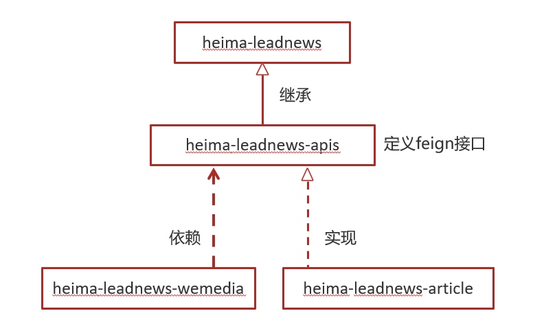
>
> **定义feign接口：**
>
> [app端文章保存接口](# 2.6 app端文章保存接口)
>
> 步骤（以文章为例）：
>
> 1. 在feign模块定义相应接口，
>2. 在文章微服务中定义新的包feign，编写类实现feign模块中的接口，实现时候直接使用service层的函数即可，
> 
>**远程调用feign接口方式：**
> 
>在heima-leadnews-wemedia服务中已经依赖了heima-leadnews-feign-apis工程，只需要在自媒体（wemedia）的引导类中开启feign的远程调用即可
> 
> 注解为：`@EnableFeignClients(basePackages = "com.heima.apis")` 需要指向apis这个包

> **服务降级处理：**
>
> 1. 在heima-leadnews-feign-api编写降级逻辑
>2. 在自媒体微服务（消费者）中添加类，扫描降级代码类的包
> 3. 远程接口中指向降级代码
>4. 客户端开启降级heima-leadnews-wemedia
> 
>5. 测试
> 
>**开启异步调用：**
> 
>①：在自动审核的方法上加上@Async注解（标明要异步调用）
> 
>③：在自媒体（消费者）引导类中使用@EnableAsync注解开启异步调用

1. **在heima-leadnews-feign-api编写降级逻辑**

   ```java
   package com.heima.apis.article.fallback;
   
   import com.heima.apis.article.IArticleClient;
   import com.heima.model.article.dtos.ArticleDto;
   import com.heima.model.common.dtos.ResponseResult;
   import com.heima.model.common.enums.AppHttpCodeEnum;
   import org.springframework.stereotype.Component;
   
   /**
    * feign失败配置
    * @author itheima
    */
   @Component
   public class IArticleClientFallback implements IArticleClient {
       @Override
       public ResponseResult saveArticle(ArticleDto dto)  {
           return ResponseResult.errorResult(AppHttpCodeEnum.SERVER_ERROR,"获取数据失败");
       }
   }
   ```

   

2. **在自媒体微服务中（消费者）添加类，扫描降级代码类的包**

   ````java
   package com.heima.wemedia.config;
   
   import org.springframework.context.annotation.ComponentScan;
   import org.springframework.context.annotation.Configuration;
   
   @Configuration
   @ComponentScan("com.heima.apis.article.fallback")
   public class InitConfig {
   }
   ````

   > 主要是两个注解，一个config、一个scan

3. **远程接口中指向降级代码**

   ```java
   package com.heima.apis.article;
   
   import com.heima.apis.article.fallback.IArticleClientFallback;
   import com.heima.model.article.dtos.ArticleDto;
   import com.heima.model.common.dtos.ResponseResult;
   import org.springframework.cloud.openfeign.FeignClient;
   import org.springframework.web.bind.annotation.PostMapping;
   import org.springframework.web.bind.annotation.RequestBody;
   
   @FeignClient(value = "leadnews-article",fallback = IArticleClientFallback.class)
   public interface IArticleClient {
   
       @PostMapping("/api/v1/article/save")
       public ResponseResult saveArticle(@RequestBody ArticleDto dto);
   }
   ```

   

4. **客户端开启降级heima-leadnews-wemedia**

   ```yaml
   feign:
     # 开启feign对hystrix熔断降级的支持
     hystrix:
       enabled: true
     # 修改调用超时时间
     client:
       config:
         default:
           connectTimeout: 2000
           readTimeout: 2000
   ```

   > 在wemedia的nacos配置中心里添加如下内容，开启服务降级，也可以指定服务响应的超时的时间

5. **测试**

   ```java
   try {
       Thread.sleep(3000);
   } catch (InterruptedException e) {
       e.printStackTrace();
   }
   ```

   > 在ApArticleServiceImpl类中saveArticle方法添加代码
   >
   > 在自媒体端进行审核测试，会出现服务降级的现象


# 2 业务分析

## 2.1 登录

### 2.1.1 密码加密

> 引入了`密码+salt`md5加密，即数据库添加一个字段salt(字符串)。
>
> - 用户注册：密码+生成的字符串（salt）进行md5加密
>
> - 用户登录：先通过用户名进行查询salt字段和输入密码进行md5加密后对比数据库md5密码。

### 2.1.2 游客登录

> 1，用户输入了用户名和密码进行登录，校验成功后返回jwt(基于当前用户的id生成)
>
> 2，用户游客登录，生成jwt返回(基于默认值0生成)


## 2.2 app端

### 2.2.1 文章查看

> 思路：
>
> 
>
> 1,在默认频道展示10条文章信息 -> 按照时间的倒叙进行排序
>
> 2,可以切换频道查看不同种类文章 -> 频道是id，一个条件语句即可
>
> 3,当用户下拉可以加载最新的文章（分页）本页文章列表中发布时间为最大的时间为依据 -> 是按照时间倒叙
>
> 4,当用户上拉可以加载更多的文章信息（按照发布时间）本页文章列表中发布时间最小的时间为依据 
>
> 5，如果是当前频道的首页，前端传递默认参数：
>
> - maxBehotTime：0（毫秒）
>
> - minBehotTime：20000000000000（毫秒）--->2063年

> ```sql
> # 按照发布时间倒叙查询10条文章数据
> select * from ap_article aa ORDER BY aa.publish_time DESC LIMIT 10
> 
> 
> # 查询频道顺序
> select * from ap_article aa WHERE aa.channel_id = 1 ORDER BY aa.publish_time DESC LIMIT 10
> 
> # 加载首页
> select * from ap_article aa WHERE aa.channel_id=1 and aa.publish_time < '2063-04-19 00:20:17' ORDER BY aa.publish_time DESC LIMIT 10
> 
> ```
>
> > 这里其实是将文件
>
> 这里需要说明一下：在mybatis中小于号需要进行转码 <![CDATA[<]]>这个就是小于号，防止被xml识别
>
> ```mysql
> <if test="type != null and type == 1">
>     and aa.publish_time <![CDATA[<]]> #{dto.minBehotTime}
> </if>
> ```

### 2.2.2 服务进行的步骤（从创建到完整的模块）

> 步骤：
>
> 1. 创建模块
> 2. 添加nacos配置和boostrap文件
> 3. 正常编写业务
> 4. 在nacos网关配置进行添加相关配置


1. **创建模块**

   > 在service二级模块下面创建heima-leadnews\heima-leadnews-service\eason-leadnews-article
   >
   > 这里heima-leadnews是项目名字，heima-leadnews-service是二级模块
   >
   > 这里可以导入，然后右边或者模块的maven可以进行pom文件导入将普通文件转换为模块

2. **添加nacos配置和boostrap文件**

   - **nacos**

     ```yaml
     spring:
       datasource:
         driver-class-name: com.mysql.jdbc.Driver
         url: jdbc:mysql://localhost:3306/leadnews_article?useUnicode=true&characterEncoding=UTF-8&zeroDateTimeBehavior=convertToNull&serverTimezone=GMT%2B8&useSSL=false
         username: root
         password: 123456
     # 设置Mapper接口所对应的XML文件位置，如果你在Mapper接口中有自定义方法，需要进行该配置
     mybatis-plus:
       mapper-locations: classpath*:mapper/*.xml
       # 设置别名包扫描路径，通过该属性可以给包中的类注册别名
       type-aliases-package: com.eason.model.article.pojos
     ```

   - **boostrap**

     ```yaml
     server:
       port: 51802
     spring:
       application:
         name: leadnews-article
       cloud:
         nacos:
           discovery:
             server-addr: 192.168.47.128:8848
           config:
             server-addr: 192.168.47.128:8848
             file-extension: yml
     ```

     > 这里面基本一样，引入nacos，name是命名，自定义的模块名

3. **正常编写业务**

   > 这里有个很奇怪的现象，pom文件需要引入junit才能用knife4j，这个很奇怪

4. **在nacos网关配置进行添加相关配置**

   > ```yaml
   >         # 文章微服务
   >         - id: article
   >           uri: lb://leadnews-article
   >           predicates:
   >             - Path=/article/**
   >           filters:
   >             - StripPrefix= 1
   > ```
   >
   > > 这是需要添加的，完整的网关文件上面的[网关搭建](# 1.2.1 网关搭建)步骤有


## 2.3 通过minio来渲染页面详情

> 两种渲染页面详情：
>
> 1、 通过前端写页面然后进行数据库查询
>
> 2、 通过freemarker和minio结合进行静态页面渲染
>
> 
>
> 前者对数据库压力较大， 后者比较友好
>
> 步骤：
>
> 1. 引入minio工具类和freemarker配置
> 2. 在使用的模块nacos配置下添加minio配置
> 3. 实现步骤

1. **引入minio工具类和freemarker配置**

   > 引入工具类请看[3.2.3 封装MinIO为starter](# 3.2.3 封装MinIO为starter)
   >
   > freemarker请看[3.1.4 静态化测试](# 3.1.4 静态化测试)
   >
   > 工具类是可以集成一个模块的，放在common子模块下

2. **在使用的模块nacos配置下添加minio配置**

   ```yaml
   # minio配置
   minio:
     accessKey: minioadmin
     secretKey: minioadmin
     bucket: leadnews
     endpoint: http://192.168.47.128:9000
     readPath: http://192.168.47.128:9000
   ```

3. **实现步骤**

   > 1. 导入依赖
   > 2. 创建ApArticleContentMapper
   > 3. 在artile微服务中新增测试类（后期新增文章的时候创建详情静态页，目前暂时手动生成）

   1. **导入依赖**

      ```xml
      <dependencies>
          <dependency>
              <groupId>org.springframework.boot</groupId>
              <artifactId>spring-boot-starter-freemarker</artifactId>
          </dependency>
          <dependency>
              <groupId>com.heima</groupId>
              <artifactId>heima-file-starter</artifactId>
              <version>1.0-SNAPSHOT</version>
          </dependency>
      </dependencies>
      ```

   2. **创建ApArticleContentMapper**

      ```java
      package com.heima.article.mapper;
      
      import com.baomidou.mybatisplus.core.mapper.BaseMapper;
      import com.heima.model.article.pojos.ApArticleContent;
      import org.apache.ibatis.annotations.Mapper;
      
      @Mapper
      public interface ApArticleContentMapper extends BaseMapper<ApArticleContent> {
      }
      ```

      

   3. **在artile微服务中新增测试类（后期新增文章的时候创建详情静态页，目前暂时手动生成**

      > 

      ```java
      package com.heima.article.test;
      
      
      import com.alibaba.fastjson.JSONArray;
      import com.baomidou.mybatisplus.core.toolkit.Wrappers;
      import com.heima.article.ArticleApplication;
      import com.heima.article.mapper.ApArticleContentMapper;
      import com.heima.article.mapper.ApArticleMapper;
      import com.heima.file.service.FileStorageService;
      import com.heima.model.article.pojos.ApArticle;
      import com.heima.model.article.pojos.ApArticleContent;
      import freemarker.template.Configuration;
      import freemarker.template.Template;
      import org.apache.commons.lang3.StringUtils;
      import org.junit.Test;
      import org.junit.runner.RunWith;
      import org.springframework.beans.factory.annotation.Autowired;
      import org.springframework.boot.test.context.SpringBootTest;
      import org.springframework.test.context.junit4.SpringRunner;
      
      import java.io.ByteArrayInputStream;
      import java.io.InputStream;
      import java.io.StringWriter;
      import java.util.HashMap;
      import java.util.Map;
      
      @SpringBootTest(classes = ArticleApplication.class)
      @RunWith(SpringRunner.class)
      public class ArticleFreemarkerTest {
      
          @Autowired
          private Configuration configuration;
      
          @Autowired
          private FileStorageService fileStorageService;
      
      
          @Autowired
          private ApArticleMapper apArticleMapper;
      
          @Autowired
          private ApArticleContentMapper apArticleContentMapper;
      
          @Test
          public void createStaticUrlTest() throws Exception {
              //1.获取文章内容
              ApArticleContent apArticleContent = apArticleContentMapper.selectOne(Wrappers.<ApArticleContent>lambdaQuery().eq(ApArticleContent::getArticleId, 1390536764510310401L));
              if(apArticleContent != null && StringUtils.isNotBlank(apArticleContent.getContent())){
                  //2.文章内容通过freemarker生成html文件
                  StringWriter out = new StringWriter();
                  Template template = configuration.getTemplate("article.ftl");
      
                  Map<String, Object> params = new HashMap<>();
                  params.put("content", JSONArray.parseArray(apArticleContent.getContent()));
      
                  template.process(params, out);
                  InputStream is = new ByteArrayInputStream(out.toString().getBytes());
      
                  //3.把html文件上传到minio中
                  String path = fileStorageService.uploadHtmlFile("", apArticleContent.getArticleId() + ".html", is);
      
                  //4.修改ap_article表，保存static_url字段
                  ApArticle article = new ApArticle();
                  article.setId(apArticleContent.getArticleId());
                  article.setStaticUrl(path);
                  apArticleMapper.updateById(article);
      
              }
          }
      }
      ```


## 2.4 获取用户信息

> 思路：
>
> 1. 在过滤器（filter）从 JWT 中解析用户标识信息，然后将该信息存储到请求头部中。
> 2. 在拦截器（interceptor）将存储的用户信息取出来放入线程中。

1. **在过滤器（filter）从 JWT 中解析用户标识信息，然后将该信息存储到请求头部中。**

   在[1.2.2网关校验jwt](# 1.2.2网关校验jwt)中的第5步判断完token是否有效之后添加下面的代码来在前端发送的请求中新增一个`userId`头部字段。

   ```
   // 获取用户信息
   Object userId = claimsBody.get("id");
   // 存储到header中
   ServerHttpRequest serverHttpRequest = request.mutate().headers(httpHeaders -> {
       httpHeaders.add("userId", userId + "");
   }).build();
   // 重置请求
   exchange.mutate().request(serverHttpRequest);
   ```

2. **在拦截器（interceptor）将存储的用户信息取出来放入线程中。**

   > 步骤：
   >
   > 1. 创建自定义拦截器
   > 2. 新增一个本地线程的工具类
   > 3. 将自定义拦截器注册

   1. **创建自定义拦截器**

      ```java
      package com.heima.wemedia.interceptor;
      
      
      import com.eason.model.wemedia.pojos.WmUser;
      import com.heima.utils.thread.WmThreadLocalUtil;
      import org.springframework.web.servlet.HandlerInterceptor;
      import org.springframework.web.servlet.ModelAndView;
      
      import javax.servlet.http.HttpServletRequest;
      import javax.servlet.http.HttpServletResponse;
      
      public class WmTokenInterceptor implements HandlerInterceptor {
          /**
           * 得到header中的用户信息
           * @param request
           * @param response
           * @param handler
           * @return
           * @throws Exception
           */
          @Override
          public boolean preHandle(HttpServletRequest request, HttpServletResponse response, Object handler) throws Exception {
              String userId = request.getHeaders("userId").toString();
              if (userId != null) {
                  // 存入当前线程中
                  WmUser wmUser = new WmUser();
                  wmUser.setId(Integer.valueOf(userId));
                  WmThreadLocalUtil.setUser(wmUser);
              }
              return true;
          }
      
          /**
           * 清理线程中的数据
           * @param request
           * @param response
           * @param handler
           * @param modelAndView
           * @throws Exception
           */
          @Override
          public void postHandle(HttpServletRequest request, HttpServletResponse response, Object handler, ModelAndView modelAndView) throws Exception {
              WmThreadLocalUtil.clear();
          }
      }
      ```

   2. **新增一个本地线程的工具类**

      ```java
      package com.heima.utils.thread;
      
      import com.eason.model.wemedia.pojos.WmMaterial;
      import com.eason.model.wemedia.pojos.WmUser;
      
      public class WmThreadLocalUtil {
          private final static ThreadLocal<WmUser> WM_USER_THREAD_LOCAL = new ThreadLocal<>();
      
          // 存入线程
          public static void setUser(WmUser wmUser) {
              WM_USER_THREAD_LOCAL.set(wmUser);
          }
      
          // 从线程中取出
          public static WmUser getUser() {
              return WM_USER_THREAD_LOCAL.get();
          }
      
          // 清理
          public static void clear() {
              WM_USER_THREAD_LOCAL.remove();
          }
      }
      ```

   3. **将自定义拦截器注册**

      ```java
      package com.heima.wemedia.config;
      
      import com.heima.wemedia.interceptor.WmTokenInterceptor;
      import org.springframework.context.annotation.Configuration;
      import org.springframework.web.servlet.config.annotation.InterceptorRegistry;
      import org.springframework.web.servlet.config.annotation.WebMvcConfigurer;
      
      @Configuration
      public class WebMvcConfig implements WebMvcConfigurer {
          @Override
          public void addInterceptors(InterceptorRegistry registry) {
              registry.addInterceptor(new WmTokenInterceptor()).addPathPatterns("/**");
          }
      }
      ```


## 2.5 文章的修改和草稿

> 文章含有三个表，文章表，素材表，文章素材关系表。这三个表中可以进行文章表
>
> 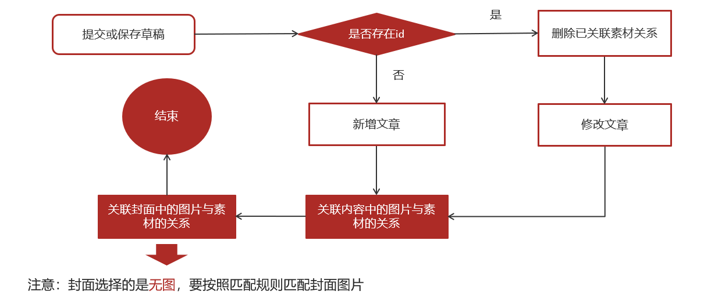
>
> 1.前端提交发布或保存为草稿
>
> 2.后台判断请求中是否包含了文章id
>
> 3.如果不包含id,则为新增
>
> ​	3.1 执行新增文章的操作
>
> ​	3.2 关联文章内容图片与素材的关系
>
> ​	3.3 关联文章封面图片与素材的关系
>
> 4.如果包含了id，则为修改请求
>
> ​	4.1 删除该文章与素材的所有关系
>
> ​	4.2 执行修改操作
>
> ​	4.3 关联文章内容图片与素材的关系
>
> ​	4.4 关联文章封面图片与素材的关系
>
> > 如果是修改的话，先删除后新增是常见的方法

### 2.5.1 分布式id（雪花算法）

mybatis-plus已经集成了雪花算法，完成以下两步即可在项目中集成雪花算法

第一：在实体类中的id上加入如下配置，指定类型为id_worker

```java
@TableId(value = "id",type = IdType.ID_WORKER)
private Long id;
```

第二：在application.yml文件中配置数据中心id和机器id

```yaml
mybatis-plus:
  mapper-locations: classpath*:mapper/*.xml
  # 设置别名包扫描路径，通过该属性可以给包中的类注册别名
  type-aliases-package: com.heima.model.article.pojos
  global-config:
    datacenter-id: 1
    workerId: 1
```

datacenter-id:数据中心id(取值范围：0-31)

workerId:机器id(取值范围：0-31)

## 2.6 app端文章保存接口

在文章审核成功以后需要在app的article库中新增文章数据

1.保存文章信息 ap_article

2.保存文章配置信息 ap_article_config

3.保存文章内容 ap_article_content

实现思路：


> 步骤： 
>
> 1. 导入依赖
> 2. 创建文章接口feign的api函数
> 3. 创建文章内容的函数
> 4. 在文章微服务实现feign接口
> 5. 添加ApArticleConfigMapper类
> 6. 在ApArticleService新增保存方法进行实现

1. **导入依赖**

   导入feign的依赖

   ```yaml
   <dependency>
       <groupId>org.springframework.cloud</groupId>
       <artifactId>spring-cloud-starter-openfeign</artifactId>
   </dependency>
   ```

2. **创建文章接口feign的api函数**

   ```java
   @FeignClient(value = "leadnews-article")
   public interface IArticleClient {
   
       @PostMapping("/api/v1/article/save")
       public ResponseResult saveArticle(@RequestBody ArticleDto dto) ;
   }
   ```

   > 1. 需要注意三个注解
   >
   > 2. 路径是feign-api这个模块中
   >
   >    package com.heima.apis.article.article;

3. **创建文章内容的函数**

   ```java
   @Data
   @AllArgsConstructor
   @NoArgsConstructor
   public class ArticleDto extends ApArticle {
       /**
        * 文章内容
        */
       private String content;
   }
   ```

   > 这个主要是为了让文章内容和自身联系起来

4. **在文章微服务实现feign接口**

   > 这里需要在文章模块下创建一个包名，专门用于实现feign的接口
   >
   > 包路径如下package com.eason.article.feign;

   ```java
   @RestController
   public class ArticleClient implements IArticleClient {
   
       @Autowired
       private ApArticleService apArticleService;
   
       @Override
       @PostMapping("/api/v1/article/save")
       public ResponseResult saveArticle(@RequestBody ArticleDto dto) {
           return apArticleService.saveArticle(dto);
       }
   
   }
   ```

   

5. **添加ApArticleConfigMapper类**

   > 要不要无伤大雅，这个是业务，主要是学这个流程

6. **在ApArticleService新增保存方法进行实现**

   在ApArticleService中新增方法

   ```java
   /**
        * 保存app端相关文章
        * @param dto
        * @return
        */
   ResponseResult saveArticle(ArticleDto dto) ;
   ```

   实现类：

   ```java
   @Autowired
   private ApArticleConfigMapper apArticleConfigMapper;
   
   @Autowired
   private ApArticleContentMapper apArticleContentMapper;
   
   /**
        * 保存app端相关文章
        * @param dto
        * @return
        */
   @Override
   public ResponseResult saveArticle(ArticleDto dto) {
       //1.检查参数
       if(dto == null){
           return ResponseResult.errorResult(AppHttpCodeEnum.PARAM_INVALID);
       }
   
       ApArticle apArticle = new ApArticle();
       BeanUtils.copyProperties(dto,apArticle);
   
       //2.判断是否存在id
       if(dto.getId() == null){
           //2.1 不存在id  保存  文章  文章配置  文章内容
   
           //保存文章
           save(apArticle);
   
           //保存配置
           ApArticleConfig apArticleConfig = new ApArticleConfig(apArticle.getId());
           apArticleConfigMapper.insert(apArticleConfig);
   
           //保存 文章内容
           ApArticleContent apArticleContent = new ApArticleContent();
           apArticleContent.setArticleId(apArticle.getId());
           apArticleContent.setContent(dto.getContent());
           apArticleContentMapper.insert(apArticleContent);
   
       }else {
           //2.2 存在id   修改  文章  文章内容
   
           //修改  文章
           updateById(apArticle);
   
           //修改文章内容
           ApArticleContent apArticleContent = apArticleContentMapper.selectOne(Wrappers.<ApArticleContent>lambdaQuery().eq(ApArticleContent::getArticleId, dto.getId()));
           apArticleContent.setContent(dto.getContent());
           apArticleContentMapper.updateById(apArticleContent);
       }
   
   
       //3.结果返回  文章的id
       return ResponseResult.okResult(apArticle.getId());
   }
   ```


## 2.7 文章审核

### 2.7.1 自管理敏感词

 **需求分析**：

> 需要自己维护一套敏感词，在文章审核的时候，需要验证文章是否包含这些敏感词

**DFA实现原理：**

DFA全称为：Deterministic Finite Automaton,即确定有穷自动机。

存储：一次性的把所有的敏感词存储到了多个map中，就是下图表示这种结构

敏感词：


检索过程：


**步骤**：

1. 创建敏感词表，导入资料中wm_sensitive到leadnews_wemedia库中
2. 拷贝对应的wm_sensitive的mapper到项目中
3. 在文章审核的代码中添加自管理敏感词审核

**1、创建敏感词表，导入资料中wm_sensitive到leadnews_wemedia库中**

```java
package com.heima.model.wemedia.pojos;

import com.baomidou.mybatisplus.annotation.IdType;
import com.baomidou.mybatisplus.annotation.TableField;
import com.baomidou.mybatisplus.annotation.TableId;
import com.baomidou.mybatisplus.annotation.TableName;
import lombok.Data;

import java.io.Serializable;
import java.util.Date;

/**
 * <p>
 * 敏感词信息表
 * </p>
 *
 * @author itheima
 */
@Data
@TableName("wm_sensitive")
public class WmSensitive implements Serializable {

    private static final long serialVersionUID = 1L;

    /**
     * 主键
     */
    @TableId(value = "id", type = IdType.AUTO)
    private Integer id;

    /**
     * 敏感词
     */
    @TableField("sensitives")
    private String sensitives;

    /**
     * 创建时间
     */
    @TableField("created_time")
    private Date createdTime;

}
```

**2、拷贝对应的wm_sensitive的mapper到项目中**

```java
package com.heima.wemedia.mapper;

import com.baomidou.mybatisplus.core.mapper.BaseMapper;
import com.heima.model.wemedia.pojos.WmSensitive;
import org.apache.ibatis.annotations.Mapper;


@Mapper
public interface WmSensitiveMapper extends BaseMapper<WmSensitive> {
}
```

**3、在文章审核的代码中添加自管理敏感词审核**

第一：在WmNewsAutoScanServiceImpl中的autoScanWmNews方法上添加如下代码

```java
//从内容中提取纯文本内容和图片
//.....省略

//自管理的敏感词过滤
boolean isSensitive = handleSensitiveScan((String) textAndImages.get("content"), wmNews);
if(!isSensitive) return;

//2.审核文本内容  阿里云接口
//.....省略
```

新增自管理敏感词审核代码

```java
@Autowired
private WmSensitiveMapper wmSensitiveMapper;

/**
     * 自管理的敏感词审核
     * @param content
     * @param wmNews
     * @return
     */
private boolean handleSensitiveScan(String content, WmNews wmNews) {

    boolean flag = true;

    //获取所有的敏感词
    List<WmSensitive> wmSensitives = wmSensitiveMapper.selectList(Wrappers.<WmSensitive>lambdaQuery().select(WmSensitive::getSensitives));
    List<String> sensitiveList = wmSensitives.stream().map(WmSensitive::getSensitives).collect(Collectors.toList());

    //初始化敏感词库
    SensitiveWordUtil.initMap(sensitiveList);

    //查看文章中是否包含敏感词
    Map<String, Integer> map = SensitiveWordUtil.matchWords(content);
    if(map.size() >0){
        updateWmNews(wmNews,(short) 2,"当前文章中存在违规内容"+map);
        flag = false;
    }

    return flag;
}
```


### 2.7.2 图片识别文字审核敏感词

**需求分析**：

> 文章中包含的图片要识别文字，过滤掉图片文字的敏感词

**图片文字识别：**

什么是OCR?

OCR （Optical Character Recognition，光学字符识别）是指电子设备（例如扫描仪或数码相机）检查纸上打印的字符，通过检测暗、亮的模式确定其形状，然后用字符识别方法将形状翻译成计算机文字的过程

| **方案**      | **说明**                                            |
| ------------- | --------------------------------------------------- |
| 百度OCR       | 收费                                                |
| Tesseract-OCR | Google维护的开源OCR引擎，支持Java，Python等语言调用 |
| Tess4J        | 封装了Tesseract-OCR  ，支持Java调用                 |

**Tess4j**案例

①：创建项目导入tess4j对应的依赖

```xml
<dependency>
    <groupId>net.sourceforge.tess4j</groupId>
    <artifactId>tess4j</artifactId>
    <version>4.1.1</version>
</dependency>
```

②：导入中文字体库， 把资料中的tessdata文件夹拷贝到自己的工作空间下

③：编写测试类进行测试

```java
package com.heima.tess4j;

import net.sourceforge.tess4j.ITesseract;
import net.sourceforge.tess4j.Tesseract;

import java.io.File;

public class Application {

    public static void main(String[] args) {
        try {
            //获取本地图片
            File file = new File("D:\\26.png");
            //创建Tesseract对象
            ITesseract tesseract = new Tesseract();
            //设置字体库路径
            tesseract.setDatapath("D:\\workspace\\tessdata");
            //中文识别
            tesseract.setLanguage("chi_sim");
            //执行ocr识别
            String result = tesseract.doOCR(file);
            //替换回车和tal键  使结果为一行
            result = result.replaceAll("\\r|\\n","-").replaceAll(" ","");
            System.out.println("识别的结果为："+result);
        } catch (Exception e) {
            e.printStackTrace();
        }
    }
}
```

**管理敏感词和图片文字识别集成到文章审核**

①：在heima-leadnews-common中创建工具类，简单封装一下tess4j

需要先导入pom

```xml
<dependency>
    <groupId>net.sourceforge.tess4j</groupId>
    <artifactId>tess4j</artifactId>
    <version>4.1.1</version>
</dependency>
```

工具类

```java
package com.heima.common.tess4j;

import lombok.Getter;
import lombok.Setter;
import net.sourceforge.tess4j.ITesseract;
import net.sourceforge.tess4j.Tesseract;
import net.sourceforge.tess4j.TesseractException;
import org.springframework.boot.context.properties.ConfigurationProperties;
import org.springframework.stereotype.Component;

import java.awt.image.BufferedImage;

@Getter
@Setter
@Component
@ConfigurationProperties(prefix = "tess4j")
public class Tess4jClient {

    private String dataPath;
    private String language;

    public String doOCR(BufferedImage image) throws TesseractException {
        //创建Tesseract对象
        ITesseract tesseract = new Tesseract();
        //设置字体库路径
        tesseract.setDatapath(dataPath);
        //中文识别
        tesseract.setLanguage(language);
        //执行ocr识别
        String result = tesseract.doOCR(image);
        //替换回车和tal键  使结果为一行
        result = result.replaceAll("\\r|\\n", "-").replaceAll(" ", "");
        return result;
    }

}
```

在spring.factories配置中添加该类,完整如下：

```java
org.springframework.boot.autoconfigure.EnableAutoConfiguration=\
  com.heima.common.exception.ExceptionCatch,\
  com.heima.common.swagger.SwaggerConfiguration,\
  com.heima.common.swagger.Swagger2Configuration,\
  com.heima.common.aliyun.GreenTextScan,\
  com.heima.common.aliyun.GreenImageScan,\
  com.heima.common.tess4j.Tess4jClient
```

②：在heima-leadnews-wemedia中的配置中添加两个属性

```yaml
tess4j:
  data-path: src/main/java/com/heima/common/static/
  language: chi_sim
```

> 这里可以直接使用src相对路径

③：在WmNewsAutoScanServiceImpl中的handleImageScan方法上添加如下代码

```java
    @Autowired
    private Tess4jClient tess4jClient;

    /**
     * 审核图片
     *
     * @param images
     * @param wmNews
     * @return
     */
    private boolean handleImageScan(List<String> images, WmNews wmNews) {

        boolean flag = true;

        if (images == null || images.size() == 0) {
            return flag;
        }

        //下载图片 minIO
        //图片去重
        images = images.stream().distinct().collect(Collectors.toList());

        List<byte[]> imageList = new ArrayList<>();

        try {
            for (String image : images) {
                byte[] bytes = fileStorageService.downLoadFile(image);

                //图片识别文字审核---begin-----

                //从byte[]转换为butteredImage
                ByteArrayInputStream in = new ByteArrayInputStream(bytes);
                BufferedImage imageFile = ImageIO.read(in);
                //识别图片的文字
                String result = tess4jClient.doOCR(imageFile);

                //审核是否包含自管理的敏感词
                boolean isSensitive = handleSensitiveScan(result, wmNews);
                if(!isSensitive){
                    return isSensitive;
                }

                //图片识别文字审核---end-----


                imageList.add(bytes);

            }
        }catch (Exception e){
            e.printStackTrace();
        }


        //审核图片
        try {
            Map map = greenImageScan.imageScan(imageList);
            if (map != null) {
                //审核失败
                if (map.get("suggestion").equals("block")) {
                    flag = false;
                    updateWmNews(wmNews, (short) 2, "当前文章中存在违规内容");
                }

                //不确定信息  需要人工审核
                if (map.get("suggestion").equals("review")) {
                    flag = false;
                    updateWmNews(wmNews, (short) 3, "当前文章中存在不确定内容");
                }
            }

        } catch (Exception e) {
            flag = false;
            e.printStackTrace();
        }
        return flag;
    }
```


最后附上文章审核的完整代码如下：

```java
   /**
     * 审核图片
     *
     * @param images
     * @param wmNews
     * @return
     */
    private boolean handleImageScan(List<String> images, WmNews wmNews) {

        boolean flag = true;

        if (images == null || images.size() == 0) {
            return flag;
        }

        //下载图片 minIO
        //图片去重
        images = images.stream().distinct().collect(Collectors.toList());

        List<byte[]> imageList = new ArrayList<>();

        try {
            for (String image : images) {
                byte[] bytes = fileStorageService.downLoadFile(image);

                //图片识别文字审核---begin-----

                //从byte[]转换为butteredImage
                ByteArrayInputStream in = new ByteArrayInputStream(bytes);
                BufferedImage imageFile = ImageIO.read(in);
                //识别图片的文字
                String result = tess4jClient.doOCR(imageFile);

                //审核是否包含自管理的敏感词
                boolean isSensitive = handleSensitiveScan(result, wmNews);
                if(!isSensitive){
                    return isSensitive;
                }

                //图片识别文字审核---end-----


                imageList.add(bytes);

            }
        }catch (Exception e){
            e.printStackTrace();
        }


        //审核图片
        try {
            Map map = greenImageScan.imageScan(imageList);
            if (map != null) {
                //审核失败
                if (map.get("suggestion").equals("block")) {
                    flag = false;
                    updateWmNews(wmNews, (short) 2, "当前文章中存在违规内容");
                }

                //不确定信息  需要人工审核
                if (map.get("suggestion").equals("review")) {
                    flag = false;
                    updateWmNews(wmNews, (short) 3, "当前文章中存在不确定内容");
                }
            }

        } catch (Exception e) {
            flag = false;
            e.printStackTrace();
        }
        return flag;
    }

```

### 2.7.3 静态文件生成

> 就是将文件发布完成之后生成静态文件存入到minio中


### 2.7.4 启动分布式事务

> 这里仅仅讲解步骤，媒体调用文章的时候产生了服务调用，需要分布式事务，这里需要添加分布式事务seata，单体即可

## 2.8  文章延时发布

### 2.8.1 延时任务

> - 定时任务：有固定周期的，有明确的触发时间
> - 延迟队列：没有固定的开始时间，它常常是由一个事件触发的，而在这个事件触发之后的一段时间内触发另一个事件，任务可以立即执行，也可以延迟
>
> 应用场景：
>
> 场景一：订单下单之后30分钟后，如果用户没有付钱，则系统自动取消订单；如果期间下单成功，任务取消
>
> 场景二：接口对接出现网络问题，1分钟后重试，如果失败，2分钟重试，直到出现阈值终止

**技术对比**：

> 1. DelayQueue
> 2. RabbitMQ
> 3. Redis

1. **DelayQueue**

   > JDK自带DelayQueue 是一个支持延时获取元素的阻塞队列， 内部采用优先队列 PriorityQueue 存储元素，同时元素必须实现 
   >
   > 一般不使用

2. **RabbitMQ**

   > - TTL：Time To Live (消息存活时间)
   >
   > - 死信队列：Dead Letter Exchange(死信交换机)，当消息成为Dead message后，可以重新发送另一个交换机（死信交换机）
   >

3. **Redis**

   > zset数据类型的去重有序（分数排序）特点进行延迟。例如：时间戳作为score进行排序

### 2.8.2 延时任务的实现

> **介绍：**
>
> - 定时任务：有固定周期的，有明确的触发时间
> - 延迟队列：没有固定的开始时间，它常常是由一个事件触发的，而在这个事件触发之后的一段时间内触发另一个事件，任务可以立即执行，也可以延迟
>
> 应用场景：
>
> ​	场景一：订单下单之后30分钟后，如果用户没有付钱，则系统自动取消订单；如果期间下单成功，任务取消
>
> ​	场景二：接口对接出现网络问题，1分钟后重试，如果失败，2分钟重试，直到出现阈值终止
>
> **步骤：**
>
> 1. 添加任务
> 2. 取消任务
> 3. 消费任务
> 4. 未来数据定时刷新
> 5. 分布式锁解决集群下的方法抢占执行
> 6. 数据库同步到redis


问题思路

**1.为什么任务需要存储在数据库中？**

延迟任务是一个通用的服务，任何需要延迟得任务都可以调用该服务，需要考虑数据持久化的问题，存储数据库中是一种数据安全的考虑。

**2.为什么redis中使用两种数据类型，list和zset？**

原因一：list存储立即执行的任务，zset存储未来的数据

原因二：任务量过大以后，zset的性能会下降

效率问题，算法的时间复杂度

操作redis中的list命令LPUSH：时间复杂度： O(1)

操作redis中的zset命令zadd：时间复杂度：O(M*log(n))

**3.在添加zset数据的时候，为什么不需要预加载？**

如果数据量特别大，为了防止阻塞，只需要把未来几分钟要执行的数据存入缓存即可。

1. **添加任务**

   > 1：拷贝资料中TaskinfoMapper 和TaskinfoLogsMapper到项目中
   >
   > 2：创建task类，用于接收添加任务的参数
   >
   > 3：创建TaskService
   >
   > ​    3.1 添加任务到数据库中
   >
   > ​    3.2 添加任务到redis中
   >
   >   	3.2.1 如果任务的执行时间小于等于当前时间存入list
   >											
   >   	3.2.2 如果任务的执行时间大于当前时间，小于等于预设时间（未来5分钟）存入zset中
   >
   > 4：测试

   > 注意：这里没说如果大于5分钟就是3.1。

2. **取消任务**

   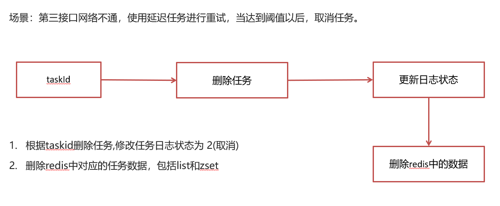

3. **消费任务**

   

4. **未来数据定时刷新**

   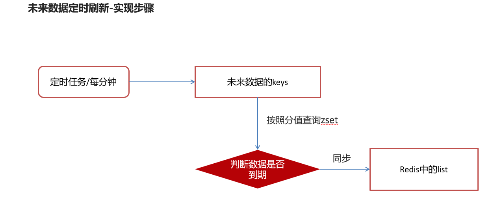

   > **关于查询zest**：
   >
   > 方案一： keys模糊匹配
   >
   > > keys的模糊匹配功能很方便也很强大，但是在生产环境需要慎用！开发中使用keys的模糊匹配却发现redis的CPU使用率极高，所以公司的redis生产环境将keys命令禁用了！redis是单线程，会被堵塞
   >
   > 方案二：scan(类似分页查询，**推荐**)
   >
   > > SCAN 命令是一个基于游标的迭代器，SCAN命令每次被调用之后， 都会向用户返回一个新的游标， 用户在下次迭代时需要使用这个新游标作为SCAN命令的游标参数， 以此来延续之前的迭代过程。
   >
   > **关于如何同步问题**：
   >
   > > 两件事：
   > >
   > > 第一：从zset中查出数据，并删除
   > >
   > > 第二：把数据存入到list中
   >
   > 使用**redis管道**(原理和缓存池相似)来进行同步

5. **分布式锁解决集群下的方法抢占执行**

   sexnx （SET if Not eXists） 命令在指定的 key 不存在时，为 key 设置指定的值。   

   

   这种加锁的思路是，如果 key 不存在则为 key 设置 value，如果 key 已存在则 SETNX 命令不做任何操作

   - 客户端A请求服务器设置key的值，如果设置成功就表示加锁成功
   - 客户端B也去请求服务器设置key的值，如果返回失败，那么就代表加锁失败
   - 客户端A执行代码完成，删除锁
   - 客户端B在等待一段时间后再去请求设置key的值，设置成功
   - 客户端B执行代码完成，删除锁

   在工具类CacheService中添加方法

   ```java
   /**
    * 加锁
    *
    * @param name
    * @param expire
    * @return
    */
   public String tryLock(String name, long expire) {
       name = name + "_lock";
       String token = UUID.randomUUID().toString();
       RedisConnectionFactory factory = stringRedisTemplate.getConnectionFactory();
       RedisConnection conn = factory.getConnection();
       try {
   
           //参考redis命令：
           //set key value [EX seconds] [PX milliseconds] [NX|XX]
           Boolean result = conn.set(
                   name.getBytes(),
                   token.getBytes(),
                   Expiration.from(expire, TimeUnit.MILLISECONDS),
                   RedisStringCommands.SetOption.SET_IF_ABSENT //NX
           );
           if (result != null && result)
               return token;
       } finally {
           RedisConnectionUtils.releaseConnection(conn, factory,false);
       }
       return null;
   }
   ```

   修改未来数据定时刷新的方法，如下：

   ```java
   /**
    * 未来数据定时刷新
    */
   @Scheduled(cron = "0 */1 * * * ?")
   public void refresh(){
   
       String token = cacheService.tryLock("FUTURE_TASK_SYNC", 1000 * 30);
       if(StringUtils.isNotBlank(token)){
           log.info("未来数据定时刷新---定时任务");
   
           //获取所有未来数据的集合key
           Set<String> futureKeys = cacheService.scan(ScheduleConstants.FUTURE + "*");
           for (String futureKey : futureKeys) {//future_100_50
   
               //获取当前数据的key  topic
               String topicKey = ScheduleConstants.TOPIC+futureKey.split(ScheduleConstants.FUTURE)[1];
   
               //按照key和分值查询符合条件的数据
               Set<String> tasks = cacheService.zRangeByScore(futureKey, 0, System.currentTimeMillis());
   
               //同步数据
               if(!tasks.isEmpty()){
                   cacheService.refreshWithPipeline(futureKey,topicKey,tasks);
                   log.info("成功的将"+futureKey+"刷新到了"+topicKey);
               }
           }
       }
   }
   ```

   

6. **数据库同步到redis**

   > 步骤：
   >
   > 1.清理缓存中的数据
   >
   > 2.查询小于未来5分钟的所有任务
   >
   > 3.新增任务到redis

### 2.8.3 延迟队列解决精准时间发布文章

> 需要提供对外接口，
>
> 

这里面需要序列化

序列化工具对比

- JdkSerialize：java内置的序列化能将实现了Serilazable接口的对象进行序列化和反序列化， ObjectOutputStream的writeObject()方法可序列化对象生成字节数组
- Protostuff：google开源的protostuff采用更为紧凑的二进制数组，**表现更加优异**，然后使用protostuff的编译工具生成pojo类

拷贝资料中的两个类到heima-leadnews-utils下

Protostuff需要引导依赖：

```xml
<dependency>
    <groupId>io.protostuff</groupId>
    <artifactId>protostuff-core</artifactId>
    <version>1.6.0</version>
</dependency>

<dependency>
    <groupId>io.protostuff</groupId>
    <artifactId>protostuff-runtime</artifactId>
    <version>1.6.0</version>
</dependency>
```

## 2.9 文章上下架（kafka）

**需求分析：**

- 已发表且已上架的文章可以下架

- 已发表且已下架的文章可以上架


> 这里如果不使用kafka就要使用feign，但是使用kafka消息队列会解耦和流量削峰

## 2.10 文章搜索

- 文章搜索

  - ElasticSearch环境搭建

  - 索引库创建

  - 文章搜索多条件复合查询

  - 索引数据同步

- 搜索历史记录

  - Mongodb环境搭建

  - 异步保存搜索历史

  - 查看搜索历史列表

  - 删除搜索历史

- 联想词查询

  - 联想词的来源

  - 联想词功能实现

### 2.10.1 搜索（es）

**需求分析**：

- 用户输入关键可搜索文章列表

- 关键词高亮显示

- 文章列表展示与home展示一样，当用户点击某一篇文章，可查看文章详情

> 为了加快检索的效率，在查询的时候不会直接从数据库中查询文章，需要在elasticsearch中进行高速检索。


### 2.10.2 搜索历史记录（mongoDB）

**需求分析**：

- 展示用户的搜索记录10条，按照搜索关键词的时间倒序
- 可以删除搜索记录
- 保存历史记录，保存10条，多余的则删除最久的历史记录
  这里删除是直接在mongodb中删除，不涉及mysql


> 用户的搜索记录，需要给每一个用户都保存一份，数据量较大，要求加载速度快，通常这样的数据存储到mongodb更合适，不建议直接存储到关系型数据库中

#### 2.10.2.1 MongoDB安装及集成

拉取镜像

```
docker pull mongo
```

创建容器

```
docker run -di --name mongo-service --restart=always -p 27017:27017 -v ~/data/mongodata:/data mongo
```

其中有三项配置比较关键：

第一：mongo依赖

```xml
<dependency>
    <groupId>org.springframework.boot</groupId>
    <artifactId>spring-boot-starter-data-mongodb</artifactId>
</dependency>
```

第二：mongo配置

```yaml
server:
  port: 9998
spring:
  data:
    mongodb:
      host: 192.168.200.130
      port: 27017
      database: leadnews-history
```

第三：映射

#### 2.10.2.2 保存搜索记录

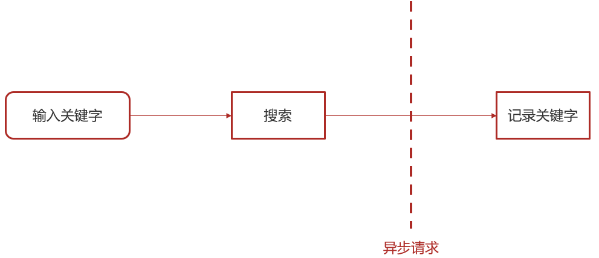

用户输入关键字进行搜索的异步记录关键字

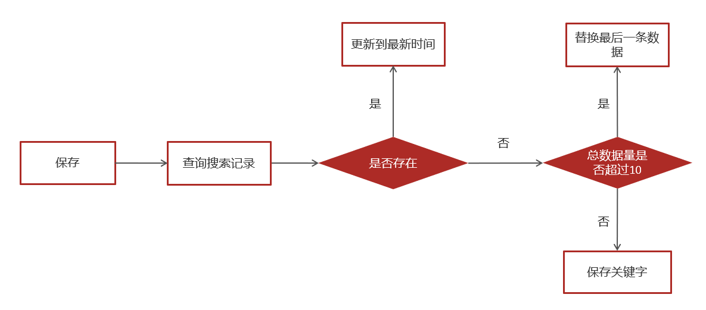

> 实现步骤
>
> **1.搜索微服务集成mongodb**
>
> ①：pom依赖
>
> ```xml
> <dependency>
>  <groupId>org.springframework.boot</groupId>
>  <artifactId>spring-boot-starter-data-mongodb</artifactId>
> </dependency>
> ```
>
> ②：nacos配置
>
> ```yaml
> spring:
> data:
> mongodb:
>  host: 192.168.200.130
>  port: 27017
>  database: leadnews-history
> ```
>
> ③：在当天资料中找到对应的实体类拷贝到搜索微服务下
>
> 2.创建ApUserSearchService新增insert方法
>
> ```java
> public interface ApUserSearchService {
> 
>  /**
>      * 保存用户搜索历史记录
>      * @param keyword
>      * @param userId
>      */
>     public void insert(String keyword,Integer userId);
> }
> ```
>
> **2.新增insert方法**
>
>   1.查询当前用户的搜索关键词
>
>   2.存在 更新创建时间
>
>   3.不存在，判断当前历史记录总数量是否超过10
>
> **3.参考自媒体相关微服务，在搜索微服务中获取当前登录的用户**
>
> 即在微服务网关中设置本地线程
>
> **4.在ArticleSearchService的search方法中调用保存历史记录**
>
> **5.保存历史记录中开启异步调用，添加注解@Async**
>
> **6.在搜索微服务引导类上开启异步调用**
>
> **7.测试，搜索后查看结果**

#### 2.10.2.3 关键字联想词

- 根据用户输入的关键字展示联想词

通常是网上搜索频率比较高的一些词，通常在企业中有两部分来源：

第一：自己维护搜索词

通过分析用户搜索频率较高的词，按照排名作为搜索词

第二：第三方获取

关键词规划师（百度）、5118、爱站网

## 2.11 精度问题

场景：long类型精度经过传送丢失问题

### 2.11.1 jackson进行序列化和反序列化解决


- 当后端响应给前端的数据中包含了id或者特殊标识（可自定义）的时候，把当前数据进行转换为String类型
- 当前端传递后后端的dto中有id或者特殊标识（可自定义）的时候，把当前数据转为Integer或Long类型。


## 2.12 热点文章处理

目前实现的思路：从数据库直接按照发布时间倒序查询

- 问题1：

  如何访问量较大，直接查询数据库，压力较大

- 问题2：

  新发布的文章会展示在前面，并不是热点文章

**处理思路**：

把热点数据存入**redis**进行展示

判断文章是否是热点，有几项标准： 点赞数量，评论数量，阅读数量，收藏数量

计算文章热度，有两种方案：

- 定时计算文章热度

- 实时计算文章热度


### 2.12.1 定时计算


设计权重


步骤：

1 查询前5天的文章数据

2 计算文章的分值

3 为每个频道缓存30条分值较高的文章


### 2.12.2 实时计算

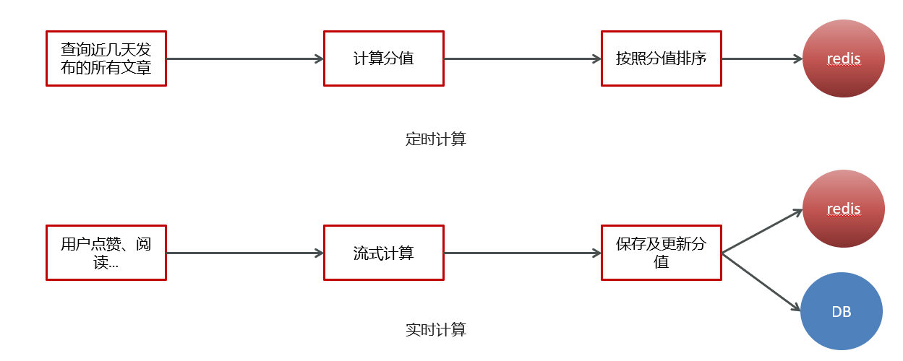

实时计算

- 用户行为发送消息

- kafkaStream聚合处理消息

- 更新文章行为数量

- 替换热点文章数据


#### 2.12.2.1 概念

> 一般流式计算会与批量计算相比较。在流式计算模型中，输入是持续的，可以认为在时间上是无界的，也就意味着，永远拿不到全量数据去做计算。同时，计算结果是持续输出的，也即计算结果在时间上也是无界的。流式计算一般对实时性要求较高，同时一般是先定义目标计算，然后数据到来之后将计算逻辑应用于数据。同时为了提高计算效率，往往尽可能采用增量计算代替全量计算。

#### 2.12.2.2 应用场景

- 日志分析

  网站的用户访问日志进行实时的分析，计算访问量，用户画像，留存率等等，实时的进行数据分析，帮助企业进行决策

- 大屏看板统计

  可以实时的查看网站注册数量，订单数量，购买数量，金额等。

- 公交实时数据

  可以随时更新公交车方位，计算多久到达站牌等

- 实时文章分值计算

  头条类文章的分值计算，通过用户的行为实时文章的分值，分值越高就越被推荐。

该项目场景是 ：今日热榜

#### 2.12.2.3 技术选择

- Hadoop 

  

- Apche Storm

  Storm 是一个分布式实时大数据处理系统，可以帮助我们方便地处理海量数据，具有高可靠、高容错、高扩展的特点。是流式框架，有很高的数据吞吐能力。

- Kafka Stream 

  可以轻松地将其嵌入任何Java应用程序中，并与用户为其流应用程序所拥有的任何现有打包，部署和操作工具集成。

#### 2.12.2.4 具体实践


# 3 新技术

## 3.1 freemarker

### 3.1.1 freemarker介绍

​	FreeMarker 是一款 模板引擎： 即一种基于模板和要改变的数据， 并用来生成输出文本(HTML网页，电子邮件，配置文件，源代码等)的通用工具。 它不是面向最终用户的，而是一个Java类库，是一款程序员可以嵌入他们所开发产品的组件。

​	模板编写为FreeMarker Template Language (FTL)。它是简单的，专用的语言， *不是* 像PHP那样成熟的编程语言。 那就意味着要准备数据在真实编程语言中来显示，比如数据库查询和业务运算， 之后模板显示已经准备好的数据。在模板中，你可以专注于如何展现数据， 而在模板之外可以专注于要展示什么数据。 


### 3.1.2 freemarker入门

> freemarker作为springmvc一种视图格式，默认情况下SpringMVC支持freemarker视图格式。
>
> 需要创建Spring Boot+Freemarker工程用于测试模板。

> 1. 创建测试工程
> 2. 配置文件
> 3. 创建模型类
> 4. 创建模板
> 5. 创建controller
> 6. 创建启动类
> 7. 测试

1. **创建测试工程**

   创建一个freemarker-demo 的测试工程专门用于freemarker的功能测试与模板的测试。

   pom.xml如下

   ```xml
   <?xml version="1.0" encoding="UTF-8"?>
   <project xmlns="http://maven.apache.org/POM/4.0.0"
            xmlns:xsi="http://www.w3.org/2001/XMLSchema-instance"
            xsi:schemaLocation="http://maven.apache.org/POM/4.0.0 http://maven.apache.org/xsd/maven-4.0.0.xsd">
       <parent>
           <artifactId>heima-leadnews-test</artifactId>
           <groupId>com.heima</groupId>
           <version>1.0-SNAPSHOT</version>
       </parent>
       <modelVersion>4.0.0</modelVersion>
   
       <artifactId>freemarker-demo</artifactId>
   
       <properties>
           <maven.compiler.source>8</maven.compiler.source>
           <maven.compiler.target>8</maven.compiler.target>
       </properties>
   
       <dependencies>
           <dependency>
               <groupId>org.springframework.boot</groupId>
               <artifactId>spring-boot-starter-web</artifactId>
           </dependency>
           <dependency>
               <groupId>org.springframework.boot</groupId>
               <artifactId>spring-boot-starter-freemarker</artifactId>
           </dependency>
   
           <dependency>
               <groupId>org.springframework.boot</groupId>
               <artifactId>spring-boot-starter-test</artifactId>
           </dependency>
           <!-- lombok -->
           <dependency>
               <groupId>org.projectlombok</groupId>
               <artifactId>lombok</artifactId>
           </dependency>
   
           <!-- apache 对 java io 的封装工具库 -->
           <dependency>
               <groupId>org.apache.commons</groupId>
               <artifactId>commons-io</artifactId>
               <version>1.3.2</version>
           </dependency>
       </dependencies>
   
   </project>
   ```

2. **配置文件**

   配置application.yml

   ```yaml
   server:
     port: 8881 #服务端口
   spring:
     application:
       name: freemarker-demo #指定服务名
     freemarker:
       cache: false  #关闭模板缓存，方便测试
       settings:
         template_update_delay: 0 #检查模板更新延迟时间，设置为0表示立即检查，如果时间大于0会有缓存不方便进行模板测试
       suffix: .ftl               #指定Freemarker模板文件的后缀名
   ```

3. **创建模型类**

   在freemarker的测试工程下创建模型类型用于测试

   

   ```java
   package com.heima.freemarker.entity;
   
   import lombok.Data;
   
   import java.util.Date;
   
   @Data
   public class Student {
       private String name;//姓名
       private int age;//年龄
       private Date birthday;//生日
       private Float money;//钱包
   }
   ```

4. **创建模板**

   在resources下创建templates，此目录为freemarker的默认模板存放目录。

   在templates下创建模板文件 01-basic.ftl ，模板中的插值表达式最终会被freemarker替换成具体的数据。

   ```html
   <!DOCTYPE html>
   <html>
   <head>
       <meta charset="utf-8">
       <title>Hello World!</title>
   </head>
   <body>
   <b>普通文本 String 展示：</b><br><br>
   Hello ${name} <br>
   <hr>
   <b>对象Student中的数据展示：</b><br/>
   姓名：${stu.name}<br/>
   年龄：${stu.age}
   <hr>
   </body>
   </html>
   ```

   

5. **创建controller**

   创建Controller类，向Map中添加name，最后返回模板文件。

   ```java
   package com.xuecheng.test.freemarker.controller;
   
   import org.springframework.beans.factory.annotation.Autowired;
   import org.springframework.stereotype.Controller;
   import org.springframework.web.bind.annotation.RequestMapping;
   import org.springframework.web.client.RestTemplate;
   
   import java.util.Map;
   
   @Controller
   public class HelloController {
   
       @GetMapping("/basic")
       public String test(Model model) {
   
   
           //1.纯文本形式的参数
           model.addAttribute("name", "freemarker");
           //2.实体类相关的参数
           
           Student student = new Student();
           student.setName("小明");
           student.setAge(18);
           model.addAttribute("stu", student);
   
           return "01-basic";
       }
   }
   ```

   01-basic.ftl，使用插值表达式填充数据

6. **创建启动类**

   ```java
   package com.heima.freemarker;
   
   import org.springframework.boot.SpringApplication;
   import org.springframework.boot.autoconfigure.SpringBootApplication;
   
   @SpringBootApplication
   public class FreemarkerDemotApplication {
       public static void main(String[] args) {
           SpringApplication.run(FreemarkerDemotApplication.class,args);
       }
   }
   ```

   

7. **测试**

   请求：http://localhost:8881/basic

3.1.3 freemarker基础

> 1. 基础语法种类
> 2. 集合指令（list和map）
> 3. if指令
> 4. 运算符
> 5. 空值处理
> 6. 内建函数

1. **基础语法种类**

    1、注释，即<#--  -->，介于其之间的内容会被freemarker忽略

   ```velocity
   <#--我是一个freemarker注释-->
   ```

     2、插值（Interpolation）：即 **`${..}`** 部分,freemarker会用真实的值代替**`${..}`**

   ```velocity
   Hello ${name}
   ```

     3、FTL指令：和HTML标记类似，名字前加#予以区分，Freemarker会解析标签中的表达式或逻辑。

   ```velocity
   <# >FTL指令</#> 
   ```

     4、文本，仅文本信息，这些不是freemarker的注释、插值、FTL指令的内容会被freemarker忽略解析，直接输出内容。

   ```velocity
   <#--freemarker中的普通文本-->
   我是一个普通的文本
   ```

2. **集合指令（list和map）**

   1、数据模型：

   在HelloController中新增如下方法：

   ```java
   @GetMapping("/list")
   public String list(Model model){
   
       //------------------------------------
       Student stu1 = new Student();
       stu1.setName("小强");
       stu1.setAge(18);
       stu1.setMoney(1000.86f);
       stu1.setBirthday(new Date());
   
       //小红对象模型数据
       Student stu2 = new Student();
       stu2.setName("小红");
       stu2.setMoney(200.1f);
       stu2.setAge(19);
   
       //将两个对象模型数据存放到List集合中
       List<Student> stus = new ArrayList<>();
       stus.add(stu1);
       stus.add(stu2);
   
       //向model中存放List集合数据
       model.addAttribute("stus",stus);
   
       //------------------------------------
   
       //创建Map数据
       HashMap<String,Student> stuMap = new HashMap<>();
       stuMap.put("stu1",stu1);
       stuMap.put("stu2",stu2);
       // 3.1 向model中存放Map数据
       model.addAttribute("stuMap", stuMap);
   
       return "02-list";
   }
   ```

   2、模板：

   在templates中新增`02-list.ftl`文件

   ```html
   <!DOCTYPE html>
   <html>
   <head>
       <meta charset="utf-8">
       <title>Hello World!</title>
   </head>
   <body>
       
   <#-- list 数据的展示 -->
   <b>展示list中的stu数据:</b>
   <br>
   <br>
   <table>
       <tr>
           <td>序号</td>
           <td>姓名</td>
           <td>年龄</td>
           <td>钱包</td>
       </tr>
   </table>
   <hr>
       
   <#-- Map 数据的展示 -->
   <b>map数据的展示：</b>
   <br/><br/>
   <a href="###">方式一：通过map['keyname'].property</a><br/>
   输出stu1的学生信息：<br/>
   姓名：<br/>
   年龄：<br/>
   <br/>
   <a href="###">方式二：通过map.keyname.property</a><br/>
   输出stu2的学生信息：<br/>
   姓名：<br/>
   年龄：<br/>
   
   <br/>
   <a href="###">遍历map中两个学生信息：</a><br/>
   <table>
       <tr>
           <td>序号</td>
           <td>姓名</td>
           <td>年龄</td>
           <td>钱包</td> 
       </tr>
   </table>
   <hr>
    
   </body>
   </html>
   ```

   实例代码：

   ```html
   <!DOCTYPE html>
   <html>
   <head>
       <meta charset="utf-8">
       <title>Hello World!</title>
   </head>
   <body>
       
   <#-- list 数据的展示 -->
   <b>展示list中的stu数据:</b>
   <br>
   <br>
   <table>
       <tr>
           <td>序号</td>
           <td>姓名</td>
           <td>年龄</td>
           <td>钱包</td>
       </tr>
       <#list stus as stu>
           <tr>
               <td>${stu_index+1}</td>
               <td>${stu.name}</td>
               <td>${stu.age}</td>
               <td>${stu.money}</td>
           </tr>
       </#list>
   
   </table>
   <hr>
       
   <#-- Map 数据的展示 -->
   <b>map数据的展示：</b>
   <br/><br/>
   <a href="###">方式一：通过map['keyname'].property</a><br/>
   输出stu1的学生信息：<br/>
   姓名：${stuMap['stu1'].name}<br/>
   年龄：${stuMap['stu1'].age}<br/>
   <br/>
   <a href="###">方式二：通过map.keyname.property</a><br/>
   输出stu2的学生信息：<br/>
   姓名：${stuMap.stu2.name}<br/>
   年龄：${stuMap.stu2.age}<br/>
   
   <br/>
   <a href="###">遍历map中两个学生信息：</a><br/>
   <table>
       <tr>
           <td>序号</td>
           <td>姓名</td>
           <td>年龄</td>
           <td>钱包</td>
       </tr>
       <#list stuMap?keys as key >
           <tr>
               <td>${key_index}</td>
               <td>${stuMap[key].name}</td>
               <td>${stuMap[key].age}</td>
               <td>${stuMap[key].money}</td>
           </tr>
       </#list>
   </table>
   <hr>
    
   </body>
   </html>
   ```

   👆上面代码解释：

   ${k_index}：
   	index：得到循环的下标，使用方法是在stu后边加"_index"，它的值是从0开始

   

3. **if指令**

   ​	 if 指令即判断指令，是常用的FTL指令，freemarker在解析时遇到if会进行判断，条件为真则输出if中间的内容，否则跳过内容不再输出。

   - 指令格式

   ```html
   <#if ></if>
   ```

   

   1、数据模型：

   使用list指令中测试数据模型，判断名称为小红的数据字体显示为红色。

   2、模板：

   ```velocity
   <table>
       <tr>
           <td>姓名</td>
           <td>年龄</td>
           <td>钱包</td>
       </tr>
       <#list stus as stu>
           <tr>
               <td >${stu.name}</td>
               <td>${stu.age}</td>
               <td >${stu.mondy}</td>
           </tr>
       </#list>
   
   </table>
   ```

   

   实例代码：

   ```velocity
   <table>
       <tr>
           <td>姓名</td>
           <td>年龄</td>
           <td>钱包</td>
       </tr>
       <#list stus as stu >
           <#if stu.name='小红'>
               <tr style="color: red">
                   <td>${stu_index}</td>
                   <td>${stu.name}</td>
                   <td>${stu.age}</td>
                   <td>${stu.money}</td>
               </tr>
               <#else >
               <tr>
                   <td>${stu_index}</td>
                   <td>${stu.name}</td>
                   <td>${stu.age}</td>
                   <td>${stu.money}</td>
               </tr>
           </#if>
       </#list>
   </table>
   ```

   > FTL中= 和 == 一样

   

   3、输出：

   姓名为“小红”的字体颜色显示为红色。

4. **运算符**

   **1、算数运算符**

   FreeMarker表达式中完全支持算术运算,FreeMarker支持的算术运算符包括:

   - 加法： `+`
   - 减法： `-`
   - 乘法： `*`
   - 除法： `/`
   - 求模 (求余)： `%`

   

   模板代码

   ```html
   <b>算数运算符</b>
   <br/><br/>
       100+5 运算：  ${100 + 5 }<br/>
       100 - 5 * 5运算：${100 - 5 * 5}<br/>
       5 / 2运算：${5 / 2}<br/>
       12 % 10运算：${12 % 10}<br/>
   <hr>
   ```

   除了 + 运算以外，其他的运算只能和 number 数字类型的计算。

   

   

   

   **2、比较运算符**

   - **`=`**或者**`==`**:判断两个值是否相等. 
   - **`!=`**:判断两个值是否不等. 
   - **`>`**或者**`gt`**:判断左边值是否大于右边值 
   - **`>=`**或者**`gte`**:判断左边值是否大于等于右边值 
   - **`<`**或者**`lt`**:判断左边值是否小于右边值 
   - **`<=`**或者**`lte`**:判断左边值是否小于等于右边值 

   

   = 和 == 模板代码

   ```html
   <!DOCTYPE html>
   <html>
   <head>
       <meta charset="utf-8">
       <title>Hello World!</title>
   </head>
   <body>
   
       <b>比较运算符</b>
       <br/>
       <br/>
   
       <dl>
           <dt> =/== 和 != 比较：</dt>
           <dd>
               <#if "xiaoming" == "xiaoming">
                   字符串的比较 "xiaoming" == "xiaoming"
               </#if>
           </dd>
           <dd>
               <#if 10 != 100>
                   数值的比较 10 != 100
               </#if>
           </dd>
       </dl>
   
   
   
       <dl>
           <dt>其他比较</dt>
           <dd>
               <#if 10 gt 5 >
                   形式一：使用特殊字符比较数值 10 gt 5
               </#if>
           </dd>
           <dd>
               <#-- 日期的比较需要通过?date将属性转为data类型才能进行比较 -->
               <#if (date1?date >= date2?date)>
                   形式二：使用括号形式比较时间 date1?date >= date2?date
               </#if>
           </dd>
       </dl>
   
       <br/>
   <hr>
   </body>
   </html>
   ```

   Controller 的 数据模型代码

   ```java
   @GetMapping("operation")
   public String testOperation(Model model) {
       //构建 Date 数据
       Date now = new Date();
       model.addAttribute("date1", now);
       model.addAttribute("date2", now);
       
       return "03-operation";
   }
   ```

   

   **比较运算符注意**

   - **`=`**和**`!=`**可以用于字符串、数值和日期来比较是否相等
   - **`=`**和**`!=`**两边必须是相同类型的值,否则会产生错误
   - 字符串 **`"x"`** 、**`"x "`** 、**`"X"`**比较是不等的.因为FreeMarker是精确比较
   - 其它的运行符可以作用于数字和日期,但不能作用于字符串
   - 使用**`gt`**等字母运算符代替**`>`**会有更好的效果,因为 FreeMarker会把**`>`**解释成FTL标签的结束字符
   - 可以使用括号来避免这种情况,如:**`<#if (x>y)>`**

   

   

   **3、逻辑运算符**

   - 逻辑与:&& 
   - 逻辑或:|| 
   - 逻辑非:! 

   逻辑运算符只能作用于布尔值,否则将产生错误 。

   

   模板代码

   ```html
   <b>逻辑运算符</b>
       <br/>
       <br/>
       <#if (10 lt 12 )&&( 10  gt  5 )  >
           (10 lt 12 )&&( 10  gt  5 )  显示为 true
       </#if>
       <br/>
       <br/>
       <#if !false>
           false 取反为true
       </#if>
   <hr>
   ```

   

5. **空值处理**

   **1、判断某变量是否存在使用 “??”**

   用法为:variable??,如果该变量存在,返回true,否则返回false 

   例：为防止stus为空报错可以加上判断如下：

   ```velocity
       <#if stus??>
       <#list stus as stu>
       	......
       </#list>
       </#if>
   ```

   

   **2、缺失变量默认值使用 “!”**

   - 使用!要以指定一个默认值，当变量为空时显示默认值

     例：  ${name!''}表示如果name为空显示空字符串。

   

   - 如果是嵌套对象则建议使用（）括起来

     例： ${(stu.bestFriend.name)!''}表示，如果stu或bestFriend或name为空默认显示空字符串。

   

6. **内建函数**

   内建函数语法格式： **`变量+?+函数名称`**  

   **1、和到某个集合的大小**

   **`${集合名?size}`**

   

   **2、日期格式化**

   显示年月日: **`${today?date}`** 
   显示时分秒：**`${today?time}`**   
   显示日期+时间：**`${today?datetime}`**   
   自定义格式化：  **`${today?string("yyyy年MM月")}`**

   

   **3、内建函数`c`**

   model.addAttribute("point", 102920122);

   point是数字型，使用${point}会显示这个数字的值，每三位使用逗号分隔。

   如果不想显示为每三位分隔的数字，可以使用c函数将数字型转成字符串输出

   **`${point?c}`**

   

   **4、将json字符串转成对象**

   一个例子：

   其中用到了 assign标签，assign的作用是定义一个变量。

   ```velocity
   <#assign text="{'bank':'工商银行','account':'10101920201920212'}" />
   <#assign data=text?eval />
   开户行：${data.bank}  账号：${data.account}
   ```

   

   模板代码：

   ````HTML
   <!DOCTYPE html>
   <html>
   <head>
       <meta charset="utf-8">
       <title>inner Function</title>
   </head>
   <body>
   
       <b>获得集合大小</b><br>
   
       集合大小：
       <hr>
   
   
       <b>获得日期</b><br>
   
       显示年月日:      <br>
   
       显示时分秒：<br>
   
       显示日期+时间：<br>
   
       自定义格式化：  <br>
   
       <hr>
   
       <b>内建函数C</b><br>
       没有C函数显示的数值： <br>
   
       有C函数显示的数值：
   
       <hr>
   
       <b>声明变量assign</b><br>
   
   
   <hr>
   </body>
   </html>
   ````

   

   

   内建函数模板页面：

   ```velocity
   <!DOCTYPE html>
   <html>
   <head>
       <meta charset="utf-8">
       <title>inner Function</title>
   </head>
   <body>
   
       <b>获得集合大小</b><br>
   
       集合大小：${stus?size}
       <hr>
   
   
       <b>获得日期</b><br>
   
       显示年月日: ${today?date}       <br>
   
       显示时分秒：${today?time}<br>
   
       显示日期+时间：${today?datetime}<br>
   
       自定义格式化：  ${today?string("yyyy年MM月")}<br>
   
       <hr>
   
       <b>内建函数C</b><br>
       没有C函数显示的数值：${point} <br>
   
       有C函数显示的数值：${point?c}
   
       <hr>
   
       <b>声明变量assign</b><br>
       <#assign text="{'bank':'工商银行','account':'10101920201920212'}" />
       <#assign data=text?eval />
       开户行：${data.bank}  账号：${data.account}
   
   <hr>
   </body>
   </html>
   ```

   内建函数Controller数据模型：

   ```java
   @GetMapping("innerFunc")
   public String testInnerFunc(Model model) {
       //1.1 小强对象模型数据
       Student stu1 = new Student();
       stu1.setName("小强");
       stu1.setAge(18);
       stu1.setMoney(1000.86f);
       stu1.setBirthday(new Date());
       //1.2 小红对象模型数据
       Student stu2 = new Student();
       stu2.setName("小红");
       stu2.setMoney(200.1f);
       stu2.setAge(19);
       //1.3 将两个对象模型数据存放到List集合中
       List<Student> stus = new ArrayList<>();
       stus.add(stu1);
       stus.add(stu2);
       model.addAttribute("stus", stus);
       // 2.1 添加日期
       Date date = new Date();
       model.addAttribute("today", date);
       // 3.1 添加数值
       model.addAttribute("point", 102920122);
       return "04-innerFunc";
   }
   ```

   

   

### 3.1.4 静态化测试

> 1. 需求分析
> 2. 静态化测试

1. **需求分析**

   使用freemarker原生Api将页面生成html文件，本节测试html文件生成的方法：

2. **静态化测试**

   根据模板文件生成html文件

   ①：修改application.yml文件，添加以下模板存放位置的配置信息，完整配置如下：

   ```yaml
   server:
     port: 8881 #服务端口
   spring:
     application:
       name: freemarker-demo #指定服务名
     freemarker:
       cache: false  #关闭模板缓存，方便测试
       settings:
         template_update_delay: 0 #检查模板更新延迟时间，设置为0表示立即检查，如果时间大于0会有缓存不方便进行模板测试
       suffix: .ftl               #指定Freemarker模板文件的后缀名
       template-loader-path: classpath:/templates   #模板存放位置
   ```

   ②：在test下创建测试类

   ```java
   package com.heima.freemarker.test;
   
   
   import com.heima.freemarker.FreemarkerDemoApplication;
   import com.heima.freemarker.entity.Student;
   import freemarker.template.Configuration;
   import freemarker.template.Template;
   import freemarker.template.TemplateException;
   import org.junit.Test;
   import org.junit.runner.RunWith;
   import org.springframework.beans.factory.annotation.Autowired;
   import org.springframework.boot.test.context.SpringBootTest;
   import org.springframework.test.context.junit4.SpringRunner;
   
   import java.io.FileWriter;
   import java.io.IOException;
   import java.util.*;
   
   @SpringBootTest(classes = FreemarkerDemoApplication.class)
   @RunWith(SpringRunner.class)
   public class FreemarkerTest {
   
       @Autowired
       private Configuration configuration;
   
       @Test
       public void test() throws IOException, TemplateException {
           //freemarker的模板对象，获取模板
           Template template = configuration.getTemplate("02-list.ftl");
           Map params = getData();
           //合成
           //第一个参数 数据模型
           //第二个参数  输出流
           template.process(params, new FileWriter("d:/list.html"));
       }
   
       private Map getData() {
           Map<String, Object> map = new HashMap<>();
   
           //小强对象模型数据
           Student stu1 = new Student();
           stu1.setName("小强");
           stu1.setAge(18);
           stu1.setMoney(1000.86f);
           stu1.setBirthday(new Date());
   
           //小红对象模型数据
           Student stu2 = new Student();
           stu2.setName("小红");
           stu2.setMoney(200.1f);
           stu2.setAge(19);
   
           //将两个对象模型数据存放到List集合中
           List<Student> stus = new ArrayList<>();
           stus.add(stu1);
           stus.add(stu2);
   
           //向map中存放List集合数据
           map.put("stus", stus);
   
   
           //创建Map数据
           HashMap<String, Student> stuMap = new HashMap<>();
           stuMap.put("stu1", stu1);
           stuMap.put("stu2", stu2);
           //向map中存放Map数据
           map.put("stuMap", stuMap);
   
           //返回Map
           return map;
       }
   }
   ```

   

## 3.2 MinIO

### 3.2.1 MinIO简介与特点

1. **简介**

   > MinIO基于Apache License v2.0开源协议的对象存储服务，可以做为云存储的解决方案用来保存海量的图片，视频，文档。由于采用Golang实现，服务端可以工作在Windows,Linux, OS X和FreeBSD上。配置简单，基本是复制可执行程序，单行命令可以运行起来。
   >
   > MinIO兼容亚马逊S3云存储服务接口，非常适合于存储大容量非结构化的数据，例如图片、视频、日志文件、备份数据和容器/虚拟机镜像等，而一个对象文件可以是任意大小，从几kb到最大5T不等。
   >
   > **S3 （ Simple Storage Service简单存储服务）**
   >
   > 基本概念
   >
   > - bucket – 类比于文件系统的目录
   > - Object – 类比文件系统的文件
   > - Keys – 类比文件名
   >
   > 官网文档：http://docs.minio.org.cn/docs/

2. **特点**

   > - 数据保护
   >
   >   Minio使用Minio Erasure Code（纠删码）来防止硬件故障。即便损坏一半以上的driver，但是仍然可以从中恢复。
   >
   > - 高性能
   >
   >   作为高性能对象存储，在标准硬件条件下它能达到55GB/s的读、35GB/s的写速率
   >
   > - 可扩容
   >
   >   不同MinIO集群可以组成联邦，并形成一个全局的命名空间，并跨越多个数据中心
   >
   > - SDK支持
   >
   >   基于Minio轻量的特点，它得到类似Java、Python或Go等语言的sdk支持
   >
   > - 有操作页面
   >
   >   面向用户友好的简单操作界面，非常方便的管理Bucket及里面的文件资源
   >
   > - 功能简单
   >
   >   这一设计原则让MinIO不容易出错、更快启动
   >
   > - 丰富的API
   >
   >   支持文件资源的分享连接及分享链接的过期策略、存储桶操作、文件列表访问及文件上传下载的基本功能等。
   >
   > - 文件变化主动通知
   >
   >   存储桶（Bucket）如果发生改变,比如上传对象和删除对象，可以使用存储桶事件通知机制进行监控，并通过以下方式发布出去:AMQP、MQTT、Elasticsearch、Redis、NATS、MySQL、Kafka、Webhooks等。

### 3.2.2 安装使用

> 步骤：
>
> [Docker 搭建 Minio 容器 (完整详细版)_docker minio-CSDN博客](https://blog.csdn.net/BThinker/article/details/125412751)
>
> 1. 拉取镜像
> 2. 创建容器
> 3. 访问minio系统

1. **拉取镜像**

   ```
   docker pull minio/minio
   ```

2. **创建容器**

   我们可以使用docker进行环境部署和启动

   ```yaml
   docker run -p 9000:9000 -p 9090:9090 \
        --net=host \
        --name minio \
        -d --restart=always \
        -e "MINIO_ACCESS_KEY=minioadmin" \
        -e "MINIO_SECRET_KEY=minioadmin" \
        -v /home/minio/data:/data \
        -v /home/minio/config:/root/.minio \
        minio/minio server \
        /data --console-address ":9090" -address ":9000"
   ```

3. **访问minio系统**

   [http://192.168.200.130:9000](http://192.168.200.130:9000/)


#### 3.2.2.1 创建工程，导入pom依赖

> 步骤： 
>
> 1. 引入依赖
> 2. 创建测试类

创建minio-demo,对应pom如下

```xml
<?xml version="1.0" encoding="UTF-8"?>
<project xmlns="http://maven.apache.org/POM/4.0.0"
         xmlns:xsi="http://www.w3.org/2001/XMLSchema-instance"
         xsi:schemaLocation="http://maven.apache.org/POM/4.0.0 http://maven.apache.org/xsd/maven-4.0.0.xsd">
    <parent>
        <artifactId>heima-leadnews-test</artifactId>
        <groupId>com.heima</groupId>
        <version>1.0-SNAPSHOT</version>
    </parent>
    <modelVersion>4.0.0</modelVersion>

    <artifactId>minio-demo</artifactId>

    <properties>
        <maven.compiler.source>8</maven.compiler.source>
        <maven.compiler.target>8</maven.compiler.target>
    </properties>

    <dependencies>

        <dependency>
            <groupId>io.minio</groupId>
            <artifactId>minio</artifactId>
            <version>7.1.0</version>
        </dependency>
        <dependency>
            <groupId>org.springframework.boot</groupId>
            <artifactId>spring-boot-starter-web</artifactId>
        </dependency>

        <dependency>
            <groupId>org.springframework.boot</groupId>
            <artifactId>spring-boot-starter-test</artifactId>
        </dependency>
    </dependencies>

</project>
```

创建测试类，上传html文件

```java
package com.heima.minio.test;

import io.minio.MinioClient;
import io.minio.PutObjectArgs;

import java.io.FileInputStream;

public class MinIOTest {


    public static void main(String[] args) {

        FileInputStream fileInputStream = null;
        try {

            fileInputStream =  new FileInputStream("D:\\list.html");;

            //1.创建minio链接客户端
            MinioClient minioClient = MinioClient.builder().credentials("minio", "minio123").endpoint("http://192.168.200.130:9000").build();
            //2.上传
            PutObjectArgs putObjectArgs = PutObjectArgs.builder()
                    .object("list.html")//文件名
                    .contentType("text/html")//文件类型
                    .bucket("leadnews")//桶名词  与minio创建的名词一致
                    .stream(fileInputStream, fileInputStream.available(), -1) //文件流
                    .build();
            minioClient.putObject(putObjectArgs);

            System.out.println("http://192.168.200.130:9000/leadnews/ak47.jpg");

        } catch (Exception ex) {
            ex.printStackTrace();
        }
    }

}
```


### 3.2.3 封装MinIO为starter

> 目录结构：
>
> 

#### 3.2.3.1 创建模块heima-file-starter

导入依赖

```xml
<dependencies>
    <dependency>
        <groupId>org.springframework.boot</groupId>
        <artifactId>spring-boot-autoconfigure</artifactId>
    </dependency>
    <dependency>
        <groupId>io.minio</groupId>
        <artifactId>minio</artifactId>
        <version>7.1.0</version>
    </dependency>
    <dependency>
        <groupId>org.springframework.boot</groupId>
        <artifactId>spring-boot-starter</artifactId>
    </dependency>
    <dependency>
        <groupId>org.springframework.boot</groupId>
        <artifactId>spring-boot-configuration-processor</artifactId>
        <optional>true</optional>
    </dependency>
    <dependency>
        <groupId>org.springframework.boot</groupId>
        <artifactId>spring-boot-starter-actuator</artifactId>
    </dependency>
</dependencies>
```

#### 3.2.3.2 配置类

MinIOConfigProperties

```java
package com.heima.file.config;


import lombok.Data;
import org.springframework.boot.context.properties.ConfigurationProperties;

import java.io.Serializable;

@Data
@ConfigurationProperties(prefix = "minio")  // 文件上传 配置前缀file.oss
public class MinIOConfigProperties implements Serializable {

    private String accessKey;
    private String secretKey;
    private String bucket;
    private String endpoint;
    private String readPath;
}
```

MinIOConfig

```java
package com.heima.file.config;

import com.heima.file.service.FileStorageService;
import io.minio.MinioClient;
import lombok.Data;
import org.springframework.beans.factory.annotation.Autowired;
import org.springframework.boot.autoconfigure.condition.ConditionalOnClass;
import org.springframework.boot.context.properties.EnableConfigurationProperties;
import org.springframework.context.annotation.Bean;
import org.springframework.context.annotation.Configuration;


@Data
@Configuration
@EnableConfigurationProperties({MinIOConfigProperties.class})
//当引入FileStorageService接口时
@ConditionalOnClass(FileStorageService.class)
public class MinIOConfig {

   @Autowired
   private MinIOConfigProperties minIOConfigProperties;

    @Bean
    public MinioClient buildMinioClient(){
        return MinioClient
                .builder()
                .credentials(minIOConfigProperties.getAccessKey(), minIOConfigProperties.getSecretKey())
                .endpoint(minIOConfigProperties.getEndpoint())
                .build();
    }
}
```

#### 3.2.3.3 封装操作minIO类

FileStorageService

```java
package com.heima.file.service;

import java.io.InputStream;

/**
 * @author itheima
 */
public interface FileStorageService {


    /**
     *  上传图片文件
     * @param prefix  文件前缀
     * @param filename  文件名
     * @param inputStream 文件流
     * @return  文件全路径
     */
    public String uploadImgFile(String prefix, String filename,InputStream inputStream);

    /**
     *  上传html文件
     * @param prefix  文件前缀
     * @param filename   文件名
     * @param inputStream  文件流
     * @return  文件全路径
     */
    public String uploadHtmlFile(String prefix, String filename,InputStream inputStream);

    /**
     * 删除文件
     * @param pathUrl  文件全路径
     */
    public void delete(String pathUrl);

    /**
     * 下载文件
     * @param pathUrl  文件全路径
     * @return
     *
     */
    public byte[]  downLoadFile(String pathUrl);

}
```

MinIOFileStorageService

```java
package com.heima.file.service.impl;


import com.heima.file.config.MinIOConfig;
import com.heima.file.config.MinIOConfigProperties;
import com.heima.file.service.FileStorageService;
import io.minio.GetObjectArgs;
import io.minio.MinioClient;
import io.minio.PutObjectArgs;
import io.minio.RemoveObjectArgs;
import lombok.extern.slf4j.Slf4j;
import org.springframework.beans.factory.annotation.Autowired;
import org.springframework.boot.context.properties.EnableConfigurationProperties;
import org.springframework.context.annotation.Import;
import org.springframework.util.StringUtils;

import java.io.ByteArrayOutputStream;
import java.io.IOException;
import java.io.InputStream;
import java.text.SimpleDateFormat;
import java.util.Date;

@Slf4j
@EnableConfigurationProperties(MinIOConfigProperties.class)
@Import(MinIOConfig.class)
public class MinIOFileStorageService implements FileStorageService {

    @Autowired
    private MinioClient minioClient;

    @Autowired
    private MinIOConfigProperties minIOConfigProperties;

    private final static String separator = "/";

    /**
     * @param dirPath
     * @param filename  yyyy/mm/dd/file.jpg
     * @return
     */
    public String builderFilePath(String dirPath,String filename) {
        StringBuilder stringBuilder = new StringBuilder(50);
        if(!StringUtils.isEmpty(dirPath)){
            stringBuilder.append(dirPath).append(separator);
        }
        SimpleDateFormat sdf = new SimpleDateFormat("yyyy/MM/dd");
        String todayStr = sdf.format(new Date());
        stringBuilder.append(todayStr).append(separator);
        stringBuilder.append(filename);
        return stringBuilder.toString();
    }

    /**
     *  上传图片文件
     * @param prefix  文件前缀
     * @param filename  文件名
     * @param inputStream 文件流
     * @return  文件全路径
     */
    @Override
    public String uploadImgFile(String prefix, String filename,InputStream inputStream) {
        String filePath = builderFilePath(prefix, filename);
        try {
            PutObjectArgs putObjectArgs = PutObjectArgs.builder()
                    .object(filePath)
                    .contentType("image/jpg")
                    .bucket(minIOConfigProperties.getBucket()).stream(inputStream,inputStream.available(),-1)
                    .build();
            minioClient.putObject(putObjectArgs);
            StringBuilder urlPath = new StringBuilder(minIOConfigProperties.getReadPath());
            urlPath.append(separator+minIOConfigProperties.getBucket());
            urlPath.append(separator);
            urlPath.append(filePath);
            return urlPath.toString();
        }catch (Exception ex){
            log.error("minio put file error.",ex);
            throw new RuntimeException("上传文件失败");
        }
    }

    /**
     *  上传html文件
     * @param prefix  文件前缀
     * @param filename   文件名
     * @param inputStream  文件流
     * @return  文件全路径
     */
    @Override
    public String uploadHtmlFile(String prefix, String filename,InputStream inputStream) {
        String filePath = builderFilePath(prefix, filename);
        try {
            PutObjectArgs putObjectArgs = PutObjectArgs.builder()
                    .object(filePath)
                    .contentType("text/html")
                    .bucket(minIOConfigProperties.getBucket()).stream(inputStream,inputStream.available(),-1)
                    .build();
            minioClient.putObject(putObjectArgs);
            StringBuilder urlPath = new StringBuilder(minIOConfigProperties.getReadPath());
            urlPath.append(separator+minIOConfigProperties.getBucket());
            urlPath.append(separator);
            urlPath.append(filePath);
            return urlPath.toString();
        }catch (Exception ex){
            log.error("minio put file error.",ex);
            ex.printStackTrace();
            throw new RuntimeException("上传文件失败");
        }
    }

    /**
     * 删除文件
     * @param pathUrl  文件全路径
     */
    @Override
    public void delete(String pathUrl) {
        String key = pathUrl.replace(minIOConfigProperties.getEndpoint()+"/","");
        int index = key.indexOf(separator);
        String bucket = key.substring(0,index);
        String filePath = key.substring(index+1);
        // 删除Objects
        RemoveObjectArgs removeObjectArgs = RemoveObjectArgs.builder().bucket(bucket).object(filePath).build();
        try {
            minioClient.removeObject(removeObjectArgs);
        } catch (Exception e) {
            log.error("minio remove file error.  pathUrl:{}",pathUrl);
            e.printStackTrace();
        }
    }


    /**
     * 下载文件
     * @param pathUrl  文件全路径
     * @return  文件流
     *
     */
    @Override
    public byte[] downLoadFile(String pathUrl)  {
        String key = pathUrl.replace(minIOConfigProperties.getEndpoint()+"/","");
        int index = key.indexOf(separator);
        String bucket = key.substring(0,index);
        String filePath = key.substring(index+1);
        InputStream inputStream = null;
        try {
            inputStream = minioClient.getObject(GetObjectArgs.builder().bucket(minIOConfigProperties.getBucket()).object(filePath).build());
        } catch (Exception e) {
            log.error("minio down file error.  pathUrl:{}",pathUrl);
            e.printStackTrace();
        }

        ByteArrayOutputStream byteArrayOutputStream = new ByteArrayOutputStream();
        byte[] buff = new byte[100];
        int rc = 0;
        while (true) {
            try {
                if (!((rc = inputStream.read(buff, 0, 100)) > 0)) break;
            } catch (IOException e) {
                e.printStackTrace();
            }
            byteArrayOutputStream.write(buff, 0, rc);
        }
        return byteArrayOutputStream.toByteArray();
    }
}
```

#### 3.2.3.4 对外加入自动配置

在resources中新建`META-INF/spring.factories`

```java
org.springframework.boot.autoconfigure.EnableAutoConfiguration=\
  com.heima.file.service.impl.MinIOFileStorageService
```


#### 3.2.3.5 其他微服务使用

第一，导入heima-file-starter的依赖

第二，在微服务中添加minio所需要的配置（谁用谁添加）

```yaml
minio:
  accessKey: minio
  secretKey: minio123
  bucket: leadnews
  endpoint: http://192.168.200.130:9000
  readPath: http://192.168.200.130:9000
```

第三，在对应使用的业务类中注入FileStorageService，样例如下：

```java
package com.heima.minio.test;


import com.heima.file.service.FileStorageService;
import com.heima.minio.MinioApplication;
import org.junit.Test;
import org.junit.runner.RunWith;
import org.springframework.beans.factory.annotation.Autowired;
import org.springframework.boot.test.context.SpringBootTest;
import org.springframework.test.context.junit4.SpringRunner;

import java.io.FileInputStream;
import java.io.FileNotFoundException;

@SpringBootTest(classes = MinioApplication.class)
@RunWith(SpringRunner.class)
public class MinioTest {

    @Autowired
    private FileStorageService fileStorageService;

    @Test
    public void testUpdateImgFile() {
        try {
            FileInputStream fileInputStream = new FileInputStream("E:\\tmp\\ak47.jpg");
            String filePath = fileStorageService.uploadImgFile("", "ak47.jpg", fileInputStream);
            System.out.println(filePath);
        } catch (FileNotFoundException e) {
            e.printStackTrace();
        }
    }
}
```

## 3.3 参数校验


**5.7.2** **统一校验实现**

首先在Base工程添加spring-boot-starter-validation的依赖

  ```  
  <dependency>
      <groupId>org.springframework.boot</groupId>
      <artifactId>spring-boot-starter-validation</artifactId>
  </dependency>
  ```


在javax.validation.constraints包下有很多这样的校验注解，直接使用注解定义校验规则即可。


```java
package com.xuecheng.content.model.dto;

import io.swagger.annotations.ApiModel;
import io.swagger.annotations.ApiModelProperty;
import lombok.Data;

import javax.validation.constraints.NotEmpty;
import javax.validation.constraints.Size;
import java.math.BigDecimal;

/**
 * @description 添加课程dto
 * @author Mr.M
 * @date 2022/9/7 17:40
 * @version 1.0
 */
@Data
@ApiModel(value="AddCourseDto", description="新增课程基本信息")
public class AddCourseDto {

 @NotEmpty(message = "课程名称不能为空")
 @ApiModelProperty(value = "课程名称", required = true)
 private String name;

 @NotEmpty(message = "适用人群不能为空")
 @Size(message = "适用人群内容过少",min = 10)
 @ApiModelProperty(value = "适用人群", required = true)
 private String users;

 @ApiModelProperty(value = "课程标签")
 private String tags;

 @NotEmpty(message = "课程分类不能为空")
 @ApiModelProperty(value = "大分类", required = true)
 private String mt;

 @NotEmpty(message = "课程分类不能为空")
 @ApiModelProperty(value = "小分类", required = true)
 private String st;

 @NotEmpty(message = "课程等级不能为空")
 @ApiModelProperty(value = "课程等级", required = true)
 private String grade;

 @ApiModelProperty(value = "教学模式（普通，录播，直播等）", required = true)
 private String teachmode;

 @ApiModelProperty(value = "课程介绍")
 private String description;

 @ApiModelProperty(value = "课程图片", required = true)
 private String pic;

 @NotEmpty(message = "收费规则不能为空")
 @ApiModelProperty(value = "收费规则，对应数据字典", required = true)
 private String charge;

 @ApiModelProperty(value = "价格")
 private BigDecimal price;
}
```

> 上边用到了@NotEmpty和@Size两个注解，@NotEmpty表示属性不能为空，@Size表示限制属性内容的长短。

定义好校验规则还需要开启校验，在controller方法中添加@Validated注解，如下：

```java
@ApiOperation("新增课程基础信息")
@PostMapping("/course")
public CourseBaseInfoDto createCourseBase(@RequestBody @Validated AddCourseDto addCourseDto){
    //机构id，由于认证系统没有上线暂时硬编码
    Long companyId = 1L;
  return courseBaseInfoService.createCourseBase(companyId,addCourseDto);
}

```

如果校验出错Spring会抛出MethodArgumentNotValidException异常，我们需要在统一异常处理器中捕获异常，解析出异常信息。

```java
@ResponseBody
@ExceptionHandler(MethodArgumentNotValidException.class)
@ResponseStatus(HttpStatus.INTERNAL_SERVER_ERROR)
public RestErrorResponse methodArgumentNotValidException(MethodArgumentNotValidException e) {
    BindingResult bindingResult = e.getBindingResult();
    List<String> msgList = new ArrayList<>();
    //将错误信息放在msgList
    bindingResult.getFieldErrors().stream().forEach(item->msgList.add(item.getDefaultMessage()));
    //拼接错误信息
    String msg = StringUtils.join(msgList, ",");
    log.error("【系统异常】{}",msg);
    return new RestErrorResponse(msg);
}

```

## 3.4 kafka

消息中间件对比-选择建议

| **消息中间件** | **建议**                                                     |
| -------------- | ------------------------------------------------------------ |
| Kafka          | 追求高吞吐量，适合产生大量数据的互联网服务的数据收集业务     |
| RocketMQ       | 可靠性要求很高的金融互联网领域,稳定性高，经历了多次阿里双11考验 |
| RabbitMQ       | 性能较好，社区活跃度高，数据量没有那么大，优先选择功能比较完备的RabbitMQ |

### 3.4.1 kafka安装配置

Kafka对于zookeeper是强依赖，保存kafka相关的节点数据，所以安装Kafka之前必须先安装zookeeper

- Docker安装zookeeper

下载镜像：

```shell
docker pull zookeeper:3.4.14
```

创建容器

```shell
docker run -d --name zookeeper -p 2181:2181 zookeeper:3.4.14
```

- Docker安装kafka

下载镜像：

```shell
docker pull wurstmeister/kafka:2.12-2.3.1
```

创建容器

```shell
docker run -d --name kafka \
--env KAFKA_ADVERTISED_HOST_NAME=192.168.47.128 \
--env KAFKA_ZOOKEEPER_CONNECT=192.168.47.128:2181 \
--env KAFKA_ADVERTISED_LISTENERS=PLAINTEXT://192.168.47.128:9092 \
--env KAFKA_LISTENERS=PLAINTEXT://0.0.0.0:9092 \
--env KAFKA_HEAP_OPTS="-Xmx256M -Xms256M" \
--net=host wurstmeister/kafka:2.12-2.3.1
```

### 3.4.2 kafka入门

- 生产者发送消息，多个消费者只能有一个消费者接收到消息
- 生产者发送消息，多个消费者都可以接收到消息

1）创建kafka-demo项目，导入依赖

```xml
<dependency>
    <groupId>org.apache.kafka</groupId>
    <artifactId>kafka-clients</artifactId>
</dependency>
```

（2）生产者发送消息

```java
package com.heima.kafka.sample;

import org.apache.kafka.clients.producer.KafkaProducer;
import org.apache.kafka.clients.producer.ProducerConfig;
import org.apache.kafka.clients.producer.ProducerRecord;

import java.util.Properties;

/**
 * 生产者
 */
public class ProducerQuickStart {

    public static void main(String[] args) {
        //1.kafka的配置信息
        Properties properties = new Properties();
        //kafka的连接地址
        properties.put(ProducerConfig.BOOTSTRAP_SERVERS_CONFIG,"192.168.200.130:9092");
        //发送失败，失败的重试次数
        properties.put(ProducerConfig.RETRIES_CONFIG,5);
        //消息key的序列化器
        properties.put(ProducerConfig.KEY_SERIALIZER_CLASS_CONFIG,"org.apache.kafka.common.serialization.StringSerializer");
        //消息value的序列化器
        properties.put(ProducerConfig.VALUE_SERIALIZER_CLASS_CONFIG,"org.apache.kafka.common.serialization.StringSerializer");

        //2.生产者对象
        KafkaProducer<String,String> producer = new KafkaProducer<String, String>(properties);

        //封装发送的消息
        ProducerRecord<String,String> record = new ProducerRecord<String, String>("itheima-topic","100001","hello kafka");

        //3.发送消息
        producer.send(record);

        //4.关闭消息通道，必须关闭，否则消息发送不成功
        producer.close();
    }

}
```


（3）消费者接收消息

```java
package com.heima.kafka.sample;

import org.apache.kafka.clients.consumer.ConsumerConfig;
import org.apache.kafka.clients.consumer.ConsumerRecord;
import org.apache.kafka.clients.consumer.ConsumerRecords;
import org.apache.kafka.clients.consumer.KafkaConsumer;

import java.time.Duration;
import java.util.Collections;
import java.util.Properties;

/**
 * 消费者
 */
public class ConsumerQuickStart {

    public static void main(String[] args) {
        //1.添加kafka的配置信息
        Properties properties = new Properties();
        //kafka的连接地址
        properties.put(ConsumerConfig.BOOTSTRAP_SERVERS_CONFIG, "192.168.200.130:9092");
        //消费者组
        properties.put(ConsumerConfig.GROUP_ID_CONFIG, "group2");
        //消息的反序列化器
        properties.put(ConsumerConfig.KEY_DESERIALIZER_CLASS_CONFIG, "org.apache.kafka.common.serialization.StringDeserializer");
        properties.put(ConsumerConfig.VALUE_DESERIALIZER_CLASS_CONFIG, "org.apache.kafka.common.serialization.StringDeserializer");

        //2.消费者对象
        KafkaConsumer<String, String> consumer = new KafkaConsumer<String, String>(properties);

        //3.订阅主题
        consumer.subscribe(Collections.singletonList("itheima-topic"));

        //当前线程一直处于监听状态
        while (true) {
            //4.获取消息
            ConsumerRecords<String, String> consumerRecords = consumer.poll(Duration.ofMillis(1000));
            for (ConsumerRecord<String, String> consumerRecord : consumerRecords) {
                System.out.println(consumerRecord.key());
                System.out.println(consumerRecord.value());
            }
        }

    }

}
```


总结

- 生产者发送消息，多个消费者订阅同一个主题，只能有一个消费者收到消息（一对一）
- 生产者发送消息，多个消费者订阅同一个主题，所有消费者都能收到消息（一对多）

### 3.4.3kafka高可用设计

#### 3.4.3.1 集群


- Kafka 的服务器端由被称为 Broker 的服务进程构成，即一个 Kafka 集群由多个 Broker 组成

- 这样如果集群中某一台机器宕机，其他机器上的 Broker 也依然能够对外提供服务。这其实就是 Kafka 提供高可用的手段之一

#### 3.4.3.2 备份机制(Replication）


Kafka 中消息的备份又叫做 副本（Replica）

Kafka 定义了两类副本：

- 领导者副本（Leader Replica）

- 追随者副本（Follower Replica）

**同步方式**


ISR（in-sync replica）需要同步复制保存的follower


如果leader失效后，需要选出新的leader，选举的原则如下：

第一：选举时优先从ISR中选定，因为这个列表中follower的数据是与leader同步的

第二：如果ISR列表中的follower都不行了，就只能从其他follower中选取


极端情况，就是所有副本都失效了，这时有两种方案

第一：等待ISR中的一个活过来，选为Leader，数据可靠，但活过来的时间不确定

第二：选择第一个活过来的Replication，不一定是ISR中的，选为leader，以最快速度恢复可用性，但数据不一定完整

### 3.4.4 kafka生产者详解 

#### 3.4.4.1 发送类型

- 同步发送

  使用send()方法发送，它会返回一个Future对象，调用get()方法进行等待，就可以知道消息是否发送成功

```java
RecordMetadata recordMetadata = producer.send(kvProducerRecord).get();
System.out.println(recordMetadata.offset());
```

- 异步发送

  调用send()方法，并指定一个回调函数，服务器在返回响应时调用函数

```java
//异步消息发送
producer.send(kvProducerRecord, new Callback() {
    @Override
    public void onCompletion(RecordMetadata recordMetadata, Exception e) {
        if(e != null){
            System.out.println("记录异常信息到日志表中");
        }
        System.out.println(recordMetadata.offset());
    }
});
```

#### 3.4.4.2 参数详解

- ack


代码的配置方式：

```java
//ack配置  消息确认机制
prop.put(ProducerConfig.ACKS_CONFIG,"all");
```

参数的选择说明

| **确认机制**     | **说明**                                                     |
| ---------------- | ------------------------------------------------------------ |
| acks=0           | 生产者在成功写入消息之前不会等待任何来自服务器的响应,消息有丢失的风险，但是速度最快 |
| acks=1（默认值） | 只要集群首领节点收到消息，生产者就会收到一个来自服务器的成功响应 |
| acks=all         | 只有当所有参与赋值的节点全部收到消息时，生产者才会收到一个来自服务器的成功响应 |

- retries


生产者从服务器收到的错误有可能是临时性错误，在这种情况下，retries参数的值决定了生产者可以重发消息的次数，如果达到这个次数，生产者会放弃重试返回错误，默认情况下，生产者会在每次重试之间等待100ms

代码中配置方式：

```java
//重试次数
prop.put(ProducerConfig.RETRIES_CONFIG,10);
```

- 消息压缩

默认情况下， 消息发送时不会被压缩。

代码中配置方式：

```java
//数据压缩
prop.put(ProducerConfig.COMPRESSION_TYPE_CONFIG,"lz4");
```

| **压缩算法** | **说明**                                                     |
| ------------ | ------------------------------------------------------------ |
| snappy       | 占用较少的  CPU，  却能提供较好的性能和相当可观的压缩比， 如果看重性能和网络带宽，建议采用 |
| lz4          | 占用较少的 CPU， 压缩和解压缩速度较快，压缩比也很客观        |
| gzip         | 占用较多的  CPU，但会提供更高的压缩比，网络带宽有限，可以使用这种算法 |

使用压缩可以降低网络传输开销和存储开销，而这往往是向 Kafka 发送消息的瓶颈所在。

### 3.4.5 kafka消费者详解

#### 3.4.5.1 消费者组

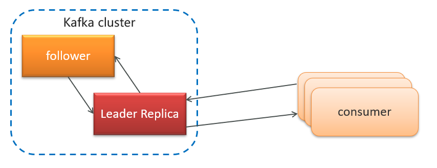

- 消费者组（Consumer Group） ：指的就是由一个或多个消费者组成的群体

- 一个发布在Topic上消息被分发给此消费者组中的一个消费者

  - 所有的消费者都在一个组中，那么这就变成了queue模型

  - 所有的消费者都在不同的组中，那么就完全变成了发布-订阅模型

#### 3.4.5.2 消息有序性

应用场景：

- 即时消息中的单对单聊天和群聊，保证发送方消息发送顺序与接收方的顺序一致

- 充值转账两个渠道在同一个时间进行余额变更，短信通知必须要有顺序


topic分区中消息只能由消费者组中的唯一一个消费者处理，所以消息肯定是按照先后顺序进行处理的。但是它也仅仅是保证Topic的一个分区顺序处理，不能保证跨分区的消息先后处理顺序。 所以，如果你想要顺序的处理Topic的所有消息，那就只提供一个分区。

#### 3.4.5.3 提交和偏移量

kafka不会像其他JMS队列那样需要得到消费者的确认，消费者可以使用kafka来追踪消息在分区的位置（偏移量）

消费者会往一个叫做_consumer_offset的特殊主题发送消息，消息里包含了每个分区的偏移量。如果消费者发生崩溃或有新的消费者加入群组，就会触发再均衡

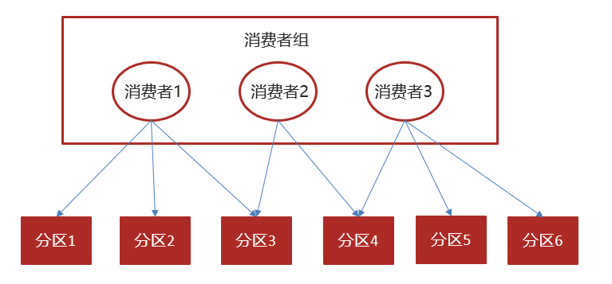

正常的情况

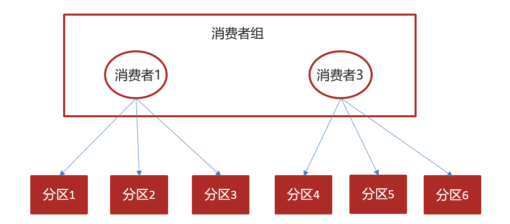

如果消费者2挂掉以后，会发生再均衡，消费者2负责的分区会被其他消费者进行消费

再均衡后不可避免会出现一些问题

问题一：

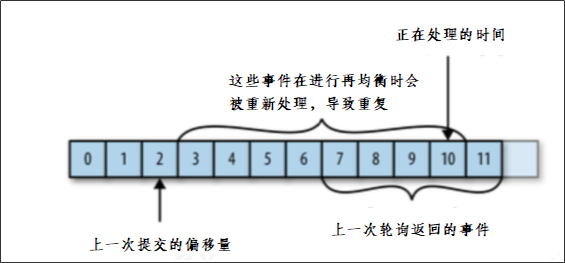

如果提交偏移量小于客户端处理的最后一个消息的偏移量，那么处于两个偏移量之间的消息就会被重复处理。

问题二：

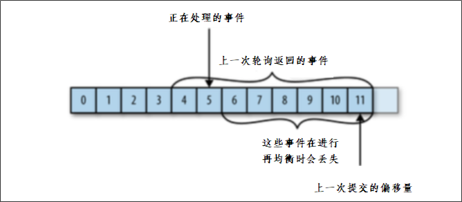

如果提交的偏移量大于客户端的最后一个消息的偏移量，那么处于两个偏移量之间的消息将会丢失。


如果想要解决这些问题，还要知道目前kafka提交偏移量的方式：

提交偏移量的方式有两种，分别是自动提交偏移量和手动提交

- 自动提交偏移量

当enable.auto.commit被设置为true，提交方式就是让消费者自动提交偏移量，每隔5秒消费者会自动把从poll()方法接收的最大偏移量提交上去

- 手动提交 ，当enable.auto.commit被设置为false可以有以下三种提交方式

  - 提交当前偏移量（同步提交）

  - 异步提交

  - 同步和异步组合提交


1.提交当前偏移量（同步提交）

把`enable.auto.commit`设置为false,让应用程序决定何时提交偏移量。使用commitSync()提交偏移量，commitSync()将会提交poll返回的最新的偏移量，所以在处理完所有记录后要确保调用了commitSync()方法。否则还是会有消息丢失的风险。

只要没有发生不可恢复的错误，commitSync()方法会一直尝试直至提交成功，如果提交失败也可以记录到错误日志里。

```java
while (true){
    ConsumerRecords<String, String> records = consumer.poll(Duration.ofMillis(1000));
    for (ConsumerRecord<String, String> record : records) {
        System.out.println(record.value());
        System.out.println(record.key());
        try {
            consumer.commitSync();//同步提交当前最新的偏移量
        }catch (CommitFailedException e){
            System.out.println("记录提交失败的异常："+e);
        }

    }
}
```

2.异步提交

手动提交有一个缺点，那就是当发起提交调用时应用会阻塞。当然我们可以减少手动提交的频率，但这个会增加消息重复的概率（和自动提交一样）。另外一个解决办法是，使用异步提交的API。

```java
while (true){
    ConsumerRecords<String, String> records = consumer.poll(Duration.ofMillis(1000));
    for (ConsumerRecord<String, String> record : records) {
        System.out.println(record.value());
        System.out.println(record.key());
    }
    consumer.commitAsync(new OffsetCommitCallback() {
        @Override
        public void onComplete(Map<TopicPartition, OffsetAndMetadata> map, Exception e) {
            if(e!=null){
                System.out.println("记录错误的提交偏移量："+ map+",异常信息"+e);
            }
        }
    });
}
```

3.同步和异步组合提交

异步提交也有个缺点，那就是如果服务器返回提交失败，异步提交不会进行重试。相比较起来，同步提交会进行重试直到成功或者最后抛出异常给应用。异步提交没有实现重试是因为，如果同时存在多个异步提交，进行重试可能会导致位移覆盖。

举个例子，假如我们发起了一个异步提交commitA，此时的提交位移为2000，随后又发起了一个异步提交commitB且位移为3000；commitA提交失败但commitB提交成功，此时commitA进行重试并成功的话，会将实际上将已经提交的位移从3000回滚到2000，导致消息重复消费。

```java
try {
    while (true){
        ConsumerRecords<String, String> records = consumer.poll(Duration.ofMillis(1000));
        for (ConsumerRecord<String, String> record : records) {
            System.out.println(record.value());
            System.out.println(record.key());
        }
        consumer.commitAsync();
    }
}catch (Exception e){+
    e.printStackTrace();
    System.out.println("记录错误信息："+e);
}finally {
    try {
        consumer.commitSync();
    }finally {
        consumer.close();
    }
}
```

### 3.4.6 springboot集成kafka

#### 3.4.6.1 入门

1.导入spring-kafka依赖信息

```xml
<dependencies>
    <dependency>
        <groupId>org.springframework.boot</groupId>
        <artifactId>spring-boot-starter-web</artifactId>
    </dependency>
    <!-- kafkfa -->
    <dependency>
        <groupId>org.springframework.kafka</groupId>
        <artifactId>spring-kafka</artifactId>
        <exclusions>
            <exclusion>
                <groupId>org.apache.kafka</groupId>
                <artifactId>kafka-clients</artifactId>
            </exclusion>
        </exclusions>
    </dependency>
    <dependency>
        <groupId>org.apache.kafka</groupId>
        <artifactId>kafka-clients</artifactId>
    </dependency>
    <dependency>
        <groupId>com.alibaba</groupId>
        <artifactId>fastjson</artifactId>
    </dependency>
</dependencies>
```

2.在resources下创建文件application.yml

```yaml
server:
  port: 9991
spring:
  application:
    name: kafka-demo
  kafka:
    bootstrap-servers: 192.168.200.130:9092
    producer:
      retries: 10
      key-serializer: org.apache.kafka.common.serialization.StringSerializer
      value-serializer: org.apache.kafka.common.serialization.StringSerializer
    consumer:
      group-id: ${spring.application.name}-test
      key-deserializer: org.apache.kafka.common.serialization.StringDeserializer
      value-deserializer: org.apache.kafka.common.serialization.StringDeserializer
```

3.消息生产者

```java
package com.heima.kafka.controller;

import org.springframework.beans.factory.annotation.Autowired;
import org.springframework.kafka.core.KafkaTemplate;
import org.springframework.web.bind.annotation.GetMapping;
import org.springframework.web.bind.annotation.RestController;

@RestController
public class HelloController {

    @Autowired
    private KafkaTemplate<String,String> kafkaTemplate;

    @GetMapping("/hello")
    public String hello(){
        kafkaTemplate.send("itcast-topic","黑马程序员");
        return "ok";
    }
}
```

4.消息消费者

```java
package com.heima.kafka.listener;

import org.springframework.kafka.annotation.KafkaListener;
import org.springframework.stereotype.Component;
import org.springframework.util.StringUtils;

@Component
public class HelloListener {

    @KafkaListener(topics = "itcast-topic")
    public void onMessage(String message){
        if(!StringUtils.isEmpty(message)){
            System.out.println(message);
        }

    }
}
```

#### 3.4.6.2 传递消息为对象

目前springboot整合后的kafka，因为序列化器是StringSerializer，这个时候如果需要传递对象可以有两种方式

方式一：可以自定义序列化器，对象类型众多，这种方式通用性不强，本章节不介绍

方式二：可以把要传递的对象进行转json字符串，接收消息后再转为对象即可，本项目采用这种方式

- 发送消息

```java
@GetMapping("/hello")
public String hello(){
    User user = new User();
    user.setUsername("xiaowang");
    user.setAge(18);

    kafkaTemplate.send("user-topic", JSON.toJSONString(user));

    return "ok";
}
```

- 接收消息

```java
package com.heima.kafka.listener;

import com.alibaba.fastjson.JSON;
import com.heima.kafka.pojo.User;
import org.springframework.kafka.annotation.KafkaListener;
import org.springframework.stereotype.Component;
import org.springframework.util.StringUtils;

@Component
public class HelloListener {

    @KafkaListener(topics = "user-topic")
    public void onMessage(String message){
        if(!StringUtils.isEmpty(message)){
            User user = JSON.parseObject(message, User.class);
            System.out.println(user);
        }

    }
}
```


### 3.4.7 Kafka Stream 

#### 3.4.7.1 概述

Kafka Stream是Apache Kafka从0.10版本引入的一个新Feature。它是提供了对存储于Kafka内的数据进行流式处理和分析的功能。

Kafka Stream的特点如下：

- Kafka Stream提供了一个非常简单而轻量的Library，它可以非常方便地嵌入任意Java应用中，也可以任意方式打包和部署
- 除了Kafka外，无任何外部依赖
- 充分利用Kafka分区机制实现水平扩展和顺序性保证
- 通过可容错的state store实现高效的状态操作（如windowed join和aggregation）
- 支持正好一次处理语义
- 提供记录级的处理能力，从而实现毫秒级的低延迟
- 支持基于事件时间的窗口操作，并且可处理晚到的数据（late arrival of records）
- 同时提供底层的处理原语Processor（类似于Storm的spout和bolt），以及高层抽象的DSL（类似于Spark的map/group/reduce）


#### 3.4.7.2 Kafka Streams的关键概念

- **源处理器（Source Processor）**：源处理器是一个没有任何上游处理器的特殊类型的流处理器。它从一个或多个kafka主题生成输入流。通过消费这些主题的消息并将它们转发到下游处理器。
- **Sink处理器**：sink处理器是一个没有下游流处理器的特殊类型的流处理器。它接收上游流处理器的消息发送到一个指定的**Kafka主题**。

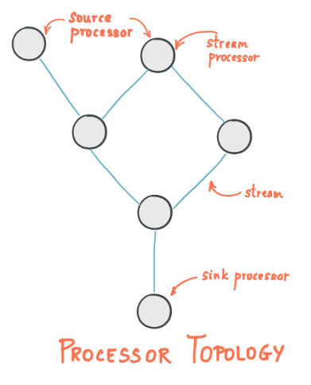


#### 3.4.7.3 KStream

（1）数据结构类似于map,如下图，key-value键值对

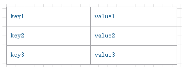

（2）KStream


**KStream**数据流（data stream），即是一段顺序的，可以无限长，不断更新的数据集。
数据流中比较常记录的是事件，这些事件可以是一次鼠标点击（click），一次交易，或是传感器记录的位置数据。

KStream负责抽象的，就是数据流。与Kafka自身topic中的数据一样，类似日志，每一次操作都是**向其中插入（insert）新数据。**

为了说明这一点，让我们想象一下以下两个数据记录正在发送到流中：

（“ alice”，1）->（“” alice“，3）

如果您的流处理应用是要总结每个用户的价值，它将返回`4`了`alice`。为什么？因为第二条数据记录将不被视为先前记录的更新。（insert）新数据

#### 3.4.7.4 Kafka Stream入门案例编写

（1）需求分析，求单词个数（word count）


（2）引入依赖

在之前的kafka-demo工程的pom文件中引入

```xml
<dependency>
    <groupId>org.apache.kafka</groupId>
    <artifactId>kafka-streams</artifactId>
    <exclusions>
        <exclusion>
            <artifactId>connect-json</artifactId>
            <groupId>org.apache.kafka</groupId>
        </exclusion>
        <exclusion>
            <groupId>org.apache.kafka</groupId>
            <artifactId>kafka-clients</artifactId>
        </exclusion>
    </exclusions>
</dependency>
```

(3)创建原生的kafka staream入门案例

```java
package com.heima.kafka.sample;

import org.apache.kafka.common.serialization.Serdes;
import org.apache.kafka.streams.KafkaStreams;
import org.apache.kafka.streams.KeyValue;
import org.apache.kafka.streams.StreamsBuilder;
import org.apache.kafka.streams.StreamsConfig;
import org.apache.kafka.streams.kstream.KStream;
import org.apache.kafka.streams.kstream.TimeWindows;
import org.apache.kafka.streams.kstream.ValueMapper;

import java.time.Duration;
import java.util.Arrays;
import java.util.Properties;

/**
 * 流式处理
 */
public class KafkaStreamQuickStart {

    public static void main(String[] args) {

        //kafka的配置信心
        Properties prop = new Properties();
        prop.put(StreamsConfig.BOOTSTRAP_SERVERS_CONFIG,"192.168.200.130:9092");
        prop.put(StreamsConfig.DEFAULT_KEY_SERDE_CLASS_CONFIG, Serdes.String().getClass());
        prop.put(StreamsConfig.DEFAULT_VALUE_SERDE_CLASS_CONFIG, Serdes.String().getClass());
        prop.put(StreamsConfig.APPLICATION_ID_CONFIG,"streams-quickstart");

        //stream 构建器
        StreamsBuilder streamsBuilder = new StreamsBuilder();

        //流式计算
        streamProcessor(streamsBuilder);


        //创建kafkaStream对象
        KafkaStreams kafkaStreams = new KafkaStreams(streamsBuilder.build(),prop);
        //开启流式计算
        kafkaStreams.start();
    }

    /**
     * 流式计算
     * 消息的内容：hello kafka  hello itcast
     * @param streamsBuilder
     */
    private static void streamProcessor(StreamsBuilder streamsBuilder) {
        //创建kstream对象，同时指定从那个topic中接收消息
        KStream<String, String> stream = streamsBuilder.stream("itcast-topic-input");
        /**
         * 处理消息的value
         */
        stream.flatMapValues(new ValueMapper<String, Iterable<String>>() {
            @Override
            public Iterable<String> apply(String value) {
                return Arrays.asList(value.split(" "));
            }
        })
                //按照value进行聚合处理
                .groupBy((key,value)->value)
                //时间窗口
                .windowedBy(TimeWindows.of(Duration.ofSeconds(10)))
                //统计单词的个数
                .count()
                //转换为kStream
                .toStream()
                .map((key,value)->{
                    System.out.println("key:"+key+",vlaue:"+value);
                    return new KeyValue<>(key.key().toString(),value.toString());
                })
                //发送消息
                .to("itcast-topic-out");
    }
}
```

(4)测试准备

- 使用生产者在topic为：itcast_topic_input中发送多条消息

- 使用消费者接收topic为：itcast_topic_out

结果：

- 通过流式计算，会把生产者的多条消息汇总成一条发送到消费者中输出

#### 3.4.7.5 SpringBoot集成Kafka Stream

（1）自定配置参数

```java
package com.heima.kafka.config;

import lombok.Getter;
import lombok.Setter;
import org.apache.kafka.clients.consumer.ConsumerConfig;
import org.apache.kafka.common.serialization.Serdes;
import org.apache.kafka.streams.StreamsConfig;
import org.apache.kafka.streams.Topology;
import org.springframework.boot.context.properties.ConfigurationProperties;
import org.springframework.context.annotation.Bean;
import org.springframework.context.annotation.Configuration;
import org.springframework.kafka.annotation.EnableKafkaStreams;
import org.springframework.kafka.annotation.KafkaStreamsDefaultConfiguration;
import org.springframework.kafka.config.KafkaStreamsConfiguration;

import java.util.HashMap;
import java.util.Map;

/**
 * 通过重新注册KafkaStreamsConfiguration对象，设置自定配置参数
 */

@Setter
@Getter
@Configuration
@EnableKafkaStreams
@ConfigurationProperties(prefix="kafka")
public class KafkaStreamConfig {
    private static final int MAX_MESSAGE_SIZE = 16* 1024 * 1024;
    private String hosts;
    private String group;
    @Bean(name = KafkaStreamsDefaultConfiguration.DEFAULT_STREAMS_CONFIG_BEAN_NAME)
    public KafkaStreamsConfiguration defaultKafkaStreamsConfig() {
        Map<String, Object> props = new HashMap<>();
        props.put(StreamsConfig.BOOTSTRAP_SERVERS_CONFIG, hosts);
        props.put(StreamsConfig.APPLICATION_ID_CONFIG, this.getGroup()+"_stream_aid");
        props.put(StreamsConfig.CLIENT_ID_CONFIG, this.getGroup()+"_stream_cid");
        props.put(StreamsConfig.RETRIES_CONFIG, 10);
        props.put(StreamsConfig.DEFAULT_KEY_SERDE_CLASS_CONFIG, Serdes.String().getClass());
        props.put(StreamsConfig.DEFAULT_VALUE_SERDE_CLASS_CONFIG, Serdes.String().getClass());
        return new KafkaStreamsConfiguration(props);
    }
}
```

修改application.yml文件，在最下方添加自定义配置

```yaml
kafka:
  hosts: 192.168.200.130:9092
  group: ${spring.application.name}
```

(2)新增配置类，创建KStream对象，进行聚合

```java
package com.heima.kafka.stream;

import lombok.extern.slf4j.Slf4j;
import org.apache.kafka.streams.KeyValue;
import org.apache.kafka.streams.StreamsBuilder;
import org.apache.kafka.streams.kstream.KStream;
import org.apache.kafka.streams.kstream.TimeWindows;
import org.apache.kafka.streams.kstream.ValueMapper;
import org.springframework.context.annotation.Bean;
import org.springframework.context.annotation.Configuration;

import java.time.Duration;
import java.util.Arrays;

@Configuration
@Slf4j
public class KafkaStreamHelloListener {

    @Bean
    public KStream<String,String> kStream(StreamsBuilder streamsBuilder){
        //创建kstream对象，同时指定从那个topic中接收消息
        KStream<String, String> stream = streamsBuilder.stream("itcast-topic-input");
        stream.flatMapValues(new ValueMapper<String, Iterable<String>>() {
            @Override
            public Iterable<String> apply(String value) {
                return Arrays.asList(value.split(" "));
            }
        })
                //根据value进行聚合分组
                .groupBy((key,value)->value)
                //聚合计算时间间隔
                .windowedBy(TimeWindows.of(Duration.ofSeconds(10)))
                //求单词的个数
                .count()
                .toStream()
                //处理后的结果转换为string字符串
                .map((key,value)->{
                    System.out.println("key:"+key+",value:"+value);
                    return new KeyValue<>(key.key().toString(),value.toString());
                })
                //发送消息
                .to("itcast-topic-out");
        return stream;
    }
}
```

测试：

​	启动微服务，正常发送消息，可以正常接收到消息


## 3.5 xxl-Job框架

> 分布式任务调度框架
>
> [分布式任务调度平台XXL-JOB (xuxueli.com)](https://www.xuxueli.com/xxl-job/)
>
> docker： [xuxueli/xxl-job-admin - Docker Image | Docker Hub](https://hub.docker.com/r/xuxueli/xxl-job-admin)


### 3.5.1 xxl-job入门案例编写

1.创建mysql容器，初始化xxl-job的SQL脚本

```shell
docker run -p 3306:3306 --name mysql57 \
-v /opt/mysql/conf:/etc/mysql \
-v /opt/mysql/logs:/var/log/mysql \
-v /opt/mysql/data:/var/lib/mysql \
-e MYSQL_ROOT_PASSWORD=root \
-d mysql:5.7
```

2.拉取镜像

```shell
docker pull xuxueli/xxl-job-admin:2.3.0
```

3.创建容器

```shell
docker run -e PARAMS="--spring.datasource.url=jdbc:mysql://192.168.200.130:3306/xxl_job?Unicode=true&characterEncoding=UTF-8 \
--spring.datasource.username=root \
--spring.datasource.password=root" \
-p 8888:8080 -v /tmp:/data/applogs \
--name xxl-job-admin --restart=always  -d xuxueli/xxl-job-admin:2.3.0
```

#### 3.5.1.1登录调度中心，点击下图所示“新建任务”按钮，新建示例任务

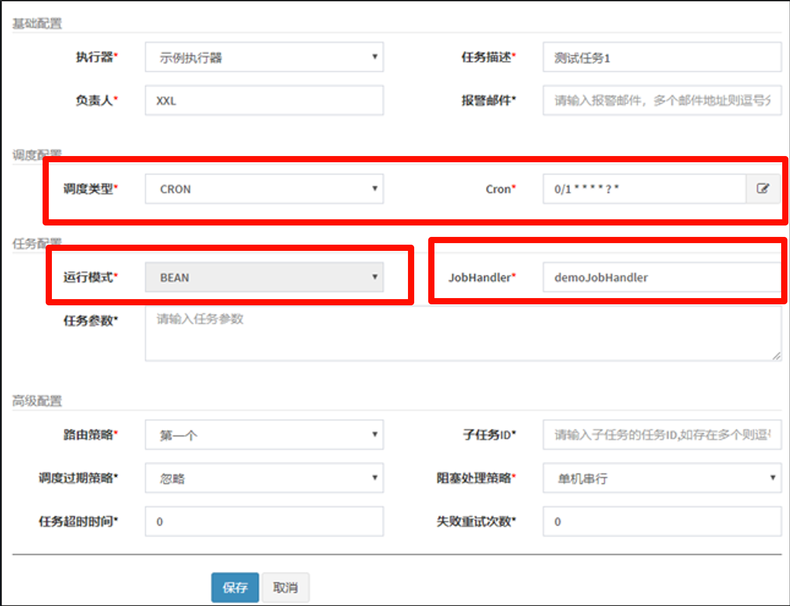

#### 3.5.1.2 创建xxljob-demo项目，导入依赖

```xml
<dependencies>
    <dependency>
        <groupId>org.springframework.boot</groupId>
        <artifactId>spring-boot-starter-web</artifactId>
    </dependency>

    <!--xxl-job-->
    <dependency>
        <groupId>com.xuxueli</groupId>
        <artifactId>xxl-job-core</artifactId>
        <version>2.3.0</version>
    </dependency>
</dependencies>
```

#### 3.5.1.3 application.yml配置

```yaml
server:
  port: 8881


xxl:
  job:
    admin:
      addresses: http://192.168.200.130:8888/xxl-job-admin
    executor:
      appname: xxl-job-executor-sample
      port: 9999

```

#### 3.5.1.4 新建配置类

```java
package com.heima.xxljob.config;

import com.xxl.job.core.executor.impl.XxlJobSpringExecutor;
import org.slf4j.Logger;
import org.slf4j.LoggerFactory;
import org.springframework.beans.factory.annotation.Value;
import org.springframework.context.annotation.Bean;
import org.springframework.context.annotation.Configuration;

/**
 * xxl-job config
 *
 * @author xuxueli 2017-04-28
 */
@Configuration
public class XxlJobConfig {
    private Logger logger = LoggerFactory.getLogger(XxlJobConfig.class);

    @Value("${xxl.job.admin.addresses}")
    private String adminAddresses;

    @Value("${xxl.job.executor.appname}")
    private String appname;

    @Value("${xxl.job.executor.port}")
    private int port;


    @Bean
    public XxlJobSpringExecutor xxlJobExecutor() {
        logger.info(">>>>>>>>>>> xxl-job config init.");
        XxlJobSpringExecutor xxlJobSpringExecutor = new XxlJobSpringExecutor();
        xxlJobSpringExecutor.setAdminAddresses(adminAddresses);
        xxlJobSpringExecutor.setAppname(appname);
        xxlJobSpringExecutor.setPort(port);
        return xxlJobSpringExecutor;
    }


}
```

#### 3.5.1.5 任务代码，重要注解:@XxlJob(“**JobHandler**”)

```java
package com.heima.xxljob.job;

import com.xxl.job.core.handler.annotation.XxlJob;
import org.springframework.stereotype.Component;

@Component
public class HelloJob {


    @XxlJob("demoJobHandler")
    public void helloJob(){
        System.out.println("简单任务执行了。。。。");

    }
}
```

#### 3.5.1.5 测试-单节点

- 启动微服务

- 在xxl-job的调度中心中启动任务

### 3.5.2 任务详解-执行器

- 执行器：任务的绑定的执行器，任务触发调度时将会自动发现注册成功的执行器, 实现任务自动发现功能; 

- 另一方面也可以方便的进行任务分组。每个任务必须绑定一个执行器


 以下是执行器的属性说明：

| 属性名称 | 说明                                                         |
| -------- | ------------------------------------------------------------ |
| AppName  | 是每个执行器集群的唯一标示AppName, 执行器会周期性以AppName为对象进行自动注册。可通过该配置自动发现注册成功的执行器, 供任务调度时使用; |
| 名称     | 执行器的名称, 因为AppName限制字母数字等组成,可读性不强, 名称为了提高执行器的可读性; |
| 排序     | 执行器的排序, 系统中需要执行器的地方,如任务新增, 将会按照该排序读取可用的执行器列表; |
| 注册方式 | 调度中心获取执行器地址的方式；                               |
| 机器地址 | 注册方式为"手动录入"时有效，支持人工维护执行器的地址信息；   |

自动注册和手动注册的区别和配置


### 3.5.3 任务详解-基础配置


**基础配置**

- 执行器：每个任务必须绑定一个执行器, 方便给任务进行分组

- 任务描述：任务的描述信息，便于任务管理；

- 负责人：任务的负责人；

- 报警邮件：任务调度失败时邮件通知的邮箱地址，支持配置多邮箱地址，配置多个邮箱地址时用逗号分隔


**调度配置**

- 调度类型：
  - 无：该类型不会主动触发调度；
  - CRON：该类型将会通过CRON，触发任务调度；
  - 固定速度：该类型将会以固定速度，触发任务调度；按照固定的间隔时间，周期性触发；


**任务配置**

- 运行模式：

​    BEAN模式：任务以JobHandler方式维护在执行器端；需要结合 "JobHandler" 属性匹配执行器中任务；

- JobHandler：运行模式为 "BEAN模式" 时生效，对应执行器中新开发的JobHandler类“@JobHandler”注解自定义的value值；

- 执行参数：任务执行所需的参数；


**阻塞处理策略**

阻塞处理策略：调度过于密集执行器来不及处理时的处理策略；

- 单机串行（默认）：调度请求进入单机执行器后，调度请求进入FIFO(First Input First Output)队列并以串行方式运行；

- 丢弃后续调度：调度请求进入单机执行器后，发现执行器存在运行的调度任务，本次请求将会被丢弃并标记为失败；

- 覆盖之前调度：调度请求进入单机执行器后，发现执行器存在运行的调度任务，将会终止运行中的调度任务并清空队列，然后运行本地调度任务；


**路由策略**

当执行器集群部署时，提供丰富的路由策略，包括；

- FIRST（第一个）：固定选择第一个机器；

- LAST（最后一个）：固定选择最后一个机器；

- **ROUND（轮询）**

- RANDOM（随机）：随机选择在线的机器；

- CONSISTENT_HASH（一致性HASH）：每个任务按照Hash算法固定选择某一台机器，且所有任务均匀散列在不同机器上。

- LEAST_FREQUENTLY_USED（最不经常使用）：使用频率最低的机器优先被选举；

- LEAST_RECENTLY_USED（最近最久未使用）：最久未使用的机器优先被选举；

- FAILOVER（故障转移）：按照顺序依次进行心跳检测，第一个心跳检测成功的机器选定为目标执行器并发起调度；

- BUSYOVER（忙碌转移）：按照顺序依次进行空闲检测，第一个空闲检测成功的机器选定为目标执行器并发起调度；

- **SHARDING_BROADCAST(分片广播)：广播触发对应集群中所有机器执行一次任务，同时系统自动传递分片参数；可根据分片参数开发分片任务；**

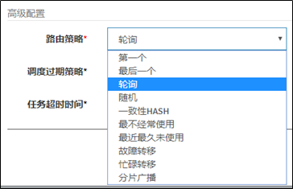

### 3.5.4 路由策略(轮询)-案例

1.修改任务为轮询


2.启动多个微服务


修改yml配置文件

```yaml
server:
  port: ${port:8881}


xxl:
  job:
    admin:
      addresses: http://192.168.200.130:8888/xxl-job-admin
    executor:
      appname: xxl-job-executor-sample
      port: ${executor.port:9999}
```

3.启动多个微服务

每个微服务轮询的去执行任务

### 3.5.5 路由策略(分片广播)

#### 3.5.5.1 分片逻辑

执行器集群部署时，任务路由策略选择”分片广播”情况下，一次任务调度将会广播触发对应集群中所有执行器执行一次任务

)

执行器集群部署时，任务路由策略选择”分片广播”情况下，一次任务调度将会广播触发对应集群中所有执行器执行一次任务


#### 3.5.5.2 路由策略(分片广播)-案例

需求：让两个节点同时执行10000个任务，每个节点分别执行5000个任务

①：创建分片执行器


②：创建任务，路由策略为分片广播


③：分片广播代码

   分片参数

​     index：当前分片序号(从0开始)，执行器集群列表中当前执行器的序号；

​     total：总分片数，执行器集群的总机器数量；

修改yml配置

```yaml
server:
  port: ${port:8881}


xxl:
  job:
    admin:
      addresses: http://192.168.200.130:8888/xxl-job-admin
    executor:
      appname: xxl-job-sharding-executor
      port: ${executor.port:9999}
```

代码

```java
package com.heima.xxljob.job;

import com.xxl.job.core.context.XxlJobHelper;
import com.xxl.job.core.handler.annotation.XxlJob;
import org.springframework.beans.factory.annotation.Value;
import org.springframework.stereotype.Component;

import java.util.ArrayList;
import java.util.List;

@Component
public class HelloJob {

    @Value("${server.port}")
    private String port;


    @XxlJob("demoJobHandler")
    public void helloJob(){
        System.out.println("简单任务执行了。。。。"+port);

    }

    @XxlJob("shardingJobHandler")
    public void shardingJobHandler(){
        //分片的参数
        int shardIndex = XxlJobHelper.getShardIndex();
        int shardTotal = XxlJobHelper.getShardTotal();

        //业务逻辑
        List<Integer> list = getList();
        for (Integer integer : list) {
            if(integer % shardTotal == shardIndex){
                System.out.println("当前第"+shardIndex+"分片执行了，任务项为："+integer);
            }
        }
    }

    public List<Integer> getList(){
        List<Integer> list = new ArrayList<>();
        for (int i = 0; i < 10000; i++) {
            list.add(i);
        }
        return list;
    }
}
```

④：测试

启动多个微服务测试，一次执行可以执行多个任务

### 3.5.6 如何保证任务不重复执行

1、执行器收到作业分片广播，计算 任务id 模上 分片总数的结果，等于分片序号任务去执行，这里保证了不同的执行器执行不同的任务。

2、配置调度过期策略，避免同一个执行器多次重复执行同一个任务

调度过期策略如下：
     \- 忽略：调度过期后，忽略过期的任务，从当前时间开始重新计算下次触发时间；
     \- 立即执行一次：调度过期后，立即执行一次，并从当前时间开始重新计算下次触发时间；
   \- 阻塞处理策略：调度过于密集执行器来不及处理时的处理策略；

这里我们选择忽略，如果立即执行一次可能会重复调度。


其次，再看阻塞处理策略，阻塞处理策略就是当前执行器正在执行任务还没有结束时调度时间到达到，此时该如何处理。

查看文档如下：
     单机串行（默认）：调度请求进入单机执行器后，调度请求进入FIFO队列并以串行方式运行；
     丢弃后续调度：调度请求进入单机执行器后，发现执行器存在运行的调度任务，本次请求将会被丢弃并标记为失败；
     覆盖之前调度：调度请求进入单机执行器后，发现执行器存在运行的调度任务，将会终止运行中的调度任务并清空队列，然后运行本地调度任务；

这里选择 丢弃后续调度，避免重复调度。

 

3、保证任务处理的幂等性

幂等性是为了解决重复提交问题，比如：恶意刷单，重复支付等。

解决幂等性常用的方案：

1）数据库约束，比如：唯一索引，主键。

2）乐观锁，常用于数据库，更新数据时根据乐观锁状态去更新。

3）唯一序列号，操作传递一个唯一序列号，操作时判断与该序列号相等则执行。

这里我们在数据库视频处理表中添加处理状态字段，视频处理完成更新状态为完成，执行视频处理前判断状态是否完成，如果完成则不再处理。


# 4 SQL表

## 4.1 垂直分表

> **概念**:
>
> ​	将一个表的字段分散到多个表中，每个表存储其中一部分字段
>
> **优势**： 
>
> 1. 减少io争抢，减少锁表几率，查看文章概述与文档详情互不影响
> 2. 充分发挥高频数据的操作效率，对文章概述数据操作的高效率不会被操作文章详情数据的低效率所拖累
>
> **拆分规则**：
>
> 1. 不常用的字段单独放在一张表
> 2. 大字段拆分出来单独放在一张表
> 3. 经常组合查询的字段单独放在一张表


# 附录：工具类用法

## 1 DigestUtils

> Spring的加密工具类
>
> 背景：
>
> ​	需要将**数据库中的salt+用户输入的password**字符串拼接后进行md5加密然后和数据库中的密码进行对比
>
> ```java
>             String salt = dbUser.getSalt();
>             String password = dto.getPassword();
>             String pswd = DigestUtils.md5DigestAsHex((password + salt).getBytes());
>             if (pswd.equals(dbUser.getPassword())) {
>                 return ResponseResult.errorResult(AppHttpCodeEnum.LOGIN_PASSWORD_ERROR);
>             }
> ```
>
> > 这里的salt是数据库中的，password是用户输入的，dbUser是数据库中的
